# Hacking8使用大全和利用Hacking8打造自己的知识信息流

本文就是讲述一下`Hacking8信息流更新的内容`以及`如何利用Hacking8打造自己的知识信息流`。

## 关于Hacking8信息流

有关网络安全的资讯获取渠道很多，论坛，新闻，微博，Twitter，rss订阅大牛的博客，各种技术平台、微信公众号、知识星球等等，有时候也想关注一下cve和cnvd自己感兴趣的内容。hacking8整合了这些资讯，只用访问hacking8，就能获取到有关安全的最新资讯。

经过了一年的沉淀，技术上Hacking8的爬虫从最开始的Python小脚本，到现在进化成了包含的代理、爬虫(包含chromium)、节点日志等功能的自动化程序，已经可以很好很稳定的对这些平台的进行抓取并显示了。

Hacking8安全信息流的地址是：https://i.hacking8.com/

### 节点

打开首页会每日更新一些安全内容。

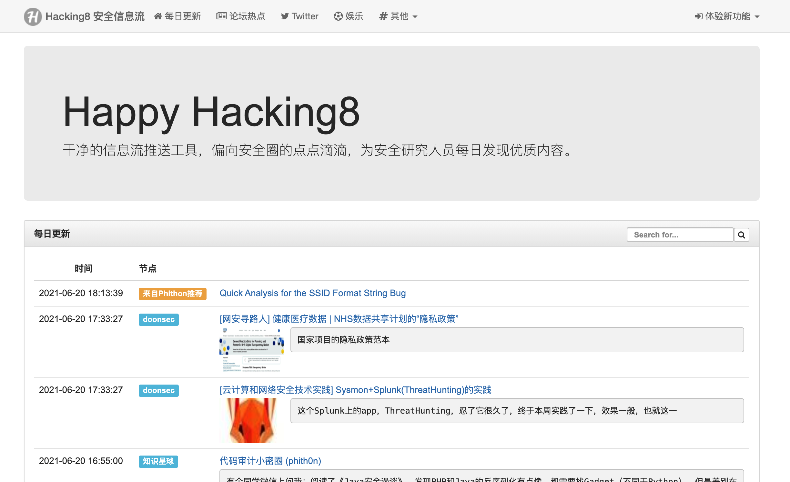

hacking8在抓取内容的时候有自己的想法，例如发现某个知名组建出现漏洞后会提醒

节点:https://i.hacking8.com/nodes/cve-famous/

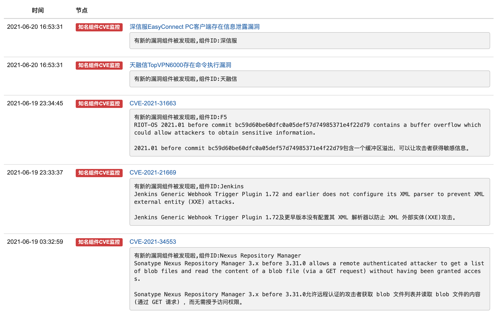

`hackone`、`bug bounty writeups`公开的漏洞也会提醒

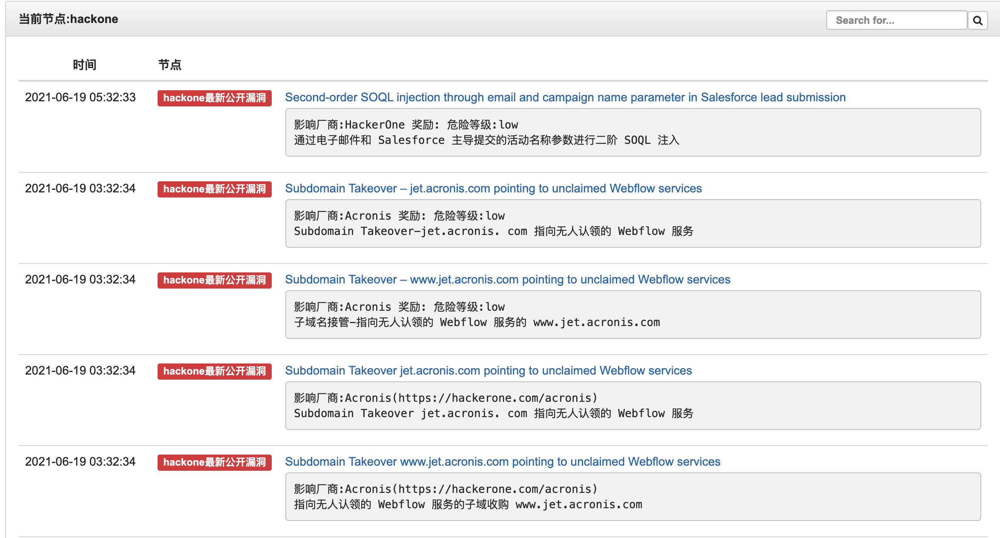

同时也监控各个组件官网的更新，包含`shiro`、`struts`、`weblogic`等等。

### 全部节点

在首页任意点击一个节点可以进入节点中心，可以查看信息流的全部节点。

例如： https://i.hacking8.com/nodes/doonsec/

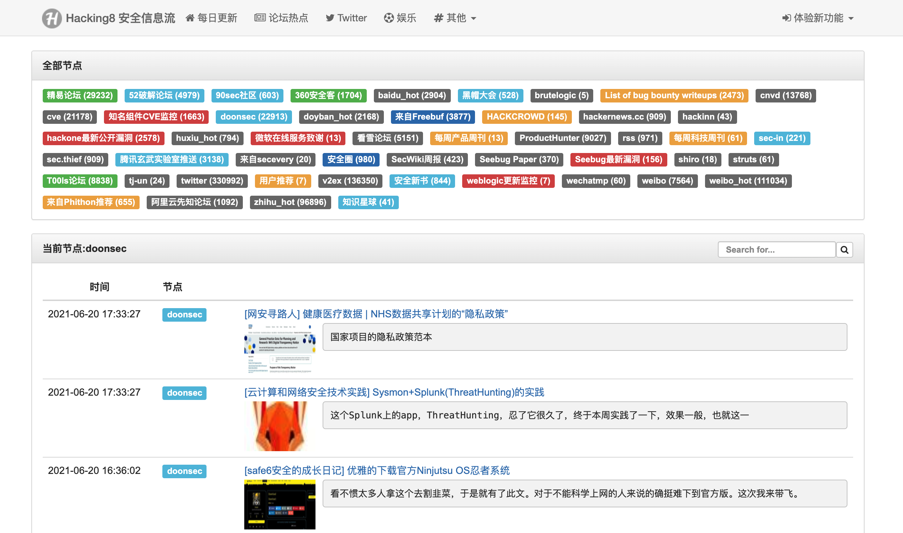

此时url地址`https://i.hacking8.com/nodes/`后面的即是doonsec节点的名称了

例如 https://i.hacking8.com/nodes/cve-famous/ 知名cve监控节点的节点名称是cve-famous。

注意这一点哦，后面全文搜索会有说到。

#### 自定义rss

注册用户可以添加自己喜欢的rss源，在`设置`-`节点订阅`中可以自定义rss，更新后就会在首页显示。

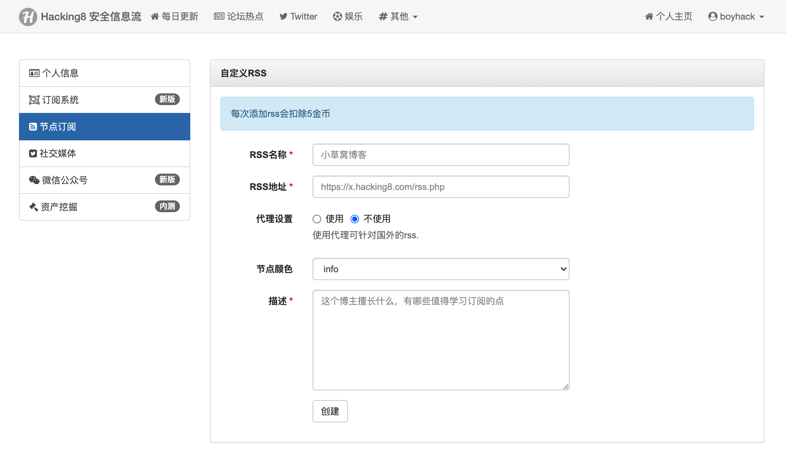

#### 自定义微信公众号

注册用户也可以添加自己爱看的微信公众号，在`设置`-`微信公众号`中搜索微信公众号，之后订阅就行了。

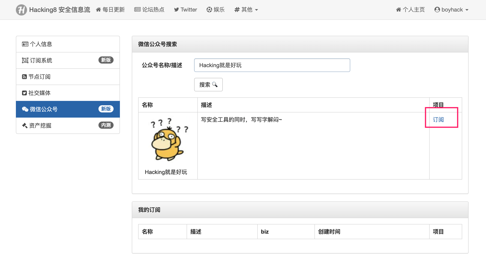

### 全文搜索

这个功能必须安利！

搜索功能在这个不起眼的小地方

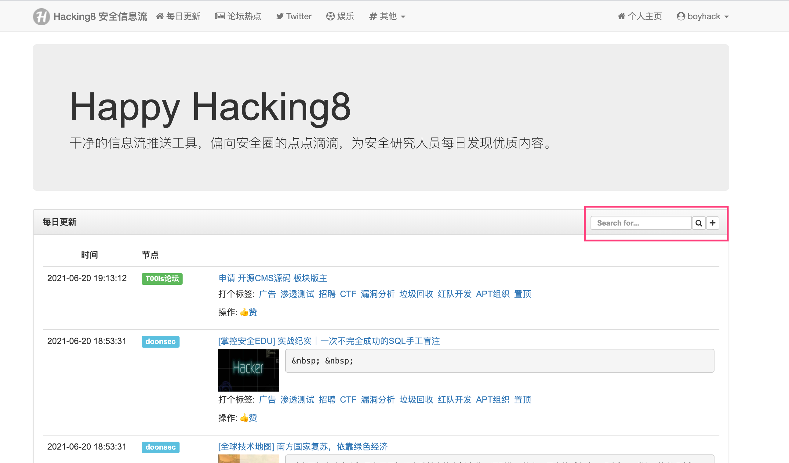

但是功能非常强大。支持`()`、`AND`、`OR`等逻辑运算符(注意要大写)。也提供了`node:`来指定一个节点

例如搜索`shellcode 免杀`（两个词语空格相当于AND）

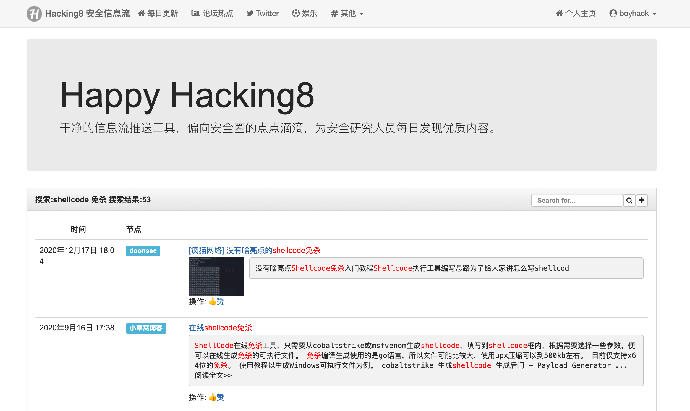

也可以这样使用

  * shellcode AND 免杀 AND node:doonsec # 搜索doonsec节点中包含shellcode+免杀的内容
  * shellcode AND (node:doonsec OR node:rss) # 搜索doonsec或rss节点中包含shellcode的内容


Hacking8的全文索引对一些安全词汇和对cve的格式有优化，例如搜索`CVE-2021-21985`就能看到Vmware vCenter unauth RCE 的前世今生。

### 论坛

地址：https://i.hacking8.com/forums/

论坛热点选择了我会经常去的几个中文社区，它们的更新频率是20分钟，新帖可以第一时间看到。

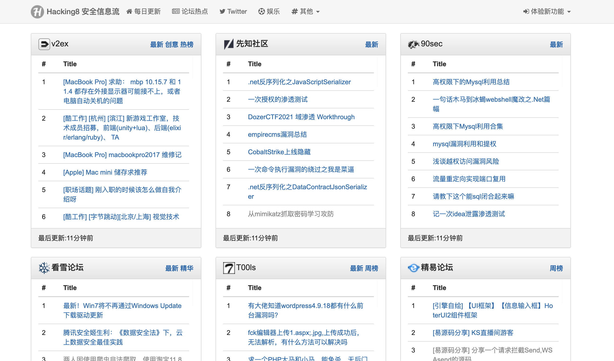

### Twitter/微博

地址：https://i.hacking8.com/twitter/

这个页面展示了关注的微博和Twitter大佬，同时也支持实时更新基于关键词的Twitter内容。

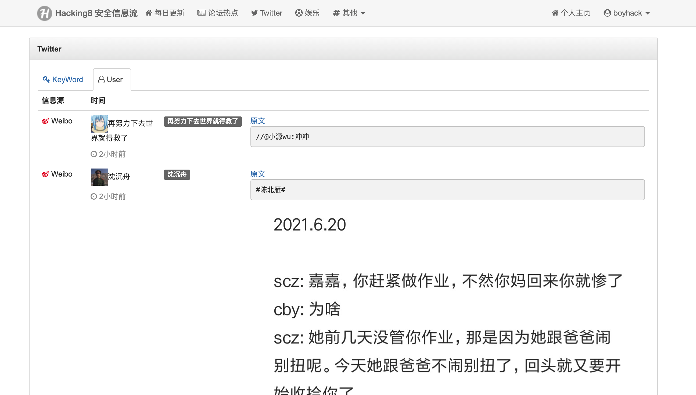

#### 自定义 微博/Twitter

同样注册用户支持订阅自己感兴趣的微博/Twitter账号。在`设置`-`社交媒体`中添加 微博用户/Twitter用户/Twitter关键词 即可，更新即在页面显示。

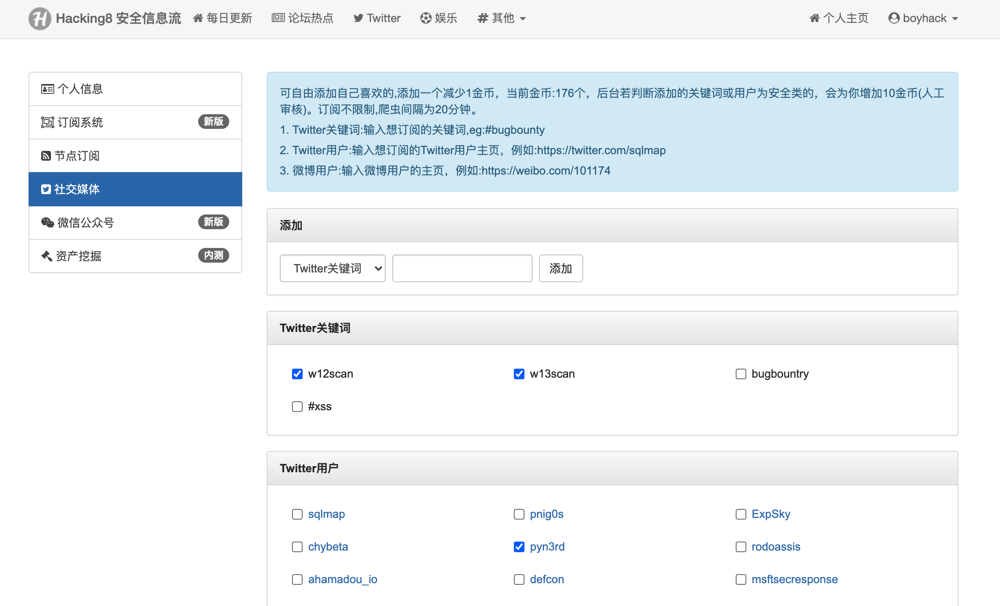

### 娱乐

如果想摸鱼，可以来娱乐板块 https://i.hacking8.com/happy/

这里有吃瓜的一手信息

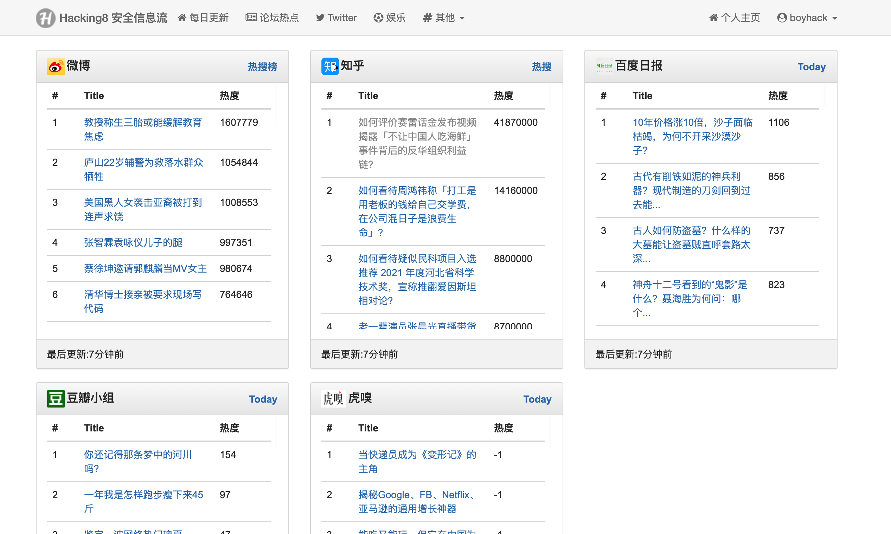

### Producthunt

Producthunt上有很多富有想象力的项目，自己的技术可以创造多大的价值，可以在上面看看，一定会有所收获。

地址：https://i.hacking8.com/product/

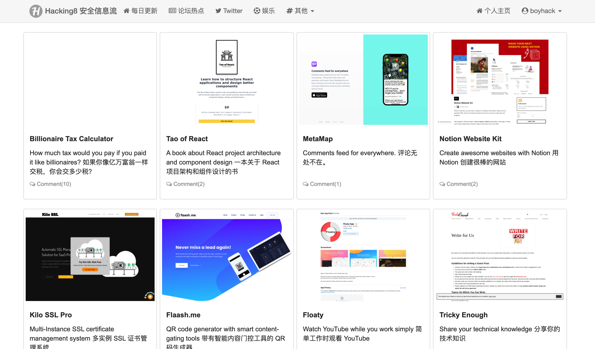

## 在线工具

我很喜欢自动化，这个网站大部分也都是自动化驱动的，平时的一些小点子，我也会将它加入进来。

### 提权辅助

地址：https://i.hacking8.com/tiquan

信息流会每日更新微软的补丁，根据补丁来提供提权的建议。只需要将`systeminfo`的内容粘贴进来，就能知道自己电脑打过哪些补丁/没打哪些补丁。

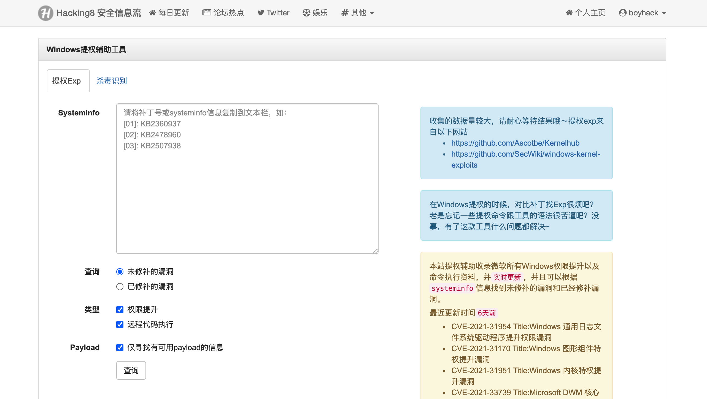

### 杀毒识别

通过对将近300+程序进行了标签处理，只需要将`tasklist`的内容粘贴进来即可识别电脑上运行的程序。

### SRC资产

有自动化的脚本，会周期的从`HackerOne`、`BugCrowd`等平台获取最新的src厂商信息（筛选的都是有赏金的厂商），并自动进行`子域名收集`、`http信息识别`、`使用PoC模板进行探测`、`自动分析C段/IP段范围`等等一系列的信息收集操作。

地址：https://i.hacking8.com/src/

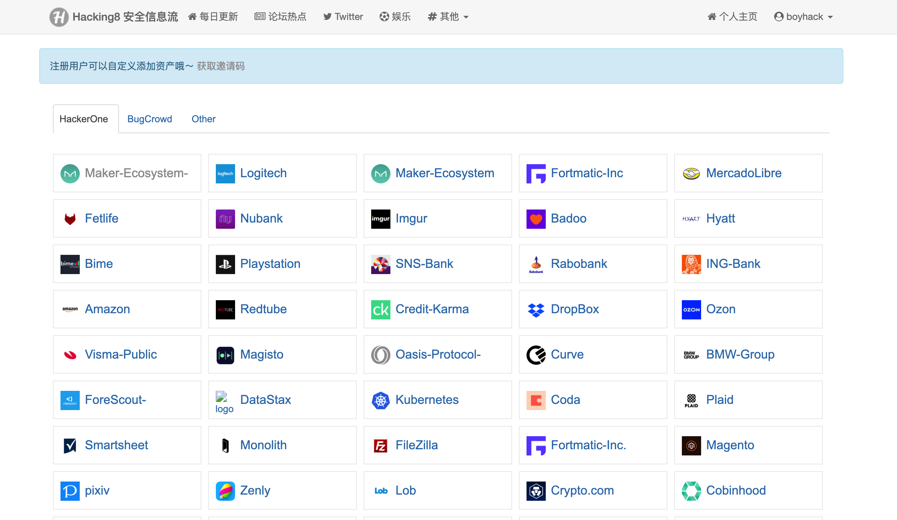

#### 自定义资产扫描

注册用户在`设置`-`资产挖掘`中可以添加自己的厂商

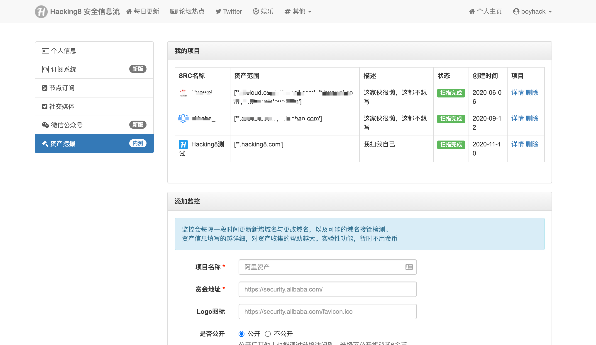

系统会每隔一段对资产重新扫描，并找出新增的资产。

### 任意exe转shellcode

地址：https://i.hacking8.com/exe2shellcode

目前仅支持32位，支持将任意的exe转换为shellcode，支持无重定位表的exe，并输出成各种语言的格式。

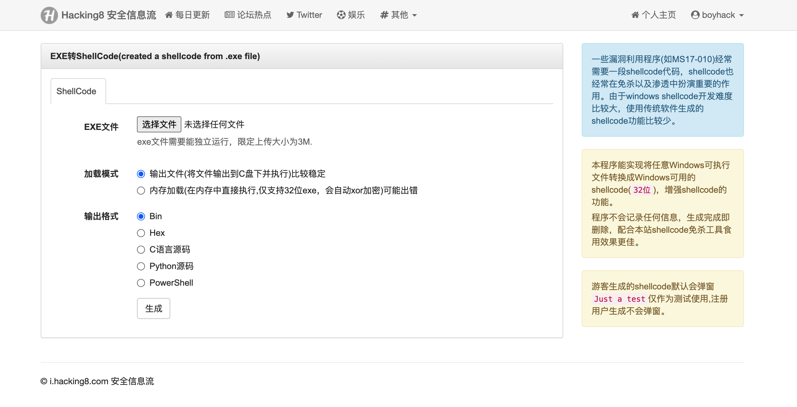

### dll转shellcode

地址：https://i.hacking8.com/dll2shellcode

支持将任意dll转换为shellcode，支持32位和64位

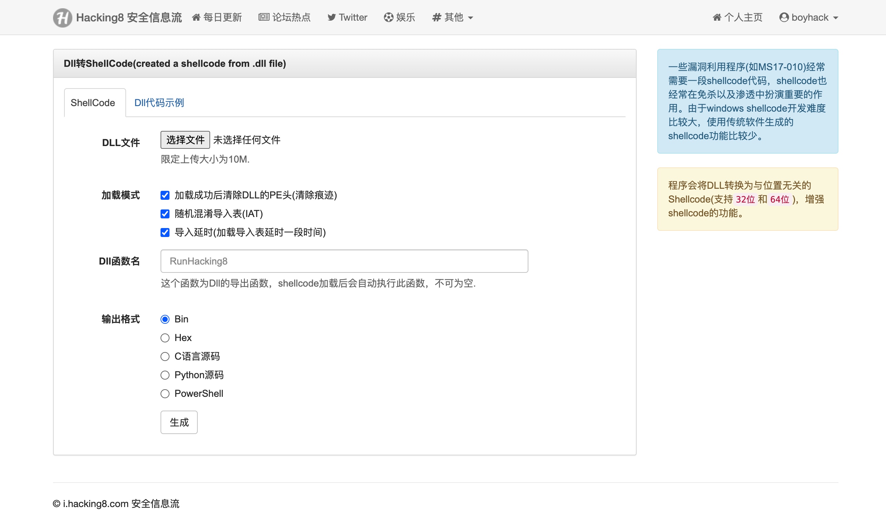

## 利用Hacking8打造自己的知识信息流

如何构建自己的知识信息流呢，我想可以分为三个方面来说。

  * 构建数据源
  * 过滤数据
  * 总结


首先构建自己的数据源，这个依靠hacking8就能搞定、之后找个零碎的时间人工处理，将自己感兴趣的地方做个标记，等有空再来阅读，在之后就是总结知识面了。

### 构建数据源

Hacking8的资讯获取渠道很多，论坛，新闻，微博，Twitter，rss订阅大牛的博客，各种技术平台、微信公众号、知识星球等等，并且都可以自己定制。

Hacking8基本涵盖了可以收集咨询的所有途径，如果有的途径没有被收录，可以联系`master@hacking8.com`进行收录。

自己github关注的动态也可以在hacking8中展现。打开 https://github.com/ 登陆后到最小方。

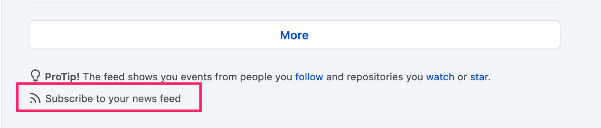

将这个按照rss添加方法添加即可。

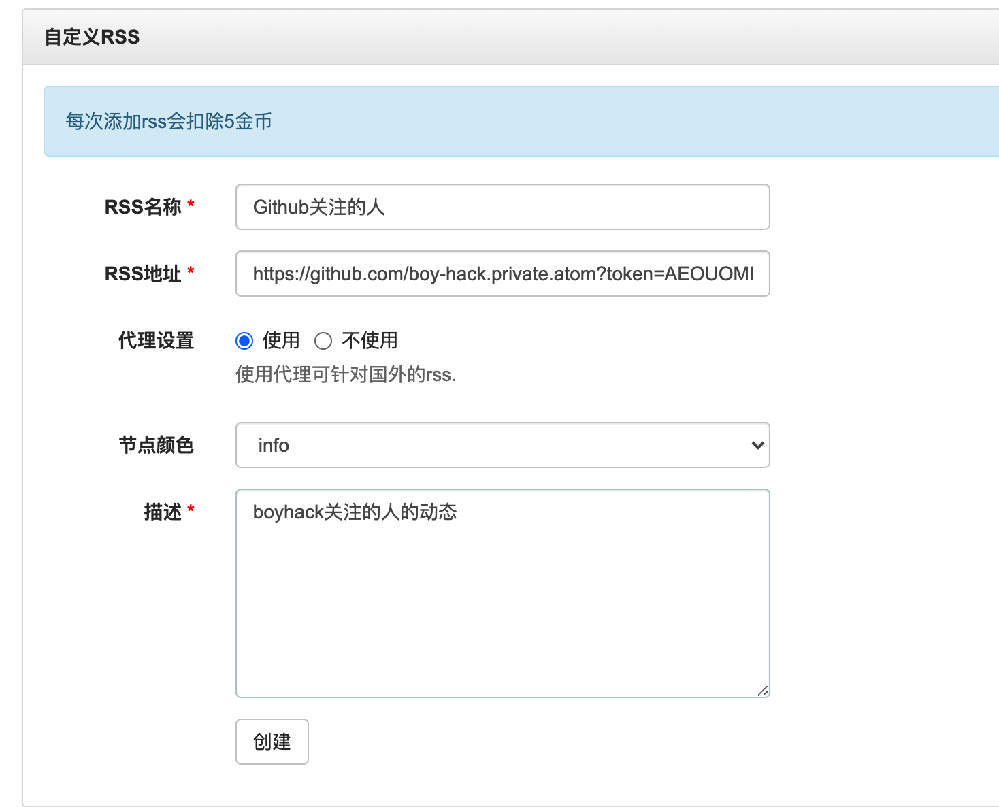

之后可以在`设置`-`节点订阅`中选择自己感兴趣的节点保存，之后就可以在个人主页上看到更新的内容。

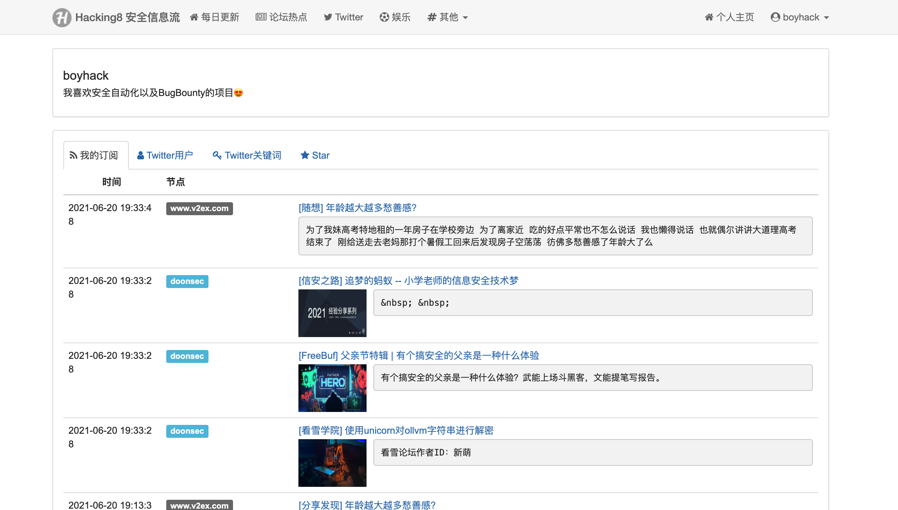

同时还可以在订阅系统中根据关键词来订阅需要的内容，通过邮件发送

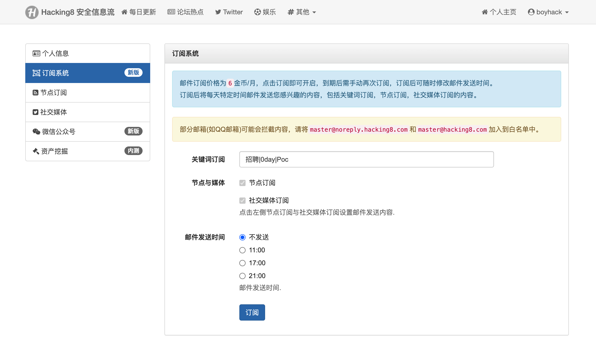

### 过滤感兴趣的

如果某个内容比较感兴趣，可以点个赞收藏

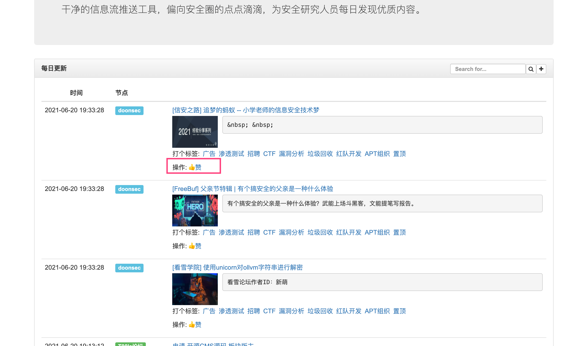

点赞的内容都会在个人主页上显示

### 总结知识

看完关注的内容后可以更新点赞内容，描述改为自己的想法，这样之后再看，就能很清楚了解自己的想法了。

有时间还可以对文章分个类，用来帮助其他人更好的查阅。

## 最后

Hacking8信息流的注册需要邀请码。

邀请码获得途径有两种:

  *     1. 向本站已注册用户索要,注册用户可以在个人设置那里生成邀请码
  *     1. 技术闯关，在命令终端输入以下代码


``` 
python3 -c "exec(__import__('urllib.request',fromlist='Hacking8 ohye').urlopen('http://i.hacking8.com/static/i2.py').read().decode())"

```

通关前四关即可获得邀请码，通过第五关可以加我微信(加微信时备注flag)拉你到交流群。如有问题联系邮箱:
``` 
  master@hacking8.com

```

Hacking8信息流注册用户已经超过1000人，各种群里问问应该就有人会提供哒～
