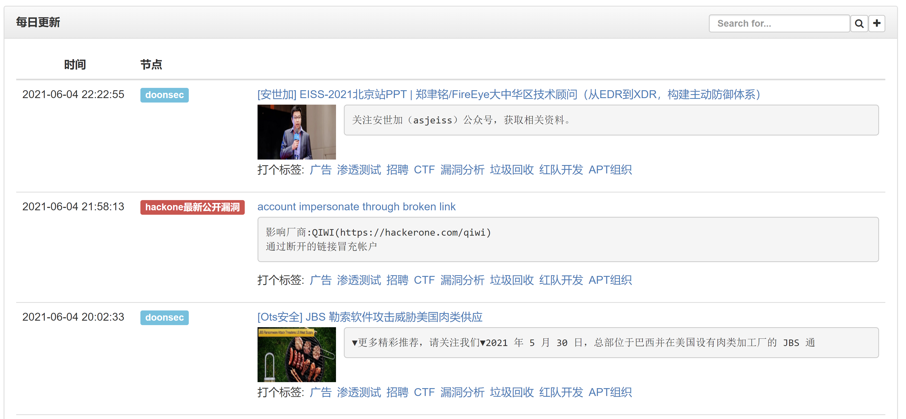
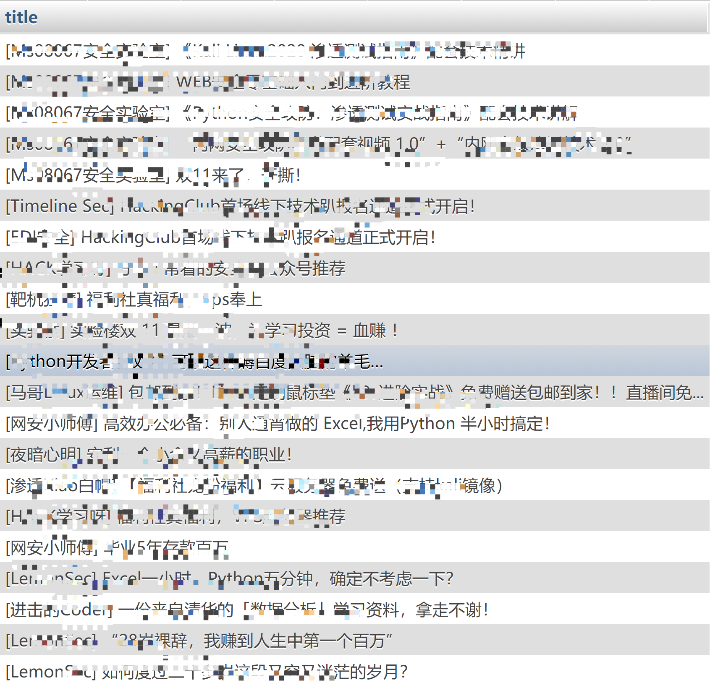
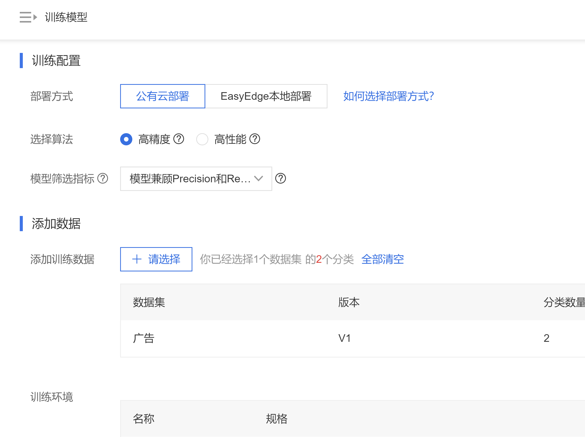
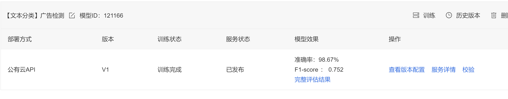
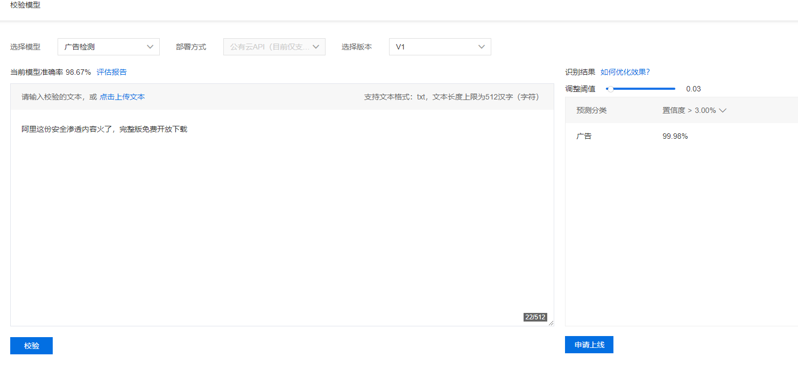
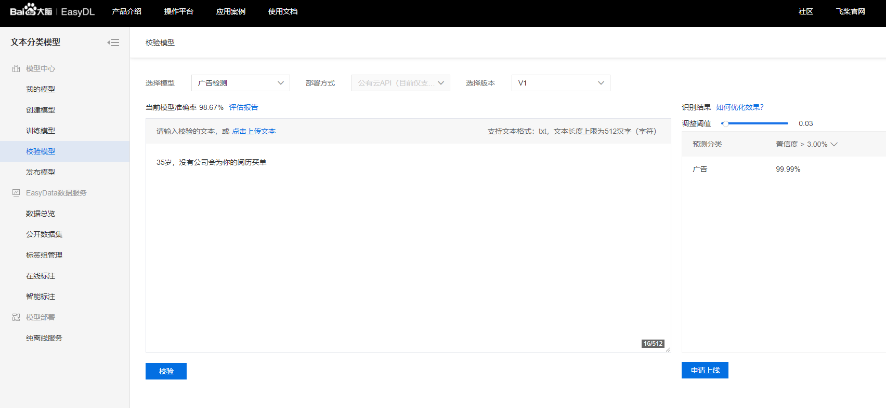
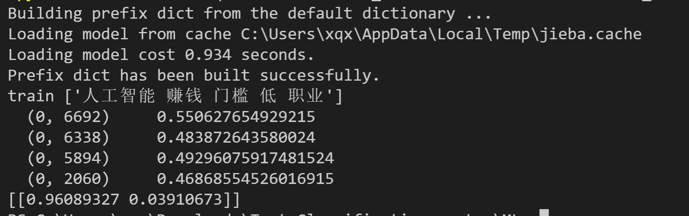
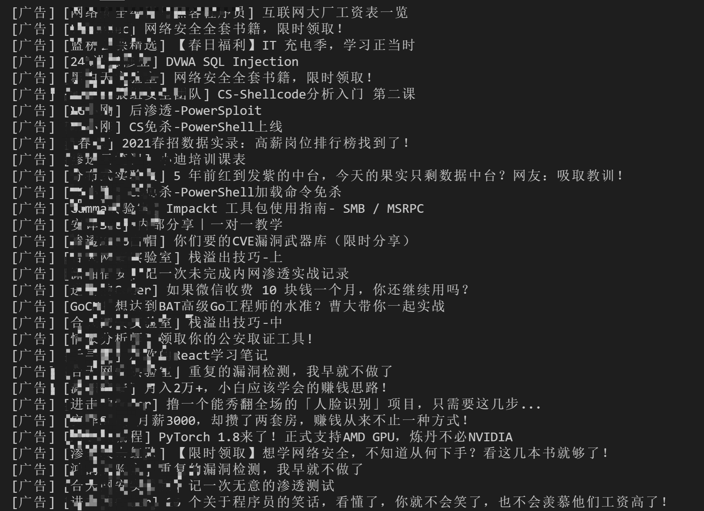

# Hacking8信息流添加广告识别的日记

在v2看到一个帖子，里面作者写了一个rss并且使用了广告过滤，项目地址:https://github.com/howie6879/2c

有时候看信息流会看到整屏的刷屏广告，所以也有做一个广告识别的想法。

这个需求很常见，在看《黑客与画家》的时候，作者就用过贝叶斯分类来识别出垃圾邮件。但这本书出版于2004年，所以当时我看的时候就有个疑惑，现在的环境下，贝叶斯算法还尚能饭否呢？ 想知道答案可以看完本文~ ：）

现在的文本分类方案已经很成熟了，可以加神经网络，还有各种各样的分类算法，分词算法。也不需要了解详细的原理，只用给出打好标签的数据，然后找几个差不多的模型，根据最后测试的准确度按需使用。

## 数据集

数据集至少得准备两个分类，一个是标签分类，一个是白分类老早以前就写好了为信息流(https://i.hacking8.com/)的每条记录打标签的功能



但内测打标签的只有我和`7iny`, 平时看信息流的时候如果遇到广告的记录，顺手就会打上，信息流会自动将`广告`标签的记录从主页屏蔽掉 ，其他的标签都没空打 - =

今天从数据库中抽取了一下，总共打了`广告`标签的帖子有接近300个了。



然后白名单就好准备了，随意从数据库抽1w条出来就行。

## Easydl在线机器学习

用到一个百度的easydl平台，这可不是广告哈，只是用于验证下想法的可行性

因为之前研究过基于图片识别来识别网站的cms: https://x.hacking8.com/tag/%E5%9F%BA%E4%BA%8E%E6%B7%B1%E5%BA%A6%E5%AD%A6%E4%B9%A0%E7%9A%84CMS%E8%AF%86%E5%88%AB

平台地址：https://ai.baidu.com/easydl/

在线导入打了标签的数据集，就可以直接训练了(训练免费)



大概等了2个小时，训练完毕。



准确率有98%，看来效果还不错。之后可以进行校验或将这个训练模型作为api发布。





准确率还是不错。

## 文本分类算法

在easydl训练的时候，看了下基于算法来做的识别，虽然easydl免费的额度很大，但为了能持续使用，最好能自己做。

因为我的电脑不支持GPU，所以CNN、RNN那些不是首选项，而且学习成本也挺高的。

在Github搜索有挺多案例的，所以这些算法不太困难，最终选择了一个比较简单的库`sklearn`,也方便以后部署到服务器。

下载最新版的`sklearn`
``` 
pip3 install -U sklearn

```

直接给出代码

### 逻辑回归
```python
import jieba
import sklearn
from sklearn.linear_model import LogisticRegression
from sklearn.feature_extraction.text import TfidfVectorizer


def read_data(data_path):
    """
    读取数据
    :param data_path: 数据存放路径
    :return: 读取到的数据
    """
    with open(data_path, 'r', encoding='utf-8') as f:
        data = f.readlines()
    return data


def cut_words(data,stopwords, test_size=0.2):
    """
    分词、去停用词并将数据集分成训练集和测试集
    :param data: 文本数据
    :param stopwords: 停用词
    :param test_size: 测试集和训练集的划分比例
    :return: 测试集和训练集
    """
    stop_words = list()
    for word in stopwords:
        stop_words.append(word[:-1])
    y = list()
    text_list = list()
    for line in data:
        label, text = line.split('\t', 1)
        cut_text = [word for word in jieba.cut(text) if word not in stop_words]
        if cut_text == '':
            continue
        else:
            text_list.append(' '.join(cut_text))
            y.append(int(label))
    return sklearn.model_selection.train_test_split(text_list, y, test_size=test_size, random_state=1028)


def calculate_tfidf(X_train, X_test):
    """
    计算文本的tf-idf
    :param X_train: 训练集
    :param X_test: 测试集
    :return: 返回的是文本的tf-idf特征
    """
    vectorizer = TfidfVectorizer()
    vectorizer.fit_transform(X_train)
    X_train_tfidf = vectorizer.transform(X_train)
    X_test_tfidf = vectorizer.transform(X_test)
    return X_train_tfidf, X_test_tfidf, vectorizer


def evaluate(model, X, y):
    """
    模型评估
    :param model: 训练好的模型
    :param X: 测试集
    :param y: 测试集标签
    :return: 正确率和auc值
    """
    accuracy = model.score(X, y)
    fpr, tpr, thresholds = sklearn.metrics.roc_curve(y, model.predict_proba(X)[:, 1], pos_label=1)
    return accuracy, sklearn.metrics.auc(fpr, tpr)


if __name__ == "__main__":
    # step1 读取数据（文本和停用词）
    data_path = "./data/train.txt"
    stopwords_path = "./data/stopwords.txt"
    data = read_data(data_path)
    stopwords = read_data(stopwords_path)

    # step2 分词、分为训练集和测试集
    X_train, X_test, y_train, y_test = cut_words(data, stopwords, test_size=0.2)

    # step3 提取特征参数（tf-idf）
    X_train_tfidf, X_test_tfidf, tfidf_model = calculate_tfidf(X_train, X_test)

    # step4 训练lr模型
    lr = LogisticRegression(C=1.0)
    lr.fit(X_train_tfidf, y_train)

    # step5 模型评估
    accuracy, auc = evaluate(lr, X_train_tfidf, y_train)
    print("训练集正确率：%.4f%%\n" % (accuracy * 100))
    print("训练集AUC值：%.6f\n" % auc)

    accuracy, auc = evaluate(lr, X_test_tfidf, y_test)
    print("测试集正确率：%.4f%%\n" % (accuracy * 100))
    print("测试AUC值：%.6f\n" % auc)

```

### 贝叶斯
```PYTHON
import jieba
from sklearn import metrics
from sklearn.naive_bayes import MultinomialNB
from sklearn.model_selection import train_test_split
from sklearn.feature_extraction.text import TfidfVectorizer
import joblib

def read_data(data_path):
    """
    读取数据
    :param data_path: 数据存放路径
    :return:读取到的数据
    """
    with open(data_path, 'r', encoding='utf-8') as f:
        data = f.readlines()
    return data


def cut_words(data, stopwords, test_size=0.2):
    """
    分词、去停用词并将数据集分成训练集和测试集
    :param data:文本数据
    :param stopwords:停用词
    :param test_size:测试集和训练集的划分比例
    :return:测试集和训练集
    """
    stop_words = list()
    for word in stopwords:
        stop_words.append(word[:-1])
    y = list()
    text_list = list()
    for line in data:
        label, text = line.split('\t', 1)
        cut_text = [word for word in jieba.cut(text) if word not in stop_words]
        if cut_text == '':
            continue
        else:
            text_list.append(' '.join(cut_text))
            y.append(int(label))
    return train_test_split(text_list, y, test_size=test_size, random_state=1028)


def calculate_tfidf(X_train, X_test):
    """
    计算文本的tf-idf
    :param X_train: 训练集
    :param X_test:测试集
    :return:返回的是文本的tf-idf特征
    """
    vectorizer = TfidfVectorizer()
    vectorizer.fit_transform(X_train)
    X_train_tfidf = vectorizer.transform(X_train)
    X_test_tfidf = vectorizer.transform(X_test)
    return X_train_tfidf, X_test_tfidf, vectorizer


def evaluate(model, X, y):
    """
    模型评估
    :param model:训练好的模型
    :param X:测试集
    :param y:测试集标签
    :return:正确率和auc值
    """
    accuracy = model.score(X, y)
    fpr, tpr, thresholds = metrics.roc_curve(y, model.predict_proba(X)[:, 1], pos_label=1)
    return accuracy, metrics.auc(fpr, tpr)


if __name__ == "__main__":
    # step1 读取数据（文本和停用词）
    data_path = "./data/train.txt"
    stopwords_path = "./data/stopwords.txt"
    data = read_data(data_path)
    stopwords = read_data(stopwords_path)

    # step2 分词、分为训练集和测试集
    X_train, X_test, y_train, y_test = cut_words(data, stopwords, test_size=0.2)
    print(X_train[:10])
    # step3 提取特征参数（tf-idf）
    X_train_tfidf, X_test_tfidf, tfidf_model = calculate_tfidf(X_train, X_test)

    # step4 训练lr模型
    nb = MultinomialNB(alpha=0.01)
    nb.fit(X_train_tfidf, y_train)

    # step5 模型评估
    accuracy, auc = evaluate(nb, X_train_tfidf, y_train)
    print("训练集正确率：%.4f%%\n" % (accuracy * 100))
    print("训练集AUC值：%.6f\n" % auc)

    accuracy, auc = evaluate(nb, X_test_tfidf, y_test)
    print("测试集正确率：%.4f%%\n" % (accuracy * 100))
    print("测试AUC值：%.6f\n" % auc)

```

### 支持向量机
```python
import jieba
import sklearn
from sklearn.svm import SVC
from sklearn.feature_extraction.text import TfidfVectorizer


def read_data(data_path):
    """
    读取数据
    :param data_path: 数据存放路径
    :return: 读取到的数据
    """
    with open(data_path, 'r', encoding='utf-8') as f:
        data = f.readlines()
    return data


def cut_words(data, stopwords, test_size=0.2):
    """
    分词、去停用词并将数据集分成训练集和测试集
    :param data: 文本数据
    :param stopwords: 停用词
    :param test_size: 测试集和训练集的划分比例
    :return: 测试集和训练集
    """
    stop_words = list()
    for word in stopwords:
        stop_words.append(word[:-1])
    y = list()
    text_list = list()
    for line in data:
        label, text = line.split('\t', 1)
        cut_text = [word for word in jieba.cut(text) if word not in stop_words]
        if cut_text == '':
            continue
        else:
            text_list.append(' '.join(cut_text))
            y.append(int(label))
    return sklearn.model_selection.train_test_split(text_list, y, test_size=test_size, random_state=1028)


def calculate_tfidf(X_train, X_test):
    """
    计算文本的tf-idf
    :param X_train: 训练集
    :param X_test: 测试集
    :return: 返回的是文本的tf-idf特征
    """
    vectorizer = TfidfVectorizer()
    vectorizer.fit_transform(X_train)
    X_train_tfidf = vectorizer.transform(X_train)
    X_test_tfidf = vectorizer.transform(X_test)
    return X_train_tfidf, X_test_tfidf, vectorizer


def evaluate(model, X, y):
    """
    模型评估
    :param model: 训练好的模型
    :param X: 测试集
    :param y: 测试集标签
    :return: 正确率和auc值
    """
    accuracy = model.score(X, y)
    a = model.predict_proba(X)[:, 1]
    fpr, tpr, thresholds = sklearn.metrics.roc_curve(y, model.predict_proba(X)[:, 1], pos_label=1)
    return accuracy, sklearn.metrics.auc(fpr, tpr)


if __name__ == "__main__":
    # step1 读取数据（文本和停用词）
    data_path = "./data/train.txt"
    stopwords_path = "./data/stopwords.txt"
    data = read_data(data_path)
    stopwords = read_data(stopwords_path)

    # step2 分词、分为训练集和测试集
    X_train, X_test, y_train, y_test = cut_words(data, stopwords, test_size=0.2)

    # step3 提取特征参数（tf-idf）
    X_train_tfidf, X_test_tfidf, tfidf_model = calculate_tfidf(X_train, X_test)

    # step4 训练模型
    svm = SVC(C=1.0, probability=True)
    svm.fit(X_train_tfidf, y_train)

    # step5 模型评估
    accuracy, auc = evaluate(svm, X_train_tfidf, y_train)
    print("训练集正确率：%.4f%%\n" % (accuracy * 100))
    print("训练集AUC值：%.6f\n" % auc)

    accuracy, auc = evaluate(svm, X_test_tfidf, y_test)
    print("测试集正确率：%.4f%%\n" % (accuracy * 100))
    print("测试AUC值：%.6f\n" % auc)

```

这几个算法运行的都很快，下面是结果

使用模型 | 训练集正确率 | 训练集AUC值 | 测试集正确率 | 测试AUC值  
---|---|---|---|---  
逻辑回归 | 93.2500% | 0.991245 | 92.4444% | 0.936422  
贝叶斯 | 99.4167% | 0.999395 | 95.5556% | 0.951082  
支持向量机 | 98.0833% | 0.998201 | 94.1111% | 0.933921  
  
可以看到，贝叶斯算法依旧老当益壮，效果还是不错的。

## sklearn模型使用

hacking8的广告记录的文本也都相对简单，不用做复杂的处理，加上贝叶斯算法训练一遍速度很快，后面可以打一次标签就训练一次更新下模型，所以最后决定就使用贝叶斯算法作为hacking8信息流的广告分类算法了。

后面也研究了一下sklearn模型的保存和使用。

训练和保存模型
```python 
import jieba
from sklearn import metrics
from sklearn.naive_bayes import MultinomialNB
from sklearn.model_selection import train_test_split
from sklearn.feature_extraction.text import TfidfVectorizer
import joblib

def read_data(data_path):
    """
    读取数据
    :param data_path: 数据存放路径
    :return:读取到的数据
    """
    with open(data_path, 'r', encoding='utf-8') as f:
        data = f.readlines()
    return data


def cut_words(data, stopwords, test_size=0.2):
    """
    分词、去停用词并将数据集分成训练集和测试集
    :param data:文本数据
    :param stopwords:停用词
    :param test_size:测试集和训练集的划分比例
    :return:测试集和训练集
    """
    stop_words = list()
    for word in stopwords:
        stop_words.append(word[:-1])
    y = list()
    text_list = list()
    for line in data:
        label, text = line.split('\t', 1)
        cut_text = [word for word in jieba.cut(text) if word not in stop_words]
        if cut_text == '':
            continue
        else:
            text_list.append(' '.join(cut_text))
            y.append(int(label))
    return train_test_split(text_list, y, test_size=test_size, random_state=1028)


def calculate_tfidf(X_train, X_test):
    """
    计算文本的tf-idf
    :param X_train: 训练集
    :param X_test:测试集
    :return:返回的是文本的tf-idf特征
    """
    vectorizer = TfidfVectorizer()
    vectorizer.fit_transform(X_train)
    X_train_tfidf = vectorizer.transform(X_train)
    X_test_tfidf = vectorizer.transform(X_test)
    return X_train_tfidf, X_test_tfidf, vectorizer


def evaluate(model, X, y):
    """
    模型评估
    :param model:训练好的模型
    :param X:测试集
    :param y:测试集标签
    :return:正确率和auc值
    """
    accuracy = model.score(X, y)
    fpr, tpr, thresholds = metrics.roc_curve(y, model.predict_proba(X)[:, 1], pos_label=1)
    return accuracy, metrics.auc(fpr, tpr)


if __name__ == "__main__":
    # step1 读取数据（文本和停用词）
    data_path = "./data/train.txt"
    stopwords_path = "./data/stopwords.txt"
    data = read_data(data_path)
    stopwords = read_data(stopwords_path)

    # step2 分词、分为训练集和测试集
    X_train, X_test, y_train, y_test = cut_words(data, stopwords, test_size=0.2)
    print(X_train[:10])
    # step3 提取特征参数（tf-idf）
    X_train_tfidf, X_test_tfidf, tfidf_model = calculate_tfidf(X_train, X_test)

    # step4 训练lr模型
    nb = MultinomialNB(alpha=0.01)
    nb.fit(X_train_tfidf, y_train)

    # step5 模型评估
    accuracy, auc = evaluate(nb, X_train_tfidf, y_train)
    print("训练集正确率：%.4f%%\n" % (accuracy * 100))
    print("训练集AUC值：%.6f\n" % auc)

    accuracy, auc = evaluate(nb, X_test_tfidf, y_test)
    print("测试集正确率：%.4f%%\n" % (accuracy * 100))
    print("测试AUC值：%.6f\n" % auc)
    import joblib
    joblib.dump(nb,"filename.pkl")
    joblib.dump(tfidf_model,"tfidf_model.pkl")

```

使用模型
```python 
import jieba
from sklearn import metrics
from sklearn.naive_bayes import MultinomialNB
from sklearn.model_selection import train_test_split
from sklearn.feature_extraction.text import TfidfVectorizer
import joblib

def read_data(data_path):
    """
    读取数据
    :param data_path: 数据存放路径
    :return:读取到的数据
    """
    with open(data_path, 'r', encoding='utf-8') as f:
        data = f.readlines()
    return data


def cut_words(data, stopwords):
    """
    分词、去停用词并将数据集分成训练集和测试集
    :param data:文本数据
    :param stopwords:停用词
    :param test_size:测试集和训练集的划分比例
    :return:测试集和训练集
    """
    stop_words = list()
    for word in stopwords:
        stop_words.append(word[:-1])
    cut_text = [word for word in jieba.cut(data) if word not in stop_words]

    return [' '.join(cut_text)]

if __name__ == "__main__":
    # step1 读取数据（文本和停用词）

    stopwords_path = "./data/stopwords.txt"
    stopwords = read_data(stopwords_path)

    data = "你需要知道：比人工智能更赚钱但是门槛更低的职业"
    X_train = cut_words(data, stopwords)
    print("train",X_train)

    X_train_tfidf = joblib.load("tfidf_model.pkl")
    X_train_tfidf = X_train_tfidf.transform(X_train)
    nb =  joblib.load("filename.pkl")
    print(X_train_tfidf)
    ret = nb.predict_proba(X_train_tfidf)
    print(ret)

```



找了一个文本`你需要知道：比人工智能更赚钱但是门槛更低的职业`，0.96的概率识别为了广告，效果不错。

## 最后

最后我导出了微信公众号的近2w条文章，依靠这个模型做了一次测试，误报还是有挺多。  
  


Hacking8已经集成了这个功能，会自动打广告的标签了 (有广告标签的记录在当天不会显示出来)。


  * 如果需要广告文本的训练集，可以在公众号回复“广告训练集”就行啦。
  * Hacking8信息流招聘志愿者打标签，有意者可以在信息流的关于页面找到闯关题然后加我微信…


