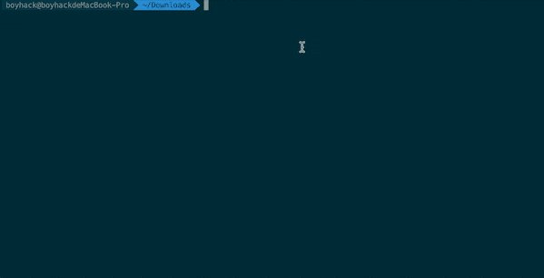
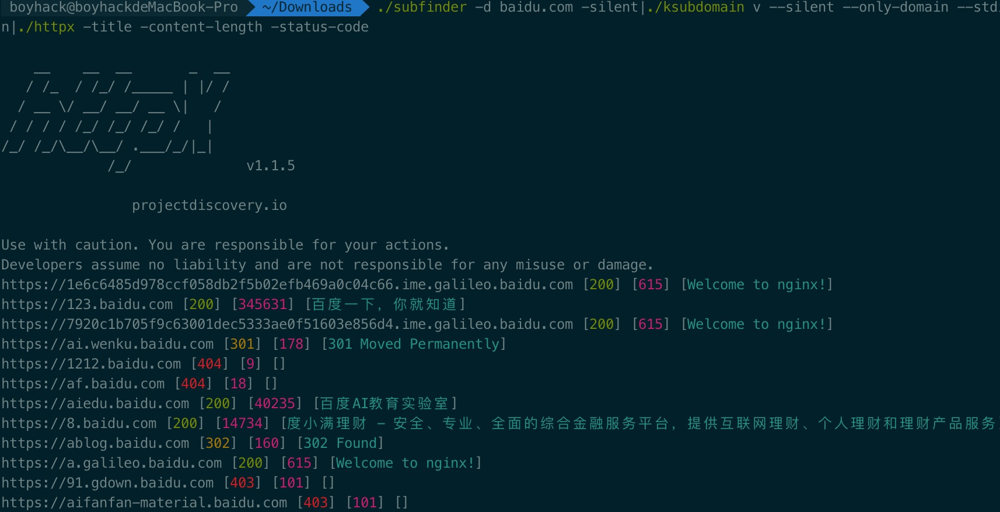

# ksubdomain新版发布,比massdns更快！

过年期间又玩了玩ksubdomain，发现以前写的代码太烂了，时隔一年多，我对go有了些新的理解，所以把它重写了下，一点一点的优化性能和速度，解决高并发中的各种冲突，最终它超过了massdns的速度和性能！

### 什么是ksubdomain

ksubdomain是一款快速的子域名爆破工具。

之前的一个研究 <从代码角度看各类子域名收集工具> https://paper.seebug.org/1292/

现有的子域名爆破工具都是基于系统socket进行发包探测，受限制于系统，效率不高。

所以写了ksubdomain，想法来自masscan和zmap的无状态扫描原理，ksubdomain直接从网卡收包发包，不经过系统，速度和效率极高，而且不占用系统资源。

同时ksubdomain改进了发包制度，会记录发送失败的数据包进行重发，提高准确度。



### 特性和Tips

  * 无状态爆破，有失败重发机制，速度极快
  * 中文帮助，`-h`会看到中文帮助
  * 两种模式，枚举模式和验证模式，枚举模式内置10w字典
  * 将网络参数简化为了`-b`参数，输入你的网络下载速度如`-b 5m`，将会自动限制网卡发包速度。
  * 可以使用`./ksubdomain test`来测试本地最大发包数
  * 获取网卡改为了全自动并可以根据配置文件读取。
  * 会有一个时时的进度条，依次显示成功/发送/队列/接收/失败/耗时 信息。 
  * 不同规模的数据，调整 `--retry` `--timeout`参数即可获得最优效果
  * 当`--retry`为`-1`，将会一直重试直到所有成功。


### 重构了什么

  1. 优化了代码结构，优化了go协程组织方式，代码易懂好看了，解决了一些冲突问题

  2. 设计了一种新的算法，用来快速发包并且大大减少失败率

  3. 获取网卡改为了全自动并可以根据配置文件读取。 
  4. 会有一个时时的进度条，依次显示成功/发送/队列/接收/失败/耗时 信息。


### 与massdns、dnsx对比

功能上的比较

| ksubdomain | massdns | dnsx  
---|---|---|---  
支持系统 | Windows/Linux/Darwin | Windows/Linux/Darwin | Windows/Linux/Darwin  
功能 | 支持验证和枚举 | 只能验证 | 只能验证  
发包方式 | pcap网卡发包 | epoll,pcap,socket | socket  
  
以`baidu.com`为例，选取了10w左右字典,文件名`dd.txt`，在4H5M的网络环境下进行测试，且dns服务器相同，文件名为`dns.txt`

| ksubdomain | massdns | dnsx  
---|---|---|---  
命令行 | time ./ksubdomain v -b 5m -f dd.txt -o ksubdomain.txt -r dns.txt —retry 3 | time ./massdns -r dns.txt -t AAAA -w massdns.txt dd.txt —root -o L | time ./dnsx -a -o dnsx.txt -r dns.txt -l dd.txt -retry 3 -t 5000  
备注 | 重试次数为3 | 没有找到重试的参数 | 重试次数为3, 开启5000线程跑  
结果 | 耗时:17.067s  
| 耗时:25.118s  
| 耗时:40.118s   
  
  
接下来选择了100w字典，文件名为`d2.txt`，在上述相同条件下进行测试

| ksubdomain | massdns | dnsx  
---|---|---|---  
命令行 | time ./ksubdomain v -b 5m -f d2.txt -o ksubdomain.txt -r dns.txt —retry 3 —np | time ./massdns -r dns.txt -t AAAA -w massdns.txt d2.txt —root -o L | time ./dnsx -a -o dnsx.txt -r dns.txt -l d2.txt -retry 3 -t 5000  
备注 | 加了—np 防止打印过多 |  |   
结果 | 耗时:1m28.273s  
| 耗时:3m29.337s  
| 耗时:5m26.780s   
  
  
### Useage
```bash
NAME:
   KSubdomain - 无状态子域名爆破工具

USAGE:
   ksubdomain [global options] command [command options] [arguments...]

VERSION:
   1.4

COMMANDS:
   enum, e    枚举域名
   verify, v  验证模式
   test       测试本地网卡的最大发送速度
   help, h    Shows a list of commands or help for one command

GLOBAL OPTIONS:
   --help, -h     show help (default: false)
   --version, -v  print the version (default: false)

```

**验证模式** 提供完整的域名列表，ksubdomain负责快速获取结果
```bash 
./ksubdomain verify -h

NAME:
   cmd verify - 验证模式

USAGE:
   cmd verify [command options] [arguments...]

OPTIONS:
   --filename value, -f value   验证域名文件路径
   --band value, -b value       宽带的下行速度，可以5M,5K,5G (default: "2m")
   --resolvers value, -r value  dns服务器文件路径，一行一个dns地址
   --output value, -o value     输出文件名
   --silent                     使用后屏幕将仅输出域名 (default: false)
   --retry value                重试次数,当为-1时将一直重试 (default: 3)
   --timeout value              超时时间 (default: 6)
   --stdin                      接受stdin输入 (default: false)
   --only-domain, --od          只打印域名，不显示ip (default: false)
   --not-print, --np            不打印域名结果 (default: false)
   --help, -h                   show help (default: false)

```
```bash 
从文件读取 
./ksubdomain v -f dict.txt

从stdin读取
echo "www.hacking8.com"|./ksubdomain v --stdin

```

**枚举模式** 只提供一级域名，指定域名字典或使用ksubdomain内置字典，枚举所有二级域名
```bash 
./ksubdomain enum -h

NAME:
   cmd enum - 枚举域名

USAGE:
   cmd enum [command options] [arguments...]

OPTIONS:
   --band value, -b value          宽带的下行速度，可以5M,5K,5G (default: "2m")
   --resolvers value, -r value     dns服务器文件路径，一行一个dns地址
   --output value, -o value        输出文件名
   --silent                        使用后屏幕将仅输出域名 (default: false)
   --retry value                   重试次数,当为-1时将一直重试 (default: 3)
   --timeout value                 超时时间 (default: 6)
   --stdin                         接受stdin输入 (default: false)
   --only-domain, --od             只打印域名，不显示ip (default: false)
   --not-print, --np               不打印域名结果 (default: false)
   --domain value, -d value        爆破的域名
   --domainList value, --dl value  从文件中指定域名
   --filename value, -f value      字典路径
   --skip-wild                     跳过泛解析域名 (default: false)
   --level value, -l value         枚举几级域名，默认为2，二级域名 (default: 2)
   --level-dict value, --ld value  枚举多级域名的字典文件，当level大于2时候使用，不填则会默认
   --help, -h                      show help (default: false)

```
``` 
./ksubdomain e -d baidu.com

从stdin获取
echo "baidu.com"|./ksubdomain e --stdin

```

### 管道操作

借助`subfinder`，`httpx`等工具，可以用管道结合在一起配合工作。达到收集域名，验证域名，http验证存活目的。
```bash 
./subfinder -d baidu.com -silent|./ksubdomain v --silent --only-domain --stdin|./httpx -title -content-length -status-code

```



### 开源

ksubdomain是遵守MIT协议的开源软件，仅供用于教育学习目的。

项目地址：https://github.com/boy-hack/ksubdomain
