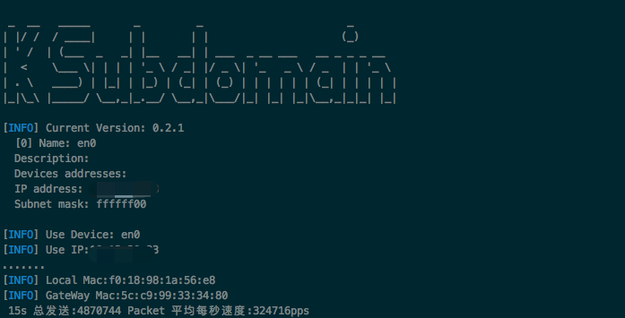
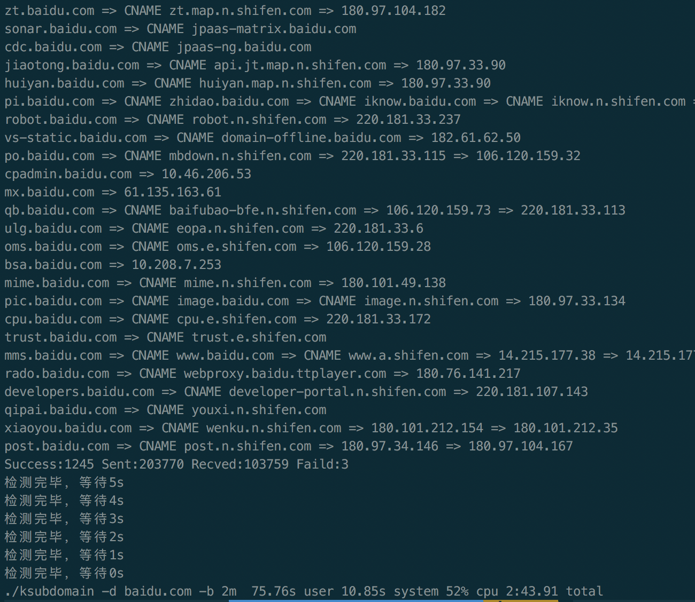
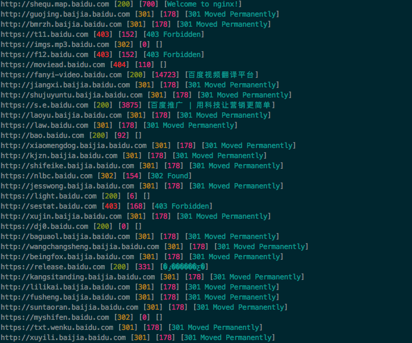

# ksubdomain无状态域名爆破工具

在渗透测试信息中我们可能需要尽可能收集域名来确定资产边界。

在写自动化渗透工具的时候苦与没有好用的子域名爆破工具，于是自己就写了一个。

> Ksubdomain是一个域名爆破/验证工具，它使用Go编写，支持在Windows/Linux/Mac上运行，在Mac和Windows上最大发包速度在30w/s,linux上为160w/s的速度。

总的来说，ksubdomain能爆破/验证域名，并且**快** 和**准确** 。

## 什么是无状态

> 无状态连接是指无需关心TCP,UDP协议状态，不占用系统协议栈 资源，忘记syn,ack,fin,timewait ，不进行会话组包。在实现上也有可能需要把必要的信息存放在数据包本身中。如13年曾以44分钟扫描完全部互联网zmap，之后出现的massscan， 都使用了这种无状态技术，扫描速度比以往任何工具都有质的提升，后者更是提出了3分钟扫完互联网的极速。

zmap/masscan都是基于tcp协议来扫描端口的(虽然它们也有udp扫描模块)，相比它们，基于无状态来进行DNS爆破更加容易，我们只需要发送一个udp包，等待DNS服务器的应答即可。

目前大部分开源的域名爆破工具都是基于系统socket发包，不仅会占用系统网络，让系统网络阻塞，且速度始终会有限制。

ksubdomain使用pcap发包和接收数据，会直接将数据包发送至网卡，不经过系统，使速度大大提升。

ksubdomain提供了一个`-test`参数，使用它可以测试本地最大发包数，使用`ksubdomain -test`

在Mac下的运行结果，每秒30w左右



发包的多少还和网络相关，ksubdomain将网络参数简化为了`-b`参数，输入你的网络下载速度如`-b 5m`，ksubdomain就会自动限制发包速度。

## 状态表

由于又是udp协议，数据包丢失的情况很多，所以ksubdomain在程序中建立了“状态表”，用于检测数据包的状态，当数据包发送时，会记录下状态，当收到了这个数据包的回应时，会从状态表去除，如果一段时间发现数据包没有动作，便可以认为这个数据包已经丢失了，于是会进行重发，当重发到达一定次数时，就可以舍弃该数据包了。

上面说ksubdomain是无状态发包，如何建立确认状态呢？

根据DNS协议和UDP协议的一些特点，DNS协议中ID字段，UDP协议中SrcPort字段可以携带数据，在我们收到返回包时，这些字段的数据不会改变。所以利用这些字段的值来确认这个包是我们需要的，并且找到状态表中这个包的位置。

通过状态表基本可以解决漏包，可以让准确度达到一个满意的范围，但与此同时会发送更多的数据包和消耗一些时间来循环判断。

通过`time ./ksubdomain -d baidu.com -b 1m` 使用ksubdomain内置的字典跑一遍baidu.com域名，大概10w字典在2分钟左右跑完，并找到1200多子域名。



## Useage

从releases下载二进制文件。

在linux下，还需要安装`libpcap-dev`,在Windows下需要安装`WinPcap`，mac下可以直接使用。
``` 

 _  __   _____       _         _                       _
| |/ /  / ____|     | |       | |                     (_)
| ' /  | (___  _   _| |__   __| | ___  _ __ ___   __ _ _ _ __
|  <    \___ \| | | | '_ \ / _| |/ _ \| '_   _ \ / _  | | '_ \
| . \   ____) | |_| | |_) | (_| | (_) | | | | | | (_| | | | | |
|_|\_\ |_____/ \__,_|_.__/ \__,_|\___/|_| |_| |_|\__,_|_|_| |_|

Usage of ./ksubdomain:
  -b string
        宽带的下行速度，可以5M,5K,5G (default "1M")
  -d string
        爆破域名
  -dl string
        从文件中读取爆破域名
  -e int
        默认网络设备ID,默认-1，如果有多个网络设备会在命令行中选择 (default -1)
  -f string
        字典路径,-d下文件为子域名字典，-verify下文件为需要验证的域名
  -l int
        爆破域名层级,默认爆破一级域名 (default 1)
  -o string
        输出文件路径
  -s string
        resolvers文件路径,默认使用内置DNS
  -silent
        使用后屏幕将不会输出结果
  -skip-wild
        跳过泛解析的域名
  -test
        测试本地最大发包数
  -ttl
        导出格式中包含TTL选项
  -verify
        验证模式

```

### 一些常用命令
```
使用内置字典爆破
ksubdomain -d seebug.org

使用字典爆破域名
ksubdomain -d seebug.org -f subdomains.dict

字典里都是域名，可使用验证模式
ksubdomain -f dns.txt -verify

爆破三级域名
ksubdomain -d seebug.org -l 2

通过管道爆破
echo "seebug.org"|ksubdomain

通过管道验证域名
echo "paper.seebug.org"|ksubdomain -verify

```

## 管道操作

借助知名的`subfinder`，`httpx`等工具，可以用管道结合在一起配合工作。
``` 
./subfinder -d baidu.com -silent|./ksubdomain -verify -silent|./httpx -title -content-length -status-code

```

subfinder 通过各种搜索引擎获取域名

ksubdomain 验证域名

httpx http请求获得数据,验证存活



## Knownsec 404 Team星链计划

ksubdomain 是Knownsec 404 Team星链计划计划中的一员。

> “404星链计划”是知道创宇404实验室于2020年8月开始的计划，旨在通过开源或者开放的方式，**长期维护** 并推进涉及安全研究各个领域不同环节的工具化，就像星链一样，将立足于不同安全领域、不同安全环节的研究人员链接起来。
> 
> 其中不仅限于突破安全壁垒的大型工具，也会包括涉及到优化日常使用体验的各种小工具，除了404本身的工具开放以外，也会不断收集安全研究、渗透测试过程中的痛点，希望能通过“404星链计划”改善安全圈内工具庞杂、水平层次不齐、开源无人维护的多种问题，营造一个更好更开放的安全工具促进与交流的技术氛围。

https://github.com/knownsec/404StarLink-Project

## 开源地址

ksubdomain完全开源，任何人可以在此基础上修改或提交代码。

GitHub：https://github.com/knownsec/ksubdomain
