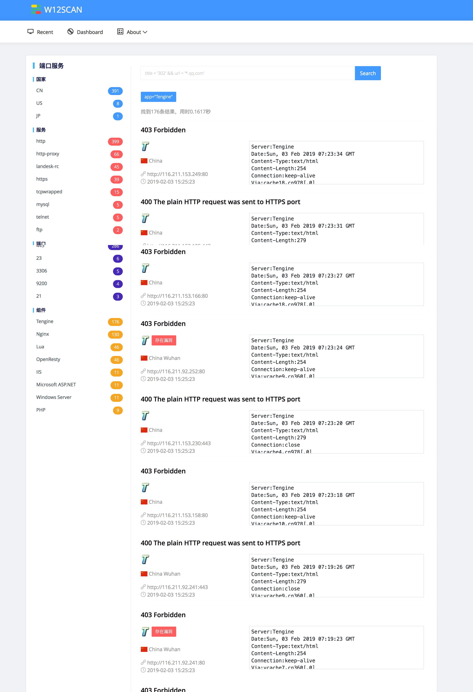
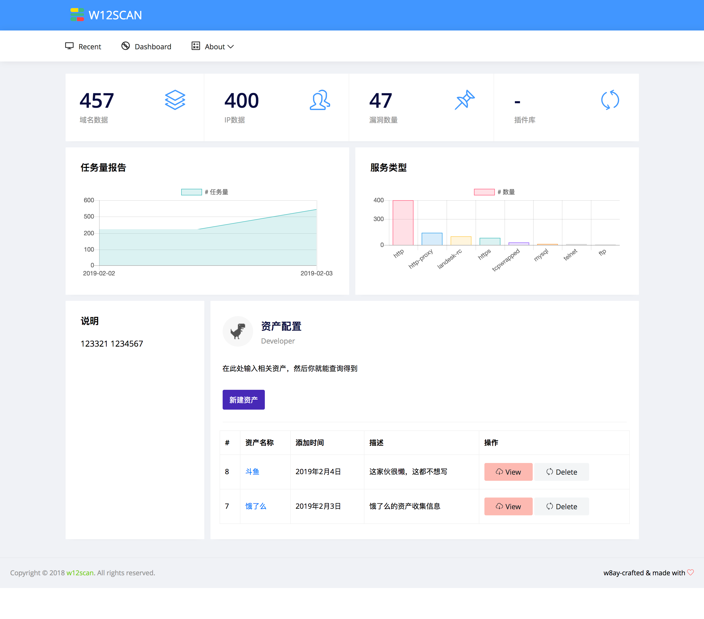

# w12scan WEB端完成了

大年三十，一边看着春晚，一边修改细节，最后成品感觉挺不错的。web端完成了，对这个作品越来越期待了。今天想了下，觉得w12scan的架构有点复杂， 如果不是我自己的话，其他人部署可能会很困难，曾经我就是不喜欢这样困难的部署才造轮子的，所以，我觉得w12scan的部署至少应该也是一键化的，在Windows，mac，Linux上都是这样。 

我有一个愿景，未来w12scan可以成为像啊D，sqlmap，中国菜刀一样知名的工具 

演示视频：
<video controls src="./assert/w12scan-2.mp4" title="Title"></video>
  

