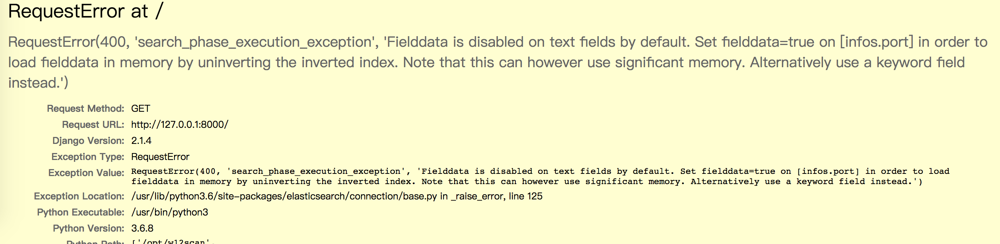
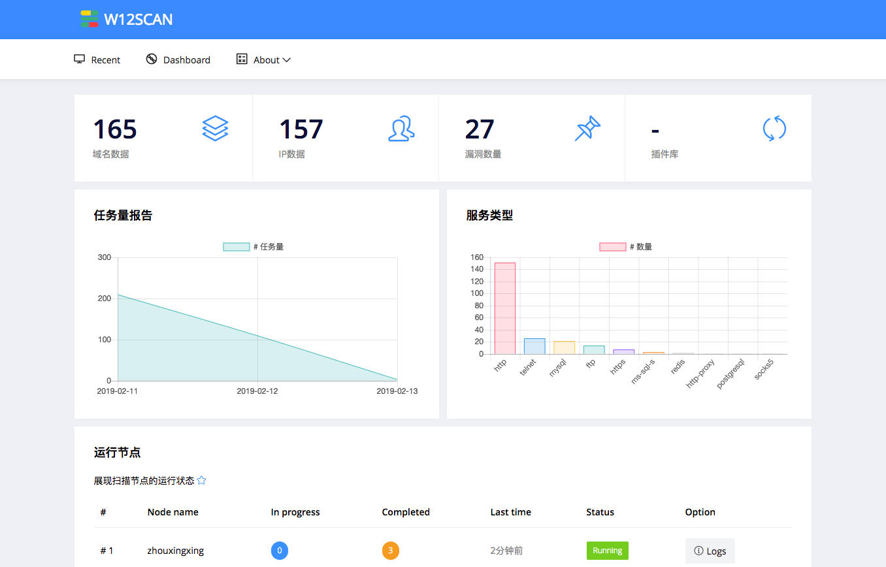

# w12scan docker-compose 编排踩坑

w11scan的时候dockerfile写得快要吐血了，本想着有了w11scan踩过的坑，w12scan应该简单才是，没想到更大的坑在等着我。 

##  前置 

前置大概浏览一遍 docker从入门到实践 https://www.hacking8.com/docker-practice/

w12scan需要多服务一起启动，有client，redis，elasticsearch，web等，所以使用的是docker-compose编排，这些设置都没问题，参考一下别人的，然后自己设置没问题。 

##  踩坑 

  * 第一次踩坑，client镜像无法连接web，排查后发现是docker一个环境变量没有传递对。 
  * 第二次，算是明白dockerfile中为什么别人要自定义一个`sh`文件运行了，而不是用dockerfile中自带的`RUN`之类的语法运行。因为有些服务需要在启动的时候在进行相关配置，而如果用dockerfile中的`RUN CMD`等等，会直接在容器中运行打包。 

  * 第三次，client的masscan无法启动，但是明明装masscan（基于alpine镜像），提示没有libcap，装了libcap发现依旧报错，后面翻看别人编译masscan的dockerfile，发现还要装一个libcap-dev才行。 

  * 第四次，client、web端正常启动，但是静态资源无法加载，排查后发现django debug模式为False的时候就不会加载静态资源了，再加一层转发太麻烦了，于是设置debug为True，设置 ALLOWED_HOSTS = ["*"] 

  * 第五次，终于正常了，测试扫描几个目标也成功，但是转到首页时提示这应该是elasticsearch的锅了，但是我调试的时候也是用的docker启动的，怎么就没报错呢，想起调试时是直接拉的elasticsearch，但是构建时为了大小依赖的是alpine镜像构建的，会不会这原因？改完后发现还是这样。经过排查发现是elasticsearch的数据结构不对，为什么不对呢，继续往上追溯，发现是masscan的扫描结果问题，不知道为何masscan扫描会有重复的情况，设置了去重算法后，还是存在此问题。最后，修改了一处elasticsearch的查询语法解决， 

  * 第六次，解决了上面的问题，都跑起来了，看起来很好。跑了几个目标，能跑起来了，看起来不错，但还是出现了问题。。nmap的识别结果出错，最后定位到的原因是，python-nmap的解析模块问题。然后又找到原因，解析模块错误的原因是在alpine中nmap某些命令不能执行。好吧，完完全全被alpine整的明明白白。。最后解决办法是换debian镜像或者自己写个服务识别，不用nmap。思来想去决定使用debian镜像，比较nmap识别的比较全~ 

##  结尾 

经过了以上一系列的踩坑，终于在本地运行没问题了。今天想把它放到vps上运行，但无奈vps内存太小，跑不了Elasticsearch，于是放弃了。docker相关的零零总总大概花了两三天的时间调试，主要总结几个问题 

  * dockerfile定义时的一定指定tag，很多服务不同版本变动很大 
  * 以上问题说到底还是一个软件功能不够完善，导致换了环境后bug百出... 

不过通过这些踩坑，也算是学习到了docker的使用，现在感觉自己也可以编写类似`vulhub`的项目了。 

##  W12SCAN完结 

w12scan算是完成了，剩下的是一些小优化和bug修复。还有一个功能是查看节点的运行信息和功能状态没有写，~~但我觉得没必要写了~~ 。现在程序写完后，却没有当初模模糊糊完成的那种兴奋了。 

