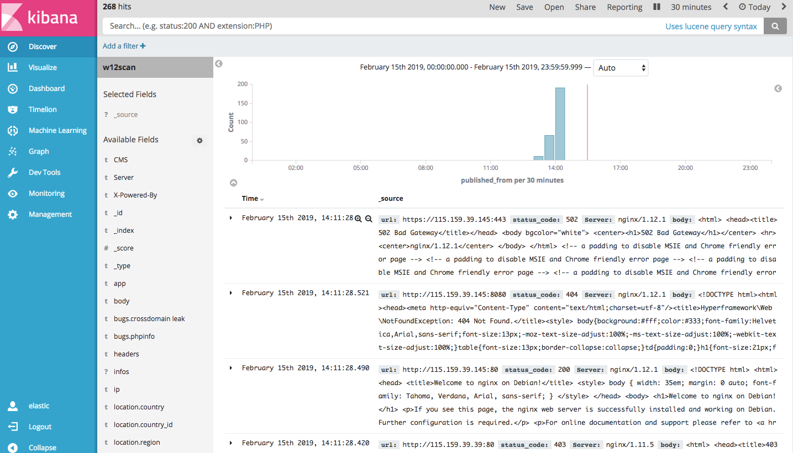
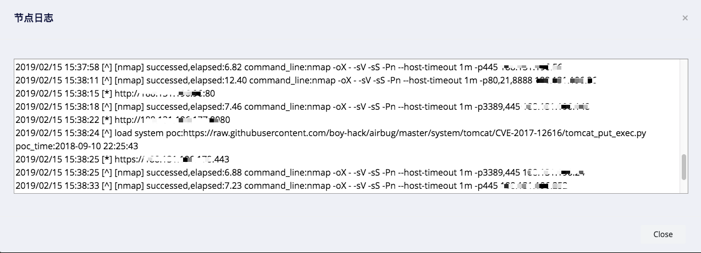
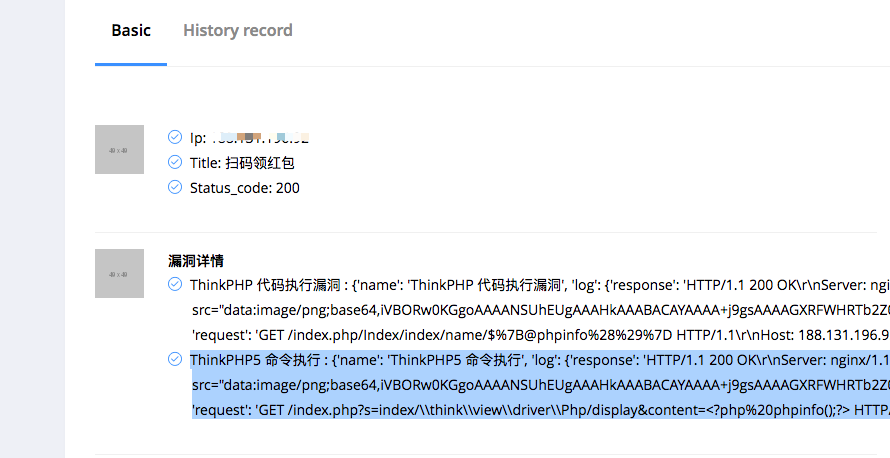

# w12scan 在线部署记录

我太兴奋了，将w12scan在线部署成功，并且也达到了令人满意的效果。

## 0x00

w12scan之前一直在本地测试，局限太大，每次启动就要掉我不少电，尝试过在vps上启动，但是vps配置太低，跑不动es。一度很想放弃。。

## 0x01

昨天晚上，突然想起了elasticsearch云服务，在对比了阿里云、腾讯云、百度云和华为云之后，只有阿里云提供了试用服务，腾讯云和百度云试用没有不说，价格也是贵的一批，华为云说好新用户注册可以免费试用，但是注册完后却说没有资格。。综上所述，只有阿里云比较好，可以免费30天，足够我测试和调试w12scan了。

## 0x02

如果你也想像我一样这样部署w12scan的话，需要通过以下几个步骤。

  1. https://github.com/boy-hack/w12scan 下载web端
  2. 修改`docker-compose.yml`,将elasticsearch服务去掉，并将`ELASTICSEARCH_HOSTS`环境变量的值修改为云服务的地址。
  3. 修改`config.py`中es验证的密码
  4. `docker-compose up -d`启动！

## 0x03

  * 顺便说一句，阿里云的es服务挺好用，但是价格嘛…  

  * 扫描端的每次更新都会自动构建到dockerhub，所以无需担心扫描端更新的问题
  * 节点日志查看真的太棒了，随时查看扫描节点的运行情况！  

  * 通过对接airbug项目扫描到的漏洞

