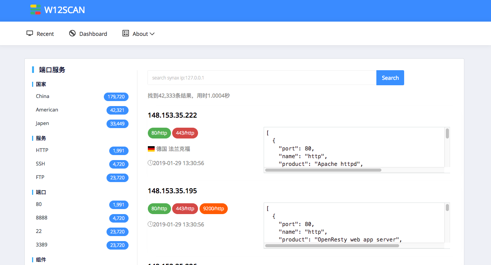
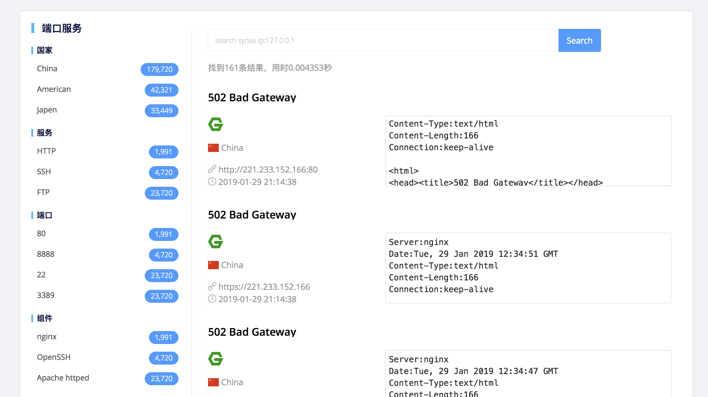

# w12scan 开发近况

实习的公司有不少工作，只能抽些琐碎的时间来完成，而且还要写长篇大论的毕业设计，实际开发阶段在里面占比已经很小了。但我还是想写完它，如果可以开源就更好了。今天实习的最后一天，很早就下了班，所以写个w12scan的开发近况。

## 0x00

目前整体的架构设计已经完成了，分为了一个扫描端（Client）和一个WEB端（Server），使用的技术大概有redis、mysql、django、elasticsearch等等。

目前扫描端的代码编写已经完成了，然后现在的工作就是web端的逻辑编写，所以把扫描的测试数据导入到了elasticsearch，然后把web显示的逻辑处理好了。如下图  
  

## 困难点

elasticsearch的中文文档太少了，用起来很不顺畅啊，但是本系统很多功能都依赖于它，但是得慢慢咀嚼

## 总结

在架构设计中我把Client端扫描核心功能和外围的一些小功能比如去重复算法，域名解析ip到ip扫描，ip转换为域名进行域名扫描分离开，现在看绝对是明智之举，以后进行分布式的时候我可以通过一个中心节点进行这些外围小操作，然后再把整个扫描过程调度到celery中即可实现分布式。
