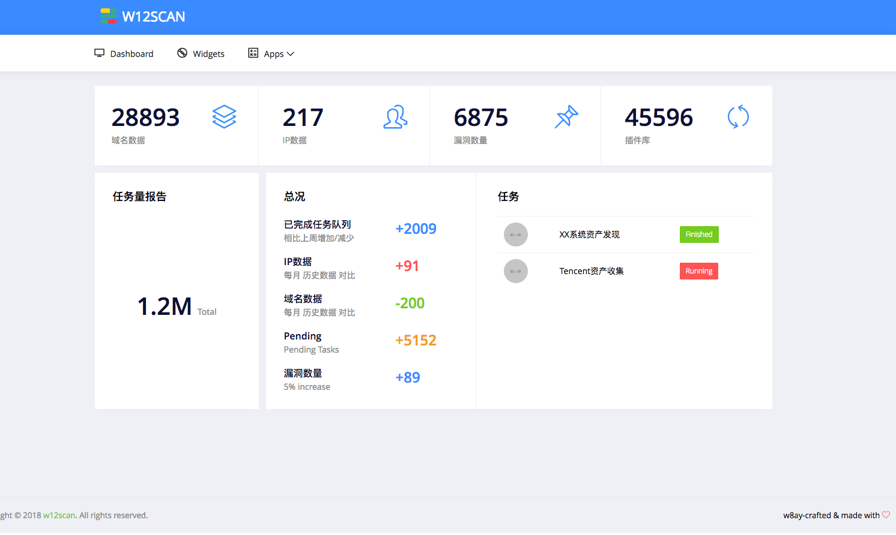
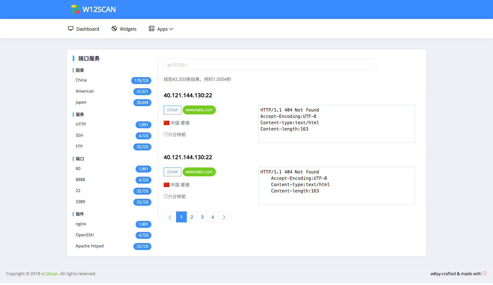

# w12scan 想法和front-end

很久之前就有w12scan的想法，但是一直停留在那里，这次借毕业设计的机会，将它实现出来！~

## Thinking

原本设计出来是为了寻找SRC的资产等信息，后来觉得可以在扩大一下，保留SRC资产的收集功能，将范围扩大到全网。具体我想模仿zoomeye,fofa的全网检索功能，所以会将所有的域名IP信息进行深度的指纹识别入库，保留SRC的功能是指我可以随时指定扫描器扫描设置的指定IP端或者域名，然后会自动寻找子域名和关联域名，扫描器闲下来的时候可以随机扫描全网的内容。

## Front-end

部分功能细节还需要在考虑一下，不过大概的框架已经设定好了，一般有一个华丽的外表才能让我有心情设计内在，于是花了一天时间设计的两个页面

## End

这些还只是初稿，可能还会进行修改，博客也会继续更新一些编写的想法，也有计划在答辩完成后将这款工具开源~
