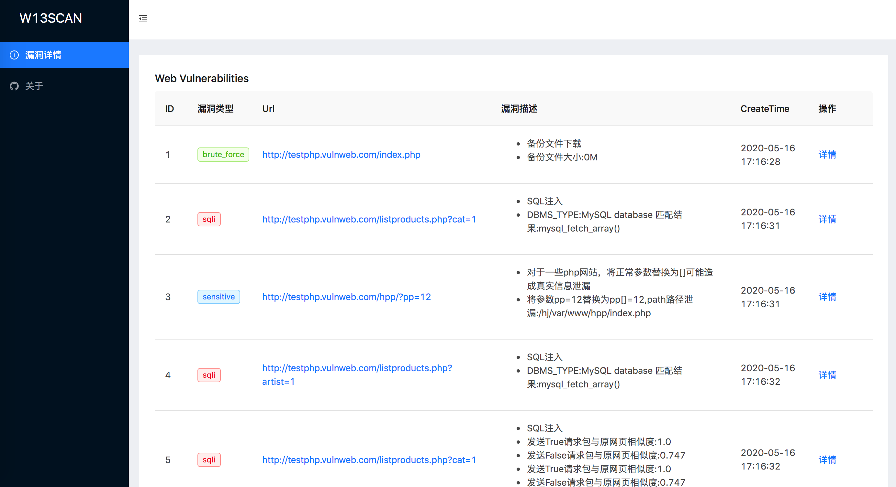
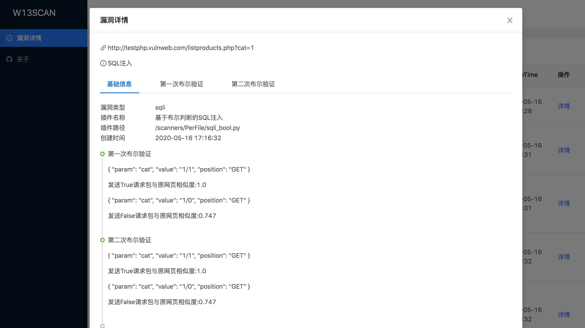
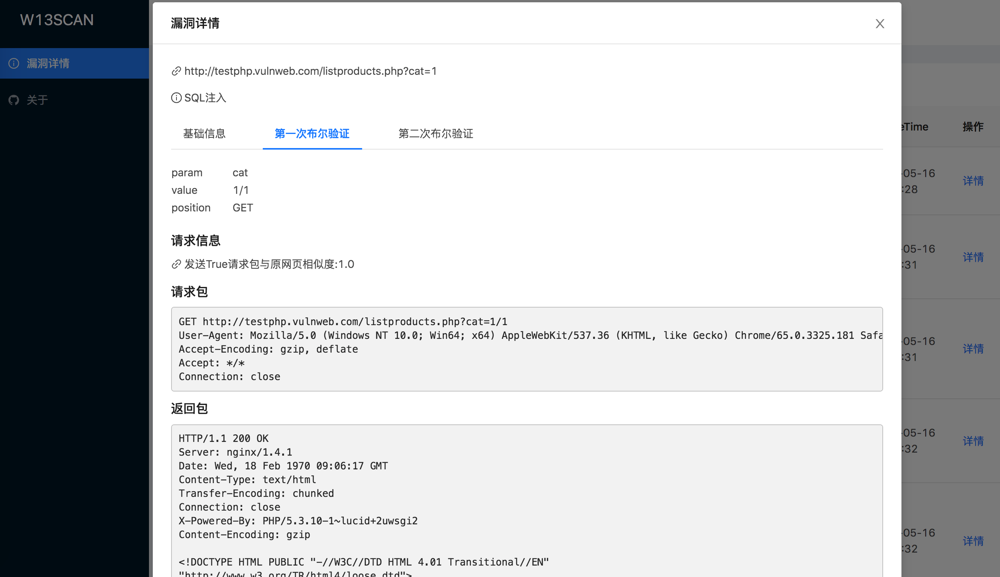

# w13scan 2.0 发布

原本时间很忙，只能抽出空来更新，但自己立的flag，含着泪也要完成。
``` 
W13scan 是基于Python3的一款开源的Web漏洞发现工具,它支持主动扫描模式和被动扫描模式，能运行在Windows、Linux、Mac上。

```

这次更新加入了基于语义解析的xss扫描模块，http smuggling走私攻击，fastjson检测模块，.net XSS检测等，优化了之前的漏洞扫描模块，现在所有模块都支持GET，POST，COOKIE类型请求的检测，部分模块支持对伪静态uri上进行检测。w13scan也对自身的代码结构，以及漏洞插件api调用方式等进行了一次打的更新，漏洞检测代码会看起来更简洁，更优美。

新版能够实时生成html格式的报告，报告页面如下



扫描模块会将如何检测到的漏洞详细记录下来，可以知道检测模块是如何通过正则匹配，语义分析还是相似度验证来发现漏洞，方便可以找到问题的原因



以sql布尔验证为例，漏洞模块进行了两次布尔盲注验证，并且记录了发送的True请求包与False请求包，并计算展示了每个请求包与原网页的相似度，同时也能查看发送的请求包与接收到的返回包。



## W13SCAN 的特点

相比于其他专业的扫描工具，w13scan也有自己独有的优点。

### 1.免费/开源

安全从业人员可能不会信任任何程序，唯一能让人稍微信任的就是开源代码。

安全是建立在信任之上，信任需要开放和透明。w13scan核心代码完全开源，任何人可以检查其代码的安全性。

可以方便针对一些棘手且高度专业化的环境，可以按照w13scan开发文档补充其功能，自定义需要的模块。

### 2.丰富的检测插件

W13SCAN支持对一些常见漏洞进行扫描，也支持对一些专业性环境上的漏洞扫描。

  * XSS扫描

    * 基于语义的反射型XSS扫描，准确率极高
    * XSS扫描会基于html语义与js语义分析，从网页中提取参数进行解析测试
  * jsonp信息泄漏

    * 基于语义解析寻找敏感信息
  * sql注入
    * 基于报错SQL注入检测
    * 基于网页相似度布尔类型的SQL注入检测
  * http smuggling 走私攻击
  * Fastjson检测与利用
  * .Net通杀Xss检测
    * portswigger 2019十大攻击技术第六名
  * iis解析漏洞
  * 敏感文件信息泄漏
    * 支持含备份文件，debug文件，js敏感信息,php真实路径泄漏,仓库泄漏，phpinfo泄漏，目录遍历等
  * baseline检测(反序列化参数检测)
  * 命令/代码注入检测
    * 支持asp,php等语言的检测
    * 支持系统命令注入检测(支持无回显检测)
    * 支持get,post,cookie等方式检测
  * 路径穿越漏洞
  * struts2漏洞检测
    * 包括s2-032、s2-045漏洞
  * webpack打包源文件泄漏


### 3.方便集成

W13SCAN天生的Python血统以及可以在各种平台运行，可以很容易的把它当成一个Python模块进行调用，我们也提供了一些例子与文档来帮助您将W13SCAN集成到自己的扫描系统中。

## 扫描平台对比

由于时间原因，w13scan测试了以下三个平台，如果你有漏洞平台靶机，欢迎提供给W13SCAN进行测试。

平台名称 | 扫描结果 | 扫描模式  
---|---|---  
WVS PHP Vulnweb | 查看 | crawlergo+w13scan 自动扫描  
WVS AJAX Vulnweb | 查看 | 被动扫描  
demo.aisec.cn | 查看 | 被动扫描  
  
## 扫描细节的处理

w13scan的在一些扫描细节处理

  * 支持扫描在 Get,Post,Cookie,Uri(伪静态) 上检测
  * w13scan内置第三方`dnslog.cn`反连平台(默认开启)，也内置有自己的反连平台(默认不开启，需配置)，用于检测无回显漏洞。
  * w13scan会记录发包过程及详情，并推荐可能的测试方案。
    * 有时候漏洞检测无法知道是否是漏扫插件的误报还是程序本身有问题，w13scan会详细说明扫描到的漏洞是怎么被发现的，以及一些判定过程。
  * 在扫描过程中会进行简单的信息收集，如收集`网站框架`，`操作系统`，`编程语言`,`web中间件`等信息，后续的检测中会根据信息收集的程度构造payload，信息收集插件在`fingprints`目录。
  * 扫描器在扫描XSS时会通过`html与js的语义化分析`自动从网页中寻找更多参数用于测试,以及根据wooyun漏洞库top参数合并，并根据算法只保留动态的参数进行测试。
  * w13scan会实时将结果以json的格式写入到output目录下,开启`--html`后，会实时生成精美的html格式的漏洞报告。
  * level发包等级，从1~5，会发送越来越多的数据包
    * 1 发送简单的检测数据包
    * 2 无视指纹识别的环境进行插件扫描(部分插件需要指纹识别到环境才会进行扫描)
    * 3 带上cookie扫描
    * 4 对uri进行探测(分离url，可探测伪静态情况)
    * 5 针对所有情况发送请求包


### 反连平台

w13scan内置了自己的反连平台，支持`http`,`dns`,`Java RMI`三种类型的反连，反连平台实现很简单，都是用纯python编写，没有用到第三方库，减少一些依赖的负担吧。

反连平台因为需要配置，默认是不启用的，但是也内置了一个第三方的反连平台`dnslog.cn`，这个平台很好，不需要账号，即开即用，所以它是默认启用的(有时间我也用go实现一个,就不用内置了)。

### 结合动态爬虫扫描

在目录`crawlergo_example` `spider.py`展示了如何与crawlergo爬虫结合联动。代码也很简洁，从中可以学习到w13scan的api是如何调用的。
```python 
#!/usr/bin/env python3
# -*- coding: utf-8 -*-
# @Time    : 2020/5/10 5:28 PM
# @Author  : w8ay
# @File    : spider.py
import os
import sys
from urllib.parse import urlparse

import requests
import json
import subprocess

from lib.core.data import KB

root = os.path.dirname(os.path.realpath(__file__))
sys.path.append(os.path.join(root, "../"))
sys.path.append(os.path.join(root, "../", "W13SCAN"))
from api import modulePath, init, FakeReq, FakeResp, HTTPMETHOD, task_push_from_name, start, logger

# 爬虫文件路径
Excvpath = "/Users/boyhack/tools/crawlergo/crawlergo_darwin"

# Chrome 路径
Chromepath = "/Applications/Google Chrome.app/Contents/MacOS/Google Chrome"

def vulscan(target):
    headers = {
        "User-Agent": "Mozilla/5.0 (Windows NT 6.1; Win64; x64) AppleWebKit/537.36 (KHTML, like Gecko) "
                      "Chrome/74.0.3945.0 Safari/537.36",
        "Spider-Name": "w13scan vulscan"
    }
    if target == "":
        return
    elif "://" not in target:
        target = "http://" + target
    try:
        req = requests.get(target, headers=headers, timeout=60)
        target = req.url
    except:
        return
    netloc = urlparse(target).netloc
    logger.info("开始爬虫:{}".format(target))
    cmd = [Excvpath, "-c", Chromepath, "--fuzz-path", "--robots-path", "-t", "20", "--custom-headers",
           json.dumps(headers), "--max-crawled-count", "10086", "-i", "-o", "json",
           target]
    rsp = subprocess.Popen(cmd, stdout=subprocess.PIPE, stderr=subprocess.PIPE)
    output, error = rsp.communicate()
    try:
        result = json.loads(output.decode().split("--[Mission Complete]--")[1])
    except IndexError:
        return
    if result:
        all_req_list = result["req_list"]
        logger.info("获得数据:{}".format(len(all_req_list)))
        for item in all_req_list:
            with open("spider_{}.json".format(netloc), "a+") as f:
                f.write(json.dumps(item) + '\n')
            url = item["url"]
            method = item["method"]
            headers = item["headers"]
            data = item["data"]

            try:
                if method.lower() == 'post':
                    req = requests.post(url, data=data, headers=headers)
                    http_model = HTTPMETHOD.POST
                else:
                    req = requests.get(url, headers=headers)
                    http_model = HTTPMETHOD.GET
            except Exception as e:
                logger.error("request method:{} url:{} faild,{}".format(method, url, e))
                continue

            fake_req = FakeReq(req.url, {}, http_model, data)
            fake_resp = FakeResp(req.status_code, req.content, req.headers)
            task_push_from_name('loader', fake_req, fake_resp)
            logger.info("加入扫描目标:{}".format(req.url))

    logger.info("爬虫结束，开始漏洞扫描")
    start()
    logger.info("漏洞扫描结束")
    logger.info("发现漏洞:{}".format(KB.output.count()))


def init_w13scan():
    root = modulePath()
    configure = {
        "debug": False,  # debug模式会显示更多信息
        "level": 2, # 扫描等级
        "timeout": 30,
        "retry": 3,
        "json": "",  # 自定义输出json结果路径,
        "html": True, # 是否输出html
        "threads": 30,  # 线程数量,
        "disable": [], # 不允许使用的插件
        "able": [],# 允许使用的插件
        "excludes": ["google", "lastpass", '.gov.cn']  # 不扫描的网址
    }
    init(root, configure)


if __name__ == '__main__':
    target = "http://testphp.vulnweb.com/"
    init_w13scan()
    vulscan(target)

```

## 遗憾

原先的设想中，会有个配套的burp插件联动w13scan，由于时间不想写了。

后面会补上w13scan各种检测模块的测试用例(都有，但是代码不太规范，要修改一下)。

w13scan已经能够支持遍历json参数的扫描了，能够支持对uri和header头发送扫描的，代码都写好了，但并没有足够多的测试，所以默认还是关闭的。

原本在github显示的是python项目，但加上html模板后，显示成了html项目？？

基本的漏洞扫描插件还是缺乏很多类型。有时间再来解决我的遗憾吧

## End

W13SCAN的使用在Github主页可以看到，也是非常简单，基本上装好python3装好依赖就能运行了。点击阅读全文跳转到GitHub地址。

有人说免费的是最贵的，那换个思路，打赏下不就不贵了？
