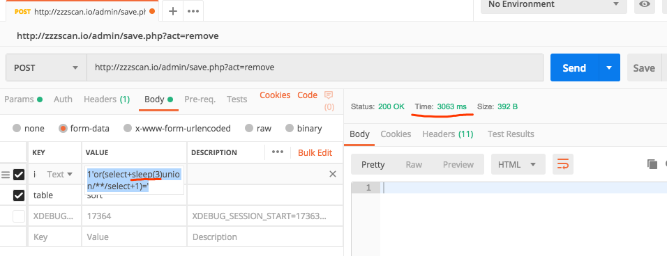
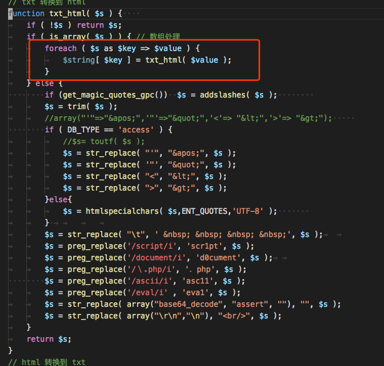
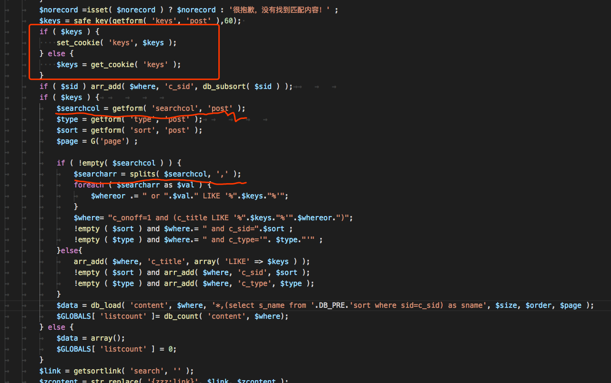
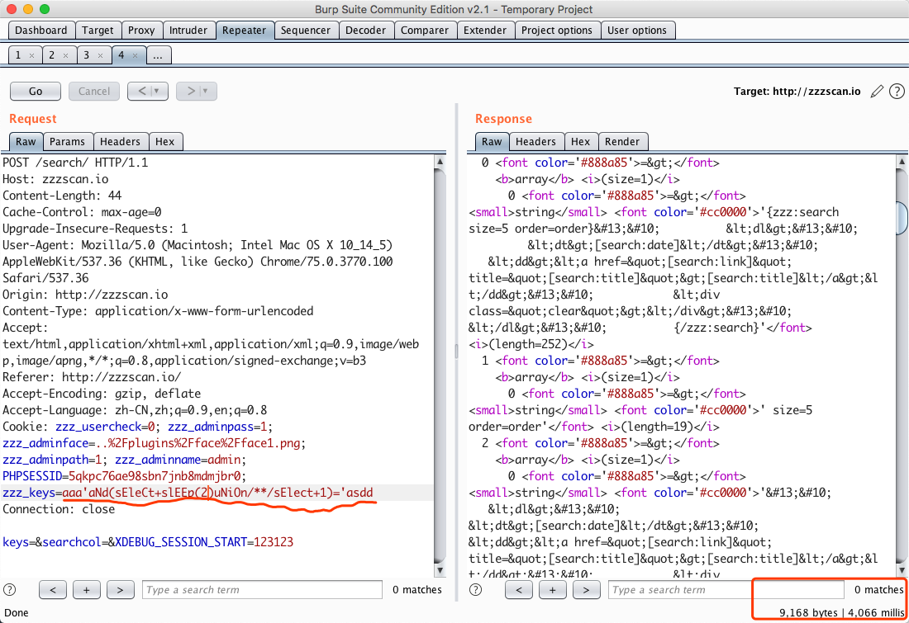

# w13scan发现的第二个漏洞

先前记录到，w13scan一直在本地用`zzzphp`进行一些调试，一路修修改改，终于稳定了许多，也找到了该框架的不少问题,我所用的版本是`V1.7.1 Build190613`。

## 后台SQl注入

在后台闲逛时发现的第一个SQL注入，需要后台管理员权限。
``` 
POST http://zzzscan.io/admin/save.php?act=remove

id[]=1'or(select+sleep(3)union/**/select+1)='&table=sort

```



然后看源码找一下漏洞原因，代码部分我就不截了，说一下原因，后台是有防注入的，但只是html转义，能够把引号给转义掉（所以还能找数字型的看看？）

但是，如果是传入的数组的话，就能够绕过这层转义。



可以看到，粗心的程序员用了一个未声明的`$string`。所以使用如上的payload就可以造成SQL注入，相同原理后台有大片类似的利用点。

但只有后台肯定没有意思，所以我准备在前台也找找。

## 前台SQL注入

前台是单独审计出来的，但w13scan也提供了不少帮助。在前台搜索的地方，`inc/zzz_template.php`



其实看这种代码风格就知道，一定会有大量漏洞。两个参数都可以直接利用。



还有其他很多ssrf，文件上传之类的就没有细看了，等写这些插件的时候再看吧。

## 总结

这两次w13scan发现的SQL注入，注入点都在一个参数数组上面，这方面的处理确实很容易忽视，所以我准备在写一个插件专门检测参数数组上面的问题 :P
