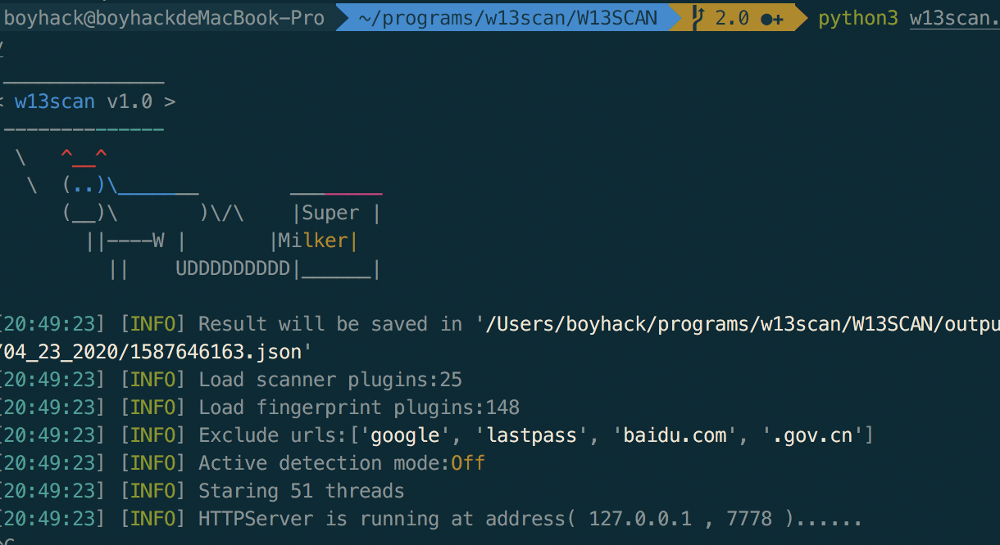
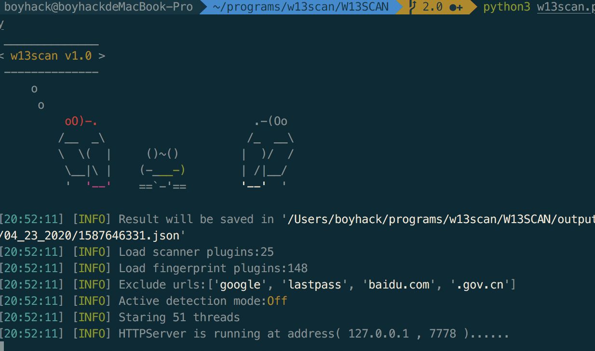
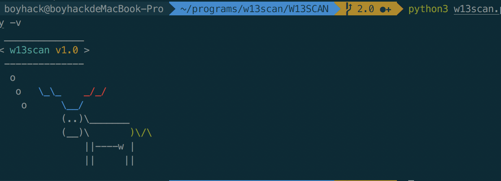
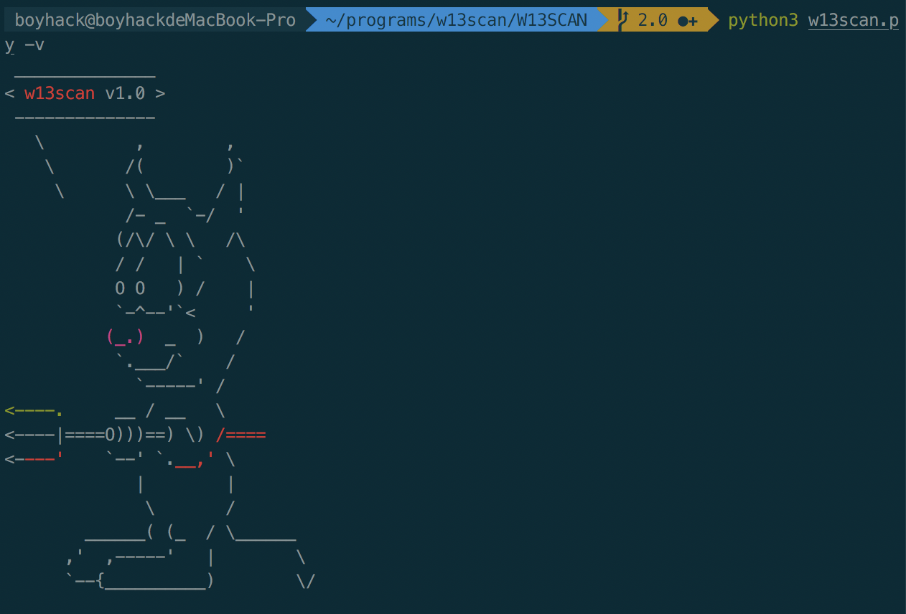
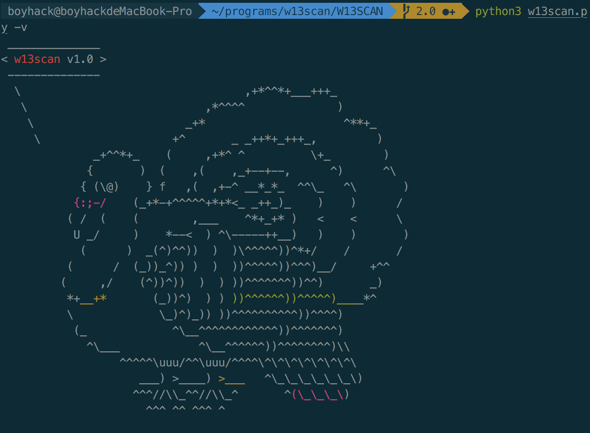
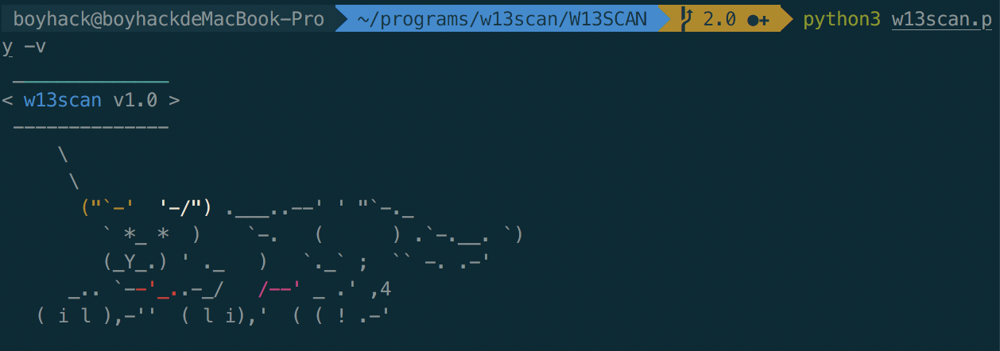
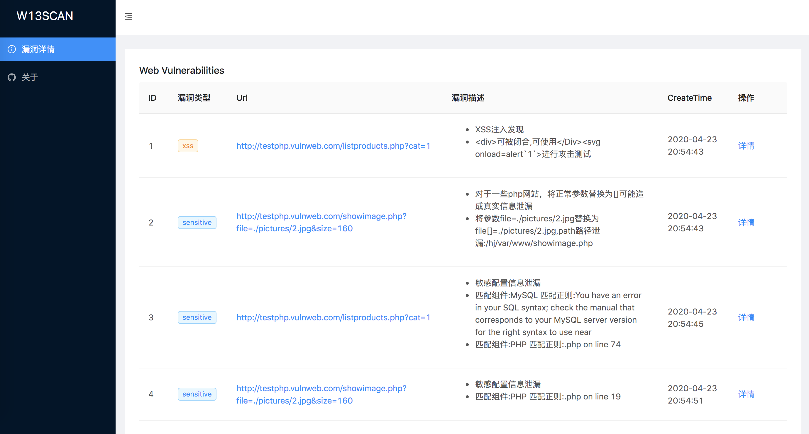
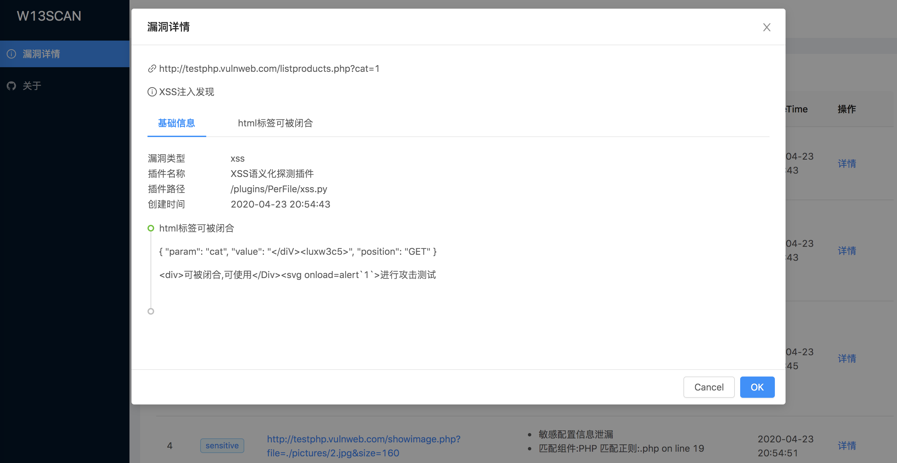
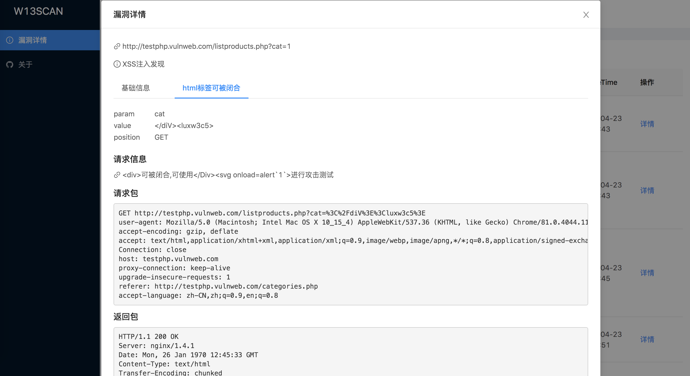

# w13scan启动logo和报告页面

为了增加一点趣味～ 给w13scan的启动logo加了些好玩的东西,和metasploit一样，内置有很多字符动物logo，还设计了一个算法，给这些动物随机上色～ 所以每次启动的画面都不会一样的哦！

## 网页报告

w13scan支持了实时生成网页报告，前端修改自xray开源的report部分，花了好多时间修改前端样式，终于改得面目全非，但乍一看还是很“工业化”的。

点击详情后展示基础信息和发送的payload

## 进度

w13scan已经能够支持遍历json参数的扫描了，能够支持对uri,header头发送扫描了(是全局支持，扫描插件可以很容易的调用来进行参数污染扫描)

基于被动的模式已经修改的差不多了，我还在思考以什么方式和burpsuite合体，以什么方式进行主动扫描,想简单一点，不想依赖太多东西 - =
