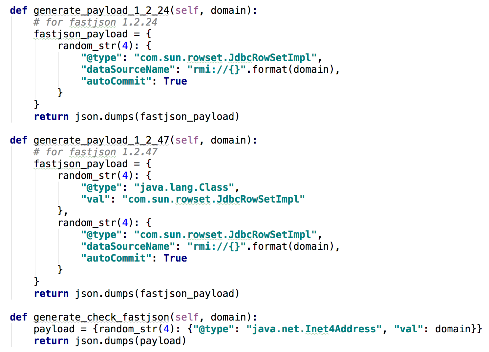
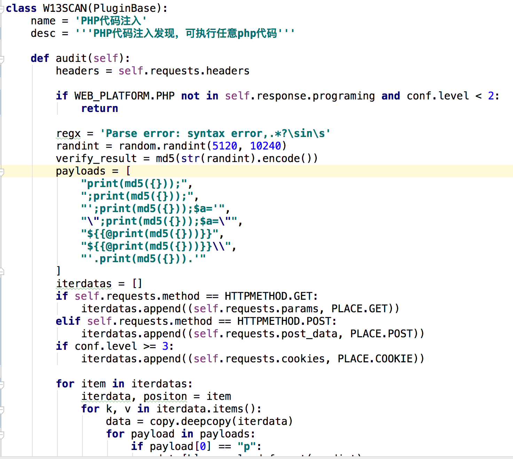
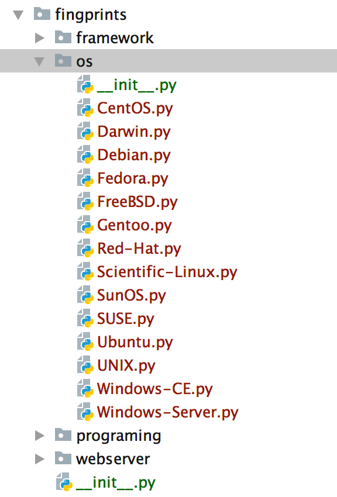
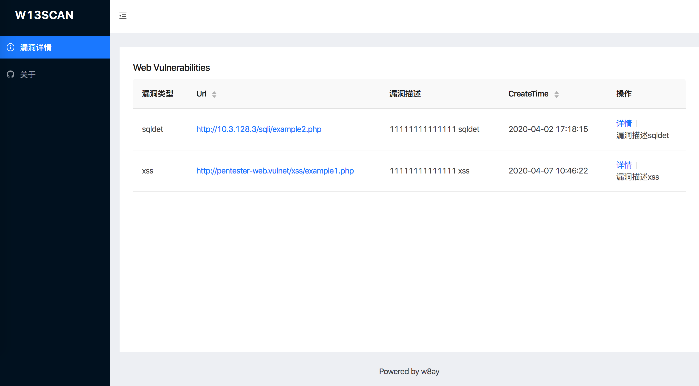

# w13scan正在进行的更新

两周前畅想了w13scan今年要进行的更新，突然发现github上w13scan的star数量越来越多，尽早更新的心情也愈加强烈。这篇日志记录一下这两周在空闲时间进行的一些修改。

## 内置反连平台

w13scan内置了自己的反连平台，支持`http`,`dns`,`Java RMI`三种类型的反连，反连平台实现很简单，都是用纯python编写，没有用到第三方库，减少一些依赖的负担吧。

反连平台因为需要配置，默认是不启用的，但是也内置了一个第三方的反连平台`dnslog.cn`，这个平台很好，不需要账号，即开即用，所以它是默认启用的(有时间我也用go实现一个,就不用内置了)。

## Fastjson 检测

反连平台内置实现了`Java RMI`协议，就是为了检测fastjson，虽然用dnslog也可以，但在内网使用的话还是用内置的RMI反连比较好（这一切也不需要配置，一行命令启动反连平台即可）。

目前使用的payload

同时根据这个issue https://github.com/alibaba/fastjson/issues/307 也实现了用dnslog来检测是否使用fastjson。

## 插件API代码更新

之前的插件代码总觉得比较冗余，经过一番改进，重写了插件api的部分，让代码更加精简，更加优美，更加python。

插件API可以从请求包或返回包获取想要的任何信息，返回信息都用了`@property`修饰符，所以可以像调用属性一样调用参数。

php代码执行插件例子

同时不再区分get和post类型插件，所有请求（get,post,cookie等）都在一个插件中完成。

## 信息收集功能

w13scan在载入一个目标时会对目标进行简单的信息收集，收集插件提取自`[wappalyzer]`

信息收集插件的编写方式就和sqlmap编写waf插件一样。

## 漏洞插件优化

去除了一些命中不太高的插件，对一些插件的检测细节做了优化。目前已经更新好的插件有以下：

  * [x] XSS扫描
    * 基于语义的反射型XSS扫描，准确率极高
  * [x] jsonp信息泄漏
    * 基于语义解析寻找敏感信息
  * [x] http smuggling 走私攻击
  * [x] Fastjson检测与利用
  * [x] .Net通杀Xss检测
    * portswigger 2019十大攻击技术第六名
  * [x] iis解析漏洞
  * [x] 敏感文件信息泄漏
    * 支持含备份文件，debug文件，js敏感信息,php真实路径泄漏,仓库泄漏，phpinfo泄漏，目录遍历等
  * [x] baseline检测(反序列化参数检测)
  * [x] 命令/代码注入检测
    * 支持asp,php等语言的检测
    * 支持系统命令注入检测(支持无回显检测)
    * 支持get,post,cookie等方式检测
  * [x] 路径穿越漏洞
  * [x] struts2漏洞检测
    * 包括s2-016、s2-032、s2-045漏洞

## 参数提取

感谢@Garlic提供的思路，w13scan扫描器会通过`html语义分析与js的语义分析`自动从网页中寻找更多参数用于测试,并根据算法只保留动态的参数进行测试。

这个功能经过测试命中率很高，会发现很多漏洞。再次感谢@Garlic。

## 结果输出

以前w13scan只输出在终端上，现在w13scan会默认实时输出结果(以json格式)到output目录，方便使用者用来进行其他分析操作。

也支持生成网页的形式，魔改了xray report的部分，截图暂时只是个demo，还未完成。

## 后续

上面所述的更新只是整体更新中的1/3，还有很多内核细节就不一一赘述了(例如增加对uri,header头的参数扫描)。后面还需要进行的更新，就是将w13scan的这些内核细节完善，还要考虑如何优雅的进行主动扫描以及与burpsuite配合，同时完善各种文档，README等等。

漏洞扫描插件还计划对sql注入插件进行重写，以前适应的情况还少，准备从sqlmap中提取payload。

预计还有2～3周，w13scan 1.0将发布！
