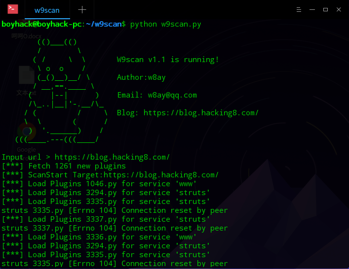
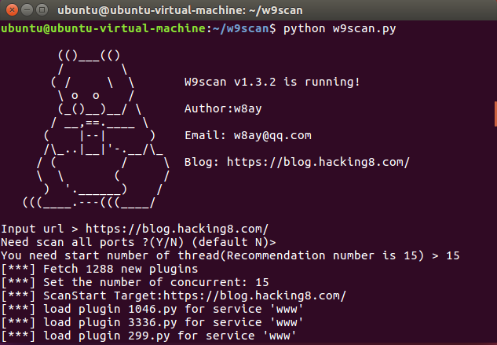
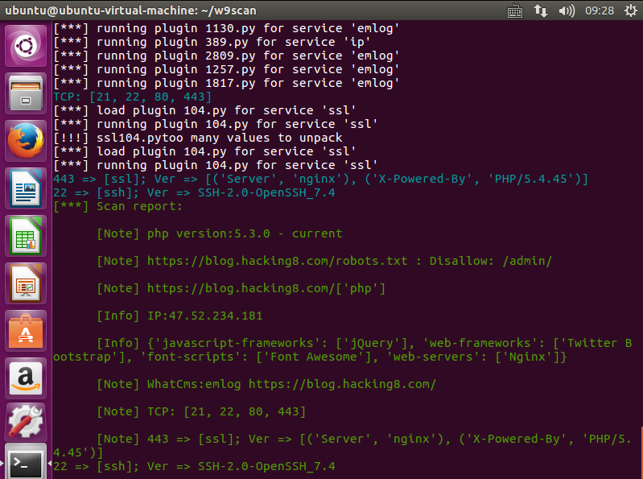
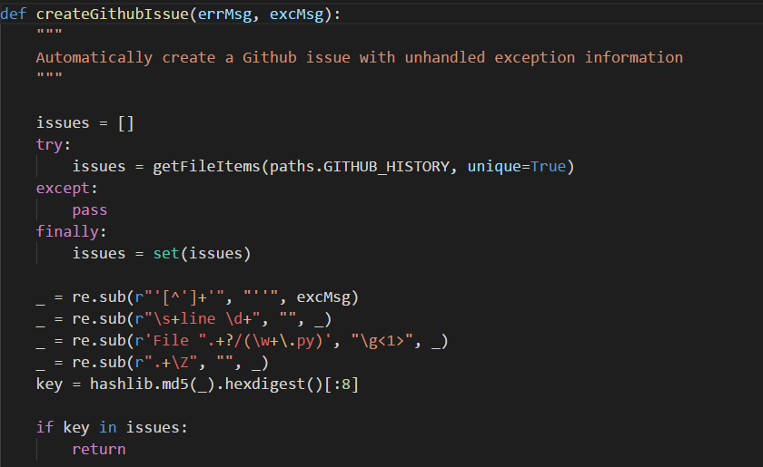
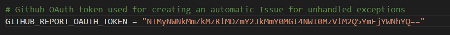
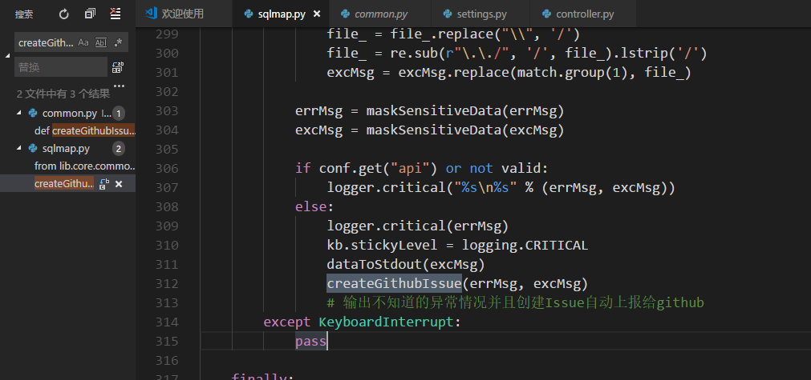
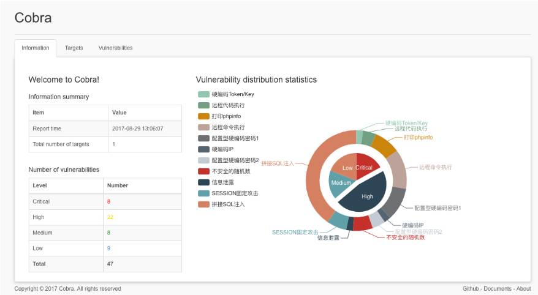
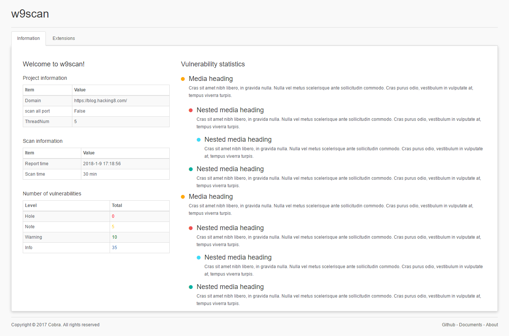
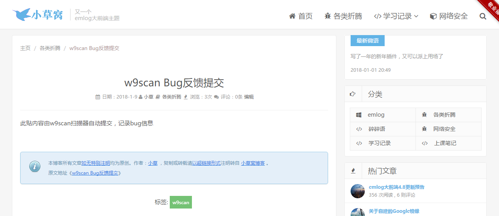

# w9scan 1.1~1.5

## 1.1

最近想批量搞点事情，bugscan的exp很多，有某位网友也发我了部分代码，经过研究成功的可以在本地运行了,因为部分细节已经投稿Freebuf,等发布的时候在写出来把 


## 1.3
w9scan1.3加入了线程池，将大大加快扫描的速度。博客记载升级中遇到的麻烦和解决办法.    


在版本`1.3.2`中，将exp通过文件夹分类的形式整理了出来，不在看起来那么杂乱，后期添加exp也好添加。整理成文件夹很简单，一个正则判断出服务名称然后一个`file_move`命令就搞定了。 



  


**  
**

**Tips**

**找出文件夹下所有文件并且去除__init__**

  

```js 
filter_func = lambda file: (True, False)['__init__' in file or 'pyc' in file]
def getExp():
    direxp = []
    for dirpath, dirnames, filenames in os.walk(paths.w9scan_Plugin_Path):
        for filename in filenames:
            direxp.append(os.path.join(dirpath,filename))
    return direxp
dir_exploit = filter(filter_func,getExp())
```

  


`filter()`函数接收一个函数 `f` 和一个`list`，这个函数 `f` 的作用是对每个元素进行判断，返回 `True`或 `False`，`filter()`根据判断结果自动过滤掉不符合条件的元素，返回由符合条件元素组成的新list。  


  

```js 
os.path.basename
```

获取路径文件名中的文件名 

## 1.4

就在几分钟前又更新w9scan扫描器，1.4加入了爬虫模块，以及依附于爬虫的SQL注入检测、xss扫描、信息泄漏收集等等模块。 

Github:https://github.com/boy-hack/w9scan

  


爬虫模块是从w8scan中分离出来的，基本的结构没有改变，但是新加入了URL相似度分析 的函数，这样使得爬虫可以不在无意义的爬取重复的链接了。具体的定义代码如下： 
```js 
def url_similar_check(self, url):
    '''
    URL相似度分析
    当url路径和参数键值类似时，则判为重复
    '''
    url_struct = urlparse.urlparse(url)
    query_key = '|'.join(sorted([i.split('=')[0] for i in url_struct.query.split('&')]))
    url_hash = hash(url_struct.path + query_key)
    if url_hash not in self.SIMILAR_SET:
        self.SIMILAR_SET.add(url_hash)
        return True
    return False
```

对url中的键进行了hash存储，当url中键相同时就不在爬取了。 

  


SQL注入扫描以扫描类型分为了三种插件 

1.int型注入扫描 

2.字符型注入扫描 

3.基于sql报错的扫描 

这三种扫描可以在一定程度上检测到sql的注入漏洞 

  


**爬虫模块的基本思想**

当爬虫获取到一个新的URL时，会用 spider_file 这个服务来标记url提供为爬虫检测 

当爬虫爬取所有目录完毕时，会将所有爬取到的链接发送到 spider_end 这个服务模块检测 

## 1.5

每个版本更新这么多次，每天都说些专业的话，新增什么啊，修改什么啊，怪累的，自己的博客，就分享下编写的心得，内心OS吧。 

  


**1.5.0 实现了子域名解析爆破**

看了下github上的很多域名爆破源码，发现都是调用dns啥的，这和我的初衷不太相符，我不想太依赖第三方库，而且还有很多看不懂的内容。后来想了想，用socket.gethostname不就可以获取是否是子域名吗？ 虽然比起DNS查询可能慢一点，但作为雏形还是可以的。测试了一下效果也不错！ 

**接下来完成这两个任务：完善报错机制 bug反馈机制**

报错机制本来想仿照POC-T扫描器的实现，看到POC-T列了好多报错类，但是模仿的时候发现自己w9scan还不需要这么多报错类的，而且报错不能只在主程序中截取，不然某个插件报错整个程序就停止运行了。故只简单的print报错内容。

bug反馈机制想着是仿sqlmap里面的自动向github上提交issue。Sqlmap上的自动提交到github上的函数。



但是还要token的



又要注册个账号，太麻烦了不想做了。后面想到在我博客上以自动提交评论的方式提交bug。 

什么时候提交bug呢？可能是找不到错误出现在什么时候的时候。。。



本来想完成自动生成扫描报告和自动提交bug这两个功能的，但天气太冷了。躲在床上用笔记本不太习惯。只写了一半。 

报告模板想生成html形式，找了半天都没啥好看的，后来找到一个cobra https://github.com/wufeifei/cobra 的报告形式。这是一个源代码审计扫描器的报告模板



  


还是挺不错的，然后down下来找到templates目录将它改成了w9scan的扫描器模板。嘿嘿~ 改了一天了，看着还不错呢~ 

  




 

BUG反馈机制这里，想用评论的方式来提交bug，博客创建了一篇文章



  


然后分析数据包就好了，有点晚了，明天在做把。 

  