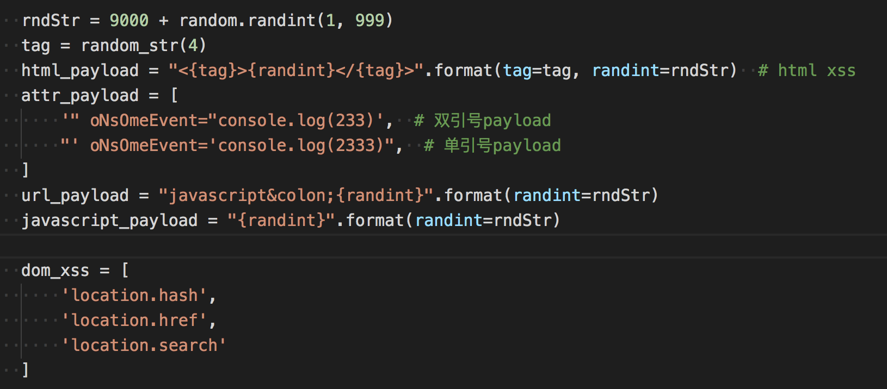
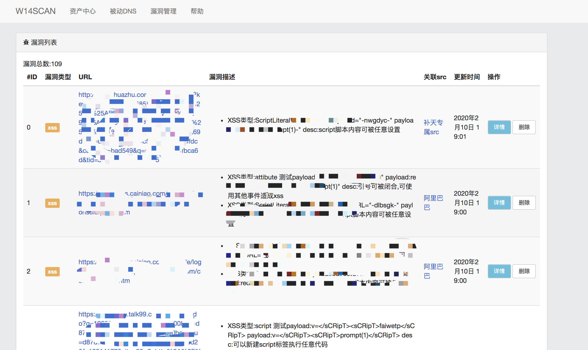
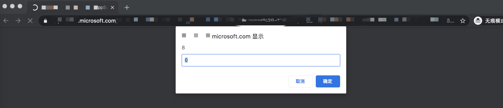

# xss扫描器成长记

为了实现自动刷SRC的目标，过年前就开始对w13scan的xss扫描功能进行优化，灵感来源于xray所宣称的基于语义的扫描技术。 

之前xss扫描是参考`w3af`中的源码，原理也很简单就是暴力的使用xss的payload进行请求，最后在返回文本中查找关键字。xss payload一般有以下几个部分。 



后面我认真的学习了一下`Xsstrike`、`Xray`、`Awvs`中的检测技巧以及检测参数，想将它们的优点和为一体。 

##  XSStrike 

先说说`Xsstrike`，里面带有xss扫描和fuzz，但感觉xss扫描的效果也不是太理想。不过它的一些特性还是可以学习的。 

###  DOM XSS 

Xsstrike的dom扫描，是通过正则来分析敏感函数 
```python 
sources = r'''document\.(URL|documentURI|URLUnencoded|baseURI|cookie|referrer)|location\.(href|search|hash|pathname)|window\.name|history\.(pushState|replaceState)(local|session)Storage'''
    sinks = r'''eval|evaluate|execCommand|assign|navigate|getResponseHeaderopen|showModalDialog|Function|set(Timeout|Interval|Immediate)|execScript|crypto.generateCRMFRequest|ScriptElement\.(src|text|textContent|innerText)|.*?\.onEventName|document\.(write|writeln)|.*?\.innerHTML|Range\.createContextualFragment|(document|window)\.location'''
    scripts = re.findall(r'(?i)(?s)<script[^>]*>(.*?)</script>', response)

```

通过将script脚本内的内容提取出来，通过一些正则来获取，最后输出。但这种方式准确度很低，只能用于辅助，不太适合自动化扫描。 

###  内置参数 

它里面有内置一些参数，在检测时会将这些参数也一起发送 
```python 
blindParams = [  # common paramtere names to be bruteforced for parameter discovery
    'redirect', 'redir', 'url', 'link', 'goto', 'debug', '_debug', 'test', 'get', 'index', 'src', 'source', 'file',
    'frame', 'config', 'new', 'old', 'var', 'rurl', 'return_to', '_return', 'returl', 'last', 'text', 'load', 'email',
    'mail', 'user', 'username', 'password', 'pass', 'passwd', 'first_name', 'last_name', 'back', 'href', 'ref', 'data', 'input',
    'out', 'net', 'host', 'address', 'code', 'auth', 'userid', 'auth_token', 'token', 'error', 'keyword', 'key', 'q', 'query', 'aid',
    'bid', 'cid', 'did', 'eid', 'fid', 'gid', 'hid', 'iid', 'jid', 'kid', 'lid', 'mid', 'nid', 'oid', 'pid', 'qid', 'rid', 'sid',
    'tid', 'uid', 'vid', 'wid', 'xid', 'yid', 'zid', 'cal', 'country', 'x', 'y', 'topic', 'title', 'head', 'higher', 'lower', 'width',
    'height', 'add', 'result', 'log', 'demo', 'example', 'message']

```

很好的思路，后面我的扫描器中也使用了这一点，从乌云镜像XSS分类中提取出了top10参数，在扫描时也会将这些参数加上。 

###  HTML解析&分析反射 

如果参数可以回显，那么通过html解析就可以获得参数位置，分析回显的环境(比如是否在html标签内，是否在html属性内，是否在注释中，是否在js中)等等，以此来确定检测的payload。 

后面我的扫描器的检测流程也是这样，非常准确和效率，不过`Xsstrike`分析html是自己写的分析函数，刚开始我也想直接用它的来着，但是这个函数内容过多，调试困难，代码也很难理解。 

其实如果把html解析理解为html的语义分析，用python3自带的html提取函数很容易就能完成这一点。 

##  Xray 

`XSStrike`让我学习到了新一代xss扫描器应该如何编写，但新一代xss扫描器的payload是在`Xray`上学到的。 

由于`Xray`没有开源，所以就通过分析日志的方式来看它的工作原理。 

###  准备工作 
```php 
<html>
<body>
<a href="?q=1&w=2&e=3&r=4&t=5" />
<script>
<?php
foreach($_GET as $key => $value){
    // $_GET[$key] = htmlspecialchars($value);
}
$q = $_GET["q"];
$w = $_GET["w"];
$e = $_GET["e"];
$r = $_GET["r"];
$t = $_GET["t"];
if(stripos($q,"prompt") > 0){
    die("error");
}
$var = 'var a = "'.$q.'";';
echo $var;
?>
</script>
<div>
<textarea><?php echo $w;?></textarea>
</div>
<input style="color:<?php echo $e;?>" value="<?php echo $r;?>"/>
    <!--
        this is comment
        <?php echo $t;?>
        -->
</body>
</html>

```

简单写了一个脚本，用来分别测试xss在script，style内，html标签内，注释这几种情况下xray的发包过程。 

###  发包探索 

  1. 对于在script的脚本内的回显内容，对于以下case 

```html
<script> $var = 'var a = "'.$_GET['q'].'";'; echo $var; </script>
```

xray顺序发送了以下payload:`pdrjzsqc`，`"-pdrjzsqc-"`,`</sCrIpT><ojyrqvrzar>`

最后会给出payload,但这个包并没有发送。后面把`prompt`作为关键词屏蔽，发现最后还是给出这个payload。 

还有一种情况，在script中的注释中输出 

```html
<html> <body> <script> var a = 11; // inline <?php echo $_GET["a"];?> /* <?php echo $_GET["b"];?> */ </script> </body> </html>
```
xray会发送`\n;chxdsdkm;//`来判定，最后给出payload `\n;prompt(1);//`

  1. 对于在标签内的内容，对于以下case 

```html
<textarea><?php echo $_GET["w"];?></textarea>
```

xray顺序发送了以下payload:`spzzmsntfzikatuchsvu`,`</tExTaReA><lixoorqfwj>`，当确定尖括号没有被过滤时，会继续发送以下payload:`</TeXtArEa>sCrIpTjhymehqbkrScRiPt`,`</TeXtArEa>iMgSrCoNeRrOrjhymehqbkr>`,`</TeXtArEa>SvGoNlOaDjhymehqbkr>`,`</TeXtArEa>IfRaMeSrCjAvAsCrIpTjhymehqbkr>`,`</TeXtArEa>aHrEfJaVaScRiPtjhymehqbkrClIcKa`,`</TeXtArEa>iNpUtAuToFoCuSoNfOcUsjhymehqbkr>`,进行关键词的试探，最后给出payload为`</TeXtArEa>`

  1. 对于在style里内容，以下case 


`html <input style="color:<?php echo $_GET["e"];?>" />`

xray顺序发送了以下payload:`kmbrocvz`,`expression(a(kmbrocvz))`

  1. 对于在html标签内的内容，以下case 


```html
<input style="color:3" value="<?php echo $_GET["r"];?>"/>
```

xray顺序发送了以下payload:`spzzmsntfzikatuchsvu`,`"ljxxrwom="`,`'ljxxrwom='`,`ljxxrwom=`,当确认引号没有被过滤时，会继续发送以下payload：`"><vkvjfzrtgi>`,`">ScRiPtvkvjfzrtgiScRiPt`,`">ImGsRcOnErRoRvkvjfzrtgi>`,`">SvGoNlOaDvkvjfzrtgi>`,`">iFrAmEsRcJaVaScRiPtvkvjfzrtgi>`,`">aHrEfJaVaScRiPtvkvjfzrtgicLiCkA`,`">InPuTaUtOfOcUsOnFoCuSvkvjfzrtgi>`,`" OnMoUsEoVeR=xviinqws`,最后可以确定payload为`">`,`"OnMoUsEoVeR=prompt(1)//`

如果针对此类case： 

```html
" />
```

xray返回payload为`prompt(1)`，说明xray会把`onerror`后面的内容当作JavaScript脚本来执行，如果把`onerror`改为`onerror1`，同样会返回`prompt`。在awvs规则中也看到过类似的规则 

```javascript
parName == "ONAFTERPRINT" || parName == "ONBEFOREPRINT" || parName == "ONBEFOREONLOAD" || parName == "ONBLUR" || parName == "ONERROR" || parName == "ONFOCUS" || parName == "ONHASCHANGE" || parName == "ONLOAD" || parName == "ONMESSAGE" || parName == "ONOFFLINE" || parName == "ONONLINE" || parName == "ONPAGEHIDE" || parName == "ONPAGESHOW" || parName == "ONPOPSTATE" || parName == "ONREDO" || parName == "ONRESIZE" || parName == "ONSTORAGE" || parName == "ONUNDO" || parName == "ONUNLOAD" || parName == "ONBLUR" || parName == "ONCHANGE" || parName == "ONCONTEXTMENU" || parName == "ONFOCUS" || parName == "ONFORMCHANGE" || parName == "ONFORMINPUT" || parName == "ONINPUT" || parName == "ONINVALID" || parName == "ONRESET" || parName == "ONSELECT" || parName == "ONSUBMIT" || parName == "ONKEYDOWN" || parName == "ONKEYPRESS" || parName == "ONKEYUP" || parName == "ONCLICK" || parName == "ONDBLCLICK" || parName == "ONDRAG" || parName == "ONDRAGEND" || parName == "ONDRAGENTER" || parName == "ONDRAGLEAVE" || parName == "ONDRAGOVER" || parName == "ONDRAGSTART" || parName == "ONDROP" || parName == "ONMOUSEDOWN" || parName == "ONMOUSEMOVE" || parName == "ONMOUSEOUT" || parName == "ONMOUSEOVER" || parName == "ONMOUSEUP" || parName == "ONMOUSEWHEEL" || parName == "ONSCROLL" || parName == "ONABORT" || parName == "ONCANPLAY" || parName == "ONCANPLAYTHROUGH" || parName == "ONDURATIONCHANGE" || parName == "ONEMPTIED" || parName == "ONENDED" || parName == "ONERROR" || parName == "ONLOADEDDATA" || parName == "ONLOADEDMETADATA" || parName == "ONLOADSTART" || parName == "ONPAUSE" || parName == "ONPLAY" || parName == "ONPLAYING" || parName == "ONPROGRESS" || parName == "ONRATECHANGE" || parName == "ONREADYSTATECHANGE" || parName == "ONSEEKED" || parName == "ONSEEKING" || parName == "ONSTALLED" || parName == "ONSUSPEND" || parName == "ONTIMEUPDATE" || parName == "ONVOLUMECHANGE" || parName == "ONWAITING" || parName == "ONTOUCHSTART" || parName == "ONTOUCHMOVE" || parName == "ONTOUCHEND" || parName == "ONTOUCHENTER" || parName == "ONTOUCHLEAVE" || parName == "ONTOUCHCANCEL" || parName == "ONGESTURESTART" || parName == "ONGESTURECHANGE" || parName == "ONGESTUREEND" || parName == "ONPOINTERDOWN" || parName == "ONPOINTERUP" || parName == "ONPOINTERCANCEL" || parName == "ONPOINTERMOVE" || parName == "ONPOINTEROVER" || parName == "ONPOINTEROUT" || parName == "ONPOINTERENTER" || parName == "ONPOINTERLEAVE" || parName == "ONGOTPOINTERCAPTURE" || parName == "ONLOSTPOINTERCAPTURE" || parName == "ONCUT" || parName == "ONCOPY" || parName == "ONPASTE" || parName == "ONBEFORECUT" || parName == "ONBEFORECOPY" || parName == "ONBEFOREPASTE" || parName == "ONAFTERUPDATE" || parName == "ONBEFOREUPDATE" || parName == "ONCELLCHANGE" || parName == "ONDATAAVAILABLE" || parName == "ONDATASETCHANGED" || parName == "ONDATASETCOMPLETE" || parName == "ONERRORUPDATE" || parName == "ONROWENTER" || parName == "ONROWEXIT" || parName == "ONROWSDELETE" || parName == "ONROWINSERTED" || parName == "ONCONTEXTMENU" || parName == "ONDRAG" || parName == "ONDRAGSTART" || parName == "ONDRAGENTER" || parName == "ONDRAGOVER" || parName == "ONDRAGLEAVE" || parName == "ONDRAGEND" || parName == "ONDROP" || parName == "ONSELECTSTART" || parName == "ONHELP" || parName == "ONBEFOREUNLOAD" || parName == "ONSTOP" || parName == "ONBEFOREEDITFOCUS" || parName == "ONSTART" || parName == "ONFINISH" || parName == "ONBOUNCE" || parName == "ONBEFOREPRINT" || parName == "ONAFTERPRINT" || parName == "ONPROPERTYCHANGE" || parName == "ONFILTERCHANGE" || parName == "ONREADYSTATECHANGE" || parName == "ONLOSECAPTURE" || parName == "ONDRAGDROP" || parName == "ONDRAGENTER" || parName == "ONDRAGEXIT" || parName == "ONDRAGGESTURE" || parName == "ONDRAGOVER" || parName == "ONCLOSE" || parName == "ONCOMMAND" || parName == "ONINPUT" || parName == "ONCONTEXTMENU" || parName == "ONOVERFLOW" || parName == "ONOVERFLOWCHANGED" || parName == "ONUNDERFLOW" || parName == "ONPOPUPHIDDEN" || parName == "ONPOPUPHIDING" || parName == "ONPOPUPSHOWING" || parName == "ONPOPUPSHOWN" || parName == "ONBROADCAST" || parName == "ONCOMMANDUPDATE" || parName == "STYLE"
```

awvs会比较参数名称来确定。在后面的自动化扫描中，发现这种方式的误报还是很高，最后我将这种情况调整到了awvs的方式，只检测指定的属性key。 

从这两处细微的差别可以看到，awvs宁愿漏报也不误报，结果会很准确，xray更多针对白帽子，结果会宽泛一些。 

  1. 对于在html注释内的内容，以下case 

```html
<!-- this is comment <?php echo $t;?> -->
```

xray顺序发送了以下payload:`spzzmsntfzikatuchsvu`,`--><husyfmzvuq>`,`--!><oamtgwmoiz>`，和上面类似，当确定`-->`或`--!>`没有过滤时，会发送 

```
以 --> 或 --!> 开头，添加如下内容 <bvwpmjtngz> sCrIpTbvwpmjtngzsCrIpT ImGsRcOnErRoRbvwpmjtngz> sVgOnLoAdbvwpmjtngz> iFrAmEsRcJaVaScRiPtbvwpmjtngz> aHrEfJaVaScRiPtbvwpmjtngzcLiCkA InPuTaUtOfOcUsOnFoCuSbvwpmjtngz>
```

##  Awvs 

Awvs的扫描规则很多，针对的情况也很多，没有仔细看它的工作方式是怎样的，主要是看它的payload以及检测的情况，和上面两种查漏补缺，最终合成了我的xss扫描器～比如它会对meta标签的content内容进行处理，会对你srcipt，src等tag的属性处理，也有一些对AngularJs等一些流行的框架的XSS探测payload。 

##  我的扫描器 

我的XSS扫描器就是综合上面三种扫描器而来，如果仔细观察，还会发现上面扫描器的一些不同寻常的细节。 

比如xray不会发送xss的payload，都是用一些随机字符来代替，同时也会随机大小写对一些标签名称，属性名称等等。 

这些精致的技巧我的扫描器也都一一吸取了，嘿嘿！～ 

###  扫描流程 

我的扫描器扫描流程是这样的 
``` 
发送随机flag -> 确定参数回显 -> 确定回显位置以及情况(html，js语法解析) -> 根据情况根据不同payload探测 -> 使用html，js语法解析确定是否多出来了标签，属性，js语句等等
```

使用html语法树检测有很多优势，可以准确判定回显所处的位置，然后通过发送一个随机payload，例如`<Asfaa>`，再使用语法检测是否有`Asfaa`这个标签，就能确定payload是否执行成功了。 

js检测也是如此，如果回显内容在JavaScript脚本中，发送随机flag后，通过js语法解析只需要确定`Identifier`和`Literal`这两个类型中是否包含，如果flag是Identifier类型，就能直接判断存在xss，payload是`alert(1)//`，如果flag是`Literal`类型，再通过单双引号来闭合进行检测。 

###  Debug之旅 

整个xss扫描代码不过1000行，但debug的过程是道阻且长。 

本地靶机测试后就对在线的靶机进行了测试 https://brutelogic.com.br/knoxss.html 

查漏补缺后就开始了自动化扫描。 

整个自动化架构如下 
``` 
1. 提供url -> 爬虫爬取 -> 参数入库 -> 消息队列 -> xss扫描器
                                -> 子域名入库
                                -> url入库

```

  1. 爬虫使用的crawlergo，效果挺不错的，但还是不太满足我的需求(造轮子的心态又膨胀了) 
  2. 数据库使用的mongodb 
  3. 用celery分布式调用，由于用到了celery，又用到了rabbitmq消息队列，flower监控 
  4. 用了server酱进行微信推送（得到一个漏洞微信就会响一次 :) 


刚开始打把游戏微信就会不停的响，然后就查找误报，优化逻辑 以此往复 - = 

经过了不懈的改造，优化了检测逻辑，加入了去重处理后，现在不仅扫描的慢而且推送的消息也变少了 - 。- 

##  一些成果 

经过一段时间对src的扫描后，成功还是挺多的（很多都归功于爬虫） 



甚至发现了微软分站某处xss 



未完，待续。。。 
