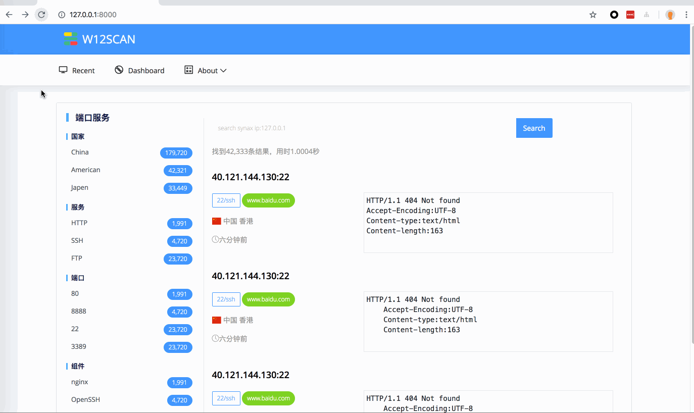

# ⚡️w12scan的前端设计原型图&Django 记录

为w12scan的前端设计了四张草稿，然后用Django简单的跑了下，gif录制程序可能有点失真，在本机上效果不错的。里面的数据都是临时填充的垃圾数据，不是真实数据。接下来就是功能性的设计和数据库的设计了。  
  


## Django installation record

### Install

need python >= 3  
`pip install django mysqlclient`目前最新的Django版本是2.1.3

### Startproject

创建项目
```python 
django-admin startproject project_name

```

创建应用
```python 
python manage.py startapp appname

```

应用创建完后加入到`settings.py`的`INSTALLED_ALL`

### Someconfig

配置数据、时区语言和静态目录
```python 
DATABASES = {
    'default': {
        'ENGINE': 'django.db.backends.mysql',
        'NAME': "w12scan",
        'USER': "root",
        "PASSWORD": "",
        "HOST": "127.0.0.1"
    }
}

```
```python 
# Internationalization
# https://docs.djangoproject.com/en/1.11/topics/i18n/

TIME_ZONE = 'Asia/Shanghai'

# See: https://docs.djangoproject.com/en/dev/ref/settings/#language-code
LANGUAGE_CODE = 'zh-Hans'

```
```python 
STATIC_URL = '/static/'
STATICFILES_DIRS = [
    os.path.join(BASE_DIR, 'static')
]

```

### Views
```python
# -*- coding: utf-8 -*-
from __future__ import unicode_literals

# Create your views here.
from django.shortcuts import render


def index(request):
    return render(request, "frontend/recent.html", )


def dashboard(request):
    return render(request, "frontend/dashboard.html", )


def ipdetail(request):
    return render(request, "frontend/ipdetail.html")


def domain(request):
    return render(request, "frontend/domain.html")

```
