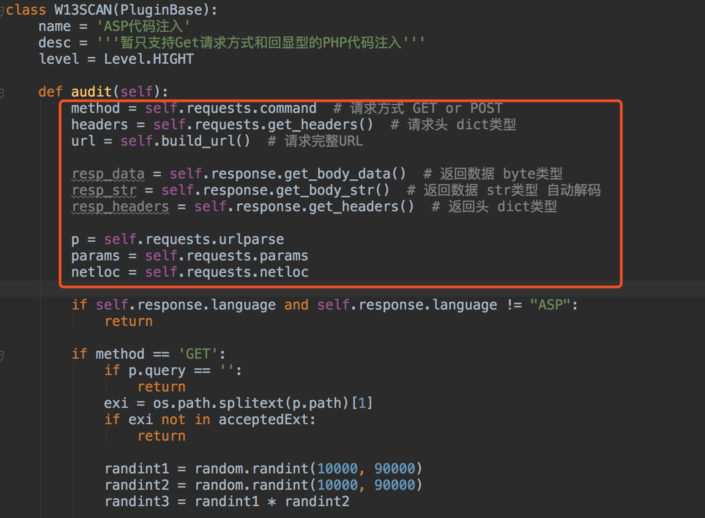
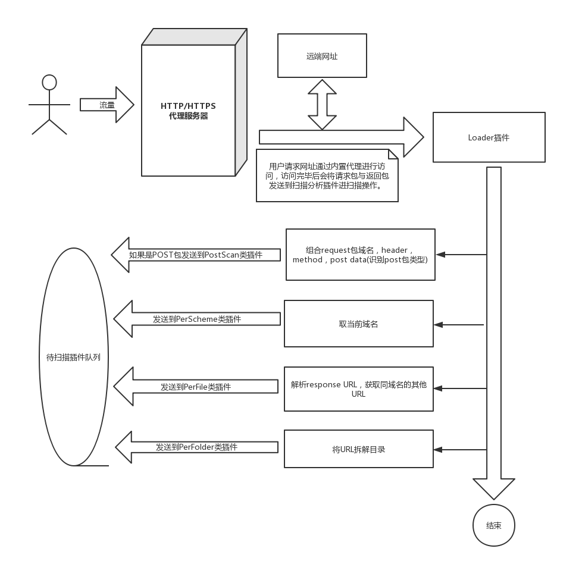
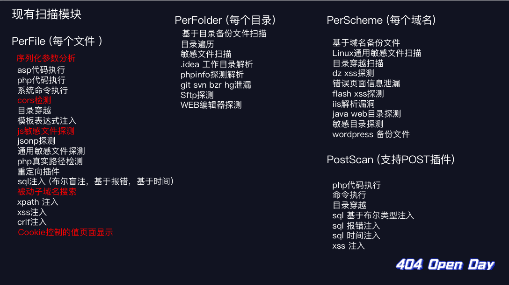
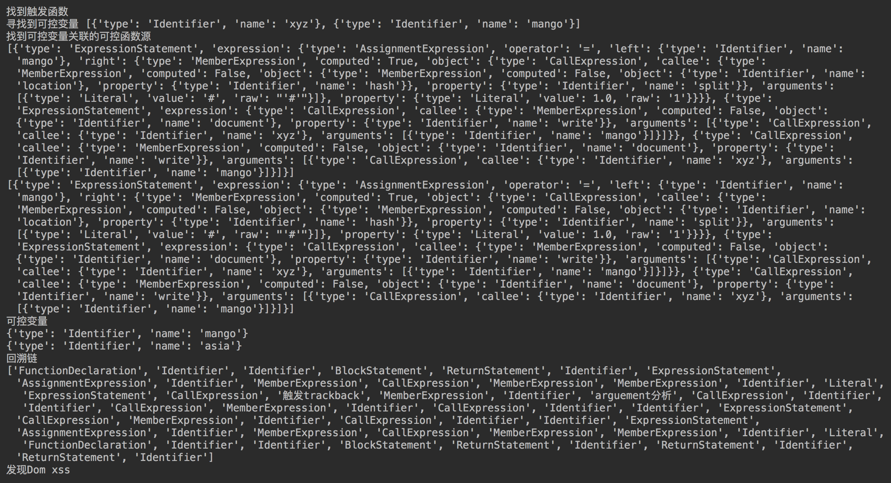

# 写在w13scan第一阶段

在`xray`发布后不久，便体验了一番，惊讶它将被动扫描与各种扫描插件结合的如此之好，但一些交互的地方和我需要的不太一样，可惜没有开源，没法折腾一下。网络上开源的被动扫描器都觉得不够好，大部分在安装这一步就放弃了，扫描规则很多直接调用的sqlmap，但现在似乎有点不合时宜了，正好这阵子学习了不少sqlmap，awvs，w3af等等扫描器的规则，所以我想将规则整合一下，做一款安全人员心中的扫描器。所以`w13scan`诞生了。

## 想法

通过参考和对比现有的，大概列了一下想法

  * 支持三系统Windows/Linux/Mac 
    * 所以尽量使用纯Python代码以及Python原生库
  * 显示扫描进度
  * 显示扫描成功结果的详细payload以及判断规则，方便复现和解决误报
  * 设计`插件系统`，每个扫描规则对应一个插件，能够在插件中调用插件。
  * 代理线程与扫描线程相互独立，发包请求不会干扰正常网页访问。
    * 之前用`xray`扫描外网网站时，网站会很卡，我怀疑是它代理线程和扫描线程没有独立导致了阻塞，但我没有证据，不知道现在修复没有，总之我希望扫描线程不会影响到代理线程。
  * 访问一个网址即可下载证书(模仿burpsuite)
  * 能主动对当前目录下的其他链接进行扫描。


### 能预想到的困难以及解决

  * 代理框架的实现

    * 代理框架看到了开源的https://github.com/qiyeboy/BaseProxy
    * 看它的介绍，正是我心中理想的框架，作者的观点也和我有很多相似之处。代理框架是w13scan重要的一环，我对其中很多部分进行了魔改，现在好像看出来原本的样子了。
  * URL如何去重复

    * 作为被动扫描器，去重策略是很重要的点，不能让同一个网站进行相同两次的扫描。初步设想是去重策略在插件系统完成，插件系统内部过滤完再发送给相应插件。
    * 之前的去重逻辑是通过`urlparse`将url解析后将`域名+路径+参数名称+插件名称`拼接在一起组合的哈希值，但后面测试中发现，很多框架例如`thinkphp`，只有几个参数名称，它通过传递不同的参数值来调用，所以现在去重逻辑是粗暴的将整个url都做hash，但同时也为后面进行效率优化埋下了伏笔。
  * 针对请求异常的处理

    * 在使用发布的第一个版本是痛苦的，各种抛出的异常和报错怀疑人生。只能一个异常一个异常的进行的处理，有的异常可以直接pass，有的异常可以给它一个机会，让它再试一次。
    * 后面模仿sqlmap的报告机制，在几处关键地方捕获异常并自动提交到GitHub issue上面，效果还不错，自此以后改的bug是越来越多了 :)
    * 大部分异常都和网络环境有关，有的是`socket`，有的是`requests`抛出的，在观察报告的issue中，经常能发现很多奇葩的情况，只能将这些异常一一捕获在进行处理。
  * 插件系统的设计

    * 在构想中漏洞检测模块都是以插件的形式的存在，由插件系统统一调度，插件系统只需要接收请求包和返回包，内部会将这两种数据各种解析，发送给需要的插件。插件系统也增强了扩展性，后面可以指定各种类型的插件进行扫描，插件系统也有独立性，因为只需要接收请求包和返回包，意味着插件系统也可以单独独立出API，外部各种程序传入请求包和返回包即可。

    * 整个插件系统的代码结构是模仿的pocsuite3,它提供了很好的例子，例如如何管理各种插件以及如何保持在编写插件时需要的扩展。

    * 一个简单的插件结构如图
    * 通过调用基类的方法获取各种请求的数据，对这些数据进行判断即可，有了这些后后面只需要专心优化检测插件就好了。

    * 插件如何调用？

      * 仿照awvs设计了插件类别

        * PerFile 对每个文件处理,包括文件后面的参数
        * PerFolder 对每个目录处理
        * PerScheme 对每个域名处理
        * PostScan 对Post请求的处理
      * 一个流程图如下


      * 先将请求包与返回包发送到loader插件，由loader插件解析后分发到各类插件。


### 针对一些点的优化

在快速开发实现了第一个版本后，后续又对很多点进行了优化

  * 针对POST数据包的识别

    * 对POST的支持原本想的是比较容易的，但是看了sqlmap的处理后，就觉得不太简单了。在sqlmap的设计中，将post数据分为了下面几类

      * 
    ```python
    class POST_HINT(object):
    NORMAL = "NORMAL"
    SOAP = "SOAP"
    JSON = "JSON"
    JSON_LIKE = "JSON-like"
    MULTIPART = "MULTIPART"
    XML = "XML (generic)"
    ARRAY_LIKE = "Array-like"
    ```
    * 它会通过正则来识别这些数据包的类型，不同数据包进行的操作是不同的。而作为一款自动化扫描器，我需要对这些格式都进行处理，并且能达到对每个参数都进行”污染“，这无疑是复杂且长期的工作。目前又对POST包进行识别，但是还未对其他类型的POST包进行处理。
  * pip一键安装
    * 因为是纯Python写的，很容易封装成一个模块，按照前面的构想，将漏洞扫描的插件系统独立了出来，任何人引入W13SCAN的包，就能快速创建一个扫描。
    * 使用pip install安装
      ```bash
      $ pip3 install w13scan
      ```
      ```python
      from W13SCAN.api import Scanner

      scanner = Scanner(threads=20)
      scanner.put("http://example.com/?post=1")
      scanner.run()

      ```

    * 目前API支持的还是有限的，使用pip安装另外一个好处是安装后直接在控制台输入`w13scan`就能启动扫描器了，更新的时候使用`pip3 install -U w13scan`就能进行更新。

  * 语言环境识别

    * 前面有说到，`loader`模块会对请求包和返回包作一些处理，语言环境识别就是其中一项，后面各项插件有针对PHP的，有针对ASP的，这项工作就是防止ASP类型的网站调用了PHP的插件，这是没必要的。
    * 识别方式很简单，调用了`Wappalyzer`中的一些指纹数据，从header头中进行匹配，也会对url后缀进行匹配，它将识别WEB服务器，编程语言和操作系统。
  * hook requests

    * 插件中网络请求使用的都是`requests`模块，通过hook，我们可以统一控制`requests`发送的请求头(headers),或者设定一个二层代理，扫描模块的流程都会转向它。同时我们还需要从requests中获取原始请求包和原始返回包，也是用hook进行实现的。当然这也是参考pocsuite实现的～
    * 相关代码在`https://github.com/boy-hack/w13scan/blob/master/W13SCAN/thirdpart/requests/__init__.py`，有兴趣可以看看。
  * struts2系统扫描

    * @Go0p 提交的struts2漏洞套餐，我意识到这些框架类的检测插件更适合被动扫描器，例如struts2,fastjson之类的。因为w13scan会对语言探测后再调用，也不用太担心一些效率问题。
    * 现在也在考虑插件的分级制度，不同等级下调用不同的插件，分级的判断是该插件对网站的影响程度和防火墙识别识别到的程度。


### 踩过的一些坑

  * requests
    * url编码
      * 有时候不想让一些payload被url转义，但requests默认不转义的字符只有`#$%&'()*+,/:;=?@[]`，其他的都会将它转义，只要是使用requests操作就会转义，这点需要注意下。
    * keep-alive
      * 在一段时间经常会有`Max retries exceeded`报错，后面了解到，requests本身会维护一个连接池，所有header头的`Connection`默认是`keep-alive`，当连接池超出了最大限度时就会报错，最后解决方案是在hook的时候设置全局header,`Connection:close`
  * HTTPServer的销毁之难
    * 代理服务器启动的是Python的内置模块`HTTPServer`，之前当用户结束想关闭w13scan时就会卡住，后面调试发现是HTTPServer的原因，调用`shutdown`却死活关闭不了，Google搜索到尝试的方法都试了一遍，没有太大帮助。
    * 最后静下来慢慢看HTTPServer的源码才发现，它会为每个连接启动一个线程，而这个线程的`daemon`默认是False（不跟随主线程退出），将它设置为True就好了，多年的疑难杂症就此终结了。。


## 扫描规则

在搜集了一圈现有的扫描器的规则，写了下面的扫描插件。



写扫描插件的规则还是很有趣的，下面说说这些有趣的规则～

### 反序列化参数分析

在w3af中找到的一个功能，但是在主动扫描器上似乎用处不大，被动扫描器正适合这个插件。如果参数中包含反序列化的参数就会被识别出来，反序列化的参数如果没有做好过滤会有很大危害。插件会通过正则识别JAVA、PHP、Python类型的反序列化参数。
```python 
def isJavaObjectDeserialization(value):
    if len(value) < 10:
        return False
    if value[0:5].lower() == "ro0ab":
        ret = is_base64(value)
        if not ret:
            return False
        if bytes(ret).startswith(bytes.fromhex("ac ed 00 05")):
            return True
    return False


def isPHPObjectDeserialization(value: str):
    if len(value) < 10:
        return False
    if value.startswith("O:") or value.startswith("a:"):
        if re.match('^[O]:\d+:"[^"]+":\d+:{.*}', value) or re.match('^a:\d+:{(s:\d:"[^"]+";|i:\d+;).*}', value):
            return True
    elif (value.startswith("Tz") or value.startswith("YT")) and is_base64(value):
        ret = is_base64(value)
        if re.match('^[O]:\d+:"[^"]+":\d+:{.*}', value) or re.match('^a:\d+:{(s:\d:"[^"]+";|i:\d+;).*}', ret):
            return True
    return False


def isPythonObjectDeserialization(value: str):
    if len(value) < 10:
        return False
    ret = is_base64(value)
    if not ret:
        return False
    # pickle binary
    if value.startswith("g"):
        if bytes(ret).startswith(bytes.fromhex("8003")) and ret.endswith("."):
            return True

    # pickle text versio
    elif value.startswith("K"):
        if (ret.startswith("(dp1") or ret.startswith("(lp1")) and ret.endswith("."):
            return True
    return False

```

### JSONP寻找插件

jsonp这一部分也能泄露挺多敏感信息，要感谢`P喵呜-PHPoop、ch1st、xiaoshi`提供的jsonp检测思路。
```python 
JSON_RECOGNITION_REGEX = r'(?s)\A(\s*\[)*\s*\{.*"[^"]+"\s*:\s*("[^"]*"|\d+|true|false|null).*\}\s*(\]\s*)*\Z' # json检测正则

JSONP_RECOGNITION_REGEX = '^\S+\(\{.*?\}\)' # jsonp检测正则

```

例如一个页面 http://www.seebug.net/demo?a=xxx&b=xxx

对返回包用上面正则进行匹配，如果匹配到是jsonp，会伪造一个Referer：http://www.seebug.net3a24f.com（原域名后面加随机字符） 再次请求，相似度和原返回包大于0.8则报告。

如果返回包是json格式，那么先尝试在url后面加入`callback`或以下payload(来源 https://github.com/kapytein/jsonp)
``` 
.jsonp?callback=test
.jsonp
?callback=test
?jsonp=test

```

看是否是jsonp，再按照jsonp的思路走。

### SQL注入判断

#### 报错注入

报错注入实现想对简单，通过特定payload查找返回页面中数据即可。抓了下`xray`的payload，它用的是`鎈'"\(`这样子的payload。

#### 基于布尔的盲注

还是抓的`xray`的payload，如果参数是数字型，正确页面会尝试`1*1`这样做的payload，错误页面使用`1/0`payload，其他类型根据闭合的单双引号来判定。
``` 
'&&'{0}'='{1}
"&&"{0}"="{1}

```

然后替换其中的`{0}`，`{1}`即可。

payload选择完了，应该怎么判断呢，一开始我使用的`w3af`中的页面相似度计算算法，它根据一些特殊的标签`<'"`来分隔文本在进行比较，比较简单。但在后面测试的时候误报太多了，最后还是转而看sqlmap是如何实现的。

这有一篇很好的文章讲述了sqlmap的检测技术：https://paper.seebug.org/729/

我也对其中几个环节再进行了简化。

  * 首先访问一次网页，和原网页对比，若相似度小于0.98则动态去除网页中不同的部分。
  * 访问一次False页面，得到False页面与原页面的相似度 ratio_false
  * 访问一次True页面，得到True页面与原页面的相似度 ratio_true
  * ratio_true > 0.88 and ratio_true - ratio_false > 0.05 and ratio_false < 0.98 即可判断为sql注入
  * 否则按照换行符分隔原始页面，True页面，False页面获得originSet,trueSet,falseSet集合。
    * originSet 对 trueSet的差集小于2并且 trueSet != falseSet 并且 trueSet 对falseSet差集大于0 即可判断为注入。


代码参考：https://github.com/boy-hack/w13scan/blob/master/W13SCAN/plugins/PerFile/sql_inject_bool.py

#### 基于时间的盲注

基于时间的探测方式，会因为一些网络的波动，影响最后的判断结果。sqlmap的时间盲注会先发送30个请求来建立模型，但对扫描器来说，这样的效率太低了，所以就采用了awvs的时间盲注检测方法。

  * 延时长度

    * awvs将延时分为了四种类型，0延时`ZeroDelay`,长延时`LongDelay`，非常长延时`VeryLongDelay`,中间延时`MidDelay`，顾名思义，每种类型延时的时间不一样。

    * 这些时间延时类型的判断依据只靠两个参数`longDuration`,`shortDuration`

    * 这两个参数由下面算法计算
      ```python
      if internal_ip:
        self.longDuration = 6
        self.shortDuration = 2
      else:
        self.longDuration = 3
        self.shortDuration = 1

      r1 = requests.get(self.url, headers=self.headers)
      time1 = r1.elapsed.total_seconds()
      r2 = requests.get(self.url, headers=self.headers) 
      time2 = r2.elapsed.total_seconds()

      _min = min(time1, time2)
      _max = max(time1, time2)

      self.shortDuration = max(self.shortDuration, _max) + 1
      self.longDuration = self.shortDuration * 2

      ```

    * 可以看到内外网不同判断的参数也不一样

  * 随机延时测试

    * 接下来就是随机选取一种延时的类型来判断是否达到了延时需要的时间。
    * awvs至少会进行8次这样的随机延时测试，测试成功即可判断存在注入
    * 当然，误差的容错也是有的，可以直接看代码。这种方式虽然暴力了点但是似乎没有其他好的办法了。


代码参考：https://github.com/boy-hack/w13scan/blob/master/W13SCAN/plugins/PerFile/sql_inject_time.py

### XSS检测

原来的XSS检测模块是参考https://www.anquanke.com/post/id/148357写的，但大部分都是针对反射型XSS，现在有点鸡肋了。

前不久`xray`加入了一种基于语义的XSS检测插件，提供了一种新的思路。我也研究了一下，从敏感函数一直回溯到可控变量源，但是针对的情况有很多种，还需要进行大量的测试。



同时也感谢@LoRexxar’ 提供独家cobra代码参考。

### 系统命令执行

放一个规则应该就明白了。
```python 
url_flag = {
    "set|set&set": [
        'Path=[\s\S]*?PWD=',
        'Path=[\s\S]*?PATHEXT=',
        'Path=[\s\S]*?SHELL=',
        'Path\x3d[\s\S]*?PWD\x3d',
        'Path\x3d[\s\S]*?PATHEXT\x3d',
        'Path\x3d[\s\S]*?SHELL\x3d',
        'SERVER_SIGNATURE=[\s\S]*?SERVER_SOFTWARE=',
        'SERVER_SIGNATURE\x3d[\s\S]*?SERVER_SOFTWARE\x3d',
        'Non-authoritative\sanswer:\s+Name:\s*',
        'Server:\s*.*?\nAddress:\s*'
    ],
    "echo `echo 6162983|base64`6162983".format(randint): [
        "NjE2Mjk4Mwo=6162983"
    ]
}

```

`set`来自awvs，Win和Linux通用。`echo`来自`xray`，构造的语句很巧妙，有时候set判断不到就用这种了。

### 敏感文件扫描

敏感文件集成了bbscan的规则 https://github.com/lijiejie/BBScan，将它按照敏感文件的类型分解成了多个插件，但除了规则基本是一样的。

关于误报

  * 基于返回包大小进行验证
  * 扫描成功文件数量 < 10 : 输出结果
  * 否则根据返回包长度进行统计，相同长度下url数量大于5 丢弃


### JS敏感内容

会对js文件进行下列匹配
```python 
regx = [
    # 匹配url
    r'(\b|\'|")(?:http:|https:)(?:[\w/\.]+)?(?:[a-zA-Z0-9_\-\.]{1,})\.(?:php|asp|ashx|jspx|aspx|jsp|json|action|html|txt|xml|do)(\b|\'|")',
    # 匹配邮箱
    r'[a-zA-Z0-9_-]+@[a-zA-Z0-9_-]+(?:\.[a-zA-Z0-9_-]+)+',
    # 匹配token或者密码泄露
    # 例如token = xxxxxxxx, 或者"apikey" : "xssss"
    r'\b(?:secret|secret_key|token|secret_token|auth_token|access_token|username|password|aws_access_key_id|aws_secret_access_key|secretkey|authtoken|accesstoken|access-token|authkey|client_secret|bucket|email|HEROKU_API_KEY|SF_USERNAME|PT_TOKEN|id_dsa|clientsecret|client-secret|encryption-key|pass|encryption_key|encryptionkey|secretkey|secret-key|bearer|JEKYLL_GITHUB_TOKEN|HOMEBREW_GITHUB_API_TOKEN|api_key|api_secret_key|api-key|private_key|client_key|client_id|sshkey|ssh_key|ssh-key|privatekey|DB_USERNAME|oauth_token|irc_pass|dbpasswd|xoxa-2|xoxrprivate-key|private_key|consumer_key|consumer_secret|access_token_secret|SLACK_BOT_TOKEN|slack_api_token|api_token|ConsumerKey|ConsumerSecret|SESSION_TOKEN|session_key|session_secret|slack_token|slack_secret_token|bot_access_token|passwd|api|eid|sid|api_key|apikey|userid|user_id|user-id)["\s]*(?::|=|=:|=>)["\s]*[a-z0-9A-Z]{8,64}"?',
    # 匹配IP地址
    r'\b(?:(?:25[0-5]|2[0-4][0-9]|[01]?[0-9][0-9]?)\.){3}(?:25[0-5]|2[0-4][0-9]|[01]?[0-9][0-9]?)\b',
    # 匹配云泄露
    r'[\w]+\.cloudfront\.net',
    r'[\w\-.]+\.appspot\.com',
    r'[\w\-.]*s3[\w\-.]*\.?amazonaws\.com\/?[\w\-.]*',
    r'([\w\-.]*\.?digitaloceanspaces\.com\/?[\w\-.]*)',
    r'(storage\.cloud\.google\.com\/[\w\-.]+)',
    r'([\w\-.]*\.?storage.googleapis.com\/?[\w\-.]*)',
    # 匹配手机号
    r'(?:139|138|137|136|135|134|147|150|151|152|157|158|159|178|182|183|184|187|188|198|130|131|132|155|156|166|185|186|145|175|176|133|153|177|173|180|181|189|199|170|171)[0-9]{8}'
    # 匹配域名
    r'((?:[a-zA-Z0-9](?:[a-zA-Z0-9\-]{0,61}[a-zA-Z0-9])?\.)+(?:biz|cc|club|cn|com|co|edu|fun|group|info|ink|kim|link|live|ltd|mobi|net|online|org|pro|pub|red|ren|shop|site|store|tech|top|tv|vip|wang|wiki|work|xin|xyz|me))',
]
dom_xss = [
    'location\.hash',
    'location\.href',
    'location\.search'
]
regx.extend(dom_xss)

```

## 写在第二阶段前

### 目前不足

有尝试过使用一个爬虫+w13scan的检测插件接口做了一次批量测试，但检测效果没有达到预期，速度和效率都很低。

目前的不足

  * 效率太低，扫描时间较长，随便测试一个网站都可以堆积100+检测队列。
  * 目前插件都是来自awvs中，有新意的插件不多
  * POST插件不足，POST包类型需要考虑的很多，如何进行参数”污染“都是问题。


### 未来构想

  * 完善w13scan漏洞检测的API调用
  * 基于js语义的XSS检测模块
  * 完善POST类型检测插件
  * 寻找和改写有新意的插件～


### 开源地址

https://github.com/boy-hack/w13scan
