# 分布式的WEB指纹识别系统：w11scan

程序的命名延续了我一贯的风格，从w8scan到w9scan现在是w11scan了。每一款都是不同类型的扫描器。 

w11scan是一款分布式的指纹识别系统，系统成员可以新增/删除指纹，建立批量的扫描任务，也支持多种搜索语法。 

虽然之前有机器学习识别web指纹的思路，但技术有限，一直找不到好的识别方法，所以还是传统的识别方式 - - 

  

**技术架构** ： 

因为不想太在前端方面花费时间，就直接使用了xunfeng的前端UI,也希望和xunfeng一样优秀 

分布式框架使用celery,消息队列是redis,后端数据库使用mongodb，WEB使用Django. 

  

**特点** ： 

1.识别哪些东西？ 

知名CMS、知名组建容器、代码语言、WAF识别 

2.扫描效率 

扫描成功后会对指纹的命中率增加权值，每次扫描时，根据权值来排列指纹。由于是分布式扫描，也会对同一路径的指纹发送到同一机器。 

  

**一些问题以及解决方案**

在编写过程中思考到一些问题，这里给出自己的解决方案。 

1.如何在分布式基础上加上其他语言识别 

其他语言识别也作为celery函数分布式调用，成功后存入数据库 

2.一个网站指纹识别成功后，如何发送消息让其他识别队列停止 

加入新任务时，redis创建一个节点，名称为该域名，设置值为1.任务执行时检查该域名值为1时则执行，不存在或不为1则跳过。任务检查成功后删除该域名节点。 

3.如果一个消费主机断开连接，主控需要重新发送消息 

celery会自动调用 

  

指纹识别的问题 

1, 计算每个指纹的命中率 

2.优先使用命中率高的指纹 

  

**目的**

just for fun !! 

顺便学习了分布式的处理方式、框架和django 

  

**预览  
**

目前大部分难题已经可以解决，前端差不多也修改完毕，预计这两个月就能开源发布 

  

首页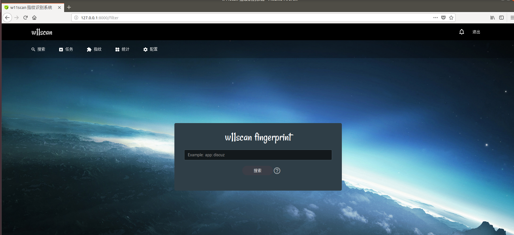

  

指纹预览 

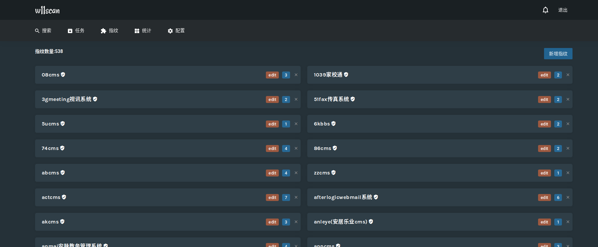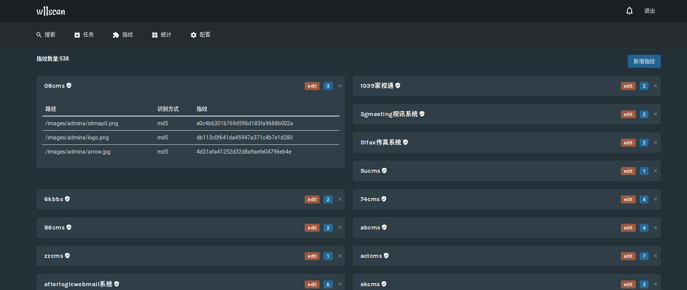

  

统计界面 

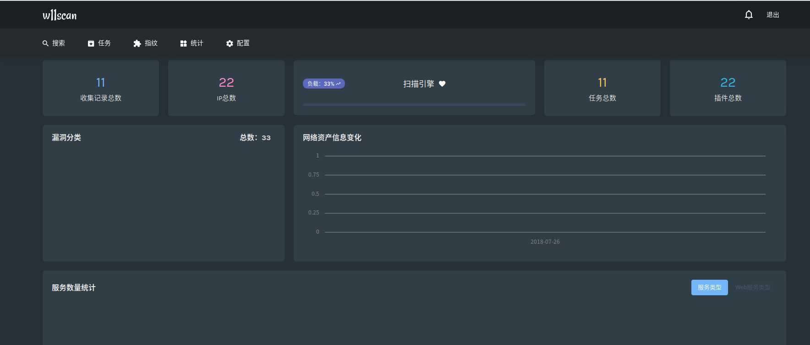

任务结果 

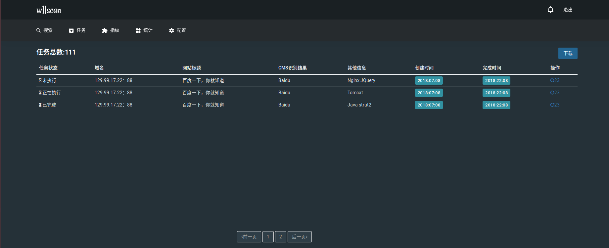

配置界面 

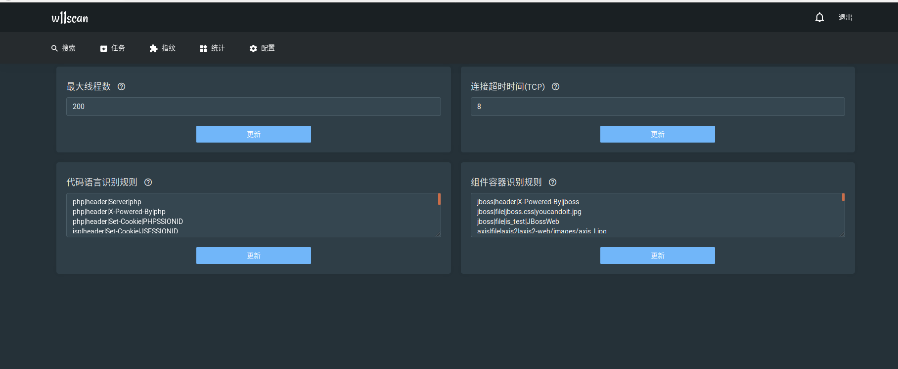

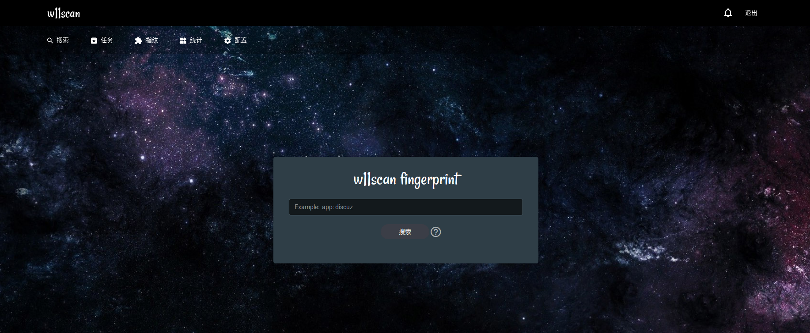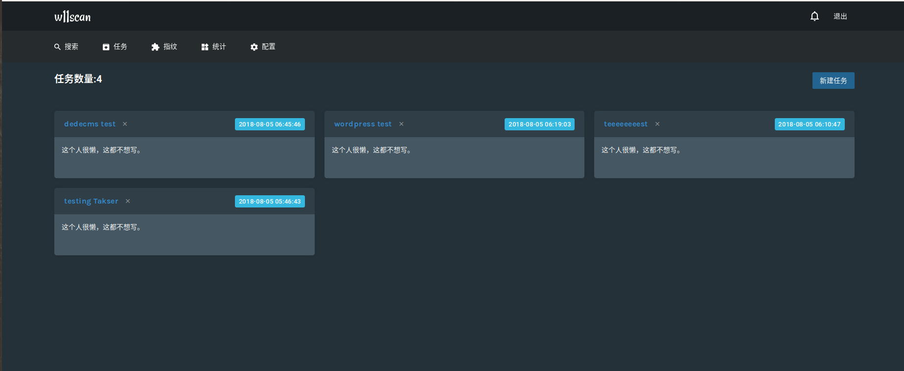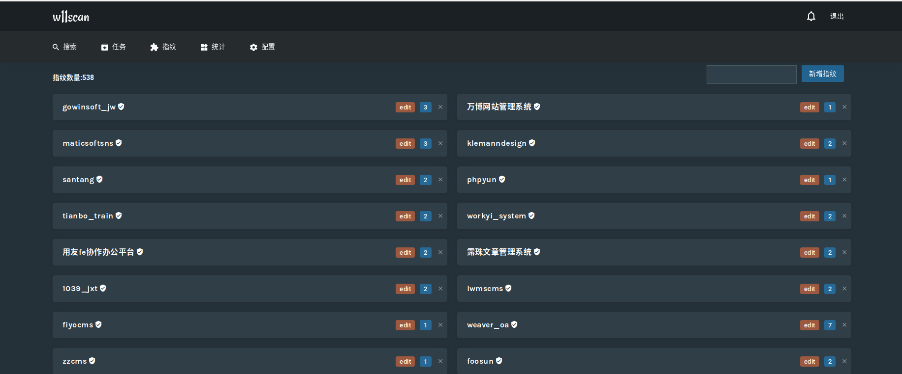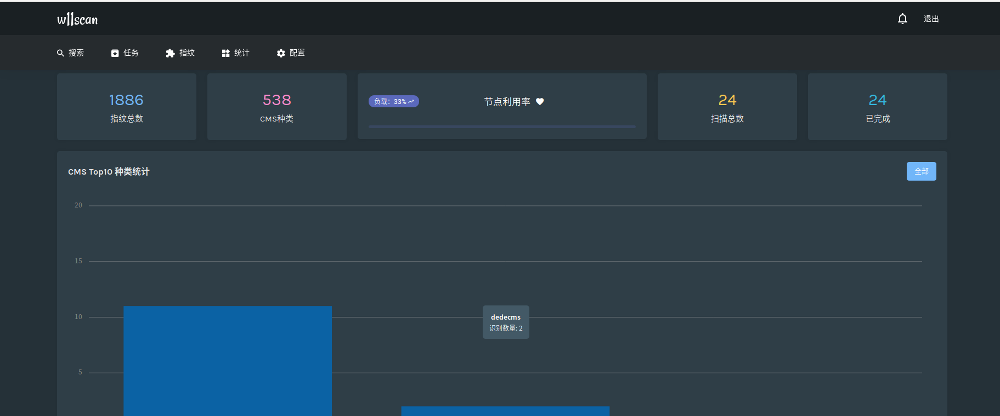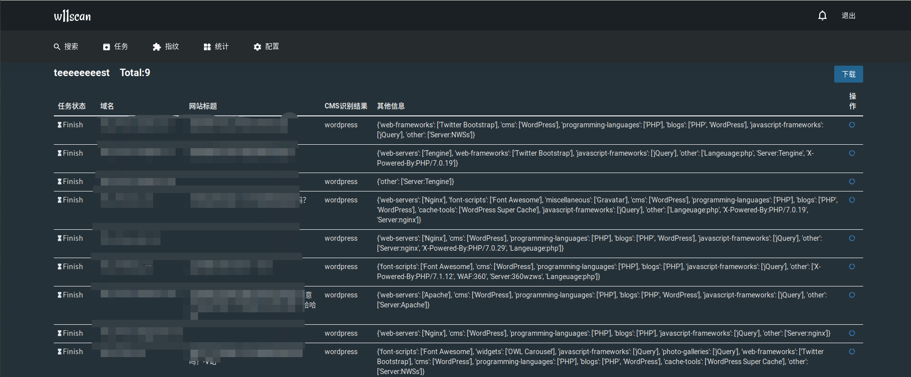
