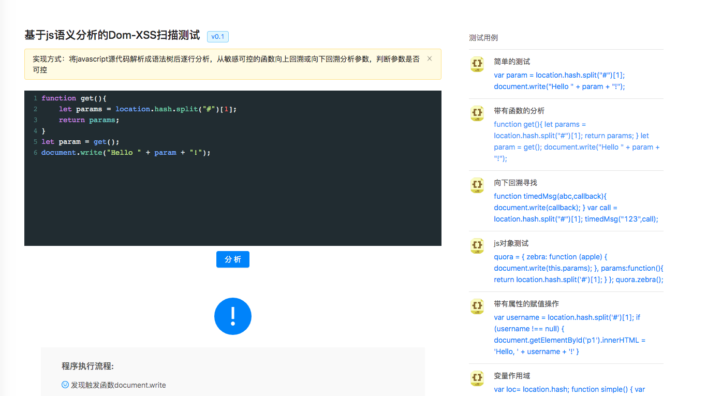

# 基于js语义分析的dom-xss扫描在线测试

起先是想在w13scan上加上这个功能，研究了几个星期，主要是研究怎么解析语法树上。最终是根据测试用例覆盖了https://esprima.readthedocs.io/en/3.1/syntax-tree-format.html 大部分的语法树规范(还没有覆盖完全)

所以就做了一个在线测试的网站，来收集样本分析。不过这么多天研究下来，觉得xss识别并没有那么困难，还很容易？遇到的问题都是一些编程上的，然后就是将规则标准化，几乎没有什么困难 - =有时候觉得是不是太容易了，还是没有get到点上呢。

在线测试网站地址:http://xss.hacking8.com/ ,欢迎来测试鸭～

