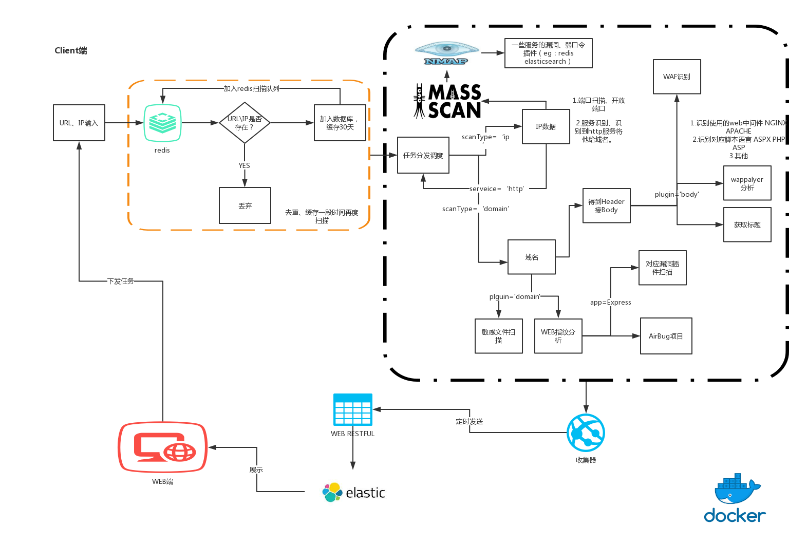
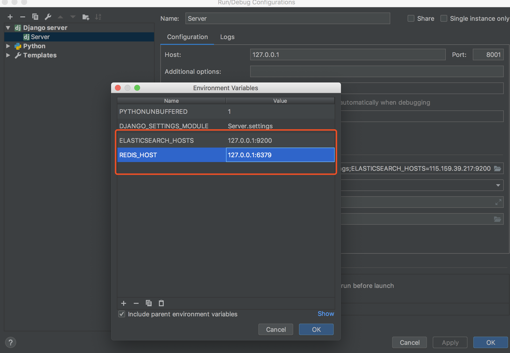

# 如何在本机搭建W12Scan

W12Scan提供了用Docker一键部署的脚本，但是如果你是以学习的目的来看的话，本机搭建和调试变得重要许多，本文说说我自己本机调试环境是如何做的。

## 准备环境

首先你需要明白W12Scan工作的整体流程图



W12Scan分为Web端与扫描(Client)端。

Web端代码开源https://github.com/w-digital-scanner/w12scan

扫描端代码开源https://github.com/w-digital-scanner/w12scan-client

你只需要按照Web端的要求使用Docker进行部署，就可以将整个W12Scan部署完成。扫描端代码仅提供参考（实际上在Web端的部署时，你会到Dockerhub中下载扫描端的相关docker）

W12Scan依赖四个主要服务，Redis、Elasticsearch、Web、Client，编程环境在Mac下。在本机进行调试的时候，我是这样安排的。

  * Redis
    * `brew install redis`安装redis
    * `redis-server`启动
  * Elasticsearch
    * 因为不想污染本地环境，所以倾向用docker启动
    * `docker run -d -p 9200:9200 elasticsearch`
    * 有时候也会在外网部署一台ES使用
  * Web
    * 创建一个Python3的虚拟环境,下载W12Scan Web端程序 https://github.com/w-digital-scanner/w12scan
    * cd w12scan
    * 安装依赖 `pip3 install -r requirement.txt`
    * 生成数据库
    ```
    python3 manage.py makemigrations
    python3 manage.py migrate

    ```

    * 初始化es表
    ```
    python3 pipeline/elastic.py
    ```

    * 创建一个用户
    ```
    python3 pipeline/user_add.py boyhack master@hacking8.com boyhack
    ```
  * 将创建账号密码为boyhack邮箱为master@hacking8.com的用户

    * 如果redis和elasticsearch 部署在本地了的话，就可以直接运行了

      * `python3 manage.py runserver`
      * 否则就增加两个环境变量来设置
  * Client

    * 下载 https://github.com/w-digital-scanner/w12scan-client
    * 安装nmap masscan
      * brew install nmap masscan
    * 安装依赖
      * pip3 install -r requirements.txt
    * 同样的，如果都部署在本地了(Web,Reids)，直接运行即可
      * python3 main.py
      * 否则需要设置环境变量来说明Web或Redis的地址，具体到`config.py`中查看


## End

整体步骤虽然多，但还是非常简单的，如果第一次部署好了，后面会更加方便。很多内容自己看源码可能会更快。
