# 安全圈微信群聊摸鱼报告

在v2ex看到一个项目《给女朋友生成一个聊天年度报告》 https://github.com/myth984/wechat-report ，尝试做了一个后觉得挺好玩，想到之前做的小8机器人加了很多安全群，能否给这些群统计一下做个报告呢？

## 数据提取

说干就干，原项目使用ios导出数据的功能获取数据，感觉有点麻烦，小8机器人运行在windows的Pc微信上，直接从Pc微信把数据脱出来就行了。

PC微信的数据库是sqlite，但是加密了，参考 https://bbs.pediy.com/thread-251303.htm 从内存中提取 key 进行解密，就能得到数据库了。

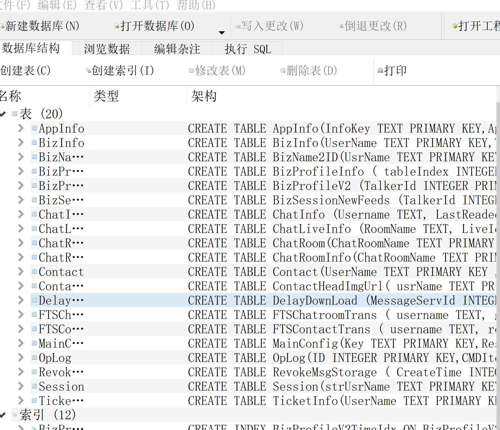

## 微信群摸鱼报告

把开源项目的前端简单修改了一下，为小8加的所有群都生成了一次`微信群聊年度报告`。

例: hacking8安全信息流交流群的报告 @chatroom"">https://i.hacking8.com/wechat-report/17715724893@chatroom


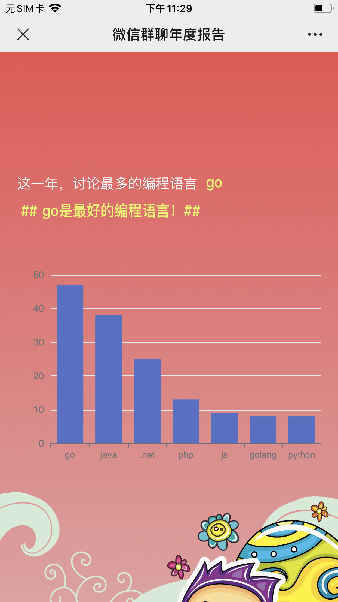

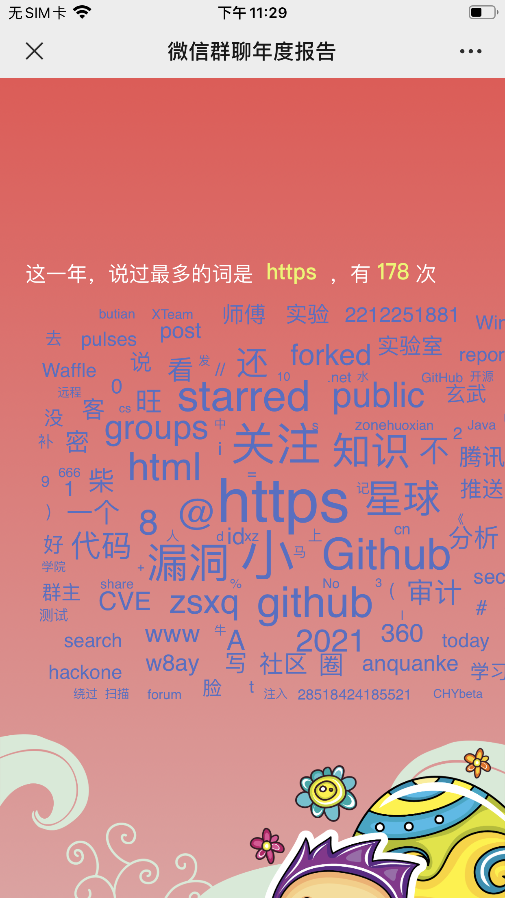

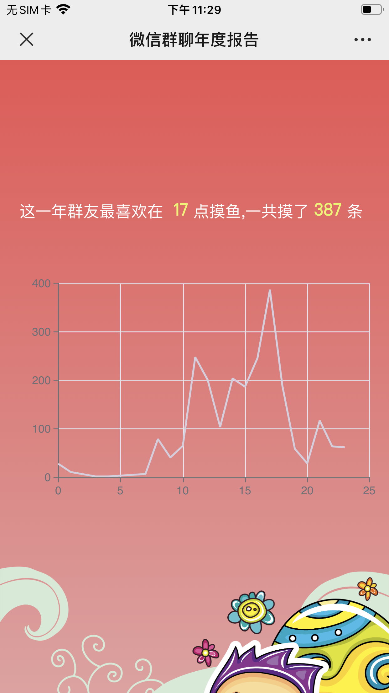

### 获取报告

如果群内加了小8机器人，可以在群内输入`@A' 小8 report` ，即可获得一份群内专属报告链接。

## 安全圈微信群摸鱼报告

既然小8加的都是些安全群，是否能根据群消息分析安全圈微信群的摸鱼报告呢。

大数据分析安全圈已经有很多珠玉在前的报告，例如 `404notfound`师傅的以博客数据的分析《我分析了2018-2020年青年安全圈450个活跃技术博客和博主》，`gainover`师傅的以微博数据为主的分析《安全圈有多大？也许就这么大！》，这次尝试用微信数据进行分析，看看安全圈微信群的摸鱼现状~

**注：** 下面分析采用的数据是小8机器人加的群，总计有81个，不能反映真实情况，不要当真！

### 哪一天说话最多？

小8推出并加群的时候才11月份，所以统计的也就是这两个月的。最小值`161`,最大值`6972`，平均值在`2139`。看到12月10日最多，超出第二名几乎一倍，这一天发生了什么？

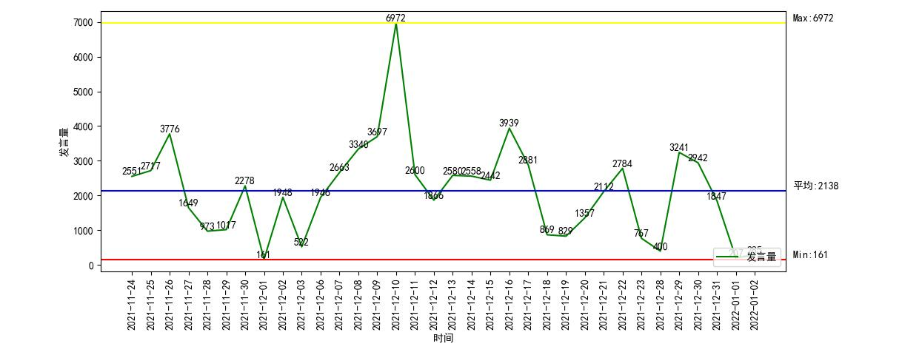

往回看聊天记录，才知道12月9日晚上，第一份log4j2的漏洞预警发布，到了12月10日，exp已经流传开了，各种复现成功的图片和payload 爆发流传，所以12月10日应该可以看作是log4j2漏洞爆发的第一天,大家应该在群里欣喜的讨论log4j。

### 大家一般都在哪个时间段说话？

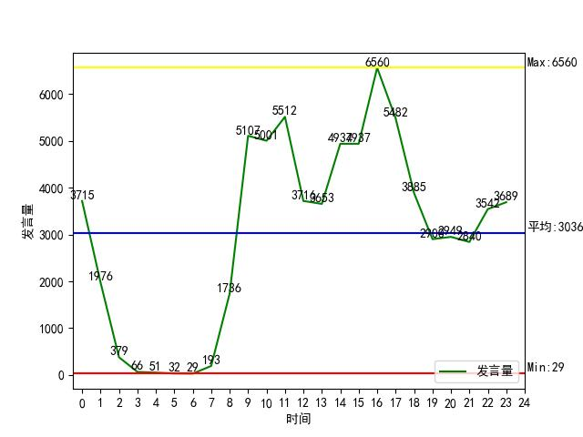

可以看到两个高峰，一个是11点，一个是16点，说话比较多，这个时间正是人一天中精力最旺盛的时候。从21点到0点的时候，也有一个上升的坡度，且发言数都大于平均值，说明在安全人员在晚上也会进行一些活动。

### 安全人员喜欢哪个语言？

`php`还是不是安全人员最喜欢的语言？怀着这样的疑问进行了统计。先对发言的内容进行分词（jieba），再和下面的数据取交集。
```python 
programs = ["asp", "php", "java", "python", "go", "golang", "node", "javascript", "js", "rust", ".net", "c#",
            "csharp", "c", "ruby","nim"]

```

结果如下

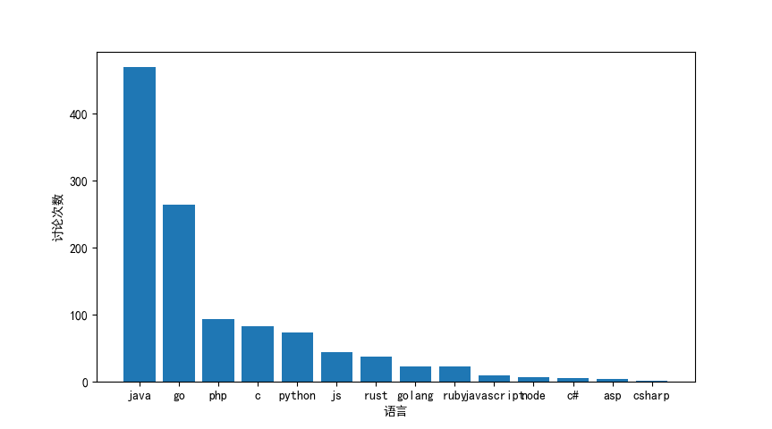

java和go的讨论最多，php在第三位。

### 哪个安全研究人员id被最多讨论？

通过以下字典可以汇总安全研究人员的id
``` 
https://github.com/404notf0und/Security-Data-Analysis-and-Visualization
https://raw.githubusercontent.com/jiesson/MyPYP/be9496150c1f23aaf294ca2bdbbfcb900ad6731a/CTF/%E5%AD%97%E5%85%B8/fuzzDicts-master/userNameDict/sec_id.txt

```

去除了一些字典杂质后提及次数大于5统计如下,当然这个数据不能说明什么，仅供参考。

安全id | 提及次数  
---|---  
chybeta | 99  
l1nk3r | 49  
aliyun | 33  
anquanke | 27  
hacking8 | 19  
orange | 15  
seebug | 14  
mars | 14  
Zedd | 12  
gh0st | 10  
hone | 10  
gh0stkey | 9  
neargle | 9  
love | 9  
Wing | 8  
payloads | 8  
z3r0yu | 8  
boy-hack | 8  
white | 7  
space | 7  
phith0n | 6  
LoRexxar | 6  
online | 6  
hexo | 5  
leavesongs | 5  
Cytosine | 5  
anyu | 5  
  
**标签云图**

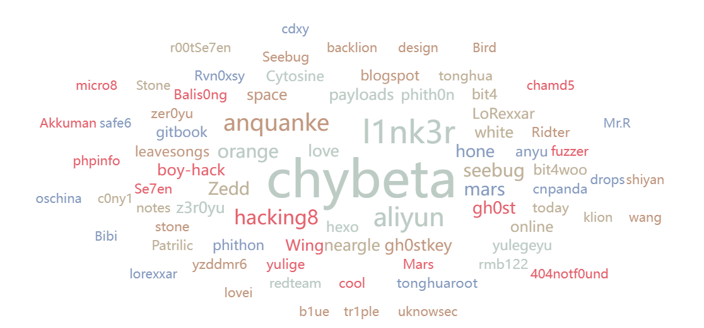

### 大家更喜欢讨论哪家安全公司？

因为没有公开的数据统计安全公司做词库，所以就百度了一下网络安全的公司，选了几个，不是很全。
```python 
companies = ["360", "启明星辰", "华为", "深信服", "绿盟", "亚信", "奇安信", "新华三", "安恒", "天融信", "山石", "知道创宇", "恒安嘉新", "阿里", "腾讯","蚂蚁","长亭", "星澜", "字节跳动", "百度"]

```

统计次数高的top10如下:

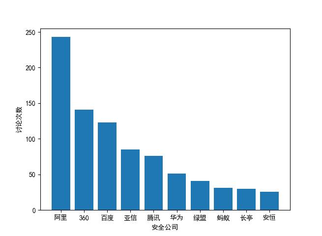

### 哪个CVE最多讨论?

统计了CVE讨论最多的TOP10
``` 
('cve-2021-44228', 47) Apache Log4j2 远程代码执行漏洞
('cve-2021-42287', 7) Windows Active Directory 域服务权限提升漏洞
('cve-2021-37580', 6) Apache ShenYu JWT认证缺陷漏洞
('cve-2021-42321', 6) Exchange Server远程代码执行漏洞（CVE-2021-42321）
('cve-2021-42278', 6) Windows Active Directory 域服务权限提升漏洞（CVE-2021-42287,CVE-2021-42278）
('cve-2019-3560', 6) 由于整数溢出导致Facebook Fizz服务被拒绝（CVE-2019-3560）
('cve-2021-45046', 6) CVE-2021-45046是Log4j2漏洞爆出后在修复版本中出现的拒绝服务漏洞
('cve-2021-41277', 5) Metabase 任意文件读取漏洞CVE-2021-41277
('cve-2021-43798', 5) Grafana未授权任意文件读取复现
('cve-2021-44832', 5) Apache Log4j 2.17.0 JDBCAppender CVE-2021-44832 任意代码执行漏洞

```

前十里面有三个和log4j2漏洞相关…

### 黑客们更喜欢RCE吗？

当出现rce(远程命令执行)漏洞时，黑客就能直接控制这台机器，这种简单粗暴的方式深得黑客喜欢。我挑选了几个漏洞常用的词汇，想看看这些词汇的讨论程度。

词汇有
``` 
['rce', 'sql', '注入', "未授权", "ssrf", "xss", "xxe"]

```

最终的统计结果
``` 
[('rce', 524), ('注入', 143), ('xss', 66), ('ssrf', 60), ('sql', 44), ('未授权', 33), ('xxe', 19)]

```

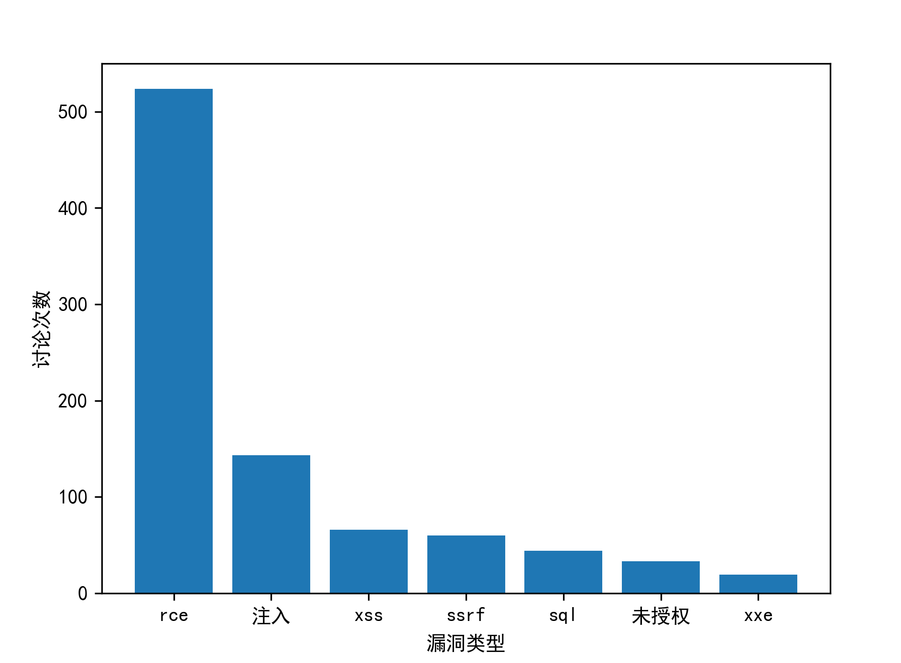

rce果然是最多的，超过第二名4倍多！

### 哪个组件被讨论最多

选取的词库是各大赏金平台中需要的漏洞组件…

Top10名单如下

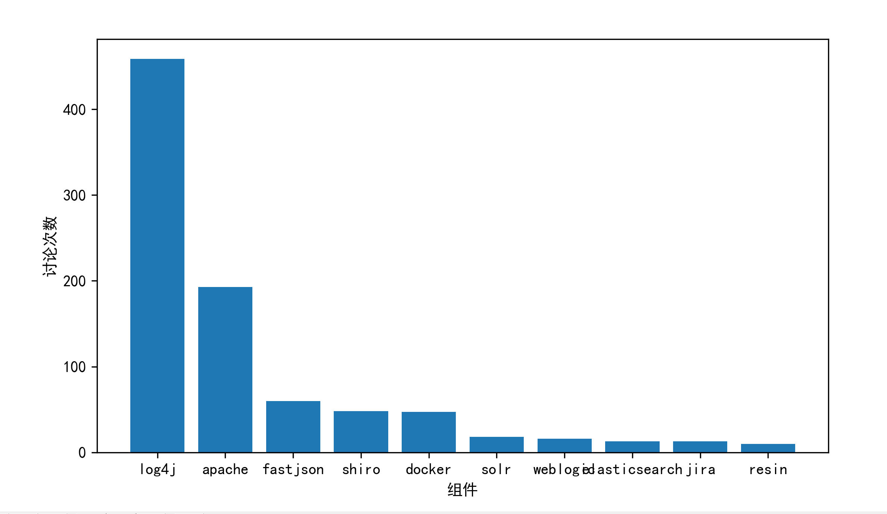

完整名单如下
``` 
('log4j', 459)
('apache', 193)
('fastjson', 60)
('shiro', 48)
('docker', 47)
('solr', 18)
('weblogic', 16)
('elasticsearch', 13)
('jira', 13)
('resin', 10)
('jackson', 9)
('gitlab', 9)
('django', 5)
('dedecms', 5)
('f5', 5)
('activemq', 2)
('kibana', 2)
('kong', 2)
('phpmyadmin', 2)
('xampp', 1)
('svn', 1)
('jenkins', 1)
('discuz', 1)
('thinkphp', 1)
('jboss', 1)
('sentry', 1)
('jumpserver', 1)
('flask', 1)
('outlook', 1)
('coremail', 1)

```

### 说过最多的字？

对全部内容分词后统计，发现说过最多的字是`不`

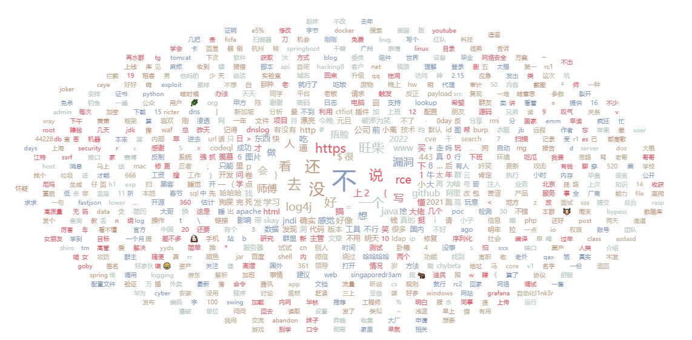

这让人联想到了一个表情包


