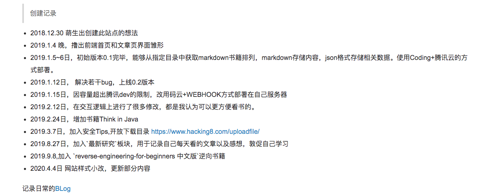
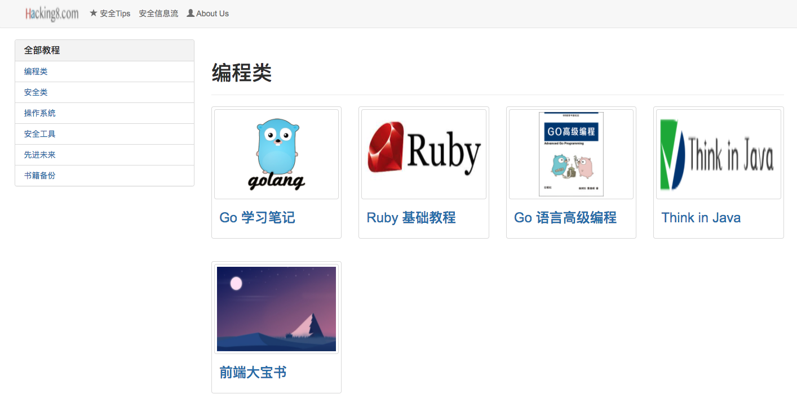
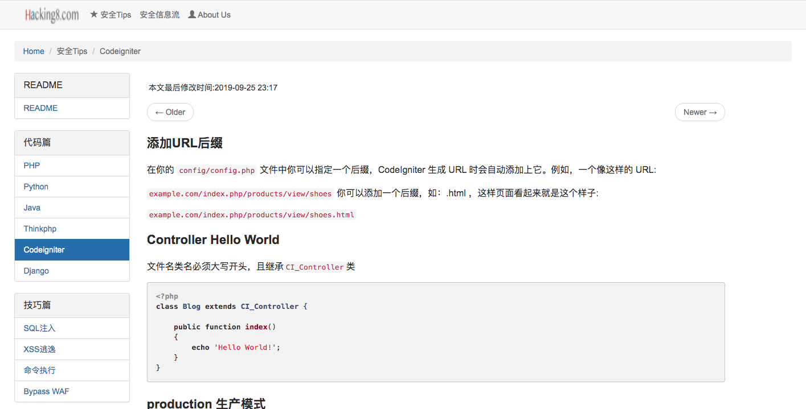
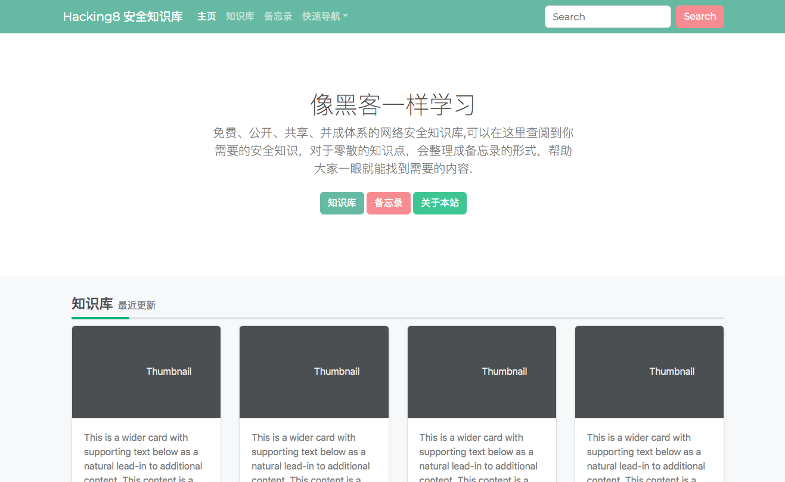
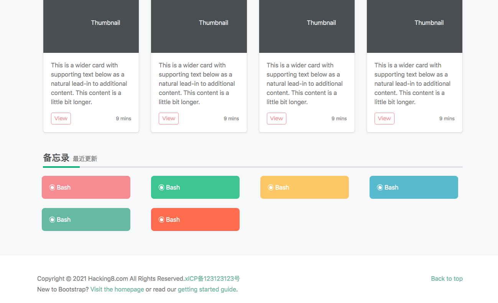
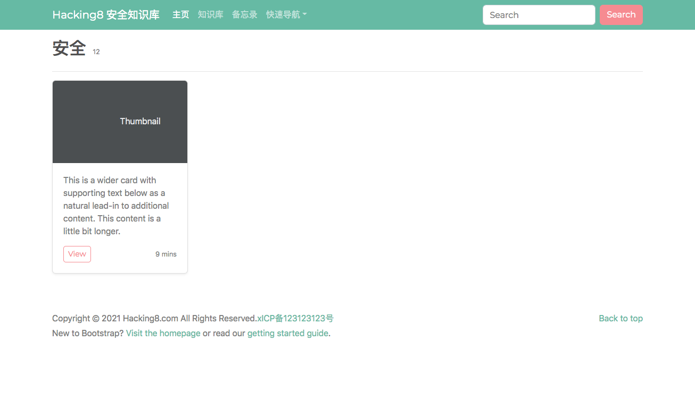
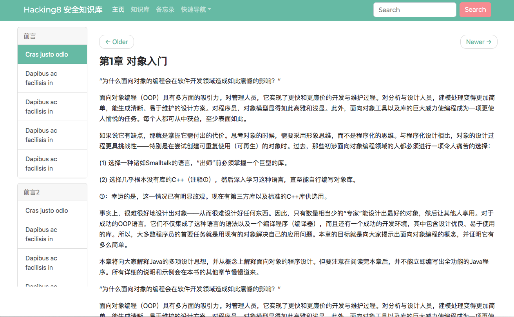
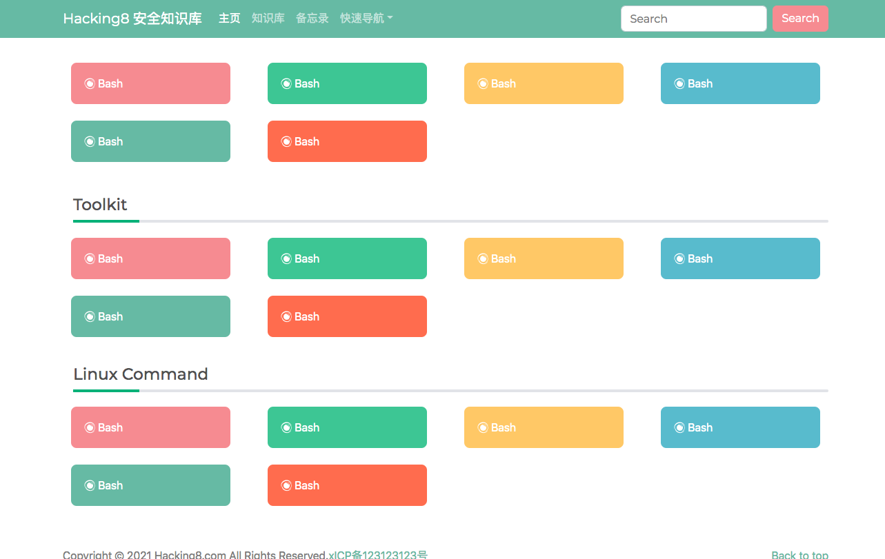
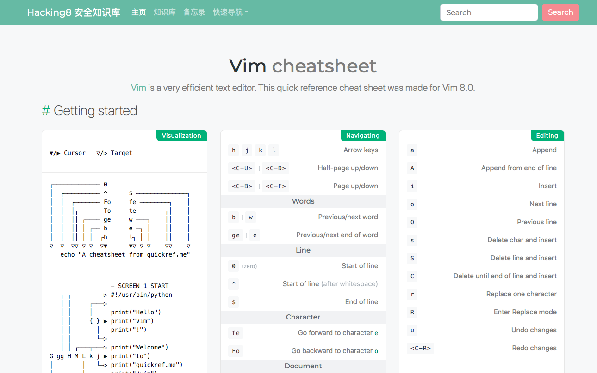

# 新的安全文库想法

18年萌生出了想法撸了一个小文库。https://www.hacking8.com/ 

一晃两年了，站点一直放着也没更新(主要是更新内容太累了)，最近想着改改，准备模仿零组和狼组(https://wiki.wgpsec.org/)的弄个。 

这两天一直在拼凑前端样式 - = 画的差不多了。 

###  首页 

###  知识库 

###  备忘录 

模仿了 https://quickref.me/ 

有些知识点就是几句话，几行命令，所以设计了一个备忘录来管理  备忘录详情 

暂时就这么多 - = 之前的站点用php写的，这一次准备用django来重构，但是wiki模式下的数据结构不太好用model描述，之前php用的直接是一个json格式，但这样不太好用搜索功能，还在纠结用啥呢。 

##  End 

2024年网站关闭。
