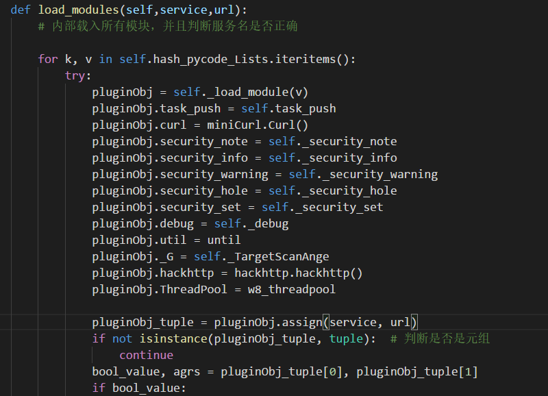
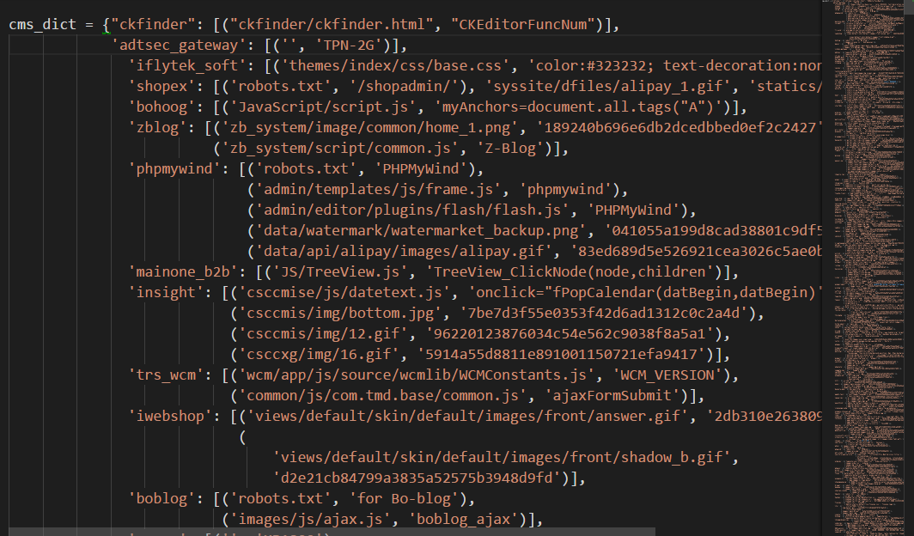
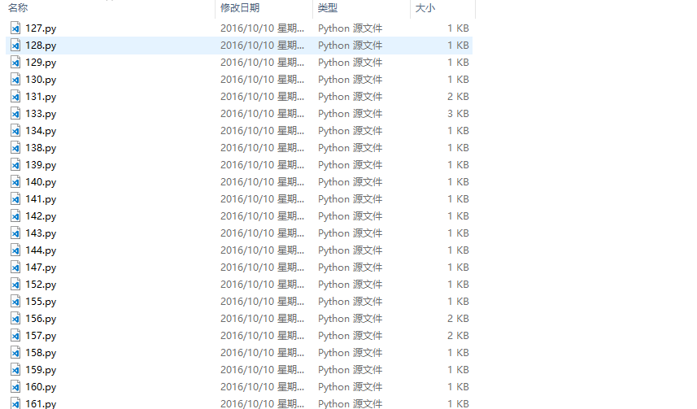
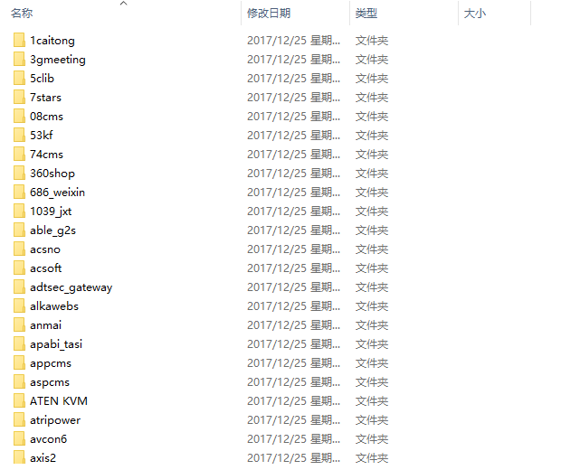
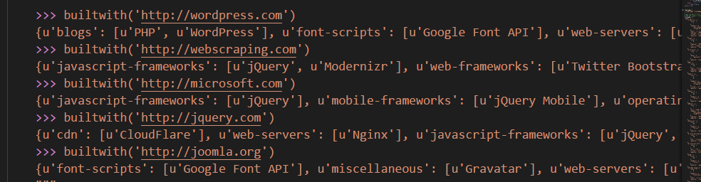
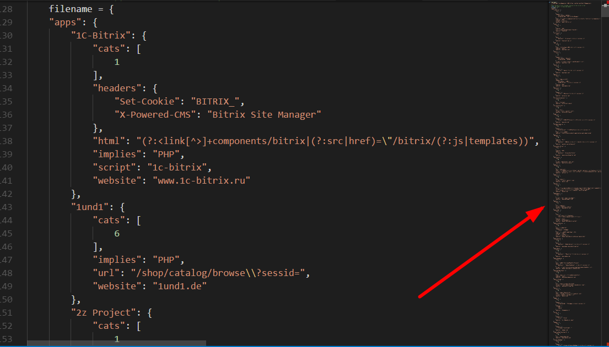

# 有关w9scan的编程经验分享

w9scan是一款全能型的网站漏洞扫描器，借鉴了各位前辈的优秀代码。内置1200+插件可对网站进行一次规模的检测，功能包括但不限于web指纹检测、端口指纹检测、网站结构分析、各种流行的漏洞检测、爬虫以及SQL注入检测、XSS检测等等，w9scan会自动生成精美HTML格式结果报告。  

**0x01 前言**

在开发w9scan之前笔者已经开发过了w8scan，了解的朋友可能知道，w8scan的扫描功能并不强，所以，笔者想通过开发w9scan，这款在本地运行的扫描器来为w8scan的扫描器代码探路~。 

俗话说工欲善其事必先利其器，笔者用过很多扫描器，无不为他们强大的扫描功能所折服。而笔者作为一名脚本小子，本想开车驶向远方却造起了轮子乐此不疲。仅以此文纪念w9scan的开发过程，纪念那逝去的青春...

额,,, 将视线拉回到本渣作。w9scan的初期代码是模仿bugscan而写的，因为w9scan在编写的初期就是为了兼容bugscan的插件，因此做了大量兼容工作来兼容w9scan的代码。而做兼容工作必不可少要了解下bugscan的工作原理，所以笔者用自己的渣渣理解力简述下bugscan的功能流程 

**0x02 BUGSCAN工作流程**

首先加载服务类型为www的插件，www插件扫描的过程中同时解析服务，得到ip，加载服务类型为ip的插件继续扫描，得到端口信息加载各种端口插件对目标分析，得到CMS信息，加载对应cms的插件等等...

不得不说，这是一个很棒的结构。  
于是笔者在代码结构层次模仿w9scan，功能结构层次模仿bugscan，凭着脑中若干的想像！@#￥@# 制造了w9scan第一版本..

对于bugscan插件的兼容:可以在 lib/code/exploit.py Exploit_run类中找到，主要通过下面几个阶段完成。

  


1.获取plugins目录下所有的py文件，（__init__.py除外)，将内容存入一个字典中 

2.插件代码加载函数，通过调用imp模块将字典存储的代码加载进来，返回模块对象 
```js 
def _load_module(self,chunk,name='<w9scan>'):
        try:
            pluginObj = imp.new_module(str(name))
            exec chunk in pluginObj.__dict__
        except Exception as err_info:
            raise LoadModuleException
        return pluginObj
```

 3.为返回的模块类加上内置的API（就是一些bugscan常用的内置API，如curl hackhttp之类） 



4.一切就绪，然后根据bugscan API说明，bugscan插件需定义两个函数 assign为验证 audit为执行函数。所有接下来来调用这两个函数了。
```js 
pluginObj_tuple = pluginObj.assign(service, url)
                if not isinstance(pluginObj_tuple, tuple):  # 判断是否是元组
                    continue
                bool_value, agrs = pluginObj_tuple[0], pluginObj_tuple[1]
if bool_value:
       pluginObj.audit(agrs)
```

**0x03 CMS****识别**

目前CMS大多数都是依靠指纹，看了很多依靠机器识别来验证webshell的列子，笔者也在学习如何用机器学习来识别CMS。 

W9scan的CMS识别的指纹库以及代码都是bugscan的，里面有一些有趣的技巧，分享一下。CMS指纹文件在 lib/utils/cmsdata.py 

可以看到主要是根据MD5以及关键字来识别的。笔者之前写的CMS识别都会用个字段来表示识别方式，这个似乎没有，来看看有什么奥秘？

来到 plugins/www/whatcms.py
```js 
import re,urlparse
from lib.utils.cmsdata import cms_dict
import hashlib
 
def getMD5(password):
    m = hashlib.md5()
    m.update(password)
    return m.hexdigest()
 
def makeurl(url):
    prox = "http://"
    if(url.startswith("https://")):
        prox = "https://"
    url_info = urlparse.urlparse(url)
    url = prox + url_info.netloc + "/"
 
    return url
 
def isMatching(f_path, cms_name, sign, res, code, host, head):
    isMatch = False
    if f_path.endswith(".gif"):
        if sign:
            isMatch = getMD5(res) == sign
        else:
            isMatch = res.startswith("GIF89a")
 
    elif f_path.endswith(".png"):
        if sign:
            isMatch = getMD5(res) == sign
        else:
            isMatch = res.startswith("\x89PNG\x0d\x0a\x1a\x0a")
 
    elif f_path.endswith(".jpg"):
        if sign:
            isMatch = getMD5(res) == sign
        else:
            isMatch = res.startswith("\xff\xd8\xff\xe0\x00\x10JFIF")
 
    elif f_path.endswith(".ico"):
        if sign:
            isMatch = getMD5(res) == sign
        else:
            isMatch = res.startswith("\x00\x00\x00")
 
    elif code == 200:
        if sign and res.find(sign) != -1 or head.find(sign) != -1:
            isMatch = True
 
    elif sign and head.find(sign) != -1:
        isMatch = True
 
    if isMatch:
        task_push(cms_name, host, target=util.get_url_host(host))
        security_note(cms_name,'whatcms')
        #print "%s %s" % (cms_name, host)
        return True
 
    return False
 
def assign(service, arg):
    if service == "www":
        return True,makeurl(arg)
 
def audit(arg):
    cms_cache = {}
    cache = {}
 
    def _cache(url):
        if url in cache:
            return cache[url]
        else:
            status_code, header, html_body, error, error = curl.curl2(url)
 
            if status_code != 200 or not html_body:
                html_body = ""
 
            cache[url] = (status_code, header, html_body)
            return status_code, header, html_body
 
    for cmsname in cms_dict:
        cms_hash_list = cms_dict[cmsname]
 
        for cms_hash in cms_hash_list:
            if isinstance(cms_hash, tuple):
                f_path, sign = cms_hash
            else:
                f_path, sign = cms_hash, None
 
            if not isinstance(f_path, list):
                f_path = [f_path]
 
            for file_path in f_path:
                if file_path not in cms_cache:
                    cms_cache[file_path] = []
                cms_cache[file_path].append((cmsname, sign))
 
    cms_key = cms_cache.keys()
    cms_key.sort(key=len)
 
    isMatch = False
 
    for f_path in cms_key:
        if isMatch:
            break
        for cms_name, sign in cms_cache[f_path]:
            code, head, res = _cache(arg + f_path)
            isMatch =isMatching(f_path, cms_name, sign, res, code, arg, head)
            if isMatch:
                break
```

从 audit函数看起，第一个for循环是给指纹排序

   
```js 
 for cmsname in cms_dict:
        cms_hash_list = cms_dict[cmsname]
 
        for cms_hash in cms_hash_list:
            if isinstance(cms_hash, tuple):
                f_path, sign = cms_hash
            else:
                f_path, sign = cms_hash, None
 
            if not isinstance(f_path, list):
                f_path = [f_path]
 
            for file_path in f_path:
                if file_path not in cms_cache:
                    cms_cache[file_path] = []
                cms_cache[file_path].append((cmsname, sign))
```

为了减少访问网页的次数，cms识别即最好访问一次路径后，同时找出相同路径下的cms的特征，例如访问一次 robots.txt 会有很多cms的指纹路径是这个。 

最后在isMatch() 函数下找到我们问题的答案~

 
```js 
def isMatching(f_path, cms_name, sign, res, code, host, head):
    isMatch = False
    if f_path.endswith(".gif"):
        if sign:
            isMatch = getMD5(res) == sign
        else:
            isMatch = res.startswith("GIF89a")
 
    elif f_path.endswith(".png"):
        if sign:
            isMatch = getMD5(res) == sign
        else:
            isMatch = res.startswith("\x89PNG\x0d\x0a\x1a\x0a")
 
    elif f_path.endswith(".jpg"):
        if sign:
            isMatch = getMD5(res) == sign
        else:
            isMatch = res.startswith("\xff\xd8\xff\xe0\x00\x10JFIF")
 
    elif f_path.endswith(".ico"):
        if sign:
            isMatch = getMD5(res) == sign
        else:
            isMatch = res.startswith("\x00\x00\x00")
 
    elif code == 200:
        if sign and res.find(sign) != -1 or head.find(sign) != -1:
            isMatch = True
 
    elif sign and head.find(sign) != -1:
        isMatch = True
 
    if isMatch:
        task_push(cms_name, host, target=util.get_url_host(host))
        security_note(cms_name,'whatcms')
        #print "%s %s" % (cms_name, host)
        return True
 
return False
```

可以看到，是通过对访问路径的后缀做判断，并且对读取的图片前几位做校验。这种判断模式比一些暴力用指纹枚举的判断模式在效率方面应该是更好的。 

最后，如果匹配成功，会像我们上面说到的一样，调用相应CMS的相应插件 
```js 
 if isMatch:
        task_push(cms_name, host, target=util.get_url_host(host))
        security_note(cms_name,'whatcms')
        #print "%s %s" % (cms_name, host)
        return True
```

在我们exploit_run 类的内部实现 task_push 的功能就好啦~

**0x04 整理插件目录**

刚开始笔者接触到的插件是这样的



这种对查找插件和添加都不太方便，于是笔者一个一个的将它们整理到了目录，变成了这个样子。这里面的辛苦。。！



其实整理也不辛苦拉，像笔者这么懒的人怎么会一个个手动干呢，一个正则 一个移动文件 一个自动创建文件夹就把这些搞定了

为什么要放出来说呢？因为笔者认为这是笔者用程序干过的最省力的事情了！QAQ

  


**0x05 子域名查询**

子域名查询是比较头疼的东西，因为对于w9scan,不想太依赖第三方庞大的库支持，重写DNS协议一个觉得麻烦而且重复造轮子没有意义，参考github上别人的子域名工具都太庞大了，短小精悍的不知道有木有。最后…用下面这十行的代码搞定了 
```js 
try:
    l = socket.gethostbyname_ex(hostnames)
    security_info(str(l),'subdomain')
except socket.error:
    pass
```

  


O(∩_∩)O哈哈~，其实通过socket.gethostname就可以完成子域名爆破的工作，为什么要用自己重写dns协议呢。

**0x06 集成****Buildwith**

这是一个识别网站框架，网站信息的脚本，当初认识它是在一本爬虫的书上，后来发现原来调用的是Wappalyzer的脚本，但是Buildwith更短小精悍，一个py文件就写好了全部的功能，简直深得我意。于是集成之~

大家可以自行 pip install buildwith 安装这个库试试，非常强大！



当然如果大家下载w9scan是不需要安装这个的，因为我已经将他集成上去了！！ 

原理其实也非常简单，就是这么多的指纹！！！



其实，一款好用的扫描器无外乎需要在速度和精准度之间权衡，精准度需要大量的插件做支撑，而这些插件，也都是一些特定的指纹访问特定的路径，但此时速度方面就得不到提高。似乎陷入一个二者不可得兼的状况。

 

**0x07 线程问题**

对于像扫描器这样的IO密集型作业，用线程似乎可以大大提升速度。当然，用多进程联动的方式也行，这应该是w9scan后面研究的对象，现在说下w9scan怎样控制线程的。 

起初，用了网上常用的ThreadPool模块，但是不知怎的，经常会出现python运行已停止的提示（Windows上）。。，而且夹杂一大堆不知道有什么用的模块。上回说到，笔者并不洗用那种一大堆文件的模块，不利于集成就算了，还ctrl+c暂停的时候卡住了！是可忍孰不可忍，于是笔者立马操起菜刀，小心翼翼的在Google上搜索答案。

以笔者的渣渣水平，十个答案里面只能看懂3个，转而想想看代码好了。之前笔者用POC-T这款软件的时候觉得挺稳，于是乎拉它开刀，还真开对了！

笔者模仿[POC-T](https://github.com/Xyntax/POC-T/blob/2.0/lib/controller/engine.py)的线程引擎不仅解决了程序异常，也解决了ctrl+c阻塞的问题。请听我慢慢道来。

程序运行异常可能在于ThreadPool模块中有不少自动调节线程的程序，经过笔者多次的测试，每次出现异常时加载的插件并不相同，可以排除是笔者插件代码问题导致。实际上笔者的程序不需要这么高端的线程池，仿照POC-T，笔者写了一个简陋，但是好用的线程池。
```js 
# coding:utf-8
# 模拟一个 线程池，可以向里面添加任务，
 
import threading
import time
import traceback
import Queue
import random
 
class w8_threadpool:
 
    def __init__(self,threadnum,func_scan):
        self.thread_count = self.thread_nums = threadnum
        self.scan_count_lock = threading.Lock()
        self.thread_count_lock = threading.Lock()
        self.load_lock = threading.Lock()
        self.scan_count = 0
        self.isContinue = True
        self.func_scan = func_scan
        self.queue = Queue.Queue()
 
    def push(self,payload):
        self.queue.put(payload)
 
    def changeScanCount(self,num):
        self.scan_count_lock.acquire()
        self.scan_count += num
        self.scan_count_lock.release()
 
    def changeThreadCount(self,num):
        self.thread_count_lock.acquire()
        self.thread_count += num
        self.thread_count_lock.release()
 
    def run(self):
        for i in range(self.thread_nums):
            t = threading.Thread(target=self.scan, name=str(i))
            t.setDaemon(True)
            t.start()
            # It can quit with Ctrl-C
        while 1:
            if self.thread_count > 0 and self.isContinue:
                time.sleep(0.01)
            else:
                break
    def stop(self):
        self.load_lock.acquire()
        self.isContinue = False
        self.load_lock.release()
       
    def scan(self):
        while 1:
            self.load_lock.acquire()
            if self.queue.qsize() > 0 and self.isContinue:
                payload = self.queue.get()
 
                self.load_lock.release()
            else:
                self.load_lock.release()
                break
            try:
                # POC在执行时报错如果不被处理，线程框架会停止并退出
                self.func_scan(payload)
            except KeyboardInterrupt:
                self.isContinue = False
                raise KeyboardInterrupt
            except Exception:
                errmsg = traceback.format_exc()
                self.isContinue = False
 
            self.changeScanCount(-1)
        self.changeThreadCount(-1)
 
 
if __name__ == '__main__':
    def calucator(num):
        i = random.randint(1, 100)
        u = num
        a = i * u
        if (a % 6 == 0):
            for x in range(5):
                print "new thread"
                p.push(x)
 
    p = w8_threadpool(3, calucator)
    for i in range(100000):
        p.push(i)
    p.run()
```

这么一个简陋的线程池对于笔者的w9scan来说足够了（其实笔者的要求也不高是不是）

Ctrl+c阻塞主线程可能是join()这个方法阻塞了，解决办法就是不用这个方法，用while循环和time.sleep功能达到一个模拟join()的作用。 

**0x08 后记**

我觉得，一些成熟的扫描器在一些常规扫描方式达到登峰造极的地步，以至于在想用这些常规方法扫描漏洞，效果可能不太好。想要有效挖掘一个网站的漏洞，应该从那些不起眼的地方着力，比如w9scan扫描器中有git svm泄露路径寻找，会基于域名的字典来查找备份文件，以及根据爬虫寻找出的文件逐个进行一句话密码破解等等…… 

为什么写此文呢？因为笔者觉得开发过程很无聊，每次发布的版本都是更新了什么修复了什么，如果能加些佐料，加以记录像武侠小说一样，又能分享经验，何乐而不为呀！

  

