# 自动化获得微软漏洞赏金的经历

时间在2020年，当时使用xray，发现它的的反射型xss扫描很好用，于是想知道原理，好奇探索了下大概的xss扫描规则。[xss扫描器成长记](xss扫描器成长记.md) 有讲述，

xray会先发送一个随机字符串，根据在html/js中反射的位置构造一个无害的payload，判断payload在标签中的位置，就能判断出是否存在反射xss，后面验证的payload自行去构造就好了。

xray没开源，我就自己写一个了，然后加了一个爬虫，自己爬自己扫，通过爬虫的数据，发现很多地方还有可以优化的地方，又看了一些公开的xss的报告，把很多奇葩条件下的xss扫描规则都加了进去。当时自己的机器都是2H1G的小机器，想提高效率，于是学习用分布式，但是又由此带来了很多第三方的数据库，队列什么的，更加压迫了我机器的性能..做了这么多，成果也很喜人，各大src，微软都有，运气好也获得了微软1000多刀的赏金。

## xss扫描器经历

基于语义检查反射xss这部分代码其实早已在w13scan上公开了：https://github.com/w-digital-scanner/w13scan/blob/master/W13SCAN/scanners/PerFile/xss.py

检测流程：

  1. 将参数变为随机数，探测随机数是否回显

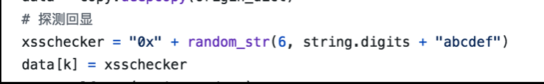
  2. 判断可否xss，content-type是否是html 

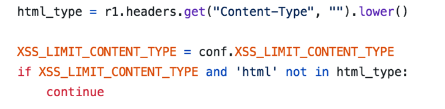
  3. 再次根据GET，POST，COOKIE进行请求，确定参数的回显位置

  4. 如果语义分析不到回显的位置，可以直接构造一个xss，看是否存在即可

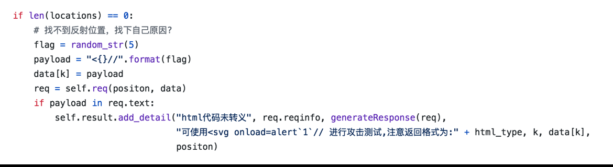
  5. 语义分析得到位置，根据不同位置生成不同的payload，并进行二次探测最终确认xss是否存在


不过公开的是第一版的代码，后面我又对代码进行过多次整改，适配了很多种情况。

  * js文本内容转义
    ```js 
    var s1="1\"
    ```

  * 回显内容在注释里,可使用换行进行bypass

  * 多个反射点特殊构造bypass

    * https://brutelogic.com.br/blog/multi-reflection-xss/
  * 针对大量回显参数进行优化，之前是发现一个回显参数就请求测试一次，但是一个页面如果有大量回显的情况，会发送很多无用包。

  * 如果有多个输出点并且在同一行，js中 反斜杠\未被转义 就能被赋予意义。

    * 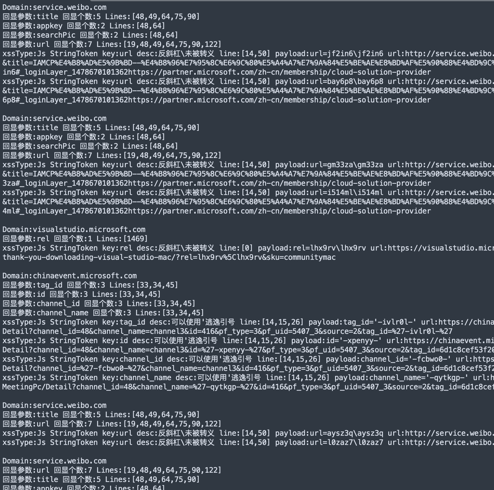
  * 一些可以输出替换的点

    * 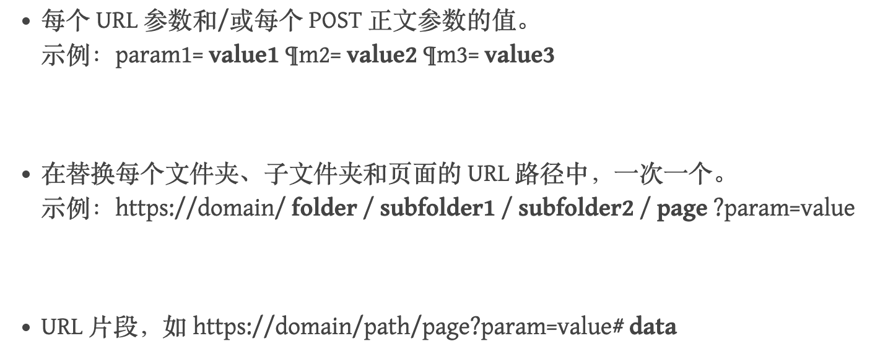


等等..

## 工程化经历

xss扫描器完毕后，加上爬虫，一个简单的流程图如下

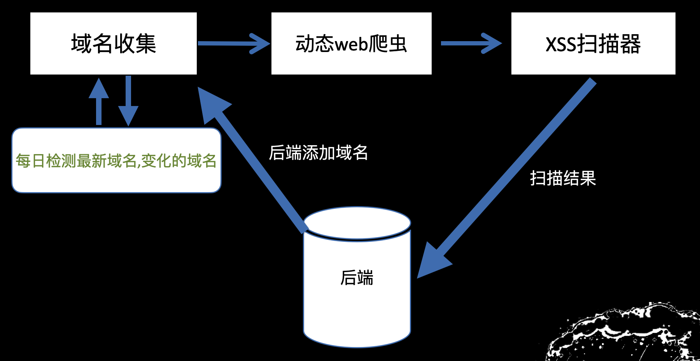

给后端添加bugbounty的目标域名，整个系统就能自己转起来，自动搜索子域名，自动爬虫，自动xss扫描，自动检测更新。

技术栈主要用的是python，现在总结起来的构成有以下，使用到的技术：

域名收集

  * https://github.com/projectdiscovery/subfinder


域名爆破+验证

  * https://github.com/boy-hack/ksubdomain


爬虫

  * https://github.com/0Kee-Team/crawlergo


后端：

  * django+mongodb


分布式:

  * celery
  * celery状态监控：flower
  * 消息队列：rabbit MQ


容器化

  * docker


自动发布

  * fabric


进程监控

  * supervisor


demo阶段后端一开始用的是`leancloud`服务，直接把扫到的数据存里面

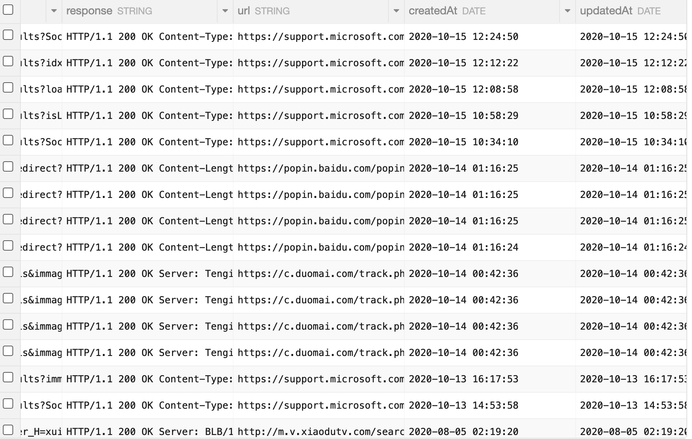

后面觉得成果不错，就开始用自己的数据库了。

## 界面和成果

当时做了简单的界面，填写src的地址等等就可以自动监控，成果也很喜人，基本上很多src的都检测到了。

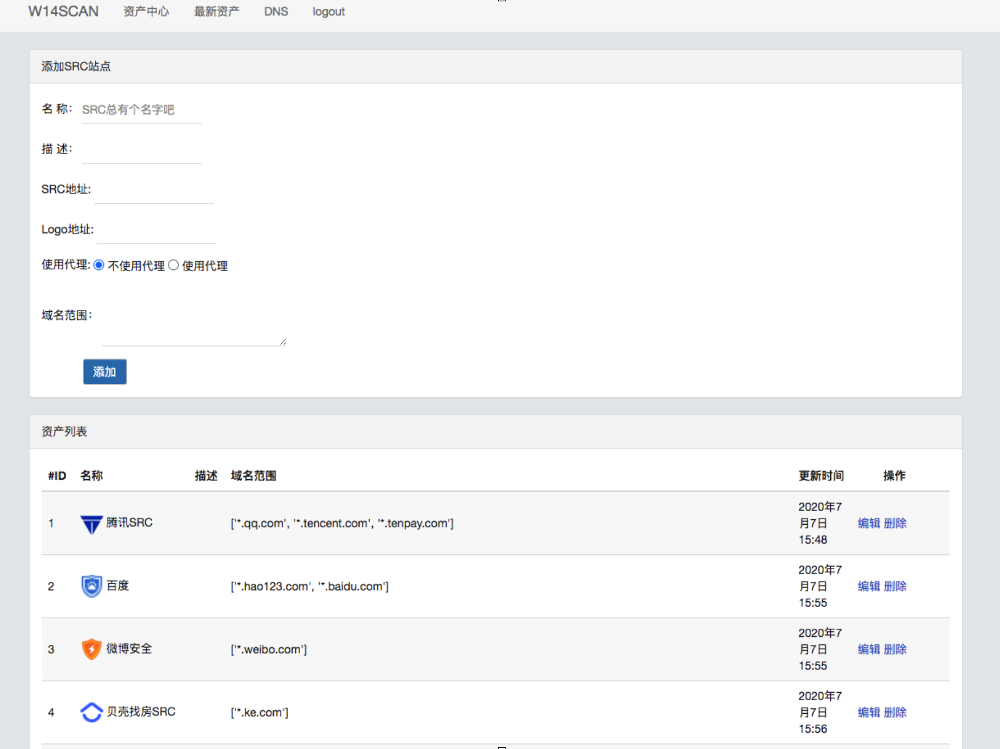

**子域名搜索**

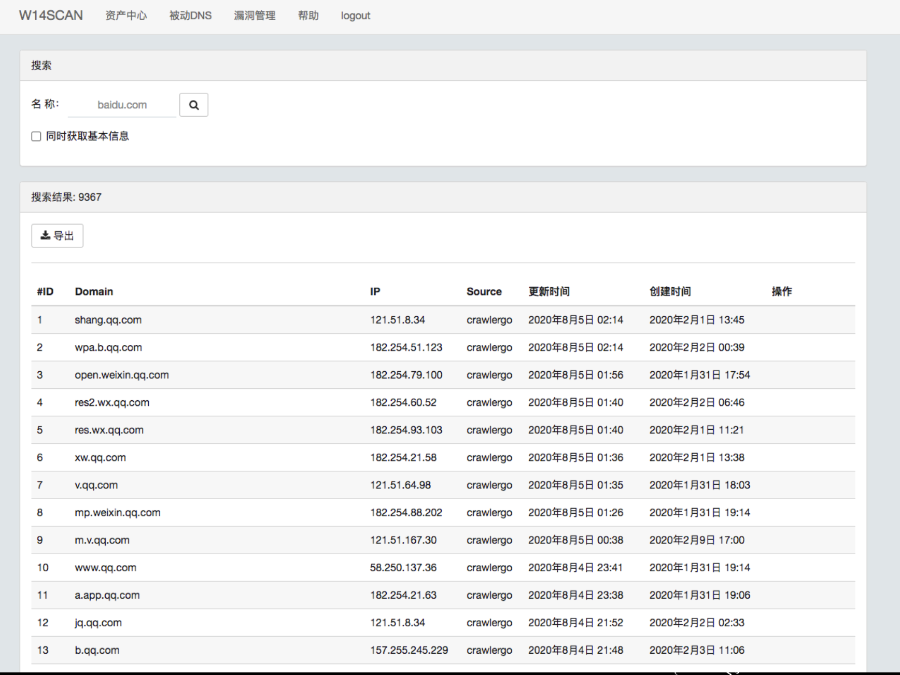

**漏洞页面**

会把xss的类型和测试payload展示，方便知道是哪些方法找到xss的

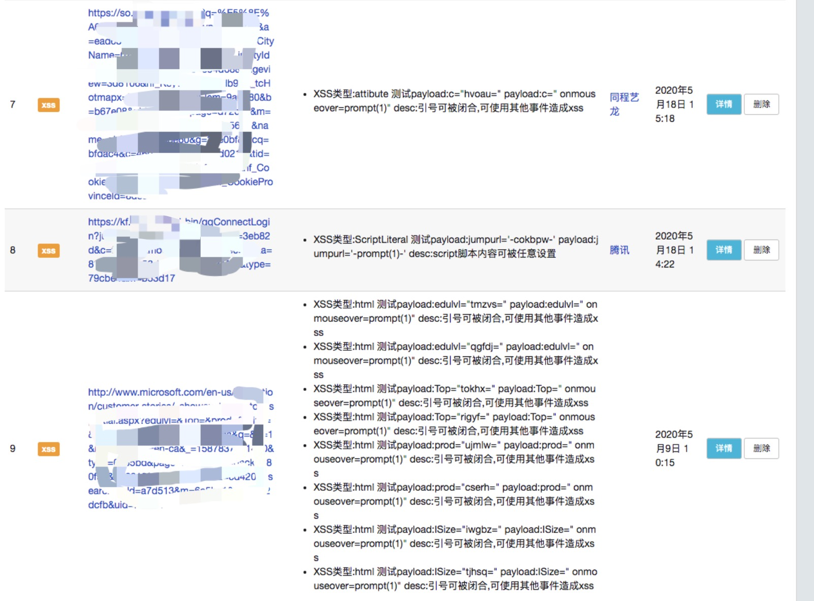

**漏洞详情**

把请求包详情展示，包括发送包，因为有时候复现不出来，大概率是和请求头某些参数有关系。

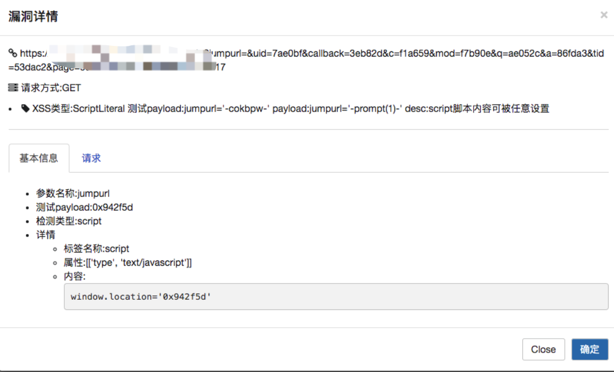

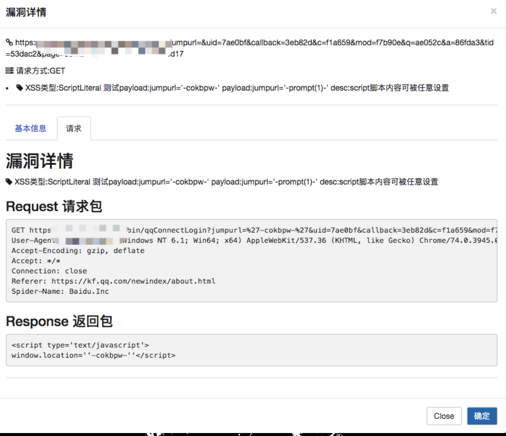

一些成果

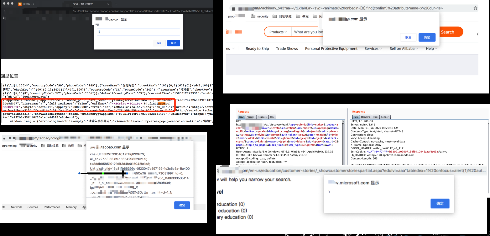

## 微软赏金经历

当时分布式都是用的国内机器，扫国外的很多都超时，所以就选了微软一家，国内访问速度还可以。当时没想很多，就把微软几个官方域名加了进去，让它自己去爆破自己去扫，还是有不少的，重点是一个月全部大更新一次再去扫，都有不一样的东西。

提交漏洞的记录：

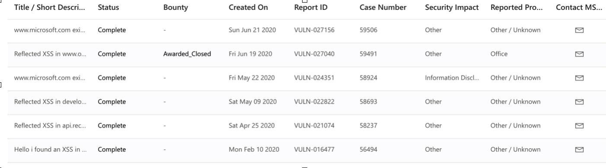

找到微软的网站漏洞，提交后它会在每月在线服务致谢中展示（xss也算噢）

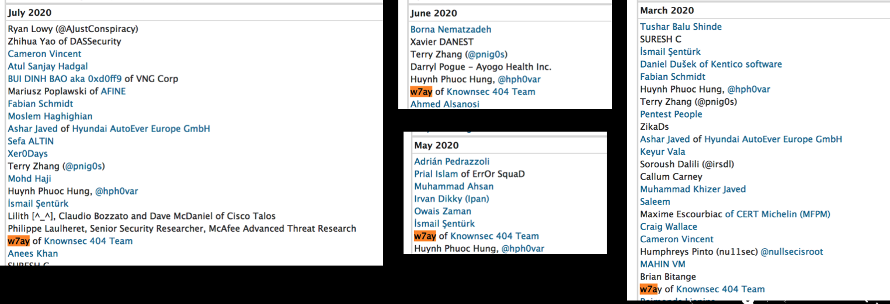

它也定义了有赏金的网站,网站在这里会得到赏金。（我发现了好几个微软主战的xss，但都没赏金..）
``` 
- www.office.com
- protection.office.com
- onedrive.live.com
- onedrive.com
- portal.azure.com
- manage.windowsazure.com
- azure.microsoft.com/en-us/blog
- portal.office.com
- outlook.office365.com
- outlook.office.com
- outlook.live.com
- outlook.com
- sharepoint.com
- lync.com
- officeapps.live.com
- www.yammer.com
- sway.com
- sway.office.com
- tasks.office.com
- teams.microsoft.com
- asm.skype.com
- msg.skype.com
- skyapi.live.net
- skype.com
- storage.live.com
- apis.live.net
- settings.live.net
- policies.live.net
- join.microsoft.com

```

后面按部就班的提交给微软咯，有一个域名我当时还不知道有赏金，就当普通的提交了，后面微软给我发来了赏金计划通知。一个xss奖励了1200美刀。

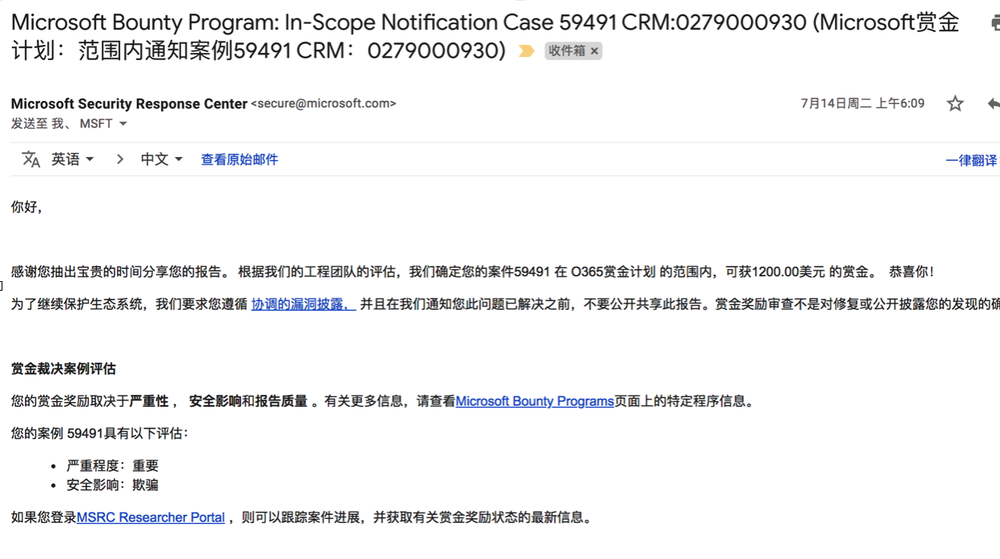

Ps :后面我还想凭着xss冲一冲微软最有价值的研究者，因为平均提交三个漏洞就能进入了，我提交了6个，但是后面发现它的机制是平均报告的volume或分数要超过同比的50%，xss分数少，可能就没过吧。。

### 为啥不做了

国内当时刷了一圈xss，但赏金都特别小，想刷国外，但就得把系统在国外vps部署一套，分布式的队列也得放到国外，它连国内的队列基本都超时，也觉得xss漏洞还是挺小，还是 反射xss，没有rce来的有成就感。后面做别的事情就忘了继续这个项目了。

### 现在还想做

还没有用这个技术刷国外的src是个遗憾，现在我也在构思自己的src平台，想把这个重新拾起，并且现在crawlergo也开源了，我可以做更多事情，比如直接在浏览器层面注入js来检测dom-xss等等，把爬虫的数据存下来，可以像google语法那样搜自己想要的东西。现在也可以买一些性能好的服务器，不用像以前2H1G拼命优化算法压榨自己的主机，连起个redis都要纠结好一会。

结尾打个广告，公众号回复知识星球，就可以获得知识星球的加入链接了(收费哦)

星球第四期作业也是以这个为题

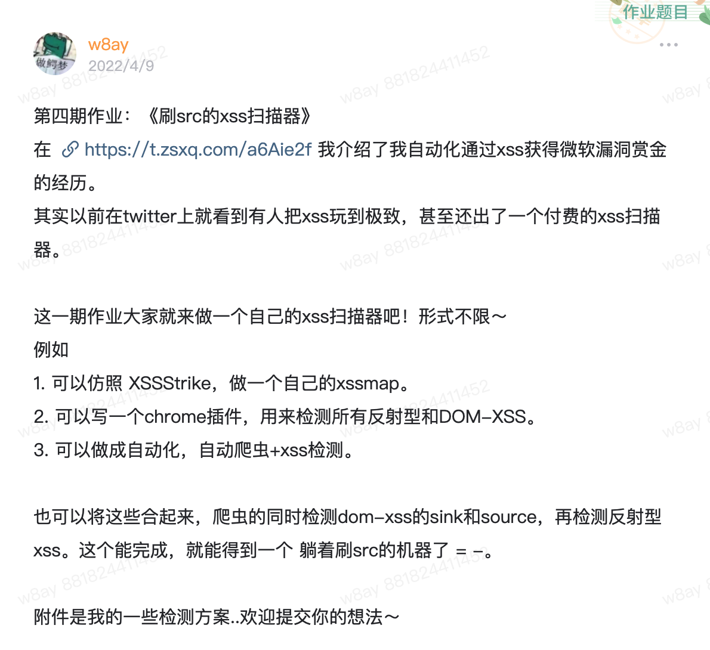

最近也重构了Go语言版的XSS扫描器，也发星球了，加上了爬虫，输入url就能自己跑xss了（完成星球第四期作业就奖励源码！）

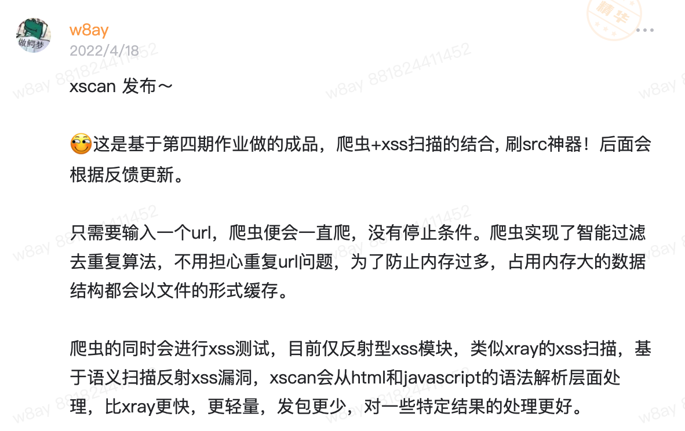

公众号回复知识星球试试？
