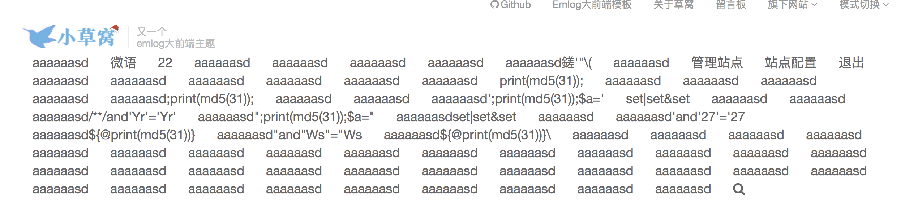
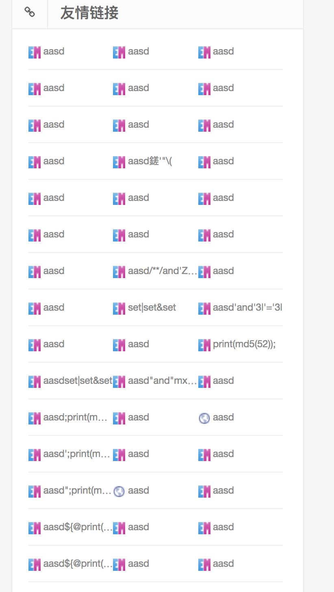
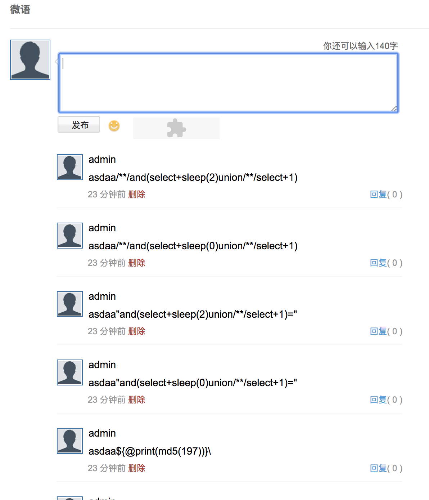

# 记W13SCAN扫描到的第一个漏洞

之前测试一直都是在靶机上进行，在完善了差不多的插件之后无意间打开W13SCAN对本地搭建的`emlog`系统进行了被动扫描，结果挺出乎意料，找到了一些后台的SQL注入等漏洞，虽然影响不大，但毕竟是W13SCAN第一次测试发现的非预期漏洞，值得记录一下。

> W13SCAN是被动+主动结合的扫描器，通过设置代理，将会自动分析流量以及根据插件检测相应漏洞。

扫描结果如下：
```bash 

   ❤️ (  ⚫︎ー⚫︎  ) Woo,W13Scan~
    　／　　　   ＼
     /　　　  ○ 　\   Version:0.1
    /　 /  　  ヽ  \
    |　/　 　　　\　|
     \Ԏ　         |イ
    　卜−　　   ―イ
    　 \　 /\　 /
    　　 ︶　 ︶
[2019-07-07 17:17:06] INFO Load plugin:25
[2019-07-07 17:17:06] INFO HTTPServer is running at address( 127.0.0.1 , 7778 )......
[2019-07-07 17:17:06] INFO Staring 10 threads
[js文件敏感内容匹配]
url            http://emlog.demo/include/lib/js/jquery/jquery-1.7.1.js?v=5.3.1
info           password:function

[JSONP寻找插件]
url            http://www.emlog.net/services/messenger.php?v=5.3.1&callback=jQue
ry17107805987039919267_1562491029740&_=1562491029784

[js文件敏感内容匹配]
url            http://emlog.demo/include/lib/js/jquery/jquery-1.7.1.js?
info           password:function

[php 真实路径泄漏]
url            http://emlog.demo/admin/?action%5B%5D=logout

[php 真实路径泄漏]
url            http://emlog.demo/admin/index.php?action%5B%5D=phpinfo

[php 真实路径泄漏]
url            http://emlog.demo/admin/write_log.php?gid=19&action%5B%5D=edit

[php 真实路径泄漏]
url            http://emlog.demo/admin/attachment.php?logid=1&action%5B%5D=attli
b

[js文件敏感内容匹配]
url            http://emlog.demo/admin/editor/lang/zh_CN.js?v=5.3.1
info           http://www.kindsoft.net/license.php

[js文件敏感内容匹配]
url            http://emlog.demo/admin/editor/lang/zh_CN.js?v=5.3.1
info           luolonghao@gmail.com

[POST插件 基于报错SQL注入]
url            http://emlog.demo/admin/save_log.php?action=edit
payload        date=1536572397鎈'"\(
data           {'title': '欢迎使用emlog', 'aaaaa-markdown-doc': '恭喜您成功安装了emlog，这是系统自
动生成的演示文章。编辑或者删除它，然后开始您的创作吧！aafe', 'content': '<p>恭喜您成功安装了emlog，这是系统自动生成的演示文章。编辑或
者删除它，然后开始您的创作吧！aafe</p>\r\n', 'as_logid': '1', 'tag': 'a', 'sort': '-1', 'postda
te': '2018-09-10+17:39:57', 'date': '1536572397鎈\'"\\(', 'excerpt': '', 'alias':
 '', 'password': '', 'allow_remark': 'y', 'token': 'e5d1f89716f15c49abe216e4ef67
bd35', 'ishide': 'n', 'gid': '1', 'author': '1'}
dbms           Unknown database

[POST插件 基于报错SQL注入]
url            http://emlog.demo/admin/save_log.php?action=edit
payload        allow_remark=y鎈'"\(
data           {'title': '欢迎使用emlog', 'aaaaa-markdown-doc': '恭喜您成功安装了emlog，这是系统自
动生成的演示文章。编辑或者删除它，然后开始您的创作吧！aafe', 'content': '<p>恭喜您成功安装了emlog，这是系统自动生成的演示文章。编辑或
者删除它，然后开始您的创作吧！aafe</p>\r\n', 'as_logid': '1', 'tag': 'a', 'sort': '-1', 'postda
te': '2018-09-10+17:39:57', 'date': '1536572397', 'excerpt': '', 'alias': '', 'p
assword': '', 'allow_remark': 'y鎈\'"\\(', 'token': 'e5d1f89716f15c49abe216e4ef67
bd35', 'ishide': 'n', 'gid': '1', 'author': '1'}
dbms           Unknown database

[POST插件 基于报错SQL注入]
url            http://emlog.demo/admin/save_log.php?action=edit
payload        ishide=n鎈'"\(
data           {'title': '欢迎使用emlog', 'aaaaa-markdown-doc': '恭喜您成功安装了emlog，这是系统自
动生成的演示文章。编辑或者删除它，然后开始您的创作吧！aafe', 'content': '<p>恭喜您成功安装了emlog，这是系统自动生成的演示文章。编辑或
者删除它，然后开始您的创作吧！aafe</p>\r\n', 'as_logid': '1', 'tag': 'a', 'sort': '-1', 'postda
te': '2018-09-10+17:39:57', 'date': '1536572397', 'excerpt': '', 'alias': '', 'p
assword': '', 'allow_remark': 'y', 'token': 'e5d1f89716f15c49abe216e4ef67bd35',
'ishide': 'n鎈\'"\\(', 'gid': '1', 'author': '1'}
dbms           Unknown database

[js文件敏感内容匹配]
url            http://emlog.demo/admin/editor/kindeditor.js?v=5.3.1
info           http://www.kindsoft.net/license.php

[php 真实路径泄漏]
url            http://emlog.demo/admin/tag.php?tid=49&action%5B%5D=mod_tag

[php 真实路径泄漏]
url            http://emlog.demo/admin/sort.php?sid=2&action%5B%5D=mod_sort

[php 真实路径泄漏]
url            http://emlog.demo/admin/sort.php?sid=2&token=e5d1f89716f15c49abe2
16e4ef67bd35&action%5B%5D=del

[php 真实路径泄漏]
url            http://emlog.demo/admin/sort.php?action=del&sid=2&token%5B%5D=e5d
1f89716f15c49abe216e4ef67bd35

[php 真实路径泄漏]
url            http://emlog.demo/admin/comment.php?amp%3Bcid=2&action%5B%5D=edit
_comment

[php 真实路径泄漏]
url            http://emlog.demo/admin/comment.php?amp%3Bid=2&action%5B%5D=hide

[php 真实路径泄漏]
url            http://emlog.demo/admin/navbar.php?amp%3Bid=18&action%5B%5D=hide

[php 真实路径泄漏]
url            http://emlog.demo/admin/navbar.php?amp%3Bnavid=69&action%5B%5D=mo
d

[php 真实路径泄漏]
url            http://emlog.demo/admin/navbar.php?id=16&token=e5d1f89716f15c49ab
e216e4ef67bd35&action%5B%5D=del

[php 真实路径泄漏]
url            http://emlog.demo/admin/navbar.php?action=del&id=16&token%5B%5D=e
5d1f89716f15c49abe216e4ef67bd35

[php 真实路径泄漏]
url            http://emlog.demo/admin/link.php?linkid=144&token=e5d1f89716f15c4
9abe216e4ef67bd35&action%5B%5D=dellink

[php 真实路径泄漏]
url            http://emlog.demo/admin/link.php?action=dellink&linkid=144&token%
5B%5D=e5d1f89716f15c49abe216e4ef67bd35

[php 真实路径泄漏]
url            http://emlog.demo/admin/link.php?amp%3Blinkid=68&action%5B%5D=hid
e

[php 真实路径泄漏]
url            http://emlog.demo/admin/page.php?action%5B%5D=new

[php 真实路径泄漏]
url            http://emlog.demo/admin/page.php?id=6&action%5B%5D=mod

[php 真实路径泄漏]
url            http://emlog.demo/admin/user.php?uid=2&action%5B%5D=edit

[POST插件 基于报错SQL注入]
url            http://emlog.demo/admin/data.php?action=bakstart
payload        table_box[]=emlog_attachment鎈'"\(
data           {'table_box[]': 'emlog_attachment鎈\'"\\(', 'bakplace': 'server',
'token': 'e5d1f89716f15c49abe216e4ef67bd35'}
dbms           MySQL database

[php 真实路径泄漏]
url            http://emlog.demo/admin/plugin.php?plugin=emlog_markdown%2Femlog_
markdown.php&token=e5d1f89716f15c49abe216e4ef67bd35&action%5B%5D=inactive

[php 真实路径泄漏]
url            http://emlog.demo/admin/plugin.php?action%5B%5D=install

[php 真实路径泄漏]
url            http://emlog.demo/admin/template.php?action%5B%5D=install

[php 真实路径泄漏]
url            http://emlog.demo/admin/template.php?tpl=default&side=1&token=e5d
1f89716f15c49abe216e4ef67bd35&action%5B%5D=usetpl

Plugin: JetBrans .idea 泄漏 time-out retry failed!3332 scanned in 266.89 seconds
[php 真实路径泄漏]
url            http://emlog.demo/admin/comment.php?ip=127.0.0.1&token=e5d1f89716
f15c49abe216e4ef67bd35&action%5B%5D=delbyip

[php 真实路径泄漏]
url            http://emlog.demo/admin/comment.php?action=delbyip&ip=127.0.0.1&t
oken%5B%5D=e5d1f89716f15c49abe216e4ef67bd35

[基于报错SQL注入]
url            http://emlog.demo/admin/comment.php?action=delbyip&ip=127.0.0.1&t
oken=e5d1f89716f15c49abe216e4ef67bd35
payload        ip=127.0.0.1鎈'"\(

[js文件敏感内容匹配]
url            http://emlog.demo/content/templates/emlog_dux_f4.0//js/main.js?ve
r=4.9
info           https://bugs.hacking8.com/cdn/1.php

[js文件敏感内容匹配]
url            http://emlog.demo/content/templates/emlog_dux_f4.0//js/main.js?ve
r=4.9
info           https://api.anotherhome.net/OwO/OwO.json

[js文件敏感内容匹配]
url            http://emlog.demo/content/templates/emlog_dux_f4.0//js/main.js?
info           https://bugs.hacking8.com/cdn/1.php

[js文件敏感内容匹配]
url            http://emlog.demo/content/templates/emlog_dux_f4.0//js/main.js?
info           https://api.anotherhome.net/OwO/OwO.json

```

严重一点的，发现了许多SQL注入漏洞，第一处是在后台保存博客的时候`http://emlog.demo/admin/save_log.php?action=edit`，`date`,`allow_remark`,`ishide`三个参数，后面通过源码分析，这其实是数据库设定了枚举类型，但是发送的payload不再预期内报错了，被扫描器抓到，虽然这处不算漏洞但是也发现了不同寻常地方，果然这款扫描器会自己挖洞了～～

第二处出现在了后台数据库备份的地方
``` 
[POST插件 基于报错SQL注入]
url            http://emlog.demo/admin/data.php?action=bakstart
payload        table_box[]=emlog_attachment鎈'"\(
data           {'table_box[]': 'emlog_attachment鎈\'"\\(', 'bakplace': 'server',
'token': 'e5d1f89716f15c49abe216e4ef67bd35'}
dbms           MySQL database

```

这次没有乌龙，真的就存在这个漏洞。

第三处在后台删除评论的地方
``` 
[基于报错SQL注入]
url            http://emlog.demo/admin/comment.php?action=delbyip&ip=127.0.0.1&t
oken=e5d1f89716f15c49abe216e4ef67bd35
payload        ip=127.0.0.1鎈'"\(

```

漏洞也真实存在，没有过滤这个参数。

然后通过逆向思维，可以发现这么几处有csrf的可能？







后面再下几套源码，带着它跑一跑，说不定会找到很多漏洞～
