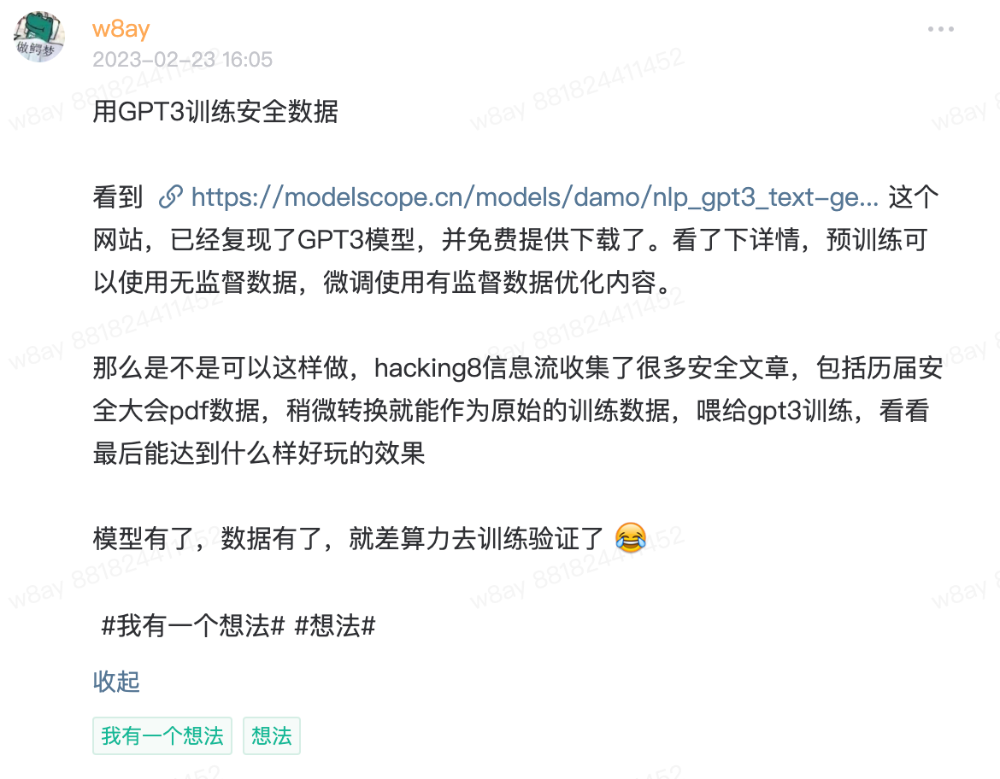
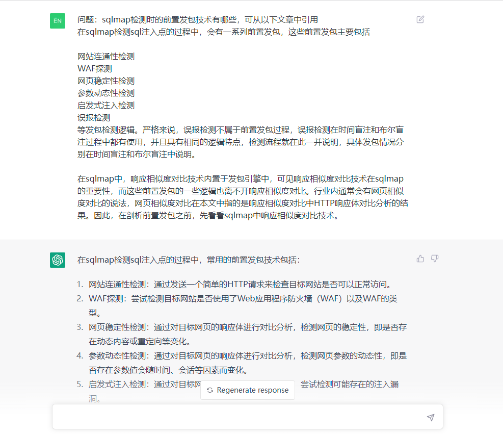
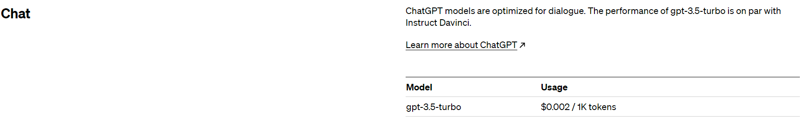
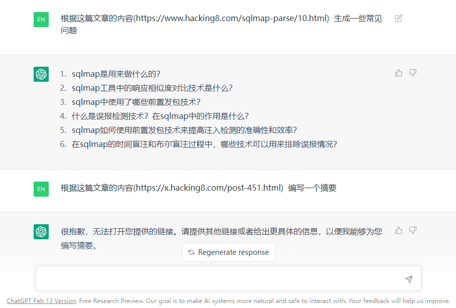
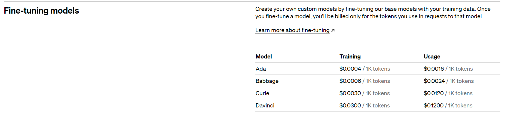
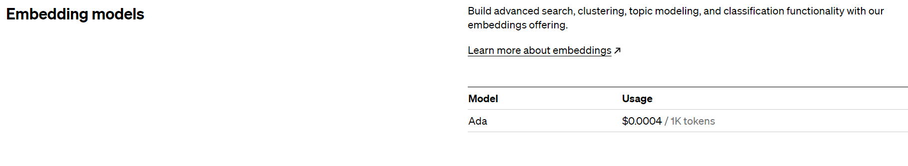
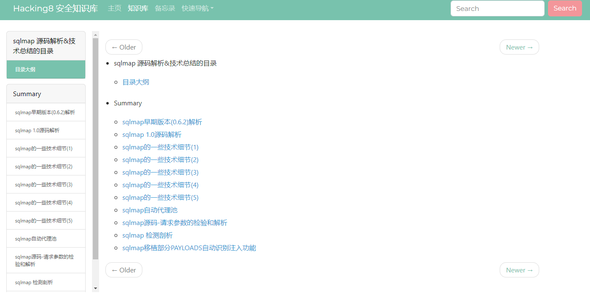
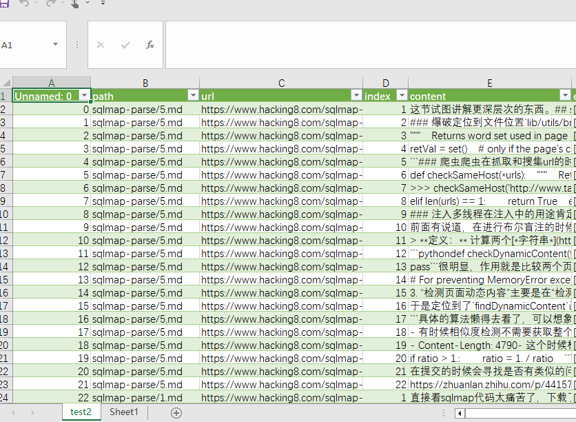
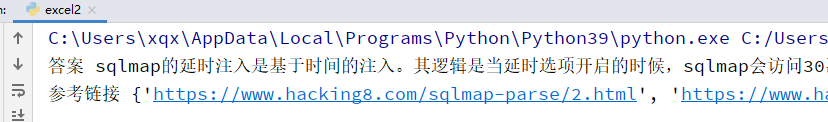
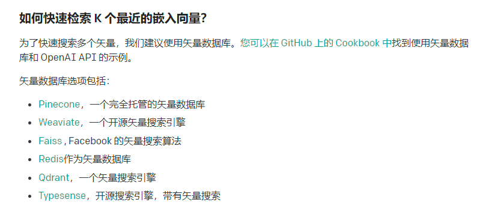

# Chatgpt:和黑客知识库聊天

chatgpt可以很好的解决通用型问题，但是对于垂直专业领域的问题还不够好，应该还需要再进行训练。

之前发过一个想法



周末做了几种可行性的探测。

## 可行性研究

### prompt上下文关联

直接再prompt的上下文中输入问题和引用的原文，再由chatgpt生成答案。



这种方法的缺点就是每次输入的文字有限制”4096 token”。

值得一提的是费用很便宜。一百万token才2美元。



有一些突破限制方法：

  * 例如把一个长的prompt拆成多个短的，逐个执行后再拼接起来。但是openai是按照token数量进行收费的，不适合用于数据量可能很大的情况。
  * 将文本放到一个网页，让chatgpt去读，但是有时候请求会读不到，无法保证可用性




### Fine-tuning (微调)

openai提供模型的微调服务：https://platform.openai.com/docs/guides/fine-tuning

> GPT-3 已经在来自开放互联网的大量文本上进行了预训练。当给出仅包含几个示例的提示时，它通常可以凭直觉判断出您要执行的任务并生成合理的完成。这通常称为“小样本学习”。
> 
> 微调通过训练比提示中更多的示例来改进小样本学习，让您在大量任务中取得更好的结果。**对模型进行微调后，您将不再需要在提示中提供示例。** 这样可以节省成本并实现更低延迟的请求。

它只需要三个步骤

  1. 准备和上传训练数据
  2. 训练新的微调模型
  3. 使用您的微调模型


数据格式形如
```json 
{"prompt": "<prompt text>", "completion": "<ideal generated text>"}
{"prompt": "<prompt text>", "completion": "<ideal generated text>"}
{"prompt": "<prompt text>", "completion": "<ideal generated text>"}

```

需要对每个数据的原文编写一个可用prompt。



微调模型里没有gpt3.5的，都是基于gpt3.0, 最好的是davinci，价格也比较贵，训练，使用都是按token收费。

### 其他可替代性模型

开源的大语言模型也有很多，它们也开放了自己的预训练模型，但是需要你自己训练进行微调才能达到效果，成本比较高，需要自己整理数据集，用GPU训练。

#### 谷歌开源的语言大模型flan-t5

https://huggingface.co/google/flan-t5-xxl

#### 百度开源的npl工具集

https://github.com/PaddlePaddle/PaddleNLP

#### GPT-J 6B, OPT, GALACTICA, GPT-Neo集成测试方案

https://github.com/oobabooga/text-generation-webui

#### GPT3中文预训练模型

https://modelscope.cn/models/damo/nlp_gpt3_text-generation_30B/summary

### embedding

基于语义检索，所谓语义检索（也称基于向量的检索，如上图所示），是指检索系统不再拘泥于用户 Query 字面本身，而是能精准捕捉到用户 Query 后面的真正意图并以此来搜索，从而更准确地向用户返回最符合的结果。

通过使用语义索引模型找到文本的向量表示，在高维向量空间中对它们进行索引，并度量查询向量与索引文档的相似程度，从而解决了关键词索引带来的缺陷。

openai也开放了这部分api。https://platform.openai.com/docs/guides/embeddings/what-are-embeddings

它的api价格比较低



1000万token用来索引只消耗4美元。

官方也提供了搜索相似代码，搜索文本的案例

https://github.com/openai/openai-cookbook/blob/main/examples/Semantic_text_search_using_embeddings.ipynb

https://github.com/openai/openai-cookbook/blob/main/examples/Code_search.ipynb

大概步骤是：

通过调用`text-embedding-ada-002`模型，输出文本向量，后续使用cos余弦相似度或其他算法找到相似的内容。

下文就是对这块的实验。

## 数据集预处理

www.hacking8.com和i.hacking8.com有很多安全方向的数据，数据源不用发愁。

我们调用openai的embedding对文本进行语义化向量输出，需要将一篇大文章分成多个块，每个块最大8191token(openai限制)。

在实验中发现，数据的预处理很重要，决定了数据的质量。每个块分多大，块中的上下文最好关联而不是错开。

决定先对 https://www.hacking8.com/sqlmap-parse/ 这篇文章索引看看效果。



这本书的内容源格式是markdown的，可以通过拆分markdown的标题来作为块，我为了方便之后通用其他数据集，用5行作为索引的块。
```python 
import glob
import math
import os.path
from itertools import islice

import numpy as np
import openai
import pandas as pd
import tiktoken

token = "sk-xxxx"
os.environ.setdefault("OPENAI_API_KEY", token)
openai.api_key = token


def num_tokens_from_string(string: str, encoding_name: str = 'cl100k_base') -> int:
    """Returns the number of tokens in a text string."""
    encoding = tiktoken.get_encoding(encoding_name)
    num_tokens = len(encoding.encode(string))
    return num_tokens


def get_embedding(text, model="text-embedding-ada-002"):
    text = text.replace("\n", " ")
    return openai.Embedding.create(input=[text], model=model)['data'][0]['embedding']


data = []


def save_csv(path, url, content, index):
    data.append({
        "path": path,
        "url": url,
        "content": content,
        "index": index
    })


# 创建数据集
base = "/books"
for filename in glob.glob('/books/sqlmap-parse/*.md', recursive=True):
    with open(filename, 'r') as f:
        path = os.path.relpath(filename, base)
        url = "https://www.hacking8.com/" + path
        content = f.read().replace("\n\n", "\n").strip()

        contents = content.split("\n")
        rawSize = 5
        rawLength = len(contents)
        index = 0
        for i in range(math.ceil(rawLength / rawSize)):
            index += 1
            current = contents[i * rawSize:(i + 1) * rawSize]
            cc = "\n".join(current).strip()
            num = num_tokens_from_string(cc)
            if num > 2000:
                it = iter(cc)
                while batch := tuple(islice(it, 2000)):
                    index += 1
                    cc = "".join(batch)
                    save_csv(path, url, cc, index)
            else:
                save_csv(path, url, cc, index)

table = pd.DataFrame(data=data, columns=["path", "url", "index", "content"])
print(table)
table.to_csv("test.csv")

```

最终得到一个1000多行的CSV。将结果保存到test.csv上



## 计算文本向量

再预处理数据基础上新增一列，调用openai计算embedding。

openai的api有限制，有时候会报错，所以加了一个异常捕获代码，代码有判断，有embedding内容则跳过，没有则进行计算，多运行几次，直至全部计算成功。
```python 
# 读取数据集，添加集合向量
# 读取CSV文件
df = pd.read_csv('test.csv')
df["embedding"] = ""
# 遍历每一行并修改列值
for index, row in df.iterrows():
    content = row["content"]
    embedding = row["embedding"]
    is_null = pd.isnull(embedding)
    if not is_null:
        continue
    print(index)
    try:
        embedding = get_embedding(content)
        time.sleep(1) // openai有 60/min 的限制
    except Exception as e:
        print(e)
        continue
    s = "[" + ", ".join(str(x) for x in embedding) + "]"
    df.loc[index, "embedding"] = s
    if int(index) % 20 == 0:
        df.to_csv('test2.csv', index=False)

df.to_csv('test2.csv', index=False)

```

## 问答

计算问题的语义向量，并和数据库中对比相似度，取排行前三的内容作为prompt，再调用gpt3.5做最后总结。
```python 
df = pd.read_csv('test2.csv')

def search_reviews(df, query, n=3):
    embedding = get_embedding(query, model='text-embedding-ada-002')
    df['similarities'] = df.embedding.apply(lambda x: cosine_similarity(eval(x), embedding))
    res = df.sort_values('similarities', ascending=False).head(n)
    return res


def cosine_similarity(a, b):
    return np.dot(a, b) / (np.linalg.norm(a) * np.linalg.norm(b))


prompt = '''你是一个大型语言模型，你的专长是阅读和总结文章。给你一个查询和一系列来自文本的输入，按照它们与查询的余弦相似度排序。你必须接受给定的输入，并返回非常详细的回答摘要。following embeddings as data: \n'''
query = "sqlmap的延时注入如何做的"

answer = search_reviews(df, query, 3)
url_set = set()
for index, item in answer.iterrows():
    content = item.content
    url = item.url
    url_set.add(url)
    # print("参考:", content)
    prompt += "{}:{}".format(index, content) + "\n"

resp_raw = openai.ChatCompletion.create(
    model="gpt-3.5-turbo",
    messages=[
        {"role": "system", "content": prompt},
        {"role": "user", "content": "Question:" + query},
    ]
)

import json

resp = json.loads(str(resp_raw))
content = resp["choices"][0]["message"]["content"]
print("答案", content)
print("参考链接", url_set)

```

我询问它 “sqlmap的延时注入如何做的”,它最终返回



> 答案 sqlmap的延时注入是基于时间的注入。其逻辑是当延时选项开启的时候，sqlmap会访问30次网页，并存储和上一次访问的间隔，所以总共会保存有30次的时间间隔。之后会生成三个不同的数字，并有这些数字组成不同的逻辑，将这些逻辑替换测试向量中原有的逻辑，并观察响应是否如预期。如果响应与预期一致，则sqlmap认为注入存在。
> 
> 参考链接 {‘https://www.hacking8.com/sqlmap-parse/2.html‘, ‘https://www.hacking8.com/sqlmap-parse/10.html‘}

回答挺不错的，简洁和有效

## 总结

这是一个简单例子，如何将知识库做索引，以及用口语化的方式查询。

还有一些可以优化的点：

  1. 人工分块，现在分块比较粗暴，会导致很多代码被无效分块，人工分块标记代码，这样生成的向量会比较准确
  2. 快速检索相似向量



目前的比对是全量数据比对，以后索引hacking8的全量数据的时候，再全量比对速度就很慢了，可以用 https://github.com/facebookresearch/faiss，它使用机器学习的手段，会将所有向量先进行一次聚类，相似的放到一起，相当于将相似的做了索引，再查询时就根据聚类的去查，就很快了。


后续将继续各类技术文档的索引，希望能达到一个目标，技术将不再看文档，而是直接问问题。
