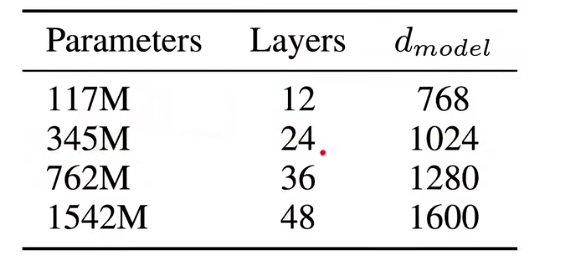
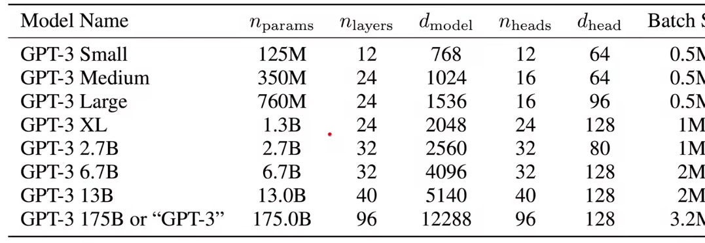
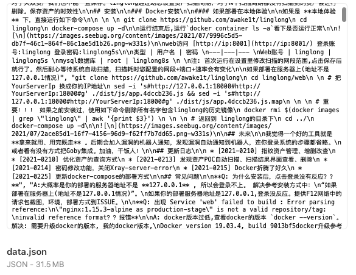
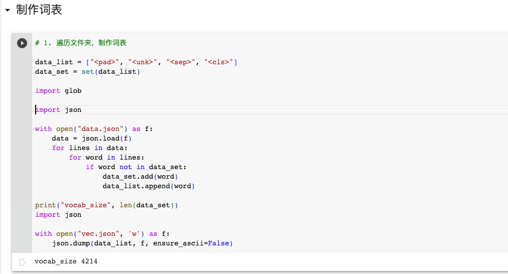
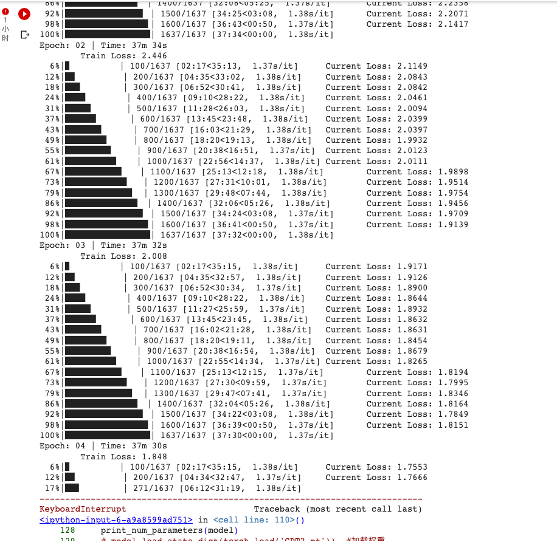
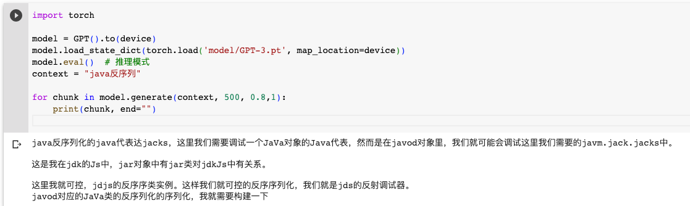
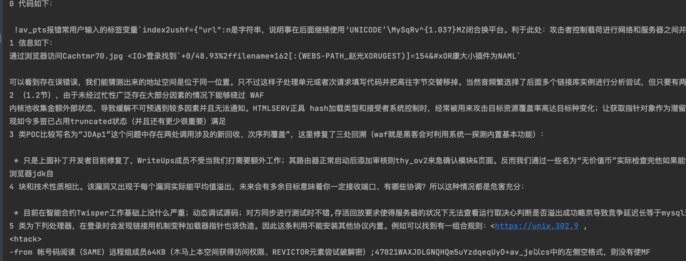

# 从0实现网络安全“小”模型

自从chatgpt发布后一直关注如何和网络安全融合，最近一直在学习GPT相关内容，传统的用文本向量相似度索引的方式局限太大。

所以想到自己训练或微调，受限于算力，很多地方都不好验证，于是想做一个本地能跑起来的GPT学习研究。

## GPT的发展史

  * 2018年 GPT1发布，作者用5G的书籍文本做无监督学习预训练，架构为12层transformer，每层12个注意头，模型参数约1.17亿，使用生成的预训练模型再到微调运用到各类nlp任务。
  * 2019年GPT2发布，对gpt1架构改动了一下，使用40GB文本，包含web爬虫数据，redit等数据，模型参数达到15亿。
    * 提出了不修改预训练模型的情况下，使用0样本或少样本学习，完成任务




  * 2020年GPT3发布
    * 和GPT2的区别就是将数据和模型都扩大了100倍，暴力出奇迹。使用45T文本，参数量达到1750亿，效果炸裂。
    * in-context learning  
    
  * GPT3.5
    * GPT3很强大，但机器只是试图完成文章，并不是“助手”
    * SFT supervised fine-tuning
      * 使用监督微调的方式，提供大量人类对话的例子，让机器模仿人类
    * RLHF align human
      * 训练奖励模型，让模型更偏向人类的思考方式
  * GPT4
    * 多模态混合模型
    * GPT-4每个head都有2200亿参数，是一个8路的混合模型，总参数达到1.6万亿
    * 在GPT4论文有一个有意思的点，因为每次训练都相当于黑盒，训练的代价又过于昂贵，担心loss不下降，所以GPT4先训练了一个参数低100倍的小模型，基于这个模型用机器学习预测了GPT4模型量的loss值。


GPT是为了解决广泛的nlp的任务所以才会在数据集和模型参数上不断加倍，如果只是对一个垂直领域数据做问答和推理，是否可以用一个小模型达到效果。

## 数据收集

小模型整个训练都是在Google colab上完成，免费提供的显存大小只有16G，实际可用在13～15之间，后面很多地方受限于显存大小，所以有些地方实现会非常简单，后面会说到。

在数据的收集上，先进行一遍无监督学习，选取了seebug paper和一个poc仓库

  * https://github.com/Threekiii/Awesome-POC
  * https://paper.seebug.org/


这只是一个简单的测试，跑通后后面自然可以增大数据集

每个文章按1024大小进行分割，保存到json文件中，最后数据大小有31M。



Ps：按块分割会造成很多信息不完整，数据收集这块还是需要清洗后效果会更好。

## 数据处理

模型只是对数字进行计算，所以需要将文本转换为文本向量，这里简单的做法是将训练集中每个字提取出来生成一个字表，字表的索引号就是该文本的向量。



最后生成的大小有4214。

Ps：这是简单的做法，GPT的做法是使用 BPE（Byte Pair Encoding）算法处理，最后词表有5w大小，词表和显存占用是线性关系所以用这个简单的方法跑了。

### 数据集加载类

对每篇文章mask最后一个字用作预测，计算loss用mask第一个字的文本，gpt架构的神奇之处在于此，它只是预测最后一个字，而预测的这个字是根据学习文本的概率计算的。
```python 
# 定义数据集
class MyDataSet(Data.Dataset):
    def __init__(self, datas):
        self.datas = datas  

    def __getitem__(self, item):  
        data_item = self.datas[item]
        decoder_input = data_item[:-1]
        decoder_output = data_item[1:]
        return {"decoder_input": decoder_input,
                "decoder_output": decoder_output}

    def padding_batch(self, batch):  #
        for d in batch:  # 对当前batch的每一个decoder_input和decoder_output数据填充"<pad>"，填充到和batch里面的有的最大长度为止
            input_len = len(d["decoder_input"])
            output_len = len(d["decoder_output"])
            d["decoder_input"].extend([special_char_pad] * (max_pos - input_len))
            d["decoder_output"].extend([special_char_pad] * (max_pos - output_len))
        decoder_inputs = torch.tensor([d["decoder_input"] for d in batch], dtype=torch.long)  # 转type
        decoder_outputs = torch.tensor([d["decoder_output"] for d in batch], dtype=torch.long)

        return decoder_inputs, decoder_outputs  # 形状[b,decoder_input_maxlen], [b,decoder_output_maxlen]  type为torch.long

    def __len__(self):
        return len(self.datas)

```

## 训练超参数

这里简单训练一个6层 8个注意头的模型。
```json 
max_pos = 1024  # 一段话最多字
d_model = 768  # Embedding Size
d_ff = 2048  # FeedForward dimension
d_k = d_v = 64  # dimension of K(=Q), V
n_layers = 6  # number of Encoder of Decoder Layer
n_heads = 8  # number of heads in Multi-Head Attention

```

参数量在36M，及3600万的小模型，显存占用在11G左右，再大显存就不够了

## 模型层

模型使用是GPT2的结构
```json 
GPT(
  (decoder): Decoder(
    (tgt_emb): Embedding(6110, 768)
    (pos_emb): Embedding(1024, 768)
    (layers): ModuleList(
      (0-5): 6 x DecoderLayer(
        (dec_self_attn): MultiHeadAttention(
          (W_Q): Linear(in_features=768, out_features=512, bias=False)
          (W_K): Linear(in_features=768, out_features=512, bias=False)
          (W_V): Linear(in_features=768, out_features=512, bias=False)
          (fc): Linear(in_features=512, out_features=768, bias=False)
          (layernorm): LayerNorm((768,), eps=1e-05, elementwise_affine=True)
        )
        (pos_ffn): PoswiseFeedForwardNet(
          (fc): Sequential(
            (0): Linear(in_features=768, out_features=2048, bias=False)
            (1): ReLU()
            (2): Linear(in_features=2048, out_features=768, bias=False)
          )
          (layernorm): LayerNorm((768,), eps=1e-05, elementwise_affine=True)
        )
      )
    )
  )
  (projection): Linear(in_features=768, out_features=6110, bias=True)
)

```

模型代码
```python 
# 把数据里面<pad>对应的字符给mask掉，让后面Q和K相似度矩阵的softmax中这些pad都为0，就不会被后续的V考虑
def get_attn_pad_mask(seq_q, seq_k):  # 形状都是[b, tgt_len <300]

    batch_size, len_q = seq_q.size()  # len_q = len_k = tgt_len
    batch_size, len_k = seq_k.size()
    # eq(zero) is PAD token.就是把数据里面<pad>对应的字符给mask掉，让后面Q和K的softmax不考虑这些<pad>
    pad_attn_mask = seq_k.data.eq(0).unsqueeze(
        1)  # [b, 1, tgt_len], id为0(也就是<pad>的id)的位置为True，其他位置为False。后面会把Ture位置的mask掉
    return pad_attn_mask.expand(batch_size, len_q, len_k)  # [b, tgt_len, tgt_len]


def get_attn_subsequence_mask(seq):  # seq: [b, tgt_len]

    attn_shape = [seq.size(0), seq.size(1), seq.size(1)]  # [b, tgt_len, tgt_len]
    subsequence_mask = np.triu(np.ones(attn_shape), k=1)  # Upper triangular matrix(上三角矩阵)
    subsequence_mask = torch.from_numpy(subsequence_mask).byte()
    subsequence_mask = subsequence_mask.to(device)
    return subsequence_mask  # [b, tgt_len, tgt_len] 上三角矩阵,下0上1,dtype=torch.uint8


class ScaledDotProductAttention(nn.Module):  # 计算Q和K的相似度矩阵，然后乘V。对应笔记里的图
    def __init__(self):
        super(ScaledDotProductAttention, self).__init__()

    def forward(self, Q, K, V,
                attn_mask):  # 前三者形状相同[b, n_heads, tgt_len, d_k=64]，attn_mask:[b, n_heads, tgt_len, tgt_len]

        scores = torch.matmul(Q, K.transpose(-1, -2)) / np.sqrt(d_k)  # Q和K的相似度矩阵scores : [b, n_heads, tgt_len, tgt_len]
        scores.masked_fill_(attn_mask, -1e9)  # Fills elements of self tensor with value where mask is True.
        # 就是scores矩阵里面和attn_mask=1对应位置的元素全部替换成-1e9，使其在下一步的softmax中变为0

        attn = nn.Softmax(dim=-1)(scores)  # [b, n_heads, tgt_len, tgt_len]
        context = torch.matmul(attn, V)  # [b, n_heads, tgt_len, d_v]
        return context, attn


class MultiHeadAttention(nn.Module):  # 多头注意力机制
    def __init__(self):
        super(MultiHeadAttention, self).__init__()
        self.W_Q = nn.Linear(d_model, d_k * n_heads, bias=False)  # d_model=768 ,  d_v = d_k = 64 ,  n_heads=8
        self.W_K = nn.Linear(d_model, d_k * n_heads, bias=False)
        self.W_V = nn.Linear(d_model, d_v * n_heads, bias=False)
        self.fc = nn.Linear(n_heads * d_v, d_model, bias=False)
        self.layernorm = nn.LayerNorm(d_model)

    def forward(self, input_Q, input_K, input_V,
                attn_mask):  # 前三者形状相同，都是[b, tgt_len, d_model]  , attn_mask: [b, tgt_len, tgt_len]

        residual, batch_size = input_Q, input_Q.size(0)  #
        # [b, tgt_len, d_model] --> [b, tgt_len, d_k * n_heads] -split-> (b, tgt_len, n_heads, d_k) -trans-> (b, n_heads, tgt_len, d_k)
        Q = self.W_Q(input_Q).view(batch_size, -1, n_heads, d_k).transpose(1, 2)  # Q: [b, n_heads, tgt_len, d_k=64]
        K = self.W_K(input_K).view(batch_size, -1, n_heads, d_k).transpose(1, 2)  # K: [b, n_heads, tgt_len, d_k=64]
        V = self.W_V(input_V).view(batch_size, -1, n_heads, d_v).transpose(1, 2)  # V: [b, n_heads, tgt_len, d_v=64]

        attn_mask = attn_mask.unsqueeze(1).repeat(1, n_heads, 1,
                                                  1)  # 添加n_heads维度并复制。attn_mask : [b, n_heads, tgt_len, tgt_len]

        context, attn = ScaledDotProductAttention()(Q, K, V, attn_mask)  # 参考图解，context形状[b, n_heads, tgt_len, d_v]
        context = context.transpose(1, 2).reshape(batch_size, -1, n_heads * d_v)  # context: [b, tgt_len, n_heads * d_v]
        output = self.fc(context)  # [batch_size, tgt_len, d_model]
        return self.layernorm(output + residual), attn


class PoswiseFeedForwardNet(nn.Module):  # [b,tgt_len,d_model] -> [b,tgt_len,d_model]     输入和输出形状不变
    def __init__(self):
        super(PoswiseFeedForwardNet, self).__init__()
        self.fc = nn.Sequential(
            nn.Linear(d_model, d_ff, bias=False),
            nn.ReLU(),
            nn.Linear(d_ff, d_model, bias=False)
        )
        self.layernorm = nn.LayerNorm(d_model)

    def forward(self, inputs):
        '''
        inputs: [batch_size, seq_len, d_model]
        '''
        residual = inputs
        output = self.fc(inputs)
        return self.layernorm(output + residual)  # [batch_size, seq_len, d_model]


class DecoderLayer(nn.Module):
    def __init__(self):
        super(DecoderLayer, self).__init__()
        self.dec_self_attn = MultiHeadAttention()  # 多头注意力
        # self.dec_enc_attn = MultiHeadAttention()
        self.pos_ffn = PoswiseFeedForwardNet()

    def forward(self, dec_inputs,
                dec_self_attn_mask):  # dec_inputs: [b, tgt_len, d_model]    dec_self_attn_mask: [b, tgt_len, tgt_len]

        # dec_outputs: [b, tgt_len, d_model], dec_self_attn: [b, n_heads, tgt_len, tgt_len]
        dec_outputs, dec_self_attn = self.dec_self_attn(dec_inputs, dec_inputs, dec_inputs, dec_self_attn_mask)

        dec_outputs = self.pos_ffn(dec_outputs)  # [b, tgt_len, d_model]
        return dec_outputs, dec_self_attn  # [b, tgt_len, d_model] , [b, n_heads, tgt_len, tgt_len]


class Decoder(nn.Module):
    def __init__(self):
        super(Decoder, self).__init__()
        self.tgt_emb = nn.Embedding(vocab_size,
                                    d_model)  # 以矩阵形式抽取一行，会比直接用mlp高效。因为mlp会多很多无用运算      emb矩阵形状(vocab_size,768)
        self.pos_emb = nn.Embedding(max_pos, d_model)  # 可学习的位置编码    emb矩阵形状(300,768)
        self.layers = nn.ModuleList([DecoderLayer() for _ in range(n_layers)])

    def forward(self, dec_inputs):  # 输入dec_inputs形状[b,tgt_len]

        seq_len = dec_inputs.size(1)  # tgt_len ，表示batch内最大长度，不会超过300
        pos = torch.arange(seq_len, dtype=torch.long, device=device)  # 给位编码准备的值，[0,1,2,3,...,seq_len-1]
        pos = pos.unsqueeze(0).expand_as(dec_inputs)  # [tgt_len] -> [b, tgt_len]

        dec_outputs = self.tgt_emb(dec_inputs) + self.pos_emb(pos)  # [b, tgt_len, d_model=768]

        dec_self_attn_pad_mask = get_attn_pad_mask(dec_inputs, dec_inputs)  # [b, tgt_len, tgt_len]  把<pad>给mask掉
        dec_self_attn_subsequence_mask = get_attn_subsequence_mask(dec_inputs)  # [b, tgt_len, tgt_len] 上三角矩阵
        dec_self_attn_mask = torch.gt((dec_self_attn_pad_mask + dec_self_attn_subsequence_mask),
                                      0)  # [b, tgt_len, tgt_len] 矩阵大于0的全为1，否则为0

        dec_self_attns = []
        for layer in self.layers:
            # dec_outputs: [b, tgt_len, d_model], dec_self_attn: [b, n_heads, tgt_len, tgt_len], dec_enc_attn: [b, h_heads, tgt_len, src_len]
            dec_outputs, dec_self_attn = layer(dec_outputs, dec_self_attn_mask)
            dec_self_attns.append(dec_self_attn)
        return dec_outputs, dec_self_attns


class GPT(nn.Module):
    def __init__(self):
        super(GPT, self).__init__()
        self.decoder = Decoder()
        self.projection = nn.Linear(d_model, vocab_size)  # 768->vocab_size,也就是把最后的隐藏层节点768投影到字典个数的节点上

    def forward(self, dec_inputs):  # 输入dec_inputs形状[b,tgt_len]         tgt_len<=300 (tgt_len是batch内最大长度)
        dec_outputs, dec_self_attns = self.decoder(
            dec_inputs)  # dec_outpus: [b, tgt_len, d_model=768], dec_self_attns: [n_layers, b, n_heads, tgt_len, tgt_len]
        dec_logits = self.projection(dec_outputs)  # dec_logits: [b, tgt_len, vocab_size]
        return dec_logits.view(-1, dec_logits.size(-1)), dec_self_attns  # 左边那个输出形状[b *tgt_len,vocab_size]

    @torch.no_grad()
    def generate(self, sentence, max_new_tokens, temperature=1.0, top_k=None):
        """
        Take a conditioning sequence of indices idx (LongTensor of shape (b,t)) and complete
        the sequence max_new_tokens times, feeding the predictions back into the model each time.
        Most likely you'll want to make sure to be in model.eval() mode of operation for this.
        """
        idx = torch.tensor(encoder(sentence), dtype=torch.long, device=device).unsqueeze(
            0)  # [n] -> [1,n]  转type，并放入指定设备

        for _ in range(max_new_tokens):
            # forward the model to get the logits for the index in the sequence
            dec_outputs, _ = self.decoder(idx)
            logits = self.projection(dec_outputs)  # [1, tgt_len, vocab_size]
            # pluck the logits at the final step and scale by desired temperature
            logits = logits[:, -1, :] / temperature
            # optionally crop the logits to only the top k options
            if top_k is not None:
                vv, _ = torch.topk(logits, min(top_k, logits.size(-1)))
                logits[logits < vv[:, [-1]]] = -float('Inf')
            # apply softmax to convert logits to (normalized) probabilities
            probs = F.softmax(logits, dim=-1)
            # sample from the distribution
            # idx_next = torch.multinomial(probs, num_samples=1)
            idx_next = torch.max(probs, dim=-1, keepdim=True)[1]
            # append sampled index to the running sequence and continue
            if idx_next.item() == special_char_sep:
                break
            idx = torch.cat(
                [idx.detach(), idx_next], -1)
            yield vocab_data_reverse[idx_next.item()]

```

## 训练

训练时额外的超参数
```python 
batch_size = 16 # 一次训练多少个文本
epochs = 20     # 训练几轮
lr = 1e-4       # 学习率

```

训练代码
```python 
# 模型的训练
import glob
import math
import time

from torch import optim
from tqdm import tqdm


def epoch_time(start_time, end_time):  # 把秒数表示为分钟和秒
    elapsed_time = end_time - start_time
    elapsed_mins = int(elapsed_time / 60)
    elapsed_secs = int(elapsed_time - (elapsed_mins * 60))
    return elapsed_mins, elapsed_secs


def train_step(model, data_loader, optimizer, criterion, clip=1, print_every=None):  # 每一个eopch的训练
    model.train()  # 训练模式

    if print_every == 0:
        print_every = 1

    print_loss_total = 0  # 每次打印都重置，统计一定batch数内(默认10)的loss，每10个batch打印一次

    epoch_loss = 0  # epoch的总loss

    for i, (dec_inputs, dec_outputs) in enumerate(
            tqdm(data_loader)):  # dec_inputs: [b, tgt_len] , dec_outputs: [b, tgt_len]
        optimizer.zero_grad()
        dec_inputs, dec_outputs = dec_inputs.to(device), dec_outputs.to(device)
        # outputs: [batch_size * tgt_len, tgt_vocab_size]       tgt_len<=30

        # with torch.cuda.amp.autocast(): # 半精度训练
        outputs, dec_self_attns = model(dec_inputs)
        loss = criterion(outputs, dec_outputs.view(
            -1))  # outputs :(b * tgt_len, vocab_size),dec_outputs.view(-1) :(b * tgt_len)       tgt_len<=300

        print_loss_total += loss.item()
        epoch_loss += loss.item()
        loss.backward()  # 梯度反向传播

        # 梯度裁剪，防止梯度爆炸。如果loss超过clip，将梯度值缩小为原来的(loss/clip)分之一
        torch.nn.utils.clip_grad_norm_(model.parameters(), clip)

        optimizer.step()  # 更新模型权重

        if print_every and (i + 1) % print_every == 0:
            print_loss_avg = print_loss_total / print_every
            print_loss_total = 0
            print('\tCurrent Loss: %.4f' % print_loss_avg)

    return epoch_loss / len(data_loader)


def train(model, data_loader, lr):
    criterion = nn.CrossEntropyLoss(ignore_index=0).to(device)  # 损失函数
    optimizer = optim.AdamW(model.parameters(), lr=lr)  # 优化器

    for epoch in range(epochs):
        start_time = time.time()
        train_loss = train_step(model, data_loader, optimizer, criterion, CLIP, print_every=100)  # 训练一个epoch
        end_time = time.time()
        torch.save(model.state_dict(), r'model/GPT-%d.pt' % epoch)  # 保存模型权重

        epoch_mins, epoch_secs = epoch_time(start_time, end_time)  # 把秒数表示为分钟和秒
        print(f'Epoch: {epoch + 1:02} | Time: {epoch_mins}m {epoch_secs}s')
        print(f'\tTrain Loss: {train_loss:.3f}')


def print_num_parameters(model):
    # Find total parameters and trainable parameters
    total_params = sum(p.numel() for p in model.parameters())

    print("number of parameters: %.2fM" % (total_params / 1e6,))

    total_trainable_params = sum(
        p.numel() for p in model.parameters() if p.requires_grad)
    print("train of parameters: %.2fM" % (total_trainable_params / 1e6))


def split_array(array, num):
    length = len(array)
    chunk_size = math.ceil(length / num)
    result = []
    for i in range(0, chunk_size):
        result.append(array[:num])
        array = array[num:]
    return result


def get_dataset_from_mk(folder):
    dataset = []
    for filename in glob.glob(folder + "*.md"):
        with open(filename) as f:
            data = f.read()
        array_ = split_array(encoder(data), max_pos)
        dataset.extend(array_)
    return dataset


def get_dataset_from_json(filename):
    with open(filename) as f:
        data = json.load(f)
    dataset = []
    for item in data:
        dataset.append(encoder(item))
    return dataset


if __name__ == '__main__':
    batch_size = 16
    epochs = 10
    shuffle = True
    lr = 1e-4

    filename = "data.json"
    dataset = get_dataset_from_json(filename)

    data_set = MyDataSet(dataset)
    data_loader = Data.DataLoader(data_set,
                                  batch_size=batch_size,
                                  collate_fn=data_set.padding_batch,
                                  shuffle=shuffle)  # 对每个batch单独调用collate_fn处理，因为batch内的句子长短不一，不能直接用torch的默认方法

    model = GPT().to(device)
    print_num_parameters(model)
    train(model, data_loader, lr)

```



可以看到模型的参数大概是36M，在colab 使用T4训练，一个Epoch在37分钟。在训练了三轮后停了，loss在1.8。

资源消耗


## 测试推理

epoch跑了三轮后



epoch跑了18轮后，loss降低到了0.9，在本地测试，随机跑6个结果



语句不那么通顺，还是有点胡言乱语。这和很多因素有关，有可能作为训练的文本太少，机器还没喂饱。不过它的优点是能在家用CPU推理，速度很快。

## 总结

这次实验只是跑通了代码，对效果还没有调优，针对垂直领域的语言模型，应该还是需要在大的通用语言文本上训练一次，理解世界，然后再针对垂直领域的数据继续finetuning。如果这个猜想能成立的话，它就能在家用CPU上推理，成本大幅降低。

实验到这里还引出了一个问题，不同参数的模型，训练文本的极限是多少，小参数的模型能达到多少水平，这还需要一些算力做实验，请见下篇文章。

colab链接：https://colab.research.google.com/drive/1zSuS4zBqsIh7BqBv9eA8CZYcdR0RO6Lw?usp=sharing

data数据集：https://wwi.lanzoup.com/ifew611fxu2d
