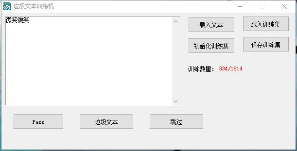
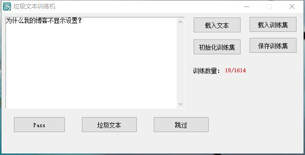
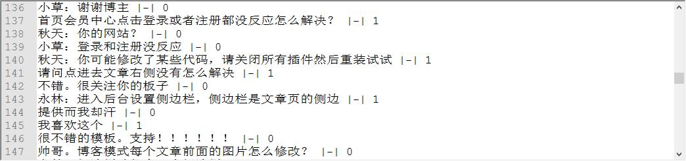

# 智能垃圾回复检测系统

《黑客与画家》一书中介绍了如何检测垃圾邮件的算法，用的贝叶斯算法，统计学的原理来检测出垃圾邮件。于是想法是利用这个算法来检测垃圾回复，因为自己博客中的无关回复太多了。

## 训练机模型

首先下载了自己博客中的回复数据，想以这些数据作为依照，总共1600+回复，然后用程序简单写了个GUI窗口，对这些数据进行评判，判断他们是垃圾回复还是正常的回复。 

如图  

数据小样  

## 总结

这篇文章还是一个半成品，现在还在对数据进行评判中，评判完成后会写个插件来实现检测垃圾回复的功能。

## 6.26更新后续

总共1000样本，不知道是不是数据大少了还是我打分打的太苛刻了？学习出来的结果总是“消极的”，想要出“积极的“结果好难。。看来测试样本要准备不少才行啊。。。准备重写打分机制在试试看。。。无语。
