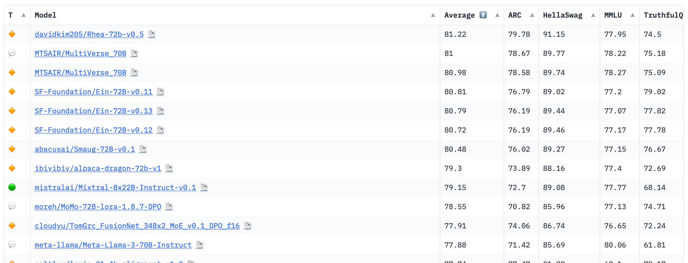
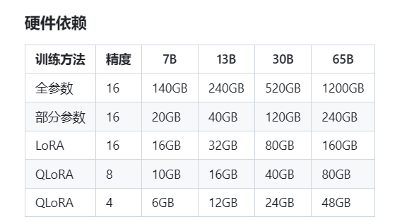
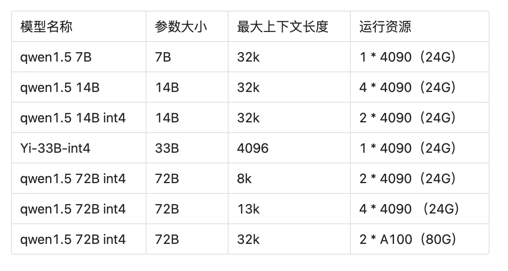

# 网络安全类任务大模型微调个人推荐

大模型哲学：能prompt就prompt，能few shot就few shot，实在不行在微调。

先看榜单，Open LLM 排行榜是 Hugging Face 设立的一个用于评测开放大语言模型的公开榜单。https://huggingface.co/spaces/HuggingFaceH4/open_llm_leaderboard，在这个榜单上目前排名第一的是基于qwen72B微调出来的。

## 常见任务

1. 中文RAG

做RAG用通用模型就可以，在中英文方面用qwen72B效果是不错的，上下文长度32k，command-r-plus也支持中文，模型大小104B，https://huggingface.co/CohereForAI/c4ai-command-r-plus，上下文长度：128K

2. Agent/Function Call

主要是意图指令识别，推荐qwen1.5系列14B和70B，qwen系列对json的支持比较好，llama3也可以试试

3. 网络安全垂直领域对话大模型

主要基于安全社区文章，安全问答，漏洞等数据做网络安全垂直领域大模型

小参数可以4xA100全量微调和lora微调，大参数4xA100可以lora微调

小参数推荐：Mistral 7B，qwen1.5 2B，7B，14B，Mistral模型微调效果非常惊艳，但是词表中文少，中文回答可能字会不够。qwen模型参数大小选择很多，小模型可以在一些没有gpu的机器上运行，模型效果稍弱mistral。

大参数推荐：Mixtral-8x22B 和 qwen72B 和 c4ai-command-r-plus，还有新出的llama3 70B，这类开源的参数级可选择就这么多，llama3还没试，主要推荐c4ai-command-r-plus，效果堪比GPT3.5，再lora预训练和sft一下安全知识，推理能力非常强。也可以基于yi-33B 200k微调对话模型，但是准备的数据需要很多，用33B主要是int4量化后可以在一个4090/3090上跑。

4. 代码类任务模型

用的比较多的是codegen和deepseek-coder，中英文支持都不错，codegen是比较老的模型，但是few shot效果就很不错，few shot效果不错的模型微调起来效果都很好。deepseek-coder是比较新的模型，支持的参数量级最高到33B，应该是开源代码模型里面参数级别最高的，codellama也有30B和70B，效果不太好。

- 代码审计类任务：deepseek-coder 7B，33B，codegen 7B

- 代码解释任务：deepseek-coder 7B，33B，codegen 7B

- 代码修复：deepseek-coder 7B，33B，codegen 7B

参数量级越高效果越好。

5. 日志分析

把日志做成sft数据，类型要多，每类大概500+就有很不错的效果

推荐：c4ai-command-r-plus和llama3 70B

5. 流量分析

可以预训练一些流量数据，然后把流量做成sft数据，类型要多，每类大概200+就有很不错的效果

推荐：c4ai-command-r-plus和llama3 70B

## 微调手段

看资源，GPU够能全量就全量，不够就lora，Qlora。

## 量化效果

fp32=fp16>bf16>ggml w8>ggml w4>=gptq w4>gptq w3

## 量化与显卡占用

基于vllm，2块4090就能跑量化后的72B模型，接近3.5的能力，实现token自由。

## 其他

- 部署：vllm
- 本地环境：ollama，lmstudio