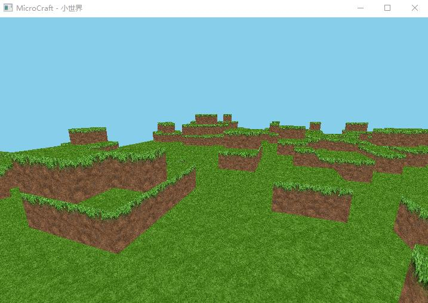

# Opengl 模仿MineCraft (三) 独占鼠标的算法

在3D游戏中，需要视角随鼠标移动变化而变化，这个利用圆的函数和gluLookAt实现即可。但是当鼠标移出窗口外后，处理函数便不在处理了，所以需要独占鼠标。 

但是opengl并没有给出这个api，找了好多资料，都没有找到相关的。于是参考了别人的项目一点一点学到了。 

算法的核心是在定时器中加入下面代码 
```js 
POINT p;
GetCursorPos(&p);
int _x = p.x - (w_left + w_width / 2);
int _y = p.y - (w_top + w_height / 2);
camera.unname2(_x, _y, man);
SetCursorPos(w_left + w_width / 2, w_top + w_height / 2);
```

首先获取鼠标在windows窗口的位置，_x,_y是计算出游戏窗口的中心位置的偏移，将偏移传给camera即可，然后重新设置鼠标位置为中心，就将鼠标永远固定在中心了。 

通过偏移视角移动这个网上资料挺多，就不详解了。最后 
```js 
while (ShowCursor(FALSE) >= 0)
        ShowCursor(FALSE);
```

来隐藏鼠标即可。 



  

