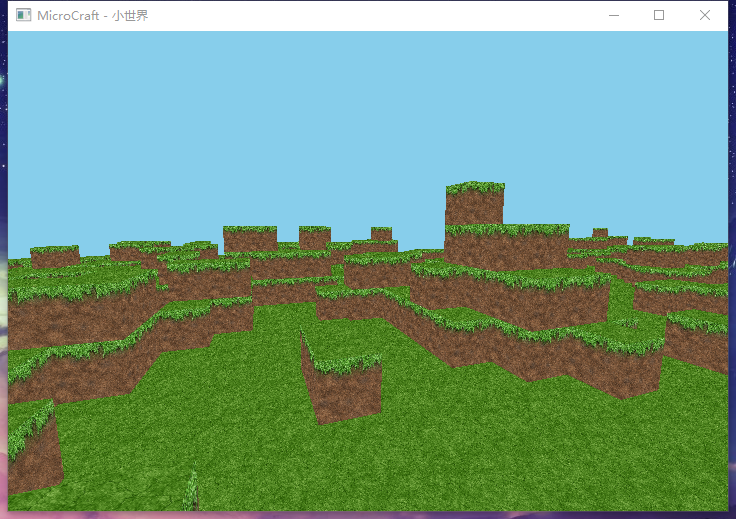
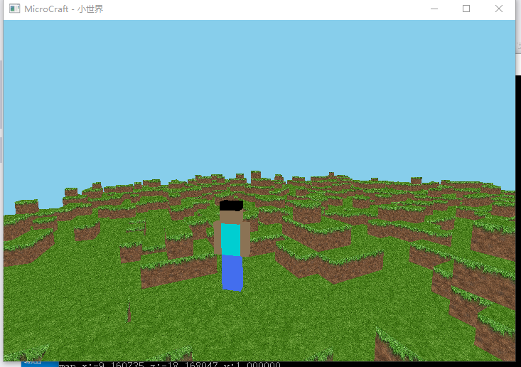

# Opengl 模仿MineCraft (二) 随机地形图

刚开始写的时候思路不是很多，写了一大片代码好多bug，于是在github上找了个参考下，觉得很不错~~ 无论是架构上还是编码规范，然后按照这个参考规范再写的 "小世界" MicroCraft 

拥有第一人称视角和第三人称视角， 

地图生成算法用的柏林噪声，可以看到生成的地图凹凸有秩，看起来还是乱乱的~~ 

但是关于opengl的鼠标锁定到窗口一直不知道怎么实现，各种方法都尝试了都不是很完美。 

  

github上有很多优质的代码，打算考虑找一两个学习下，然后地图还没有光照生成，天空也是填充的天蓝色，准备参考别人的改进 - = 
