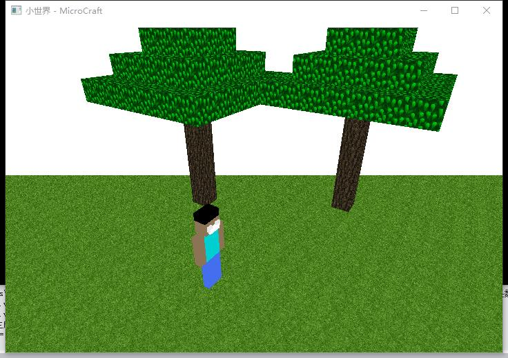
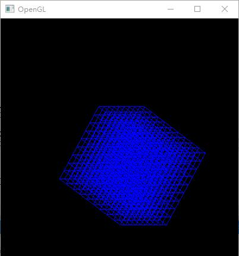

# Opengl 模仿MineCraft

在学游戏编程的时候老师布置的作业就是写一款游戏，我想来想去，觉得模仿我的世界还是很好玩的。 

比较坑的是我们图形学学的opengl现在是过时了的，看网上的教程API都大更新了。只能找到一两个以前的文章的来参考。目前完成图 

**前序**

这也是会是一篇长期更新的文章，因为比较是不断学习不断完善的过程，所以记录一下子，也能给后来人一些参考。 

环境使用的是opengl + vs2017 

编写语言是c++ 

**过程**

既然要模仿MineCraft，应该先学会一些基本操作，我学习的思路是 

1.绘制一个方块 

2.然后多个方块 

3.给方块贴图 

4.绘制出雏形 

5.绘制人物 

6.绘制一些物体 

7.人物动作 

8.鼠标动作 

暂时想到这些，目前我的状态是5，后面学习后在继续更新 

**吐槽坑**

绘制一个方块还是比较容易的，之后就比较坑了，首先弄不清楚opengl的3d坐标系转换，摄像头如何调整，投影图透视图什么的一个一个编译测试，搞了好久天。然后绘制多个方块写算法等等，比较伤脑筋。还有之前说的资料不详细，可能中文不详细，英文又没耐心看 = - 

**未来**

目前模仿的还比较粗糙，后续会加上灯光，雾等等的东西，敬请期待吧 

  

