# Python多线程与协程对比

为了优化pocsuite3的并发效率，考虑引入协程，所以做了如下测试。

# 测试1

## 本地测试

### 测试代码
```python
#!/usr/bin/env python3
# -*- coding: utf-8 -*-
# @Time    : 2019/6/21 10:40 AM
# @Author  : w8ay
# @File    : xiechenga.py

# 协程
import asyncio
import queue
import threading
import time
import aiohttp
import requests


class threadpool:

    def __init__(self, threadnum):
        self.thread_count = self.thread_nums = threadnum
        self.queue = queue.Queue()
        self.isContinue = True
        self.thread_count_lock = threading.Lock()

    def push(self, payload):
        self.queue.put(payload)

    def changeThreadCount(self, num):
        self.thread_count_lock.acquire()
        self.thread_count += num
        self.thread_count_lock.release()

    def stop(self):
        self.isContinue = False

    def run(self):
        th = []
        for i in range(self.thread_nums):
            t = threading.Thread(target=self.scan)
            t.setDaemon(True)
            t.start()
            th.append(t)

        # It can quit with Ctrl-C
        try:
            while 1:
                if self.thread_count > 0 and self.isContinue:
                    time.sleep(0.01)
                else:
                    break
        except KeyboardInterrupt:
            exit("User Quit")

    def scan(self):
        while 1:
            if self.queue.qsize() > 0 and self.isContinue:
                p = self.queue.get()
            else:
                break
            try:
                resp = requests.get(p)
                a = resp.text
            except:
                pass

        self.changeThreadCount(-1)


async def request(url):
    try:
        async with aiohttp.ClientSession() as session:
            async with session.get(url) as resp:
                content = await resp.text()
                a = content
    except:
        pass


def aiorequests(url_list):
    loop = asyncio.get_event_loop()
    tasks = []
    for url in url_list:
        task = loop.create_task(request(url))
        tasks.append(task)
    loop.run_until_complete(asyncio.wait(tasks))


if __name__ == '__main__':
    url_list = ["http://www.baidu.com", "http://www.hacking8.com", "http://www.seebug.org", "https://0x43434343.com/",
                "https://lorexxar.cn/", "https://0x48.pw/", "https://github.com"]
    print("测试url:{}".format(repr(url_list)))
    url_list = url_list * 100
    print("数据总量:{}".format(len(url_list)))

    start_time = time.time()
    aiorequests(url_list)
    print("协程 cost time", time.time() - start_time)

    start_time = time.time()
    http_pool = threadpool(50)
    for i in url_list:
        http_pool.push(i)
    http_pool.run()
    print("多线程 cost time", time.time() - start_time)

```

### 系统及相关配置环境

`Mac Mojave 10.14.5` `Python 3.7.2`
``` 
requests          2.21.0    
aiohttp           3.5.4

```

其他：线程数 50

带宽


### 数据总量：210

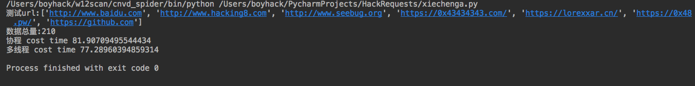

两者速度差不多，因为线程数量是50，可能时间都花在了启动线程上面。

### 数据总量：700

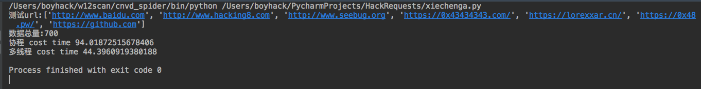
``` 
测试url:['http://www.baidu.com', 'http://www.hacking8.com', 'http://www.seebug.org', 'https://0x43434343.com/', 'https://lorexxar.cn/', 'https://0x48.pw/', 'https://github.com']
数据总量:700
协程 cost time 94.01872515678406
多线程 cost time 44.3960919380188

```

### 数据总量：3500

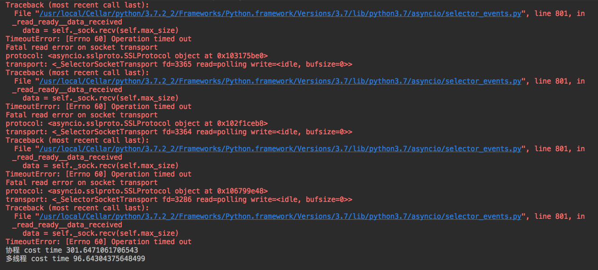
```bash 
测试url:['http://www.baidu.com', 'http://www.hacking8.com', 'http://www.seebug.org', 'https://0x43434343.com/', 'https://lorexxar.cn/', 'https://0x48.pw/', 'https://github.com']
数据总量:3500
Fatal read error on socket transport
protocol: <asyncio.sslproto.SSLProtocol object at 0x105ad5ac8>
transport: <_SelectorSocketTransport fd=604 read=polling write=<idle, bufsize=0>>
Traceback (most recent call last):
  File "/usr/local/Cellar/python/3.7.2_2/Frameworks/Python.framework/Versions/3.7/lib/python3.7/asyncio/selector_events.py", line 801, in _read_ready__data_received
    data = self._sock.recv(self.max_size)
TimeoutError: [Errno 60] Operation timed out
Fatal read error on socket transport
protocol: <asyncio.sslproto.SSLProtocol object at 0x105a71160>
transport: <_SelectorSocketTransport fd=465 read=polling write=<idle, bufsize=0>>
Traceback (most recent call last):
  File "/usr/local/Cellar/python/3.7.2_2/Frameworks/Python.framework/Versions/3.7/lib/python3.7/asyncio/selector_events.py", line 801, in _read_ready__data_received
    data = self._sock.recv(self.max_size)
TimeoutError: [Errno 60] Operation timed out
Fatal read error on socket transport
protocol: <asyncio.sslproto.SSLProtocol object at 0x105dbb390>
transport: <_SelectorSocketTransport fd=583 read=polling write=<idle, bufsize=0>>
Traceback (most recent call last):
  File "/usr/local/Cellar/python/3.7.2_2/Frameworks/Python.framework/Versions/3.7/lib/python3.7/asyncio/selector_events.py", line 801, in _read_ready__data_received
    data = self._sock.recv(self.max_size)
TimeoutError: [Errno 60] Operation timed out
Fatal read error on socket transport
protocol: <asyncio.sslproto.SSLProtocol object at 0x1037707f0>
transport: <_SelectorSocketTransport fd=179 read=polling write=<idle, bufsize=0>>
Traceback (most recent call last):
  File "/usr/local/Cellar/python/3.7.2_2/Frameworks/Python.framework/Versions/3.7/lib/python3.7/asyncio/selector_events.py", line 801, in _read_ready__data_received
    data = self._sock.recv(self.max_size)
TimeoutError: [Errno 60] Operation timed out
Fatal read error on socket transport
protocol: <asyncio.sslproto.SSLProtocol object at 0x103175be0>
transport: <_SelectorSocketTransport fd=3365 read=polling write=<idle, bufsize=0>>
Traceback (most recent call last):
  File "/usr/local/Cellar/python/3.7.2_2/Frameworks/Python.framework/Versions/3.7/lib/python3.7/asyncio/selector_events.py", line 801, in _read_ready__data_received
    data = self._sock.recv(self.max_size)
TimeoutError: [Errno 60] Operation timed out
Fatal read error on socket transport
protocol: <asyncio.sslproto.SSLProtocol object at 0x102f1ceb8>
transport: <_SelectorSocketTransport fd=3364 read=polling write=<idle, bufsize=0>>
Traceback (most recent call last):
  File "/usr/local/Cellar/python/3.7.2_2/Frameworks/Python.framework/Versions/3.7/lib/python3.7/asyncio/selector_events.py", line 801, in _read_ready__data_received
    data = self._sock.recv(self.max_size)
TimeoutError: [Errno 60] Operation timed out
Fatal read error on socket transport
protocol: <asyncio.sslproto.SSLProtocol object at 0x106799e48>
transport: <_SelectorSocketTransport fd=3286 read=polling write=<idle, bufsize=0>>
Traceback (most recent call last):
  File "/usr/local/Cellar/python/3.7.2_2/Frameworks/Python.framework/Versions/3.7/lib/python3.7/asyncio/selector_events.py", line 801, in _read_ready__data_received
    data = self._sock.recv(self.max_size)
TimeoutError: [Errno 60] Operation timed out
协程 cost time 301.6471061706543
多线程 cost time 96.64304375648499

```

可以看到多线程是优于协程。

### 修改后代码，数据总量700

协程运行时出现了部分报错，主要在ssl的读取写入方面，于是尝试限定协程的并发数量，加入了协程信号量用于限定协程并发数量。
```python 
#!/usr/bin/env python3
# -*- coding: utf-8 -*-
# @Time    : 2019/6/21 10:40 AM
# @Author  : w8ay
# @File    : xiechenga.py

# 协程
import asyncio
import queue
import threading
import time
import aiohttp
import requests


class threadpool:

    def __init__(self, threadnum):
        self.thread_count = self.thread_nums = threadnum
        self.queue = queue.Queue()
        self.isContinue = True
        self.thread_count_lock = threading.Lock()

    def push(self, payload):
        self.queue.put(payload)

    def changeThreadCount(self, num):
        self.thread_count_lock.acquire()
        self.thread_count += num
        self.thread_count_lock.release()

    def stop(self):
        self.isContinue = False

    def run(self):
        th = []
        for i in range(self.thread_nums):
            t = threading.Thread(target=self.scan)
            t.setDaemon(True)
            t.start()
            th.append(t)

        # It can quit with Ctrl-C
        try:
            while 1:
                if self.thread_count > 0 and self.isContinue:
                    time.sleep(0.01)
                else:
                    break
        except KeyboardInterrupt:
            exit("User Quit")

    def scan(self):
        while 1:
            if self.queue.qsize() > 0 and self.isContinue:
                p = self.queue.get()
            else:
                break
            try:
                resp = requests.get(p)
                a = resp.text
            except:
                pass

        self.changeThreadCount(-1)


async def request(url, semaphore):
    async with semaphore:
        try:
            async with aiohttp.ClientSession() as session:
                async with session.get(url) as resp:
                    content = await resp.text()
                    a = content
        except:
            pass


def aiorequests(url_list):
    loop = asyncio.get_event_loop()
    semaphore = asyncio.Semaphore(200)
    tasks = []
    for url in url_list:
        task = loop.create_task(request(url, semaphore))
        tasks.append(task)
    loop.run_until_complete(asyncio.wait(tasks))


if __name__ == '__main__':
    url_list = ["http://www.baidu.com", "http://www.hacking8.com", "http://www.seebug.org", "https://0x43434343.com/",
                "https://lorexxar.cn/", "https://0x48.pw/", "https://github.com"]
    print("测试url:{}".format(repr(url_list)))
    url_list = url_list * 100
    print("数据总量:{}".format(len(url_list)))

    start_time = time.time()
    aiorequests(url_list)
    print("协程 cost time", time.time() - start_time)

    start_time = time.time()
    http_pool = threadpool(50)
    for i in url_list:
        http_pool.push(i)
    http_pool.run()
    print("多线程 cost time", time.time() - start_time)

```

返回结果如下
```bash 
测试url:['http://www.baidu.com', 'http://www.hacking8.com', 'http://www.seebug.org', 'https://0x43434343.com/', 'https://lorexxar.cn/', 'https://0x48.pw/', 'https://github.com']
数据总量:700
Fatal read error on socket transport
protocol: <asyncio.sslproto.SSLProtocol object at 0x1093470f0>
transport: <_SelectorSocketTransport fd=129 read=polling write=<idle, bufsize=0>>
Traceback (most recent call last):
  File "/usr/local/Cellar/python/3.7.2_2/Frameworks/Python.framework/Versions/3.7/lib/python3.7/asyncio/selector_events.py", line 801, in _read_ready__data_received
    data = self._sock.recv(self.max_size)
TimeoutError: [Errno 60] Operation timed out
Fatal read error on socket transport
protocol: <asyncio.sslproto.SSLProtocol object at 0x109181a90>
transport: <_SelectorSocketTransport fd=84 read=polling write=<idle, bufsize=0>>
Traceback (most recent call last):
  File "/usr/local/Cellar/python/3.7.2_2/Frameworks/Python.framework/Versions/3.7/lib/python3.7/asyncio/selector_events.py", line 801, in _read_ready__data_received
    data = self._sock.recv(self.max_size)
TimeoutError: [Errno 60] Operation timed out
协程 cost time 125.1102237701416
多线程 cost time 37.17827892303467

```

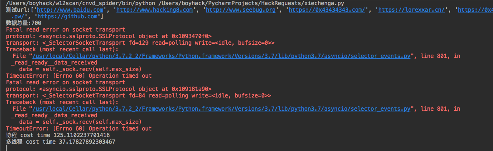

### 数据总量：7000
```
测试url:['http://www.baidu.com', 'http://www.hacking8.com', 'http://www.seebug.org', 'https://0x43434343.com/', 'https://lorexxar.cn/', 'https://0x48.pw/', 'https://github.com']
数据总量:7000
协程 cost time 820.6436007022858
多线程 cost time 197.8958179950714

```

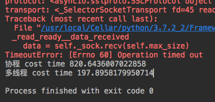

## 远程测试

服务商：vultr 

由于是国外服务器，测试地址换成了 baidu github google 同时将线程数量调整到20

### 测试代码

测试代码和上面修改后代码一致。

### 数据总量 30
```
root@vultr:~# python3 test.py
测试url:['http://www.baidu.com', 'http://github.com', 'http://google.com']
数据总量:30
协程 cost time 6.938291788101196
多线程 cost time 0.7714250087738037
root@vultr:~#

```

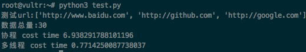

奇怪的是在把baidu去掉后


``` 
root@vultr:~# python3 test.py
测试url:['http://github.com', 'http://google.com']
数据总量:20
协程 cost time 0.5997216701507568
多线程 cost time 0.6937429904937744

```

两者近乎一样

### 数据总量 600

当测试url中不含baidu时
``` 
root@vultr:~# python3 test.py
测试url:['http://github.com', 'http://google.com']
数据总量:600
协程 cost time 3.049583673477173
多线程 cost time 12.464868545532227

```


发现协程的效率变高了。

### 数据总量18000

先将baidu去掉，将数据总量增加到了18000

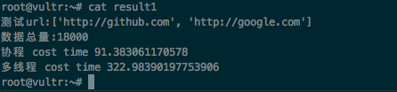
```bash 
root@vultr:~# cat result1
测试url:['http://github.com', 'http://google.com']
数据总量:18000
协程 cost time 91.383061170578
多线程 cost time 322.98390197753906
root@vultr:~#

```

发现协程效率似乎更高。

加入baidu.com后，程序运行了将近50分钟，仍然没有跑完。。。

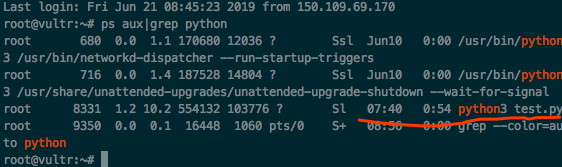

最后跑完发现

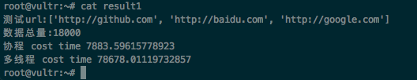

多线程却是足足慢了10倍。

## Go语言测试

为了更全面的对比协程，也用golang写了一个demo用作对比，代码如下, 限定了协程并发200
```go 
package main

import (
    "crypto/tls"
    "fmt"
    "io/ioutil"
    "net/http"
    "sync"
    "time"
)

func Get(url string,ch chan int) (content []byte, err error) {
    transCfg := &http.Transport{
        TLSClientConfig: &tls.Config{InsecureSkipVerify: true}, // disable verify
    }

    Client := &http.Client{
        Timeout:   100 * time.Second,
        Transport: transCfg,
    }
    req, err := http.NewRequest("GET", url, nil)

    if err != nil {
        return nil, err
    }
    resp, err2 := Client.Do(req)
    if err2 != nil {
        return nil, err
    }
    defer resp.Body.Close()
    bytes, _ := ioutil.ReadAll(resp.Body)
    <-ch

    return bytes, nil
}

func main() {
    var s1 = [...]string{"http://www.baidu.com", "http://www.hacking8.com", "http://www.seebug.org", "https://0x43434343.com/", "https://0x48.pw/", "https://lorexxar.cn/", "https://github.com"}
    number := 100 // 倍数
    fmt.Printf("数据总量%d\n", number*len(s1))
    wg := sync.WaitGroup{}
    t1 := time.Now() // get current time
    ch := make(chan int, 200)

    for i := 0; i < number; i++ {
        for _, v := range s1 {
            wg.Add(1)
            ch <- 1
            go func(url string,c chan int) {
                defer wg.Done()
                //fmt.Println(url)
                _, err := Get(url,c)
                if err != nil{
                    fmt.Println(err)
                }
                //fmt.Println(len(content))
            }(v,ch)
        }
        //fmt.Printf("c[%d]: %d\n", i, c[i])
    }
    wg.Wait()
    elapsed := time.Since(t1)
    fmt.Println("elapsed: ", elapsed)

}

```

### 数据总量 700

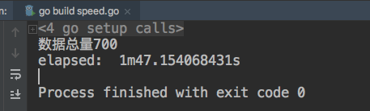

对比python的协程，似乎更慢了一些。。

### 数据总量 7000

还没有跑出来。。总之很慢。。

# 测试2

晚上和公司大佬们讨论了下，同时又发现了一个奇怪的现象，有的网址用协程很快，有的网址用协程很慢，最后制定了一个全面的测试逻辑。

  * 将源码分离为协程测试脚本与线程测试脚本
  * 在一个vps上进行测试，公司网络波动比较大
  * 协程的信号量与线程的数目也是控制变量
  * go语言重写为生产者消费者模型


## 单网址测试

### 本地测试

同样使用测试1中的代码，只对github.com一个网址进行测试。先测试协程，并设置协程并发为200。

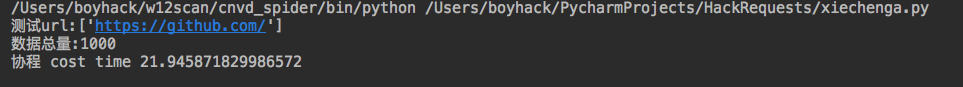

测试1000个网站协程耗时21s

同样在使用多线程，设置线程总数为200

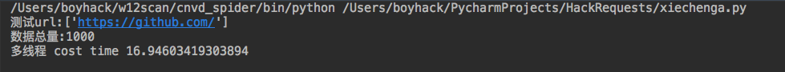

测试1000个网站多线程耗时16s

再次调整为5000个网址，协程并发为200。

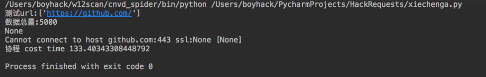

测试5000个网站协程耗时133s

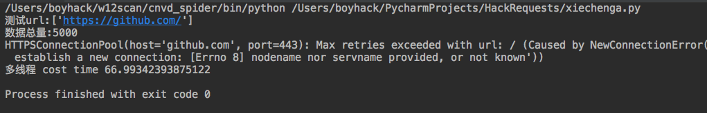

测试5000个网站多线程耗时66s

### 远程测试

为了排除公司网络波动造成的影响，在腾讯云1G1H1M的centos服务器上进行相同测试。


同样测试1000个网址，时间只需要18s

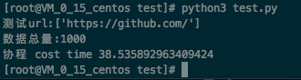

同样的，测试1000个网址协程竟需要38s，可能怀疑协程并发量上面设置了上限的问题，将协程并发量改大了一点，改为8000，结果耗时更长了。

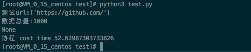

### go语言测试
```go
package main

import (
    "crypto/tls"
    "fmt"
    "io/ioutil"
    "net/http"
    "sync"
    "time"
)

func Get2(url string) (content []byte, err error) {
    transCfg := &http.Transport{
        TLSClientConfig: &tls.Config{InsecureSkipVerify: true}, // disable verify
    }

    Client := &http.Client{
        Timeout:   100 * time.Second,
        Transport: transCfg,
    }
    req, err := http.NewRequest("GET", url, nil)

    if err != nil {
        return nil, err
    }
    resp, err2 := Client.Do(req)
    if err2 != nil {
        return nil, err
    }
    defer resp.Body.Close()
    bytes, _ := ioutil.ReadAll(resp.Body)

    return bytes, nil
}

func main() {
    var s1 = [...]string{"https://github.com"}
    number := 1000 // 倍数
    fmt.Printf("数据总量%d\n", number*len(s1))
    wg := sync.WaitGroup{}
    t1 := time.Now() // get current time
    consumer := make(chan string,20)

    // 消费者
    for i := 0; i < 1000; i++ {
        go func() {
            for {
                url := <-consumer
                _, err := Get2(url)
                if err != nil {
                    fmt.Println(err)
                }
                wg.Done()
            }
        }()
    }

    // 生产者
    for i := 0; i < number; i++ {
        for _, v := range s1 {
            wg.Add(1)
            consumer <- v
        }
    }
    wg.Wait()
    elapsed := time.Since(t1)
    fmt.Println("elapsed: ", elapsed)

}

```

不明白同样的网站，效率咋这么低。

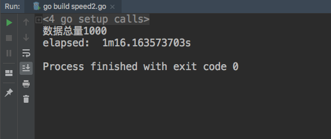

## 多网址测试

测试环境在vultr debian服务器上，只加了两个网站 `url_list = ["http://github.com","http://google.com"]`

协程和多线程是分开测试的，效果如图

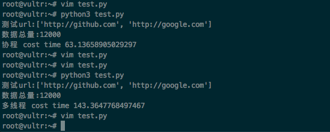
``` 
测试url:['http://github.com', 'http://google.com']
数据总量:12000
协程 cost time 63.13658905029297

测试url:['http://github.com', 'http://google.com']
数据总量:12000
多线程 cost time 143.3647768497467

```

协程效果比多线程好一点。

此时我们在增加几个网站 ,效果如下
``` 
python3 test.py
测试url:['http://github.com', 'http://google.com', 'https://0x43434343.com/', 'https://lorexxar.cn/']
数据总量:4000
协程 cost time 20.34762692451477

python3 test.py
测试url:['http://github.com', 'http://google.com', 'https://0x43434343.com/', 'https://lorexxar.cn/']
数据总量:4000
多线程 cost time 58.68550777435303

```

# 总结

一开始不明白为什么对于不同网站，协程与线程间差距会如此之大，我只能做一个粗略的大致统计，不具有权威性。

> 如果网站访问快，协程速度会优于线程，如果网站访问速度慢的话，线程比协程表现好。

HTTP协程底层原理是IO多路复用，参考 https://www.zhihu.com/question/20511233

如果网站访问较快，协程不需要什么消耗，因为是单线程的，而多线程会消耗一些资源，但是如果网站访问比较慢的话，协程也会在连接的时候卡住，因为是单线程的，所以也会一直卡住，而多线程就没有这种烦恼了。

最后，基于各种条件，感觉pocsuite3引入协程还不太成熟，就暂时搁置了
