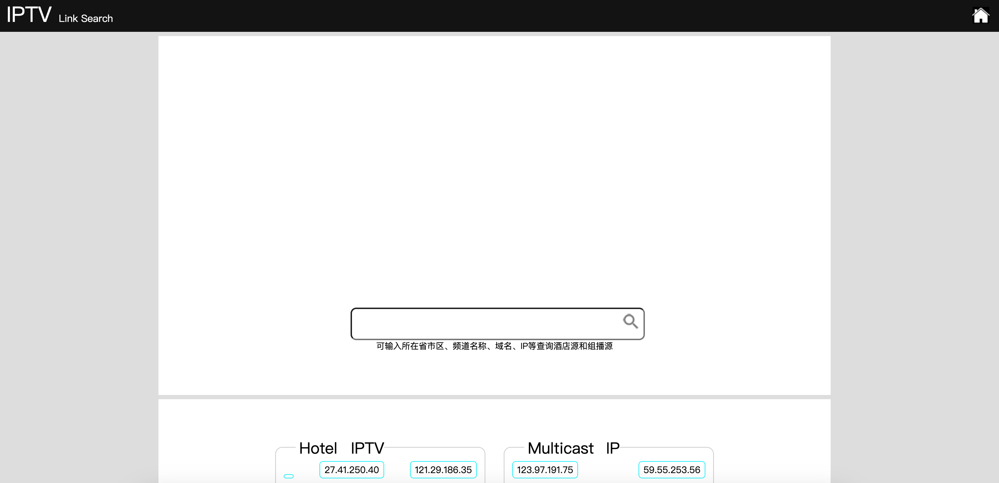
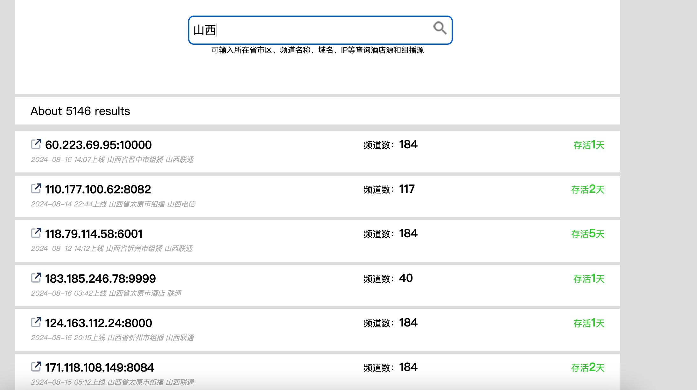
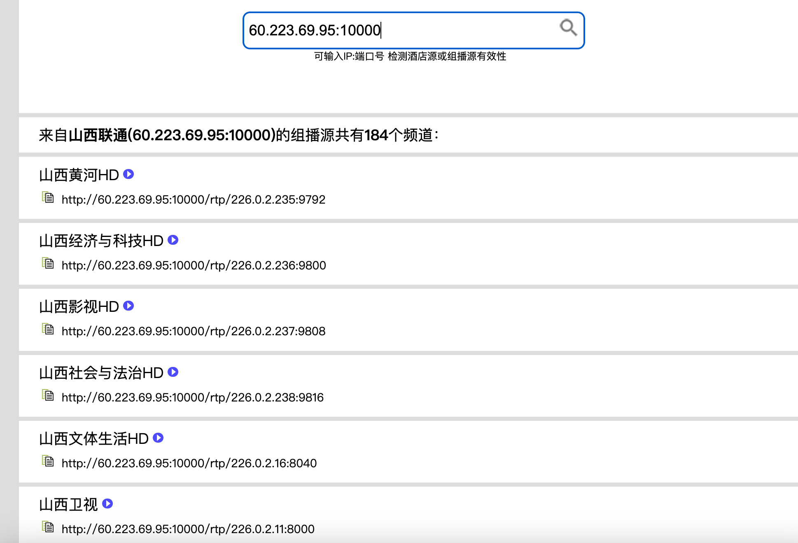
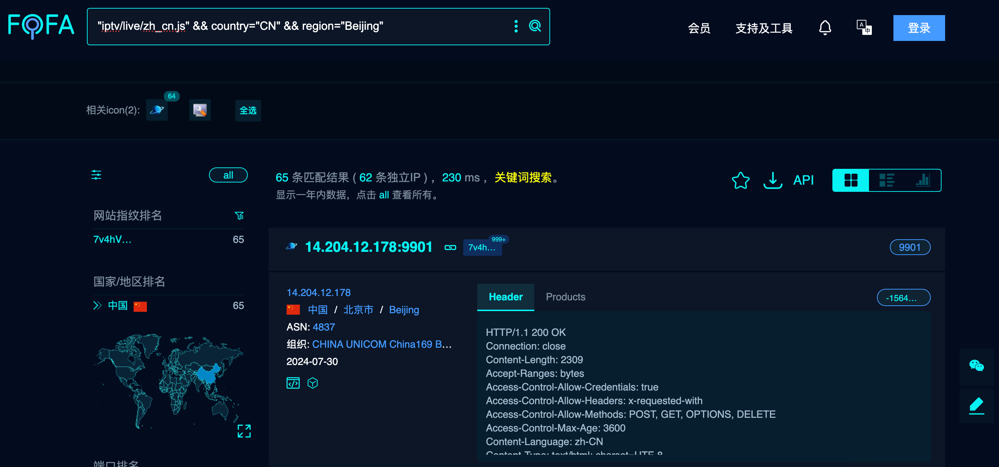
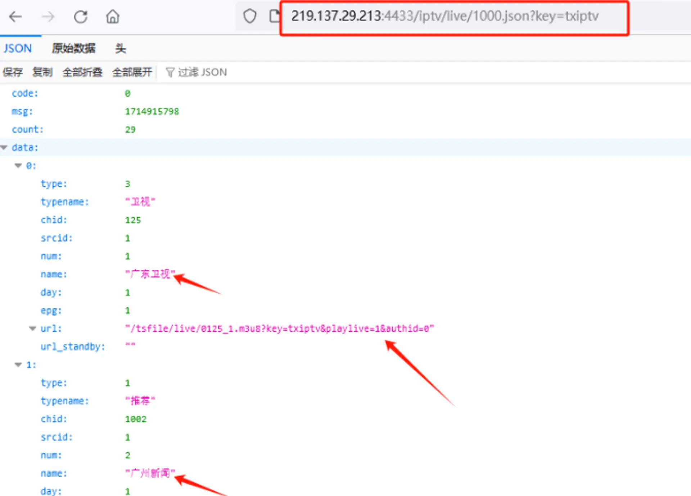

# 电视直播源研究
给家里的电视安装了tvbox，配置了源就可以免费看电视了，好奇它的原理，找了些资料研究了一下。

## 电视源搜索引擎

有两个电视源的搜索引擎，可输入所在省市区、频道名称、域名、IP等查询酒店源和组播源

- http://tonkiang.us/hoteliptv.php
- https://www.foodieguide.com/iptvsearch/hoteliptv.php




例如搜索山西，能找到山西ip的iptv地址



ip频道详情



## 网络空间搜索引擎

通常情况下，IPTV平台的响应头是定制的,例如搜索`iptv/live/zh_cn.js`再设定区域，可以获取酒店源IP并下载播放列表。



然后通过访问IP+/iptv/live/1000.json?key=txiptv获取节目列表内容的json。可以通过正则表达式或代码提取节目名称和链接制作成节目列表。可以添加限定条件来获取需要的节目，如限定区域。



python伪代码

```python
    async def fofa_task(self):
        citys = ['beijing', 'tianjin', 'hebei', 'shanxi', 'neimenggu', 'liaoning', 'jilin', 'heilongjiang', 'shanghai', 'jiangsu', 'zhejiang', 'anhui', 'fujian', 'jiangxi', 'shandong', 'henan', 'hubei', 'hunan', 'guangdong', 'hainan', 'chongqing', 'sichuan', 'guizhou', 'yunnan', 'shanxi', 'gansu', 'qinghai', 'ningxia', 'xinjiang', 'xizang']
        base_url = 'https://fofa.info/result?qbase64='
        key = ['"iptv/live/zh_cn.js" && country="CN" && region="' + city + '"' for city in citys]
        urls = [base_url + base64.b64encode(key[i].encode('utf-8')).decode('utf-8') for i in range(len(key))]
        ips = []
        for url in urls:
            print(f'正在访问{url},请稍等...')
            ip = await self.fofa(url)
            print(f'获取到{len(ip)}个ip')
            ips += ip
        return ips

```

## 合并其他源

```python
urls = [
    'https://raw.githubusercontent.com/iptv-org/iptv/master/streams/cn.m3u',
    'https://raw.githubusercontent.com/joevess/IPTV/main/iptv.m3u8',
    'https://raw.githubusercontent.com/Supprise0901/TVBox_live/main/live.txt',
    'https://raw.githubusercontent.com/Guovin/TV/gd/result.txt',  # 每天自动更新1次
    'https://raw.githubusercontent.com/ssili126/tv/main/itvlist.txt',  # 每天自动更新1次
    'https://m3u.ibert.me/txt/fmml_ipv6.txt',
    'https://m3u.ibert.me/txt/ycl_iptv.txt',
    'https://m3u.ibert.me/txt/y_g.txt',
    'https://m3u.ibert.me/txt/j_home.txt',
    'https://raw.githubusercontent.com/gaotianliuyun/gao/master/list.txt',
    'https://gitee.com/xxy002/zhiboyuan/raw/master/zby.txt',
    'https://raw.githubusercontent.com/mlvjfchen/TV/main/iptv_list.txt',  # 每天早晚各自动更新1次 2024-06-03 17:50
    'https://raw.githubusercontent.com/fenxp/iptv/main/live/ipv6.txt',  # 1小时自动更新1次11:11 2024/05/13
    'https://raw.githubusercontent.com/fenxp/iptv/main/live/tvlive.txt',  # 1小时自动更新1次11:11 2024/05/13
    'https://raw.githubusercontent.com/zwc456baby/iptv_alive/master/live.txt',  # 每天自动更新1次 2024-06-24 16:37
    'https://gitlab.com/p2v5/wangtv/-/raw/main/lunbo.txt',
    'https://raw.githubusercontent.com/PizazzGY/TVBox/main/live.txt',  # ADD 2024-07-22 13:50
    'https://raw.githubusercontent.com/wwb521/live/main/tv.m3u',  # ADD 2024-08-05 每10天更新一次
    'https://gitcode.net/MZ011/BHJK/-/raw/master/BHZB1.txt',  # ADD 2024-08-05
    'http://47.99.102.252/live.txt',  # ADD 2024-08-05
    'http://ttkx.live:55/lib/kx2024.txt',  # ADD 2024-08-11 每天更新3次
    'https://raw.githubusercontent.com/vbskycn/iptv/master/tv/iptv4.txt',  # ADD 2024-08-12 每天更新3次
    'http://117.72.68.25:9230/latest.txt',  # ADD 2024-08-13
    'https://raw.githubusercontent.com/YueChan/Live/main/IPTV.m3u',  # ADD 2024-08-14 不定期，月5次左右
    'http://xhztv.top/v6.txt',  # ADD 2024-08-14
    'https://raw.githubusercontent.com/zzmaze/iptv/main/iptv.txt',  # ADD 2024-08-14 酒店源4小时自动更新一次，质量一般
    'https://gitlab.com/tvtg/vip/-/raw/main/log.txt'  # ADD 2024-08-10
    # '',
    # ''
]
```

测速代码

```python
class Downloader:
    def __init__(self, url):
        self.url = url
        self.startTime = time.time()
        self.recive = 0
        self.endTime = None

    def getSpeed(self):
        if self.endTime and self.recive != -1:
            return self.recive / (self.endTime - self.startTime)
        else:
            return -1


def downloadTester(downloader: Downloader):
    chunck_size = 10240
    try:
        resp = urlopen(downloader.url, timeout=5)
        # max 5s
        while time.time() - downloader.startTime < 5:
            chunk = resp.read(chunck_size)
            if not chunk:
                break
            downloader.recive = downloader.recive + len(chunk)
        resp.close()
    except BaseException as e:
        downloader.recive = -1
    downloader.endTime = time.time()


def speed_level(speed):
    if speed > 1024 * 1024:
        return 'excellent', 4
    elif speed > 1024 * 500:
        return 'wonderful', 3
    elif speed > 1024 * 250:
        return 'good', 2
    elif speed > 1024 * 100:
        return 'useful', 1
    else:
        return 'bad', 0

def request(line: str):
    name, url = line.split(",")
    item = Item(name, url)
    if url.lower().endswith('.flv'):
        item.download_url = url
    elif "rtp" in url or "udp" in url:
        item.download_url = url
    else:
        ss = getStreamUrl(url)
        if len(ss) > 0:
            item.download_url = ss[0]
    if item.download_url == "":
        return False
    downloader = Downloader(item.download_url)
    downloadTester(downloader)
    if downloader.recive == -1:
        return False
    speed = downloader.getSpeed()
    speedname, speedlevel = speed_level(speed)
    print("%s:%s speed: %.2f Kb/s, %s" % (item.name, item.url, speed / 1024, speedname))
    if speedlevel >= 2:
        item.speed = speed
        return item
    return False
  
def request(line: str):
    name, url = line.split(",")
    item = Item(name, url)
    if url.lower().endswith('.flv'):
        item.download_url = url
    elif "rtp" in url or "udp" in url:
        item.download_url = url
    else:
        ss = getStreamUrl(url)
        if len(ss) > 0:
            item.download_url = ss[0]
    if item.download_url == "":
        return False
    downloader = Downloader(item.download_url)
    downloadTester(downloader)
    if downloader.recive == -1:
        return False
    speed = downloader.getSpeed()
    speedname, speedlevel = speed_level(speed)
    print("%s:%s speed: %.2f Kb/s, %s" % (item.name, item.url, speed / 1024, speedname))
    if speedlevel >= 2:
        item.speed = speed
        return item
    return False

```

## 参考

- https://github.com/fanmingming/live/tree/main
- https://github.com/kimwang1978/collect-tv-txt