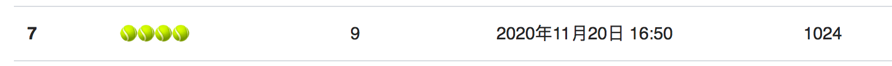
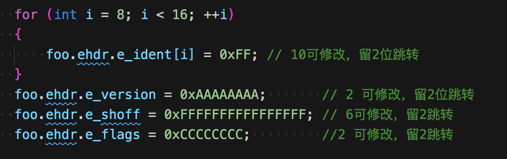
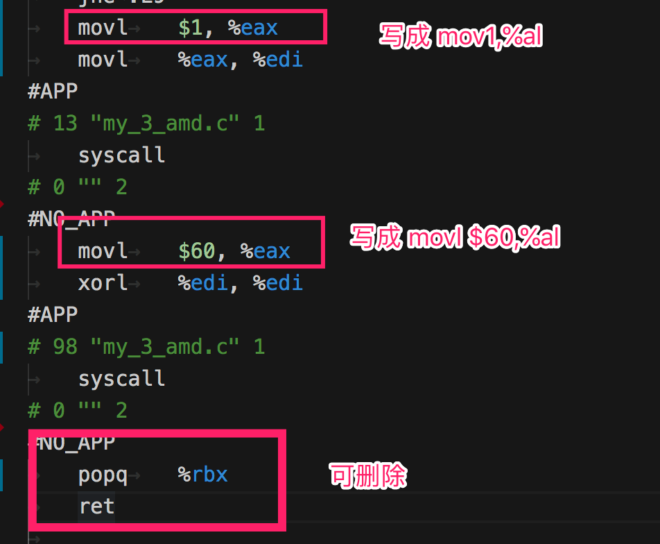
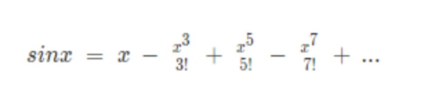
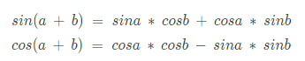

# 记一次腾讯极客技术挑战-最小的输出自身MD5值的程序

只允许64位的ELF可执行程序，总共有三个赛道，x86-64，arm64，mips64。不太熟悉汇编，三个赛道基本上都是用gcc来完成，辅助少量的汇编代码修改。

最终成绩

x86-64 472字节 第15名


arm64 816字节 第8名


mips63 1024字节 第7名



一开始有想过可否用碰撞实现，研究了几天后发现毫无头绪，就先用普通的方法尝试啦。

## x86-64

主要几个点

1. 不依赖任何库进行独立编译，对于程序`打印`和`退出`的操作，用内联汇编调用系统中断完成，计算md5算法中需要用到绝对值计算和sin函数，都diao y

2. 直接在内存中读取自身，省掉了读取文件操作的步骤

3. 计算md5的时候，根据md5算法的原理，以每64字节为一块进行计算，下一块的hash是根据上一块的hash算出的，我们可以直接算出第一块至倒数第二块的hash，硬编码写入，程序只用进行最后一次块的计算，节省体积。

4. 对elf header处理，elf header有些标识位置可以利用

可以根据指令大小来做对应填充
5. 对汇编指令的简单处理
    - 先用gcc生成汇编文件，然后对它做一些简单的处理
    - 一个简单处理的脚本>
    ```
    sed -i "s/.section.*//g" my_3_amd.s
    sed -i "s/.ident.*//g" my_3_amd.s
    sed -i "s/pushq.*//g" my_3_amd.s
    sed -i "s/.size    _start.*//g" my_3_amd.s
    sed -i "s/.align 4//g" my_3_amd.s
    sed -i "s/movl    \$1, %edx/mov \$1, %dl/g" my_3_amd.s
    sed -i "s/.align 16//g" my_3_amd.s
    sed -i "s/movsbq    %r11b, %r11//g" my_3_amd.s
    sed -i "s/movslq    %ecx, %rcx//g" my_3_amd.s
    ```
6. 手动处理
    1. 开头的`xorl %ecx, %ecx`可删除，程序初始化时寄存器默认会为0
    2. 


### 程序参考源码
```c 
#define SYS_write 1
#define SYS_exit 60
#define LEFTROTATE(x, c) (((x) << (c)) | ((x) >> (32 - (c))))

static void write(char *d, int l)
{
    __asm__ volatile("syscall"
                     :
                     : "a"(SYS_write), "D"(1), "S"((long)d), "d"(l)
                     : "rcx", "r11", "memory");
}

static long double fsin_my(long double a)
{
    long double res;
    asm __volatile__("fsin;\n\t"
                         "fabs;\n\t"
                         : "=t"(res)
                         : "0"(a)
                         : "memory");
    return res;
}
void _start(void)
{

    unsigned char *msg = (unsigned char *)0x400000;
    const short initial_len =466; // 固定 需要填写
    const short new_len = ((((initial_len + 8) / 64) + 1) * 64) - 8;
    short offset = new_len - (new_len % 64);      // 最后一个块的位置 通过计算获得
    static unsigned int digest[4] = {1, 2, 3, 4}; // 需要填写
    msg[initial_len] = 0x80;
    *(long *)(msg + new_len) = initial_len << 3; //固定 需要填写 long 改成 char能节省4字节，未测试
    unsigned int *w = (unsigned int *)(msg + offset);

    unsigned int a = digest[0];
    unsigned int b = digest[1];
    unsigned int c = digest[2];
    unsigned int d = digest[3];

    for (int i= 0; i < 64; i++)
    {
        unsigned int f;
        int g;
        if (i < 16)
        {
            f = (b & c) | ((~b) & d);
            g = i;
        }
        else if (i < 32)
        {
            f = (d & b) | ((~d) & c);
            g = (5 * i + 1) % 16;
        }
        else if (i < 48)
        {
            f = b ^ c ^ d;
            g = (3 * i + 5) % 16;
        }
        else
        {
            f = c ^ (b | (~d));
            g = (7 * i) % 16;
        }
        long double t1 = fsin_my(i + 1);
        const unsigned long long t2 = (unsigned long long)1<<32;
        unsigned int k = (unsigned int)(t2 * t1);
        f += a + k + w[g];
        a = d;
        d = c;
        c = b;
        const char r[] = {7, 12, 17, 22, 5, 9, 14, 20, 4, 11, 16, 23, 6, 10, 15, 21};
        b = b + LEFTROTATE(f, r[i / 16 * 4 + i % 4]);
    }

    digest[0] += a;
    digest[1] += b;
    digest[2] += c;
    digest[3] += d;
    unsigned char *md = (unsigned char *)&digest[0];

    char x[32];
    for (int i = 0; i < 32; i++)
    {
        int a = (md[i / 2] >> (4 * (1 - i % 2))) & 0xF;
        char c = a >= 10 ? a + ('a' - 10) : a + '0';
        x[i] = c;
    }
    write(&x, 32);


    __asm__ volatile("syscall"
                     :
                     : "a"(SYS_exit), "D"(0)
                     : "rcx", "r11", "memory");
}

```

### 编译流程
- 生成汇编代码
    ```
    CFLAGS="-static -Os -Wl,--omagic -ffunction-sections -Wl,--gc-sections -nostartfiles -nodefaultlibs -nostdlib -nostdinc -fomit-frame-pointer -fno-stack-protector -fno-unwind-tables -fno-asynchronous-unwind-tables -fno-unroll-loops -fmerge-all-constants -fno-ident -finline-functions-called-once -I ./ -fdata-sections"

    gcc  $CFLAGS my_3_amd.c -S -mavx -msse -mavx2 -ffast-math # -fverbose-asm
    ./change_asm.sh  # 自动优化汇编代码那部分
    ```

- 手动优化汇编代码
- 汇编生成二进制
    ```
    CFLAGS="-static -Os -Wl,--omagic -ffunction-sections -Wl,--gc-sections -nostartfiles -nodefaultlibs -nostdlib -nostdinc -Wl,--build-id=none -fomit-frame-pointer -fno-stack-protector -fno-unwind-tables -fno-asynchronous-unwind-tables -fno-unroll-loops -fmerge-all-constants -fno-ident  -finline-functions-called-once -I ./ "
    gcc   $CFLAGS  my_3_amd.s  -o test_amd64
    objdump -S test_amd64
    strip -s test_amd64
    # strip 减少 1088-704=384

    ../../sstrip test_amd64
    # sstri 减少 704-492=212

    ls -l|grep test
    ./test_amd64
    echo
    md5sum test_amd64

    ```
- 改造elf
    ```
    rm selfmd5-test
    ../../elftoc -E test_amd64 > selfmd5.h
    mv selfmd5.h ../../
    g++ -g -o ../../trim-elf ../../trim-src.c && ../../trim-elf
    ls -l|grep self
    chmod 777 selfmd5-test
    ./selfmd5-test
    echo
    md5sum selfmd5-test

    ```
- trim-src.c  
    ``` 
    #include "selfmd5.h"
    #include <fcntl.h>
    #include <unistd.h>
    #include <stdlib.h>
    #include <stdio.h>
    #include <string.h>
    //typedef struct {
    //    unsigned char e_ident[EI_NIDENT];     /* Magic number and other info */
    //    Elf64_Half e_type;                 /* Object file type */
    //    Elf64_Half e_machine;              /* Architecture */
    //    Elf64_Word e_version;              /* Object file version */
    //    Elf64_Addr e_entry;                /* Entry point virtual address */
    //    Elf64_Off e_phoff;                /* Program header table file offset */
    //    Elf64_Off e_shoff;                /* Section header table file offset */
    //    Elf64_Word e_flags;                /* Processor-specific flags */
    //    Elf64_Half e_ehsize;               /* ELF header size in bytes */
    //    Elf64_Half e_phentsize;            /* Program header table entry size */
    //    Elf64_Half e_phnum;                /* Program header table entry count */
    //    Elf64_Half e_shentsize;            /* Section header table entry size */
    //    Elf64_Half e_shnum;                /* Section header table entry count */
    //    Elf64_Half e_shstrndx;             /* Section header string table index */
    //} Elf64_Ehdr;

    //typedef struct
    //{
    //    Elf64_Word    p_type;                 /* Segment type */
    //    Elf64_Word    p_flags;                /* Segment flags */
    //    Elf64_Off     p_offset;               /* Segment file offset */
    //    Elf64_Addr    p_vaddr;                /* Segment virtual address */
    //    Elf64_Addr    p_paddr;                /* Segment physical address */
    //    Elf64_Xword   p_filesz;               /* Segment size in file */
    //    Elf64_Xword   p_memsz;                /* Segment size in memory */
    //    Elf64_Xword   p_align;                /* Segment alignment */
    //} Elf64_Phdr;
    int main(int argc, char *argv[])
    {
    size_t size = sizeof(foo); // - sizeof(foo._end);

    printf("foo size:%d\n",size);

    for (int i = 8; i < 16; ++i)
    {
        foo.ehdr.e_ident[i] = 0xFF; // 10可修改，留2位跳转
    }
    foo.ehdr.e_version = 0xAAAAAAAA;       // 2 可修改，留2位跳转
    foo.ehdr.e_shoff = 0xFFFFFFFFFFFFFFFF; // 6可修改，留2跳转
    foo.ehdr.e_flags = 0xCCCCCCCC;         //2 可修改，留2跳转

    // long code_text = offsetof(elf, text) + ADDR_TEXT;
    // printf("代码段偏移位置 offset %d,%d\n", offsetof(elf, text), code_text);

    // foo.ehdr.e_entry = code_text;
    // foo.ehdr.e_ident[8] = 0xEB;
    // foo.ehdr.e_ident[9] = offsetof(elf, text) - 10;
    // *(long *)(foo.ehdr.e_ident + 9) =code_text ;
    // foo.ehdr.e_ident[9] = offsetof(elf, text);
    // foo.ehdr.e_ident[10] = code_text<<4;
    // printf("new entry %d\n", entry);

    foo.ehdr.e_entry = ADDR_TEXT + 8;

    // copy 6 bytes
    foo.ehdr.e_ident[8] = foo.text[0];
    foo.ehdr.e_ident[9] = foo.text[1];
    foo.ehdr.e_ident[10] = foo.text[2];
    foo.ehdr.e_ident[11] = foo.text[3];
    foo.ehdr.e_ident[12] = foo.text[4];
    foo.ehdr.e_ident[13] = foo.text[5];
    foo.ehdr.e_ident[14] = 0xEB;
    foo.ehdr.e_ident[15] = 24;

    // foo.ehdr.e_ident[16] = 0xEB;
    // foo.ehdr.e_ident[13] = 106;//26

    printf("jmp %d\n", foo.ehdr.e_ident[15]);

    for (int i = 0; i < sizeof(foo.text) - 6; ++i)
    {
        foo.text[i] = foo.text[i + 6];
    }
    size -= 6;

    ```


``` 
// copy 8 bytes
((char *)(&foo.ehdr.e_shoff))[0] = foo.text[0];
((char *)(&foo.ehdr.e_shoff))[1] = foo.text[1];
((char *)(&foo.ehdr.e_shoff))[2] = foo.text[2];
((char *)(&foo.ehdr.e_shoff))[3] = foo.text[3];
((char *)(&foo.ehdr.e_shoff))[4] = foo.text[4];
((char *)(&foo.ehdr.e_shoff))[5] = foo.text[5];
((char *)(&foo.ehdr.e_shoff))[6] = foo.text[6];
((char *)(&foo.ehdr.e_shoff))[7] = foo.text[7];
((char *)(&foo.ehdr.e_flags))[0] = 0xEB;
((char *)(&foo.ehdr.e_flags))[1] = 70;
// ((char *)(&foo.ehdr.e_flags))[2] = 70;

// ((char *)(&foo.ehdr.e_shoff))[7] = 0xEB;
// ((char *)(&foo.ehdr.e_flags))[0] = 71;

for (int i = 0; i < sizeof(foo.text) - 8; ++i)
{
foo.text[i] = foo.text[i + 8];
}
size -= 8;

// output
FILE *fd = fopen("selfmd5-test", "wb");
size_t n = fwrite(&foo, size, 1, fd);
printf("最终大小:%d\n", size);
return 0;
}

```

有些部分参考了知乎上的一篇文章，有修改

## arm64

arm64和上面有些许不一样

1. 没有省掉md5最后一轮的运算，因为发现省不省大小一样。没有从汇编层面去研究原因 - =。
2. md5中的k值是硬编码上去的，发现用c语言实现一个sin函数体积很大，没有找到优化的方法

代码

```c
#define SYS_write 0x40 //64
#define SYS_exit 0x5d  // 93

static void write(const void *buf, long size)
{
    register long x8 __asm__("x8") = SYS_write;
    register long x0 __asm__("x0") = 1;
    register long x1 __asm__("x1") = (long)buf;
    register long x2 __asm__("x2") = size;

    __asm__ __volatile__(
        "svc 0"
        :
        : "r"(x8), "r"(x0), "r"(x1), "r"(x2)
        : "memory", "cc");
}

static void _exit()
{
    register long x8 __asm__("x8") = SYS_exit;
    register long x0 __asm__("x0") = 0;

    __asm__ __volatile__(
        "svc 0"
        :
        : "r"(x8), "r"(x0)
        : "memory", "cc");
}

// leftrotate function definition
#define LEFTROTATE(x, c) (((x) << (c)) | ((x) >> (32 - (c))))

void _start(void)
{
    const short initial_len = 824;
    unsigned char *msg = (unsigned char *)0x400000;

    static const char r[] = { 7, 12, 17, 22, 5, 9, 14, 20, 4, 11, 16, 23, 6, 10, 15, 21};
    static const unsigned int k[64] = {
        0xd76aa478, 0xe8c7b756, 0x242070db, 0xc1bdceee,
        0xf57c0faf, 0x4787c62a, 0xa8304613, 0xfd469501,
        0x698098d8, 0x8b44f7af, 0xffff5bb1, 0x895cd7be,
        0x6b901122, 0xfd987193, 0xa679438e, 0x49b40821,
        0xf61e2562, 0xc040b340, 0x265e5a51, 0xe9b6c7aa,
        0xd62f105d, 0x02441453, 0xd8a1e681, 0xe7d3fbc8,
        0x21e1cde6, 0xc33707d6, 0xf4d50d87, 0x455a14ed,
        0xa9e3e905, 0xfcefa3f8, 0x676f02d9, 0x8d2a4c8a,
        0xfffa3942, 0x8771f681, 0x6d9d6122, 0xfde5380c,
        0xa4beea44, 0x4bdecfa9, 0xf6bb4b60, 0xbebfbc70,
        0x289b7ec6, 0xeaa127fa, 0xd4ef3085, 0x04881d05,
        0xd9d4d039, 0xe6db99e5, 0x1fa27cf8, 0xc4ac5665,
        0xf4292244, 0x432aff97, 0xab9423a7, 0xfc93a039,
        0x655b59c3, 0x8f0ccc92, 0xffeff47d, 0x85845dd1,
        0x6fa87e4f, 0xfe2ce6e0, 0xa3014314, 0x4e0811a1,
        0xf7537e82, 0xbd3af235, 0x2ad7d2bb, 0xeb86d391
    };
    unsigned int a, b, c, d;
    unsigned int h0, h1, h2, h3;

    // Initialize variables - simple count in nibbles:
    h0 = 0x67452301;
    h1 = 0xefcdab89;
    h2 = 0x98badcfe;
    h3 = 0x10325476;

    const int new_len = ((((initial_len + 8) / 64) + 1) * 64) - 8;

    msg[initial_len] = 0x80;

    *(unsigned long long *)(msg + new_len) = initial_len << 3;

    for (int offset = 0; offset < new_len; offset += 64)
    {
        unsigned int *w = (unsigned int *)(msg + offset);
        // Initialize hash value for this chunk:
        a = h0;
        b = h1;
        c = h2;
        d = h3;

        // Main loop:
        for (int i = 0; i < 64; i++)
        {
            unsigned int f;
            int g;
            if (i < 16)
            {
                f = (b & c) | ((~b) & d);
                g = i;
            }
            else if (i < 32)
            {
                f = (d & b) | ((~d) & c);
                g = (5 * i + 1) % 16;
            }
            else if (i < 48)
            {
                f = b ^ c ^ d;
                g = (3 * i + 5) % 16;
            }
            else
            {
                f = c ^ (b | (~d));
                g = (7 * i) % 16;
            }
            f += a + k[i] + w[g];
            a = d;
            d = c;
            c = b;
            b = b + LEFTROTATE(f, r[i / 16  * 4 + i % 4]);
        }

        h0 += a;
        h1 += b;
        h2 += c;
        h3 += d;
    }

    unsigned int digest[4] = {h0, h1, h2, h3};
    unsigned char *md = (unsigned char *)&digest;

    char buf[32];
    for (int i = 0; i < 32; i++)
    {
        char a = (md[i / 2] >> (4 * (1 - i % 2))) & 0xF;
        char c = a >= 10 ? a + ('a' - 10) : a + '0';
        buf[i] = c;
    }
    write(&buf, 32);
    _exit();
}

```

编译:生成汇编代码
```
CFLAGS="-static -Os -Wl,--omagic -ffunction-sections -Wl,--gc-sections -nostartfiles -nodefaultlibs -nostdlib -nostdinc -fomit-frame-pointer -fno-stack-protector -fno-unwind-tables -fno-asynchronous-unwind-tables -fno-unroll-loops -fmerge-all-constants -fno-ident -finline-functions-called-once -I ./ -fdata-sections"
gcc  $CFLAGS my_3_arm.c -S -ffast-math -fverbose-asm # -fverbose-asm
```
1. 对arm的汇编不太熟悉，就删掉了exit后面的,可以优化两字节
2. 汇编代码生成二进制
```
CFLAGS="-static -Os -Wl,--omagic -ffunction-sections -Wl,--gc-sections -nostartfiles -nodefaultlibs -nostdlib -nostdinc -Wl,--build-id=none -fomit-frame-pointer -fno-stack-protector -fno-unwind-tables -fno-asynchronous-unwind-tables -fno-unroll-loops -fmerge-all-constants -fno-ident  -finline-functions-called-once -I ./ "
gcc   $CFLAGS  my_3_arm.s  -o test_arm64
objdump -S test_arm64
strip -s test_arm64
ls -l|grep test_arm

```
## mips64

mips64同arm64代码差不多，优化一下就可以直接用了。同样是sin函数无法实现，k值硬编码进去，占用了好多字节。
```c 
#define SYS_exit 5058
#define SYS_write 5001

static void _exit()
{
    register unsigned long __a0 asm("$4") = 0;
    __asm__ __volatile__(
        "    li    $2, %0    \n"
        "    syscall        \n"
        "    .set pop    "
        :
        : "i"(SYS_exit), "r"(__a0)
        : "$2", "$8", "$9", "$10", "$11", "$12", "$13", "$14", "$15", "$24",
          "memory");
}

static inline int _write(char *buf, int len)
{
    register unsigned long __a0 asm("$4") = (unsigned long)1;
    register unsigned long __a1 asm("$5") = (unsigned long)buf;
    register unsigned long __a2 asm("$6") = (unsigned long)len;
    register unsigned long __a3 asm("$7");
    unsigned long __v0;

    __asm__ __volatile__(
        "    li    $2, %2    \n"
        "    syscall        \n"
        "    move    %0, $2    \n"
        : "=r"(__v0), "=r"(__a3)
        : "i"(SYS_write), "r"(__a0), "r"(__a1), "r"(__a2)
        : "$2", "$8", "$9", "$10", "$11", "$12", "$13", "$14", "$15", "$24",
          "memory");
}

#define LEFTROTATE(x, c) (((x) << (c)) | ((x) >> (32 - (c))))
void __start(void)
{
    const short initial_len = 1056;
    unsigned char *msg = (unsigned char *)0x120000000;

    static const char r[] = {7, 12, 17, 22, 5, 9, 14, 20, 4, 11, 16, 23, 6, 10, 15, 21};
    static const unsigned int k[64] = {
        0xd76aa478, 0xe8c7b756, 0x242070db, 0xc1bdceee,
        0xf57c0faf, 0x4787c62a, 0xa8304613, 0xfd469501,
        0x698098d8, 0x8b44f7af, 0xffff5bb1, 0x895cd7be,
        0x6b901122, 0xfd987193, 0xa679438e, 0x49b40821,
        0xf61e2562, 0xc040b340, 0x265e5a51, 0xe9b6c7aa,
        0xd62f105d, 0x02441453, 0xd8a1e681, 0xe7d3fbc8,
        0x21e1cde6, 0xc33707d6, 0xf4d50d87, 0x455a14ed,
        0xa9e3e905, 0xfcefa3f8, 0x676f02d9, 0x8d2a4c8a,
        0xfffa3942, 0x8771f681, 0x6d9d6122, 0xfde5380c,
        0xa4beea44, 0x4bdecfa9, 0xf6bb4b60, 0xbebfbc70,
        0x289b7ec6, 0xeaa127fa, 0xd4ef3085, 0x04881d05,
        0xd9d4d039, 0xe6db99e5, 0x1fa27cf8, 0xc4ac5665,
        0xf4292244, 0x432aff97, 0xab9423a7, 0xfc93a039,
        0x655b59c3, 0x8f0ccc92, 0xffeff47d, 0x85845dd1,
        0x6fa87e4f, 0xfe2ce6e0, 0xa3014314, 0x4e0811a1,
        0xf7537e82, 0xbd3af235, 0x2ad7d2bb, 0xeb86d391};
    unsigned int a, b, c, d;

    // Initialize variables - simple count in nibbles:
    // h0 = 0x67452301;
    // h1 = 0xefcdab89;
    // h2 = 0x98badcfe;
    // h3 = 0x10325476;

    static unsigned int hash[4] = {1,2,3,4};

    const int new_len = ((((initial_len + 8) / 64) + 1) * 64) - 8;

    msg[initial_len] = 0x80;

    *(unsigned long long *)(msg + new_len) = initial_len << 3;
    int offset = 1233;

    unsigned int *w = (unsigned int *)(msg + offset);
    // Initialize hash value for this chunk:
    a = hash[0];
    b = hash[1];
    c = hash[2];
    d = hash[3];

    // Main loop:
    for (int i = 0; i < 64; i++)
    {
        unsigned int f;
        int g;
        if (i < 16)
        {
            f = (b & c) | ((~b) & d);
            g = i;
        }
        else if (i < 32)
        {
            f = (d & b) | ((~d) & c);
            g = (5 * i + 1) % 16;
        }
        else if (i < 48)
        {
            f = b ^ c ^ d;
            g = (3 * i + 5) % 16;
        }
        else
        {
            f = c ^ (b | (~d));
            g = (7 * i) % 16;
        }
        f += a + k[i] + w[g];
        a = d;
        d = c;
        c = b;
        b = b + LEFTROTATE(f, r[i / 16 * 4 + i % 4]);
    }

    hash[0] += a;
    hash[1] += b;
    hash[2] += c;
    hash[3] += d;

    // unsigned int digest[] = {h0, h1, h2, h3};
    unsigned char *md = (unsigned char *)&hash;
    for (int i = 0; i < 32; i++)
    {
        char a = (md[i / 2] >> (4 * (1 - i % 2))) & 0xF;
        char c = a >= 10 ? a + ('a' - 10) : a + '0';
        _write(&c, 1);
    }
    _exit();
}

```

编译
```
CFLAGS="-static -Os -Wl,--omagic -ffunction-sections -ffast-math -Wl,--build-id=none -Wl,--gc-sections -nostartfiles -nodefaultlibs -nostdlib -nostdinc -fomit-frame-pointer -fno-stack-protector -fno-unwind-tables -fno-asynchronous-unwind-tables -fno-unroll-loops -fmerge-all-constants -fno-ident -finline-functions-called-once -I ./ -fdata-sections"

mips64el-linux-gnuabi64-gcc -mno-abicalls $CFLAGS my_3_mips.c -S -fverbose-asm # -fverbose-asm

```

```
CFLAGS="-static -Os -Wl,--omagic -ffunction-sections -ffast-math -Wl,--build-id=none -Wl,--gc-sections -nostartfiles -nodefaultlibs -nostdlib -nostdinc -fomit-frame-pointer -fno-stack-protector -fno-unwind-tables -fno-asynchronous-unwind-tables -fno-unroll-loops -fmerge-all-constants -fno-ident -finline-functions-called-once -I ./ -fdata-sections"

mips64el-linux-gnuabi64-gcc $CFLAGS -mno-abicalls my_3_mips.s  -o test_mips
mips64el-linux-gnuabi64-objdump -S test_mips

ls -l |grep test_mips
./test_mips
echo     
md5sum test_mips

```

## 复盘

对于x86-64的程序，感觉用c语言是已经优化到了极限，在接下来就是对汇编进行优化，将那些占用空间的寄存器统统替换。

对于arm64和mips64，就是sin函数的最优化写法的问题了。

这些是我想到的最后再优化的解决方法了，不过因为时间原因，还都未能实现。

比赛结束后，群里面各路大神放出了自己的思路，让我深知，自己的差距并不在那里。。很多大佬的奇淫巧技让人目瞪狗呆。。对于汇编代码的优化也是让人望尘莫及。。

详情见:https://mp.weixin.qq.com/s/zQu8YPwKZevBu8zx7jMzYg

有些方法和我的类似，说说和我不一样的做法。。

- 碰撞最后iv为0 （来自第一名思路）
    * 前面说过可以提前计算md5第(n-1)个块，最后结果会有4个数值，利用elf中的缝隙字节做碰撞，将最后一个iv爆破为0，可以节省代码占用的4个字节。
    * eg:
    ```
    $ nasm ./zero_res.asm && chmod +x ./zero_res && ./zero_res && echo # 编译运行，最后在echo一个回车
    96935fafb893d3325b244bfe2ca98908
    $ ./md5 ./zero_res # 这个程序用来计算目标文件n-1个block后的结果，并输出完整程序的md5值
    0xc718942d, 0x27848216, 0x26f99fc3, 0x00000000
    96935fafb893d3325b244bfe2ca98908

    ```

  * 碰撞md5纯数字输出(来自出题人思路)

    * 也是利用缝隙字节做碰撞，让程序输出全为数字，即省去了处理输出字母的代码。
  * sin的计算
    * 使用泰勒展开式
    * 因为不需要计算任意角，只需要计算1-64的整数，所以最后采用了两角和公式：
    

sin1、cos1作为常数，循环依次加到64即可
```c 
s[0] = 0.8414709848078965;
c[0] = 0.5403023058681398;
for (i=1;i<64;i++)
{
    s[i] = s[i-1] * c[0] + c[i-1] * s[0];
    c[i] = c[i-1] * c[0] - s[i-1] * s[0];
}

```

另一个实现思路
```c 
void cal_sin(int n) {        
  // 角度转换     
  n = n * (3.142 / 180.0);      
    // 等差数列    
  float x1 = n;     
  float sinx = n;                  
  int i = 1;     
  do    
  {         
    x1 = (-x1 * n * n) / (2 * i * (2 * i + 1));         
    sinx = sinx + x1;     
  } while (++i<6);     
  return sinx;
}

```

## 最后

很感谢出题人的提供的比赛机会，这次比赛感觉到收获满满也很快乐～比赛途中好几次优化后，排名直冲第一，高兴没几个小时，就被别人比下去了，然后我又继续优化几个字节，再把他给比下去，哈哈哈哈，一来一往好几个回合，最后汇编大佬们都纷纷出场，然后我就再也没有机会了。。哭）
