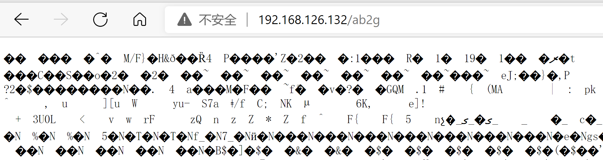
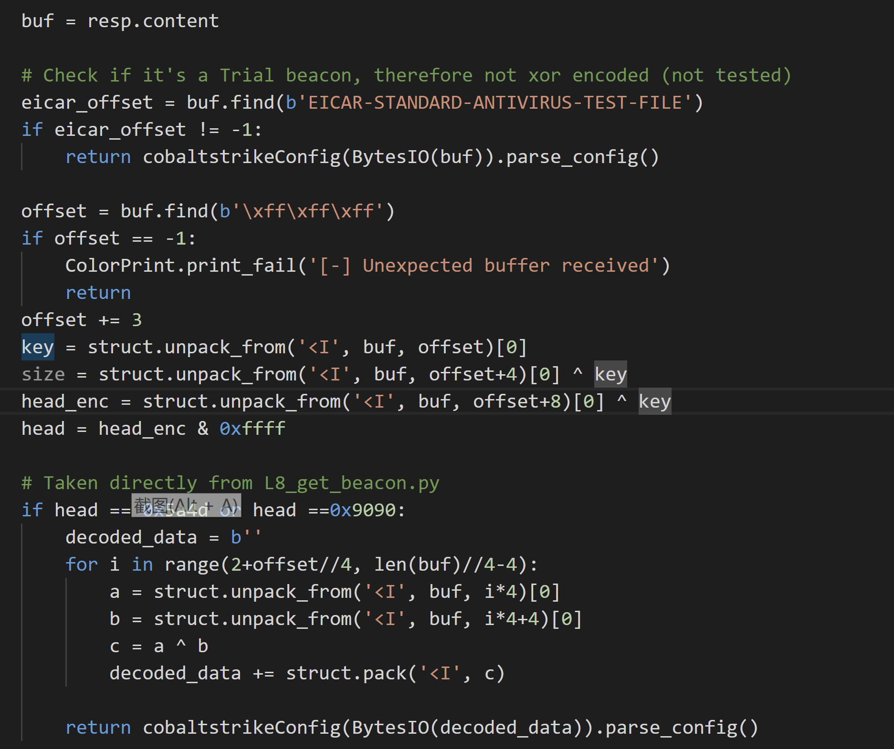
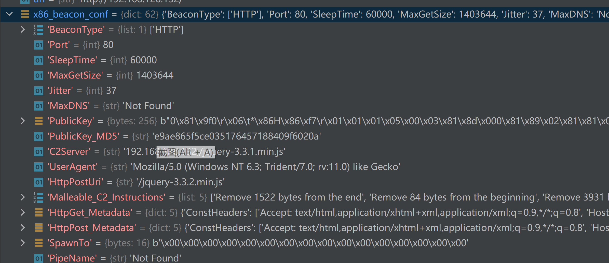
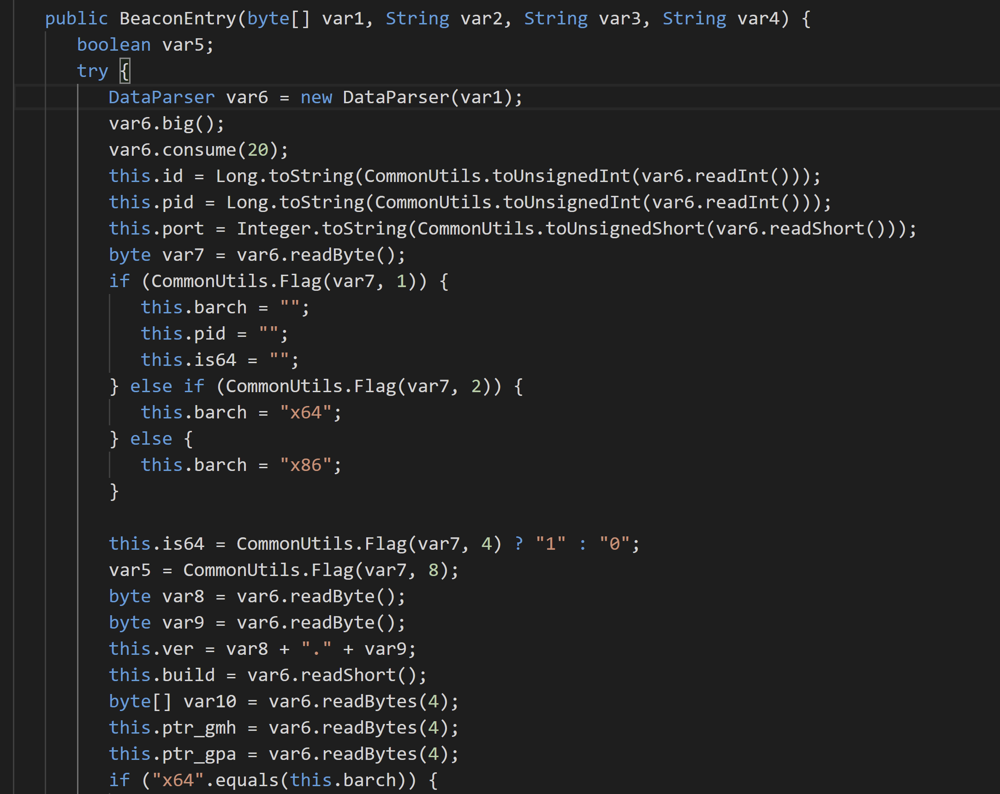
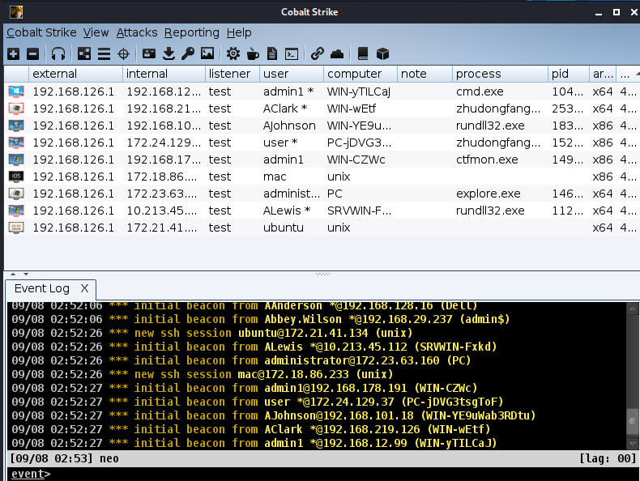
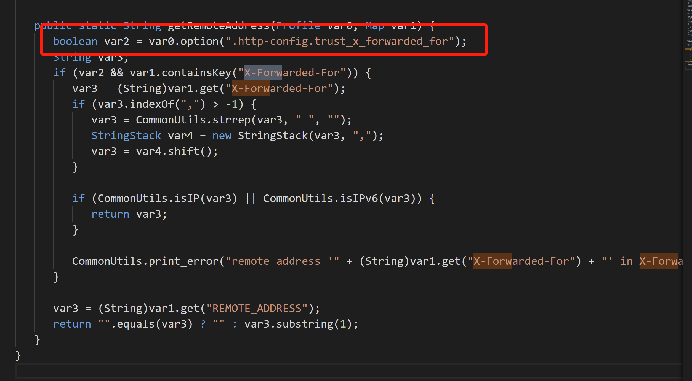
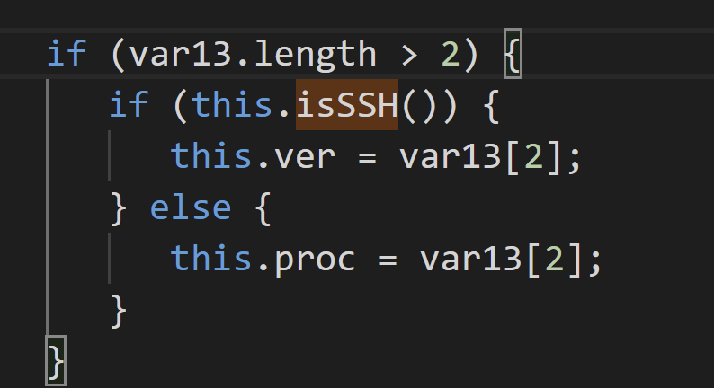
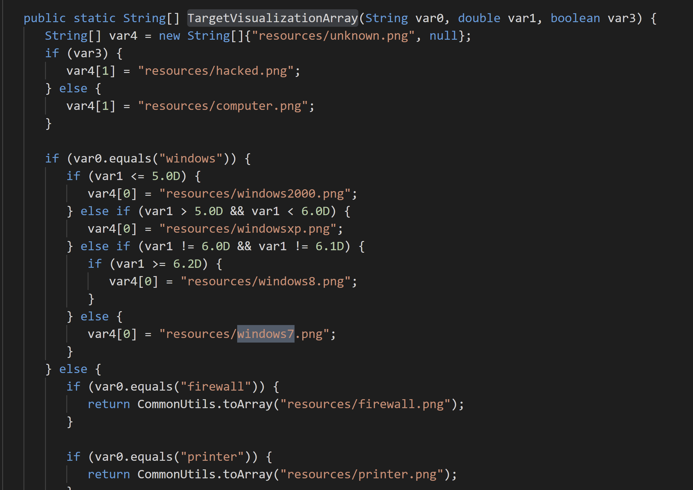
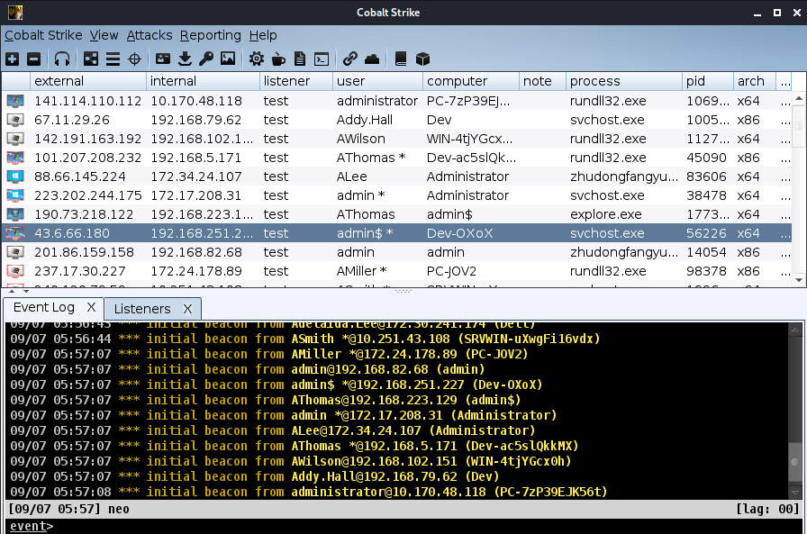

# CS上线器的一些原理及改造

信息流上线了一个CS上线器 https://i.hacking8.com/cobaltspam

我是照着 https://github.com/hariomenkel/CobaltSpam 来改的，而CobaltSpam是https://github.com/Sentinel-One/CobaltStrikeParser fork修改的，后者是用于解析beacon配置的仓库，从中可以学到一些原理 - =

## 介绍

CS为了兼容MSF，默认配置将stage下载的uri硬编码了 , 
``` 
URL_PATHS = {'x86':'ab2g', 'x64':'ab2h'}

```

所以访问 
``` 
full_url = urljoin(url, URL_PATHS[arch])

```



就能得到beacon，从中能够解析到C2的各种配置信息。

接着就是定位到数据，具体怎么找的可以看 https://blog.xpnsec.com/tailoring-cobalt-strike-on-target/

寻找的代码



执行完就能得到beacon的配置信息了



## 上线

参考文章: https://wbglil.gitbook.io/cobalt-strike/cobalt-strike-yuan-li-jie-shao/cs-mu-biao-shang-xian-guo-cheng

CS的上线，只需要beacon信息中的公钥(从代码中发现的)，以及用户自定义的请求包。这些都可以从上述的beacon解析中获得。

cs teamserver会通过rsa解密出上线信息，所以我们编写上线函数的时候只需要把上线信息通过rsa加密，公钥是beacon解析出来的。

### 上线信息结构

可以直接看源码 https://github.com/mai1zhi2/CobaltstrikeSource

`decomplie_src\cobaltstrike4.1\common\BeaconEntry.java`



根据源码，我整理了一份字段表格

名称 | 描述 | 占用字节  
---|---|---  
aes key | aes key | 16  
ANSI code page | 编码 | 2  
OEM code page | 编码 | 2  
bid | beacon id，这个id用来标记心跳状态，用这个id连续发包就可以标记心跳 | 4  
pid | beacon进程的pid | 4  
var7 | 这短短2字节，可以包含 barch、is64、isUac | 2  
ver | 两个字节两个字节读取，最后形式是 x.x | 4  
build | build信息 | 2  
junk | 不知道有什么用的字节，CobaltSpam直接随机的 | 12  
intz | 内网地址 | 4  
| 填充到第51位，填充的都用\x00 |   
| 之后是三个字符串，用\t分割  
  
  
这些数据都可以自定义，比较关注的几个在CS页面上显示的数据



在CobalSpam中上线信息在 `comm.py`文件上。

## 上线结构解析

一般的信息直接按上面的结构填充就行，下面是一些额外需要关注的字段。

  * external ip是请求过去的ip，cobalspam作者使用tor来伪造各种ip，我看源码发现如果配置了trust_x_forwarded_for选项，会使用X-Forwarded-For信息作为ip数据。默认是不配置的，但这个功能是有用的，有的cs server用nginx反代，用cdn等等，都需要加这个字段，否则就看不到目标的ip。


  * 如果设置uac选项，user后面就会自动加上`*`号，同时图标也会有一个闪闪发光的东西。var7字段两个字节，却能设置三个参数 barch、is64、isUac，2byte = 8bit，所以实际可以设置8个布尔选项(目前只用了三个),相关的代码片段如下

      ```python
      self.is64 = True
      self.barch = "x32"
      self.bypassuac = True

      if self.is64:
         self.is64 = 4
      else:
         self.is64 = 0
      if self.barch == "x64":
         self.is64 += 2
      if self.bypassuac:
         self.is64 += 8
      ```

  * 图标是怎么来的？cs第一个对应的小框框，这个地方我找了好久，终于找到对应设置的字段了。

先看怎么识别操作系统
```java 
public String getOperatingSystem() {
   if (this.isBeacon()) {
      return "Windows";
   } else if ("".equals(this.ver)) {
      return "Unknown";
   } else if ("Darwin".equals(this.ver)) {
      return "MacOS X";
   } else {
      return this.ver.startsWith("CYGWIN_NT-") ? "Windows" : this.ver;
   }
}
```
```java 
public boolean isBeacon() {
   return !this.isSSH();
}
```
```java 
public boolean isSSH() {
   return "session".equals(CommonUtils.session(this.id));
}
```
```java 
public static String session(int var0) {
   if ((var0 & 1) == 1) {
      return "session";
   } else {
      return var0 > 0 ? "beacon" : "unknown";
   }
}
```

根据beacon id来的，如果id是单数，就说明这是一个ssh，而`BeaconEntry`类刚好有个判断，如果是ssh的话，会用`注入到的进程名称`来代表操作系统。



知道了设置的地方，但还是不知道设置为何值才会显示图标，于是去resources看了下，搜了下图片的文件名`windows7.png`,找到了。

在`decomplie_src\cobaltstrike4.1\dialog\DialogUtils.java`的`TargetVisualizationArray`函数上



可以看到，对于windows版本来说(判断条件是beacon为双数)，通过匹配版本来设置各种图标
```java 
if (var0.equals("windows")) {
   if (var1 <= 5.0D) {
      var4[0] = "resources/windows2000.png";
   } else if (var1 > 5.0D && var1 < 6.0D) {
      var4[0] = "resources/windowsxp.png";
   } else if (var1 != 6.0D && var1 != 6.1D) {
      if (var1 >= 6.2D) {
         var4[0] = "resources/windows8.png";
      }
   } else {
      var4[0] = "resources/windows7.png";
   }
```

对于其他的设备可选的值有这些
```python 
["firewall", "android", "vmware", "solaris", "linux", "cisco ios", "macos x", "apple ios"]
```

填上就可以使用各种小图标了。




## 其他

  * 尝试把一些字段恶意加大，想看看能不能卡死cs，结果发现，rsa加密有明文字符串的限制，在数据加密那层就没过去。


