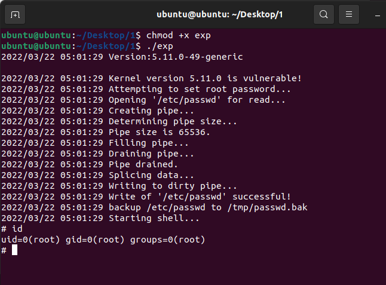
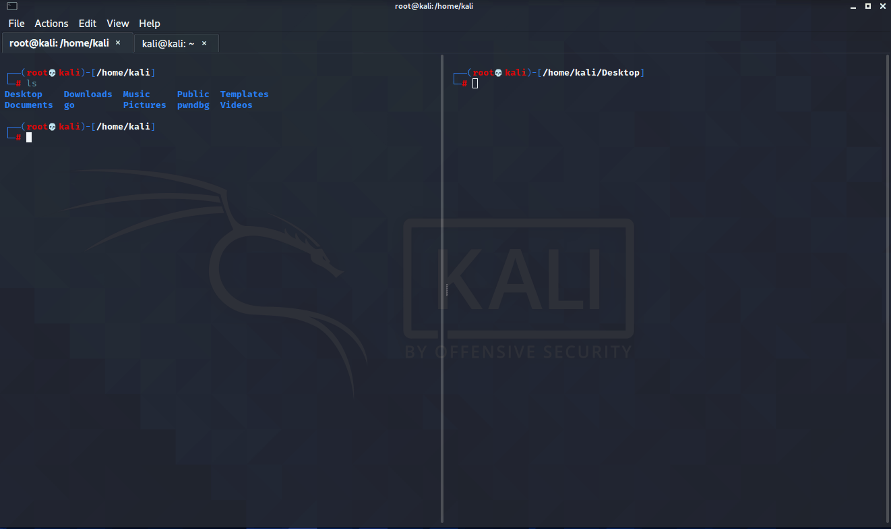

# CVE-2022-0847 Linux DirtyPipe 内核提权与docker逃逸复现

影响版本:

  * Linux Kernel版本 >= 5.8
  * Linux Kernel版本 < 5.16.11 / 5.15.25 / 5.10.102

> 漏洞点是在 splice 系统调用中**未清空** `pipe_buffer` **的标志位，从而将管道页面可写入的状态保留了下来** ，这给了我们越权写入只读文件的操作。
> 
> 攻击者利用该漏洞可以覆盖任意只读文件中的数据，这样将普通的权限提升至root权限。

## 内核提权

漏洞能覆盖任意可读文件，也有一些限制，不能覆盖第一个字节和最后一个，不能填入`\x00`，写入大小最多为linux`页`的大小。

利用可以写`/etc/passwd`，新加一个root或修改root用户，也可以写到`corntab`，`sudo文件`,sudo文件可以写入bash或修改elf入口点。

做了一个自动化工具，能一键提权，原理是利用漏洞修改了`/etc/passwd`

  1. exp会自动`检查版本`,符合内核的版本才会继续执行,会覆写`/etc/passwd`中root，将root密码置为空达到提权，工具结束后会恢复`/etc/passwd`
  2. 直接运行exp会弹回一个root权限的shell
  3. ./exp -c whoami # 以root权限执行命令

## Docker 逃逸

结合`CVE-2019-5736`达到docker逃逸效果。参考 https://mp.weixin.qq.com/s/VMR_kLz1tAbHrequa2OnUA

也做了自动化工具，基本原理是 循环获取runc的进程，获取runc入口点偏移，利用dirtypipe写入runc入口点shellcode。需要完成自动获取入口点偏移和自动生成shellcode (已经完成)。

利用条件比较苛刻：

  * 拥有docker内的root权限
  * 需要外部执行两次`docker exec` （可能只需要一次但是没调出来）

自动化利用程序演示：

