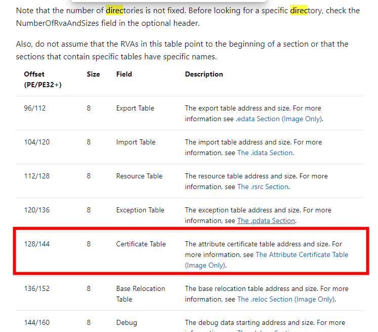
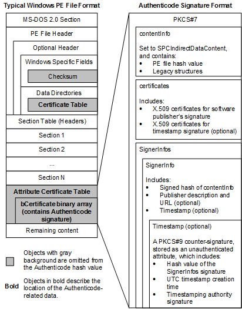
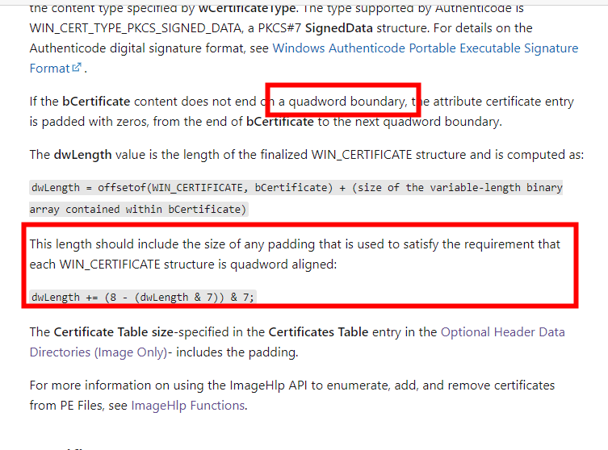
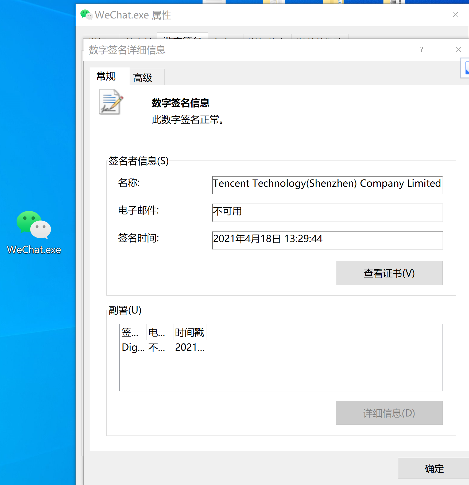
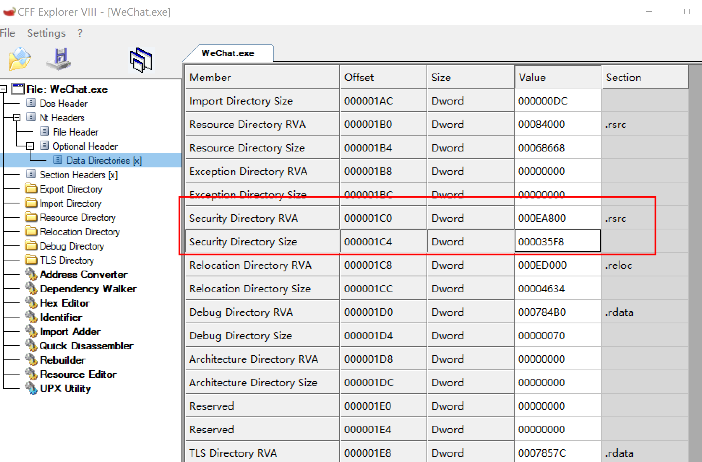
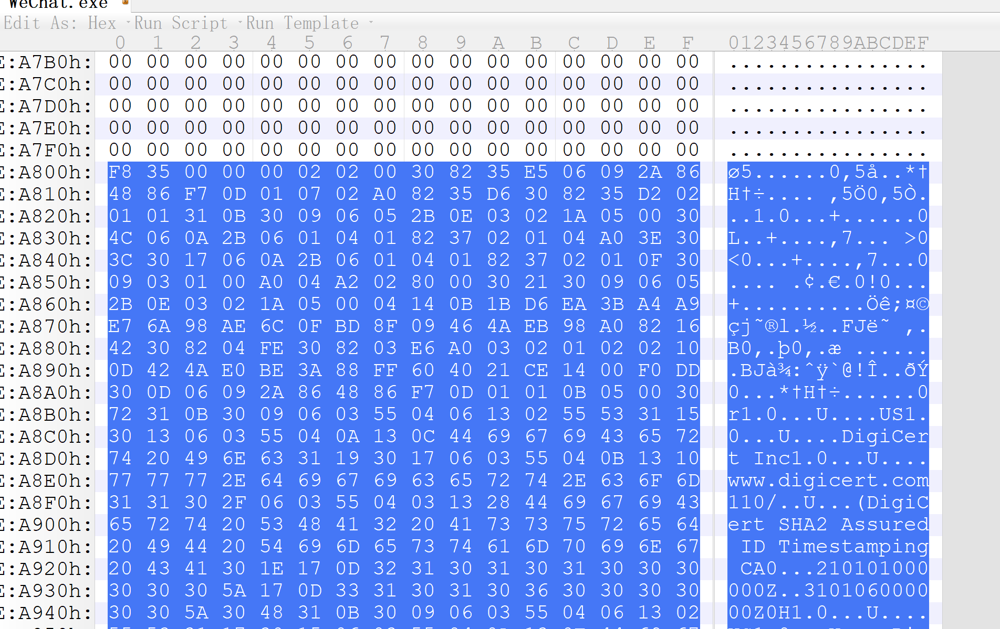
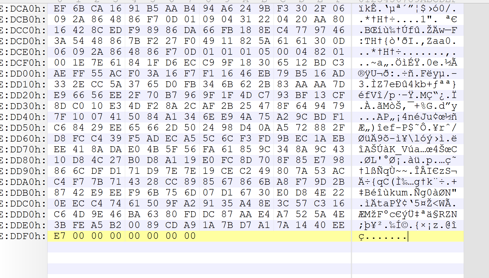
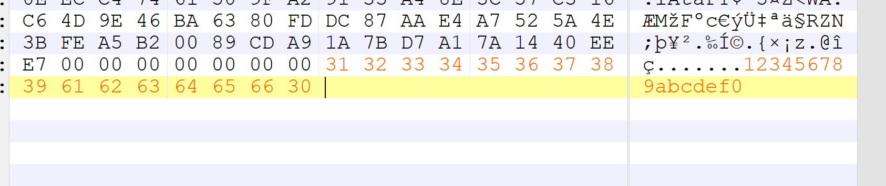
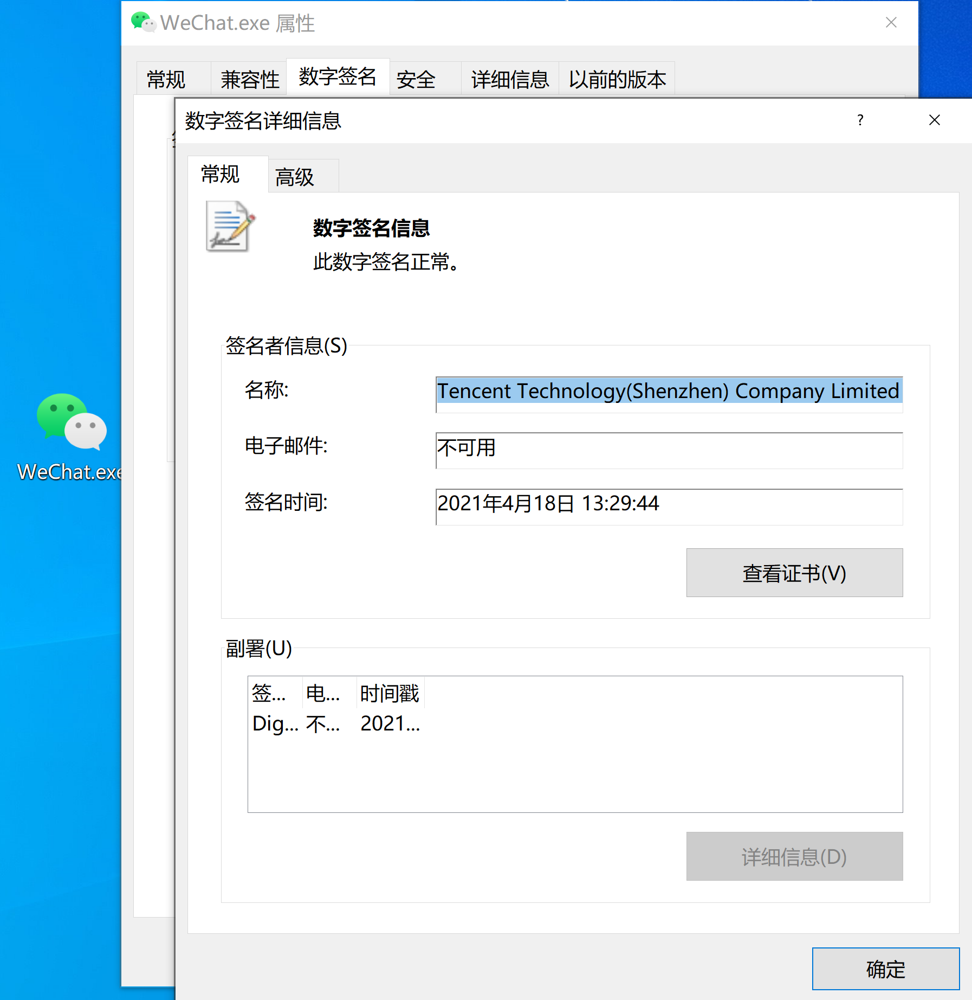

# SigFlip使用和原理

SigFlip原理：将数据隐写到已签名的PE文件上 

Github地址: https://github.com/med0x2e/SigFlip

可以怎么玩呢，可以白加黑当冲锋马的时候，白文件写入shellcode，黑文件加载白文件的shellcode。

也可以做维权使用，将shellcode注入到系统的白文件中,dll劫持或者loader加到启动项里面。

## 使用

两个目录`Bof`和`DotNet`，DotNet是c#写的用来可行性测试，包含注入代码，loader加载功能，Bof是C写的，也包含注入代码和loader加载功能，主要是可以编译成bof文件给Cobalt Strike使用。

c#代码loader的部分直接CreateRemoteThread就运行shellcode了，而bof的loader部分使用`Early Bird`，启动一个新进程 pac注入执行。

c#和Bof会写入`"\xFE\xED\xFA\xCE\xFE\xED\xFA\xCE"` 当作标记，在读取shellcode时通过这个字符就可以直接定位到shellcode了。

**注入shellcode到签名的PE文件**
``` 
c:\> SigFlip.exe -i C:\Windows\Microsoft.NET\Framework\v4.0.30319\MSBuild.exe -s C:\Temp\x86.bin -o C:\Temp\MSbuild.exe -e TestKey

```

**loader执行shellcode**
``` 
c:\> SigLoader.exe -f C:\Temp\MSBuild.exe -e TestKey -pid <PROCESS_ID>

```

说说原理，一句话就是将shellcode写到了签名时不计算的区域。

## 签名的位置

https://docs.microsoft.com/en-us/windows/win32/debug/pe-format#optional-header-data-directories-image-only



_IMAGE_DATA_DIRECTORY 第4个偏移的位置（从0开始）。

### 签名信息的结构

https://docs.microsoft.com/en-us/windows/win32/debug/pe-format#the-attribute-certificate-table-image-only



灰色背景的部分，不参与签名的hash计算。粗体的部分，就是签名的相关内容。

SigFlip的原理就是将数据隐写到灰色的部分。

**数字签名结构**

WIN_CERTIFICATE
```c++ 
typedef struct _WIN_CERTIFICATE {
    DWORD       dwLength;
    WORD        wRevision;
    WORD        wCertificateType;   // WIN_CERT_TYPE_xxx
    BYTE        bCertificate[ANYSIZE_ARRAY];
} WIN_CERTIFICATE, *LPWIN_CERTIFICATE;

```

dwLength:此结构体的长度。  
值 | 信息 | Win32 SDK中的宏定义名  
---|---|---  
0x0100 | Win_Certificate的老版本 | WIN_CERT_REVISION_1_0  
0x0200 | Win_Certificate的当前版本 | WIN_CERT_REVISION_2_0  
  
wCertificateType:证书类型，有如下表格中的类型：

值 | 信息 | Win32 SDK中的宏定义名  
---|---|---  
0x0001 | X.509证书 | WIN_CERT_TYPE_X509  
0x0002 | 包含PKCS#7的SignedData的结构 | WIN_CERT_TYPE_PKCS_SIGNED_DATA  
0x0003 | 保留 | WIN_CERT_TYPE_RESERVED_1  
0x0004 | 终端服务器协议堆栈证书签名 | WIN_CERT_TYPE_TS_STACK_SIGNED  
  
bCertificate:包含一个或多个证书，一般来说这个证书的内容一直到安全表的末尾。

具体的`WIN_CERT_TYPE_PKCS_SIGNED_DATA`结构参考 https://download.microsoft.com/download/9/c/5/9c5b2167-8017-4bae-9fde-d599bac8184a/Authenticode_PE.docx

最值得注意的是`bCertificate`的字节大小要求8字节对齐。



## 修改要做的步骤

根据_IMAGE_DATA_DIRECTORY 获取 `WIN_CERTIFICATE` 的RVA和大小，添加数据到`bCertificate`后面，再注意8字节对齐即可。

Ps:为什么添加数据在bCertificate后面不影响证书的校验呢，我原本想找找PKCS#7证书的结构看看的，搜了一圈，也没找到比较好的。但是可以猜测，既然有8位对齐的校验，说明后面添加几个字符是没有影响，再可以反推出，每个字段都有一个长度字段控制。所以后面无论我们添加多少字段，对证书的校验都不会影响。

再 更新 dwLength 大小

更新 `_IMAGE_DATA_DIRECTORY[WIN_CERTIFICATE ]`的size。

更新PE头的`CheckSum` （这个可选）

## 手动修改

有了上面的描述，我们可以手动修改试试，以“微信”为例，用它的主程序，数字签名也都正常。



用`CFF Explore`打开wechat.exe，定位到证书表的选项



可以知道证书的位置在文件偏移的`000EA800`，大小是000035F8

用`010 Editor`跳转到这个地方



头部对应上数据结构的值
``` 
typedef struct _WIN_CERTIFICATE {
    DWORD       dwLength;
    WORD        wRevision;
    WORD        wCertificateType;   // WIN_CERT_TYPE_xxx
    BYTE        bCertificate[ANYSIZE_ARRAY];
} WIN_CERTIFICATE, *LPWIN_CERTIFICATE;

```

dwLength = 0x35f8

wRevision=0x0200

wCertificateType=0x02

后面即证书的字节了，跳转到最后可以看到有七个字节用作了对齐



我们可以在后面添加自己需要的字节(要是8的倍数)，例如我添加16个。



所以新的长度就是0x35f8+16 = 0x3608 ,新的长度更新到两个地方

> 更新 dwLength 大小
> 
> 更新 `_IMAGE_DATA_DIRECTORY[WIN_CERTIFICATE ]`的size。

最后它的证书也是正常的。



## 防御手法

检查是否安装了 MS13-098 KB2893294 (一般默认不安装)

检查注册表

  * `HKLM:\Software\Microsoft\Cryptography\Wintrust\Config`
  * `HKLM:\Software\Wow6432Node\Microsoft\Cryptography\Wintrust\Config`


## 历史

早在2013年，就有人发现chrome的安装包会在证书处写自己的安装信息。

  * https://blog.didierstevens.com/2013/08/13/a-bit-more-than-a-signature/


## 增强对抗

loader就可以按shellcode的加载方式进行了，通常一个CreareRemoteThread就可以启动了。在对抗中执行可以更复杂一点，对于白加黑运行，运行shellcode可以劫持返回地址，或者注入到主程序的入口来执行。
