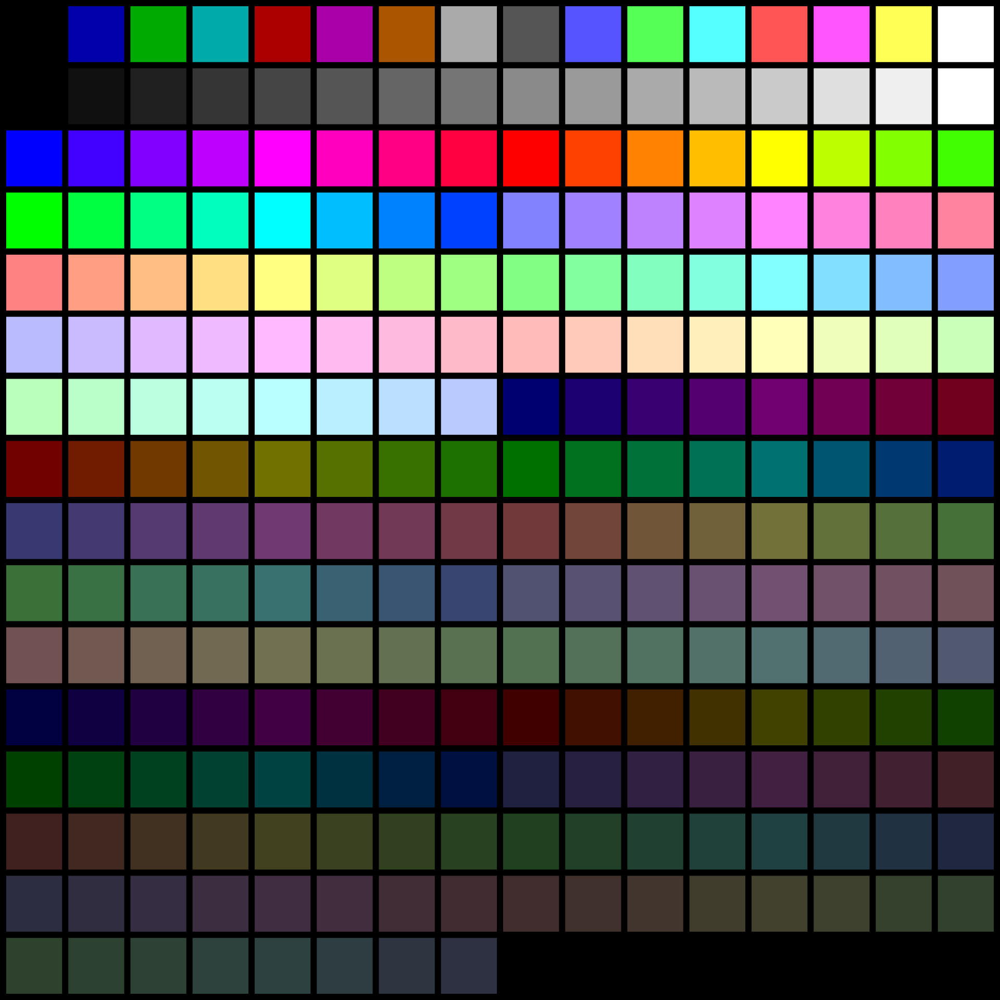
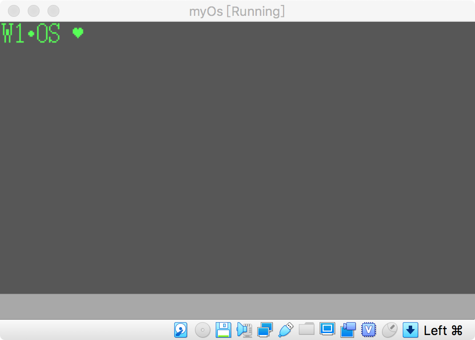

# W1OS自制操作系统

## 参考链接

  * 《30天自制操作系统》源码中文版 https://github.com/yourtion/30dayMakeOS
  * How to create an OS from scratch https://github.com/cfenollosa/os-tutorial
  * https://blog.csdn.net/tyler_download/article/category/6280228/3?


## 前言

做一个自己的操作系统一定是很一件很酷的事。今天仔细读了下上面三篇文章，都非常不错，不过比较遗憾的是除了第一节的hello world之外，后面的数据结构的定义，各种模式的转换都非常脑坑疼。为了能尽快做出一个成品来获得正反馈(zhuangb)，我将中间一系列过程能省则省掉了，最终能最简单展示一个helloworld的窗口程序，来增强一下满足感。

## 普通流程

虽然我力图精简大部分的流程，但是操作系统的制作流程还是需要明白的。

### 软盘读写

首先BIOS只能读取软盘512个字节，但是操作系统内核明显会超过它，所以一般这512字节都会写一个`内核加载器`，通过它来加载我们真正的内核。

### 内核加载器

内核加载器的作用是什么呢，它用来告诉BIOS，“来加载512字节之后的数据吧～”。同时我们还要注意我们编译出来的img的结构大小，前512字节是加载器的二进制代码，不足的用00来代替，后面是我们真正内核的代码。需要注意的是，内核加载器由于硬件（软盘）的结构限制，只能以512字节为单位加载内核，如果内核超出，需要及时修改加载器，告诉它“需要加载更多内核代码”。

### 保护模式32位寻址

计算机默认进入的实模式，但是它的功能有限，我们需要操作CPU来进入“保护模式”，上面的参考文章也会在一开始告诉你，如何进入保护模式。总之就是定义一堆看不懂的数据结构～

### 跨平台C语言的编译

进入到保护模式后，就可以访问到更大的内存空间了，接下来就是抛弃汇编，使用C语言编写内核。首先的问题是，C语言编写的程序如何让我们内核识别到？参见https://github.com/cfenollosa/os-tutorial/blob/master/11-kernel-crosscompiler/README.md，使用我们系统的gcc编译一个不带任何依赖的gcc即可（听起来有点好玩，就和go语言用go写的一样），然后在汇编种预留c语言的接口
```assembly 
[bits 32]
[extern main] ; Define calling point. Must have same name as kernel.c 'main' function
call main ; Calls the C function. The linker will know where it is placed in memory
jmp $

```

之后用编译出来的gcc编译c语言代码，汇编编译汇编代码，将两个文件合起来即可。

### 绘制界面

如果要绘制界面，需要用汇编调用BIOS的中断，操作硬件打开显卡色彩功能（可以理解为用汇编操作BIOS的API）。

打开VGA显卡
``` 
mov  al, 13h
mov  ah, 0x00
int  0x10

```

画像素点
``` 
mov  ah,0ch
mov  al,10;颜色值 1~256
mov  dx,1 ;x坐标
mov  cx,1 ;y坐标
mov  bh,0
int  0x10

```

颜色值



通过一个像素点，就可以画整个图形界面了（有点以前OpenGL写游戏的味道）

## 精简流程

为了最快自制一个带界面的操作系统，我精简了一个流程（虽然还是花了一天）。我们直接用汇编操作BIOS的显卡功能，什么加载器，什么GDT，统统不要。

直接上代码
``` 
org  0x7c00;

jmp  entry

entry:
    mov  ax, 0
    mov  ss, ax
    mov  ds, ax
    mov  es, ax
    mov  si,font_X
    mov  di,font_Y


putloop:
    mov  al, 13h
    mov  ah, 0x00
    int  0x10

    mov cx,0
    mov dx,0
    x:
      cmp cx,320
      je y
      ; mov dx, 2
      call draw
      add cx,1
      jmp x
    y:
      add dx,1
      mov cx,0
      cmp dx,200
      je draw_menu
      jmp x
    draw_menu:
      mov cx,0
      mov dx,183
      x2:
        cmp cx,320
        je y2
        call draw_greem
        add cx,1
        jmp x2
      y2:
        add dx,1
        mov cx,0
        cmp dx,200
        je draw_hello
        jmp x2

draw_hello:
    mov cx,0
    mov dx,0
    _loop_x:

        mov  cl, [si]
        add  si, 1
        mov  dl, [di]
        add  di, 1
        cmp  cl, 0
        je   fin
        call draw_font
        ; mov  ah, 0x0e
        ; mov  bx, 15
        ; int  0x10
        jmp  _loop_x
    ; _loop_y:
    jmp fin


draw:
    pusha
    mov  ah,0ch
    mov  al,8
    mov  bh,0
    int  0x10
    popa
    ret

font_X:
    DB 13,12,13,11,13,13,13,13,13,13,13,13,13,13,11,12,13,14,15,1,2,3,6,7,8,2,7,2,7,2,7,2,4,5,7,2,4,5,7,2,4,5,7,2,4,5,7,3,6,3,6,3,6,3,6,3,6,20,21,19,20,21,22,19,20,21,22,20,21,27,28,29,26,30,25,31,25,31,25,31,25,31,25,31,25,31,25,31,25,31,25,31,26,30,27,28,29,35,36,37,39,34,38,39,33,39,33,39,33,34,35,36,37,38,39,33,39,33,39,33,34,38,33,35,36,37,50,51,53,54,49,50,51,52,53,54,55,49,50,51,52,53,54,55,49,50,51,52,53,54,55,50,51,52,53,54,51,52,53,52
    db 0

font_Y:
    DB 1,2,2,3,3,4,5,6,7,8,9,10,11,12,13,13,13,13,13,1,1,1,1,1,1,2,2,3,3,4,4,5,5,5,5,6,6,6,6,7,7,7,7,8,8,8,8,9,9,10,10,11,11,12,12,13,13,6,6,7,7,7,7,8,8,8,8,9,9,1,1,1,2,2,3,3,4,4,5,5,6,6,7,7,8,8,9,9,10,10,11,11,12,12,13,13,13,1,1,1,1,2,2,2,3,3,4,4,5,6,7,7,7,8,9,10,10,11,11,12,12,12,13,13,13,13,4,4,4,4,5,5,5,5,5,5,5,6,6,6,6,6,6,6,7,7,7,7,7,7,7,8,8,8,8,8,9,9,9,10
    db 0
draw_greem:
    ; pop dx ;坐标y
    ; pop cx ;坐标x
    pusha
    mov  ah,0ch
    mov  al,7
    mov  bh,0
    int  0x10
    popa
    ret

draw_font:
    ; pop dx ;坐标y
    ; pop cx ;坐标x
    pusha
    mov  ah,0ch
    mov  al,10
    mov  bh,0
    int  0x10
    popa
    ret

fin:
    HLT
    jmp  fin

times 510-($-$$) db 0
dw 0xaa55

```

通过nasm编译
```bash 
nasm kernel.asm -f bin -o kernal.img

```

最终效果图

">

font_X，font_Y是什么呢，是文字的像素坐标，因为不会用汇编操作多维数组，只能自己用Python写个转换程序，将文字转换为坐标 - =

Python转换程序
```python 
def draw_font(chars, pianyi_x=0, pianyi_y=0):
    chars = chars.strip().splitlines()
    y = 0 + pianyi_y
    x = 0 + pianyi_x
    _x = []
    _y = []
    output = []
    for line in chars:
        x = 0 + pianyi_x
        for i in line:
            if i == '*':
                output.append((x, y))
            x += 1
        y += 1
    print(output)

    s = ""
    for point in output:
        s += str(point[0]) + ","
    print("x:DB " + s.strip(","))

    s = ""
    for point in output:
        s += str(point[1]) + ","
    print("y:DB " + s.strip(","))


charsH = '''
........
........
........
........
.**.**..
*******.
*******.
*******.
.*****..
..***...
...*....
........
........
........
........
........
'''
charW = '''

'''
draw_font(charsH, 1 + 16 + 16 + 8 + 8)

```

它将输出
``` 
x:DB 50,51,53,54,49,50,51,52,53,54,55,49,50,51,52,53,54,55,49,50,51,52,53,54,55,50,51,52,53,54,51,52,53,52
y:DB 4,4,4,4,5,5,5,5,5,5,5,6,6,6,6,6,6,6,7,7,7,7,7,7,7,8,8,8,8,8,9,9,9,10

```

将这个数值放到那段代码中即可。最后，其实可以把界面画的更好看点，但是因为没有做内核加载器，我们的程序只能512字节的大小，我这段代码刚刚差不多。我明天可以试试做个内核加载器将界面完善一下～
