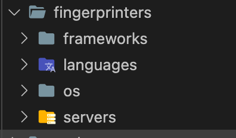
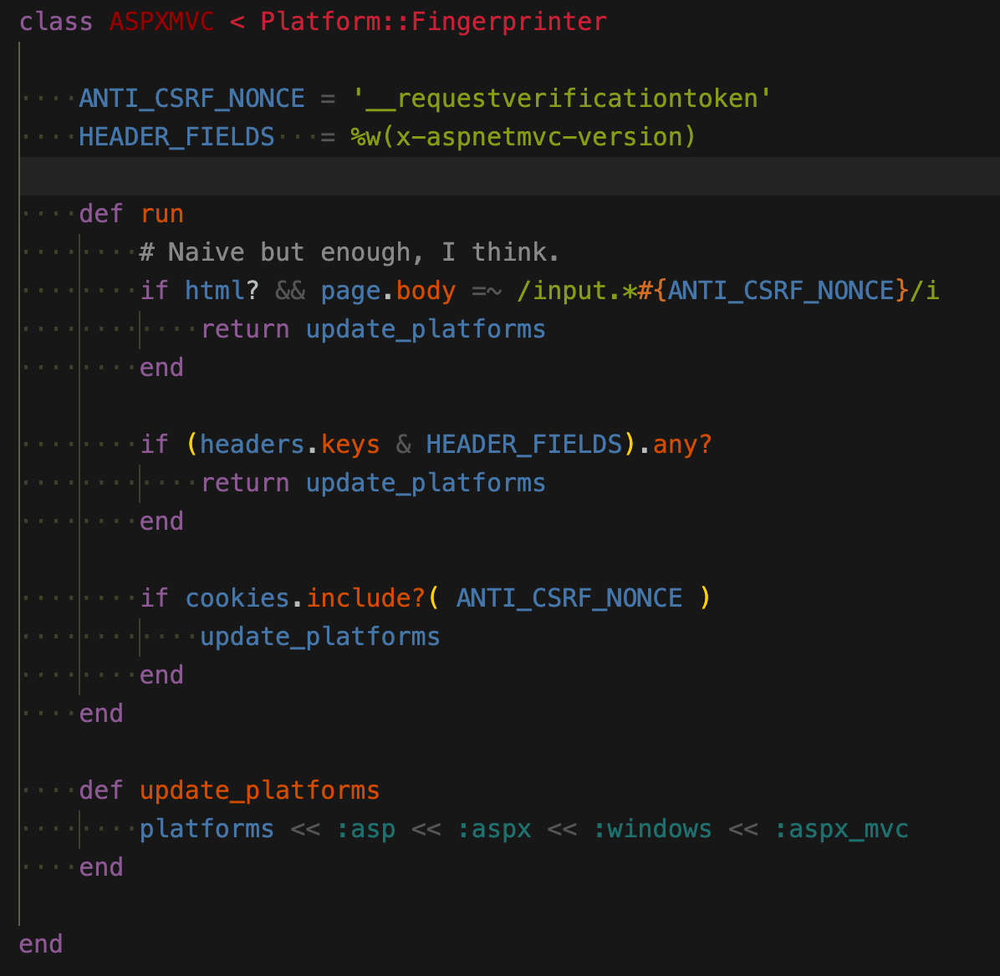
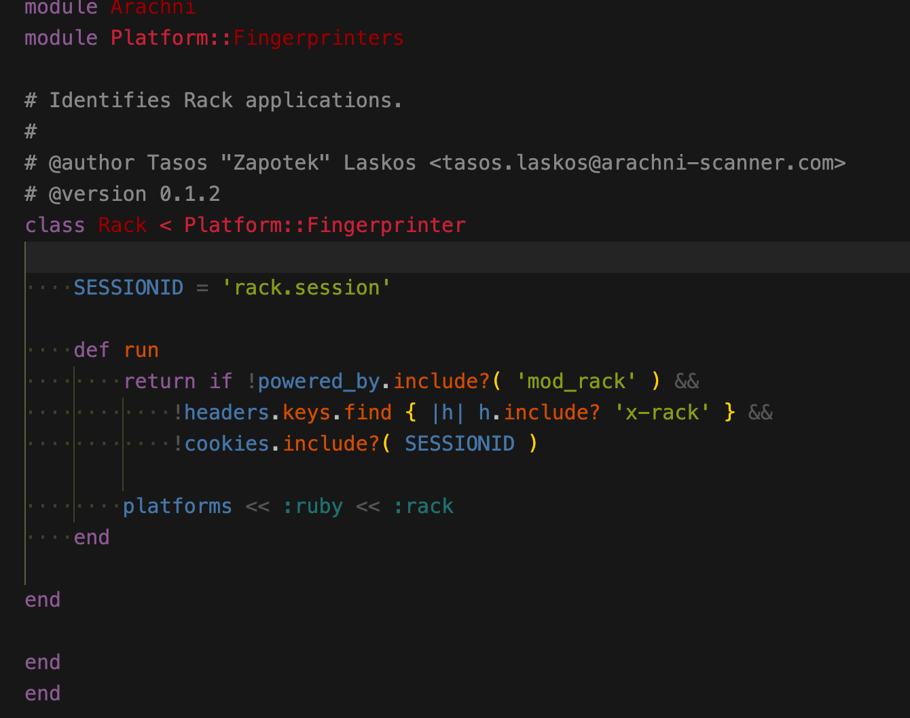
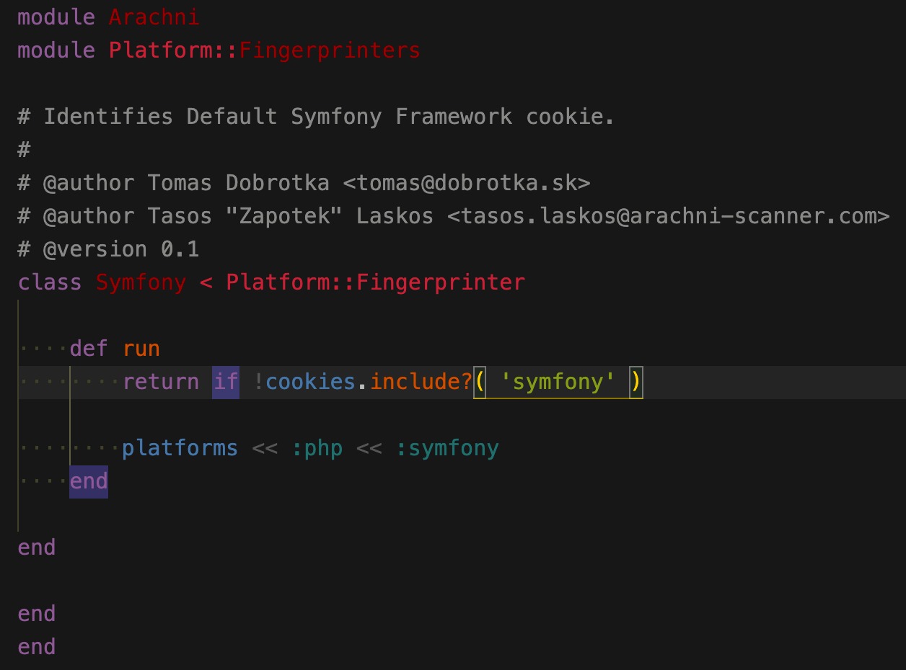
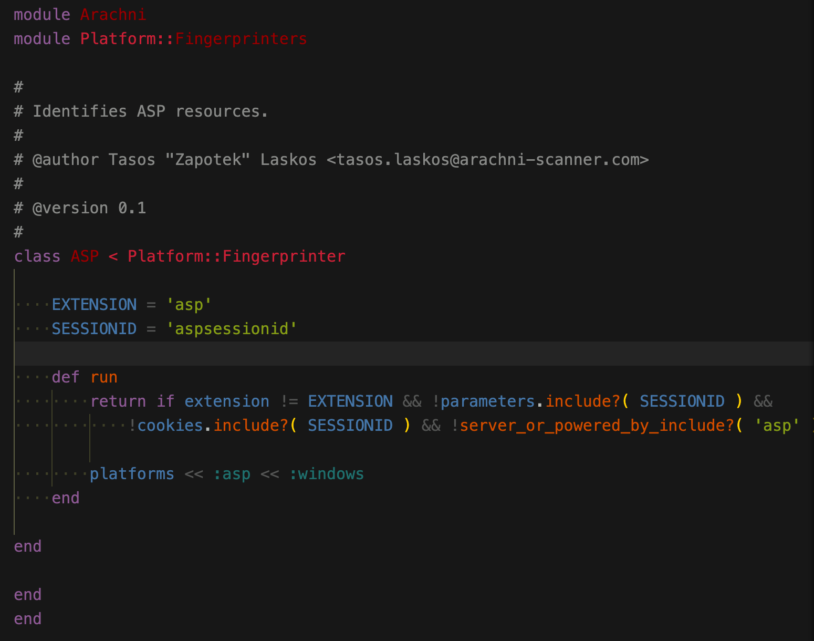
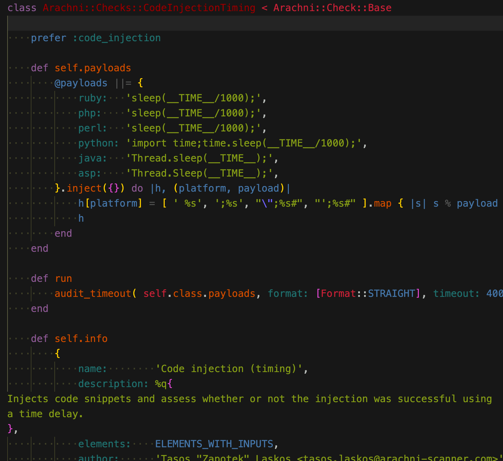
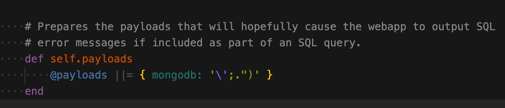

# arachni源码学习记录

有人问我w13scan和arachni的区别，之前没接触过，正好放假有空就看看这个扫描器。

> Arachni是一个包含很多特性、模块化的、高性能的Ruby框架，目的是帮助渗透测试人员和管理者评估现代web应用程序的安全。Arachni是免费、源代码开源的，它支持所有主流操作系统

它是`ruby`写的，开源地址是 https://www.arachni-scanner.com/ 里面有不少模块值得w13scan学习，所以记录一下。

## 指纹识别

w13scan也有指纹识别的模块，路径是`W13SCAN/fingprints`，也是收集自各个扫描器的，所以看arachni的指纹识别模块，只选取w13scan中没有的(现在没有，写完这篇记录之后就有了 = = )。

指纹都在`system/gems/gems/arachni-1.5.1/components/fingerprinters`



用于识别框架，语言，操作系统和服务。

### aspx_mvc 指纹识别

`system/gems/gems/arachni-1.5.1/components/fingerprinters/frameworks/aspx_mvc.rb`



言简意赅，从body，header，cookie中判断值。

### ruby rack



### symfony



### asp



### aspx
```ruby
=begin
    Copyright 2010-2017 Sarosys LLC <http://www.sarosys.com>

    This file is part of the Arachni Framework project and is subject to
    redistribution and commercial restrictions. Please see the Arachni Framework
    web site for more information on licensing and terms of use.
=end

module Arachni
module Platform::Fingerprinters

# Identifies ASPX resources.
#
# @author Tasos "Zapotek" Laskos <tasos.laskos@arachni-scanner.com>
# @version 0.1.1
class ASPX < Platform::Fingerprinter

    EXTENSION       = 'aspx'
    SESSION_COOKIE  = 'asp.net_sessionid'
    X_POWERED_BY    = 'asp.net'
    VIEWSTATE       = '__viewstate'
    HEADER_FIELDS   = %w(x-aspnet-version x-aspnetmvc-version)

    def run
        if extension == EXTENSION ||
            # Session ID in URL, like:
            #   http://blah.com/(S(yn5cby55lgzstcen0ng2b4iq))/stuff.aspx
            uri.path =~ /\/\(s\([a-z0-9]+\)\)\//i

            return update_platforms
        end

        # Naive but enough, I think.
        if html? && page.body =~ /input.*#{VIEWSTATE}/i
            return update_platforms
        end

        if server_or_powered_by_include?( X_POWERED_BY ) ||
            (headers.keys & HEADER_FIELDS).any?
            return update_platforms
        end

        if cookies.include?( SESSION_COOKIE )
            update_platforms
        end
    end

    def update_platforms
        platforms << :asp << :aspx << :windows
    end

end

end
end

```

## 路径抓取

如何从网页中取出更多路径，以后写爬虫的时候可能用得着,文件路径在`system/gems/gems/arachni-1.5.1/components/path_extractors`

可以看出路径抓取直接操作的dom，这种方式获取的比较准确吧。

### a href

从a标签获取
```ruby 
=begin
    Copyright 2010-2017 Sarosys LLC <http://www.sarosys.com>

    This file is part of the Arachni Framework project and is subject to
    redistribution and commercial restrictions. Please see the Arachni Framework
    web site for more information on licensing and terms of use.
=end

# Extracts paths from anchor elements.
#
# @author Tasos "Zapotek" Laskos <tasos.laskos@arachni-scanner.com>
class Arachni::Parser::Extractors::Anchors < Arachni::Parser::Extractors::Base

    def run
        return [] if !check_for?( 'href' )

        document.nodes_by_name( 'a' ).map { |a| a['href'] }
    end

end

```

### area href
```ruby
class Arachni::Parser::Extractors::Areas < Arachni::Parser::Extractors::Base

    def run
        return [] if !check_for?( 'area' ) || !check_for?( 'href' )

        document.nodes_by_name( 'area' ).map { |a| a['href'] }
    end

end

```

### 网页注释

用正则从网页注释中获取url
```ruby 
=begin
    Copyright 2010-2017 Sarosys LLC <http://www.sarosys.com>

    This file is part of the Arachni Framework project and is subject to
    redistribution and commercial restrictions. Please see the Arachni Framework
    web site for more information on licensing and terms of use.
=end

# Extract paths from HTML comments.
#
# @author Tasos "Zapotek" Laskos <tasos.laskos@arachni-scanner.com>
class Arachni::Parser::Extractors::Comments < Arachni::Parser::Extractors::Base

    def run
        return [] if !check_for?( '<!--' )

        document.nodes_by_class( Arachni::Parser::Nodes::Comment ).map do |comment|
            comment.value.scan( /(^|\s)(\/[\/a-zA-Z0-9%._-]+)/ )
        end.flatten.select { |s| s.start_with? '/' }
    end

end

```

### data_url
```ruby
=begin
    Copyright 2010-2017 Sarosys LLC <http://www.sarosys.com>

    This file is part of the Arachni Framework project and is subject to
    redistribution and commercial restrictions. Please see the Arachni Framework
    web site for more information on licensing and terms of use.
=end

# Extracts paths from `data-url` attributes.
#
# @author Tasos "Zapotek" Laskos <tasos.laskos@arachni-scanner.com>
class Arachni::Parser::Extractors::DataURL < Arachni::Parser::Extractors::Base

    def run
        return [] if !html || !check_for?( 'data-url' )

        html.scan( /data-url\s*=\s*['"]?(.*?)?['"]?[\s>]/ )
    end

end

```

### form action
```ruby
class Arachni::Parser::Extractors::Forms < Arachni::Parser::Extractors::Base

    def run
        return [] if !check_for?( 'action' )

        document.nodes_by_name( 'form' ).map { |f| f['action'] }
    end

end

```

### iframe src
```ruby
class Arachni::Parser::Extractors::Frames < Arachni::Parser::Extractors::Base

    def run
        return [] if !check_for?( 'frame' )

        document.nodes_by_names( ['frame', 'iframe'] ).map { |n| n['src'] }
    end

end

```

### link href
```ruby
class Arachni::Parser::Extractors::Links < Arachni::Parser::Extractors::Base

    def run
        return [] if !check_for?( 'link' )

        document.nodes_by_name( 'link' ).map { |l| l['href'] }
    end

end

```

### meta refresh
```ruby
class Arachni::Parser::Extractors::MetaRefresh < Arachni::Parser::Extractors::Base

    def run
        return [] if !check_for?( 'http-equiv' )

        document.nodes_by_attribute_name_and_value( 'http-equiv', 'refresh' ).
            map do |url|
                begin
                    _, url = url['content'].split( ';', 2 )
                    next if !url
                    unquote( url.split( '=', 2 ).last.strip )
                rescue
                    next
                end
            end
    end

    def unquote( str )
        [ '\'', '"' ].each do |q|
            return str[1...-1] if str.start_with?( q ) && str.end_with?( q )
        end
        str
    end

end

```

### script 中提取url
```ruby
class Arachni::Parser::Extractors::Scripts < Arachni::Parser::Extractors::Base

    def run
        return [] if !check_for?( 'script' )

        document.nodes_by_name( 'script' ).map do |s|
            [s['src']].flatten.compact | from_text( s.text.to_s )
        end
    end

    def from_text( text )
        text.scan( /[\/a-zA-Z0-9%._-]+/ ).
            select do |s|
            # String looks like a path, but don't get fooled by comments.
            s.include?( '.' ) && s.include?( '/' )  &&
                !s.include?( '*' ) && !s.start_with?( '//' ) &&

                # Require absolute paths, otherwise we may get caught in
                # a loop, this context isn't the most reliable for extracting
                # real paths.
                s.start_with?( '/' )
        end
    end

end

```

## 扫描插件

### 基于时间的代码注入



### 代码注入
```ruby
class Arachni::Checks::CodeInjection < Arachni::Check::Base

    def self.rand1
        @rand1 ||= '28763'
    end

    def self.rand2
        @rand2 ||= '4196403'
    end

    def self.options
        @options ||= {
            signatures: (rand1.to_i * rand2.to_i).to_s,
            format:     [Format::STRAIGHT]
        }
    end

    def self.code_strings
        # code strings to be injected to the webapp
        @code_strings ||= {
            php:    "print #{rand1}*#{rand2};",
            perl:   "print #{rand1}*#{rand2};",
            python: "print #{rand1}*#{rand2}",
            asp:    "Response.Write\x28#{rand1}*#{rand2}\x29"
        }
    end

    def self.payloads
        return @payloads if @payloads

        @payloads = {}
        code_strings.each do |platform, payload|
            @payloads[platform] = [ ';%s', "\";%s#", "';%s#" ].
                map { |var| var % payload } | [payload]
        end
        @payloads
    end

    def run
        audit( self.class.payloads, self.class.options )
    end

    def self.info
        {
            name:        'Code injection',
            description: %q{
Injects code snippets and assess whether or not execution was successful.
},
            elements:    ELEMENTS_WITH_INPUTS,
            author:      'Tasos "Zapotek" Laskos <tasos.laskos@arachni-scanner.com>',
            version:     '0.2.5',
            platforms:   payloads.keys,

            issue:       {
                name:            %q{Code injection},
                description:     %q{
A modern web application will be reliant on several different programming languages.

These languages can be broken up in two flavours. These are client-side languages
(such as those that run in the browser -- like JavaScript) and server-side
languages (which are executed by the server -- like ASP, PHP, JSP, etc.) to form
the dynamic pages (client-side code) that are then sent to the client.

Because all server-side code should be executed by the server, it should only ever
come from a trusted source.

Code injection occurs when the server takes untrusted code (ie. from the client)
and executes it.

Cyber-criminals will abuse this weakness to execute arbitrary code on the server,
which could result in complete server compromise.

Arachni was able to inject specific server-side code and have the executed output
from the code contained within the server response. This indicates that proper input
sanitisation is not occurring.
},
                references:  {
                    'PHP'    => 'http://php.net/manual/en/function.eval.php',
                    'Perl'   => 'http://perldoc.perl.org/functions/eval.html',
                    'Python' => 'http://docs.python.org/py3k/library/functions.html#eval',
                    'ASP'    => 'http://www.aspdev.org/asp/asp-eval-execute/',
                },
                tags:            %w(code injection regexp),
                cwe:             94,
                severity:        Severity::HIGH,
                remedy_guidance: %q{
It is recommended that untrusted input is never processed as server-side code.

To validate input, the application should ensure that the supplied value contains
only the data that are required to perform the relevant action.

For example, where a username is required, then no non-alpha characters should not
be accepted.
}
            }
        }
    end

end

```

### ldap注入
```ruby
class Arachni::Checks::LdapInjection < Arachni::Check::Base

    def self.error_strings
        @errors ||= read_file( 'errors.txt' )
    end

    def run
        # This string will hopefully force the webapp to output LDAP error messages.
        audit( '#^($!@$)(()))******',
            format:     [Format::APPEND],
            signatures: self.class.error_strings
        )
    end

    def self.info
        {
            name:        'LDAPInjection',
            description: %q{
It tries to force the web application to return LDAP error messages, in order to
discover failures in user input validation.
},
            elements:    ELEMENTS_WITH_INPUTS,
            author:      'Tasos "Zapotek" Laskos <tasos.laskos@arachni-scanner.com>',
            version:     '0.1.4',

            issue:       {
                name:            %q{LDAP Injection},
                description:     %q{
Lightweight Directory Access Protocol (LDAP) is used by web applications to access
and maintain directory information services.

One of the most common uses for LDAP is to provide a Single-Sign-On (SSO) service
that will allow clients to authenticate with a web site without any interaction
(assuming their credentials have been validated by the SSO provider).

LDAP injection occurs when untrusted data is used by the web application to query
the LDAP directory without prior sanitisation.

This is a serious security risk, as it could allow cyber-criminals the ability
to query, modify, or remove anything from the LDAP tree. It could also allow other
advanced injection techniques that perform other more serious attacks.

Arachni was able to detect a page that is vulnerable to LDAP injection based on
known error messages.
},
                tags:            %w(ldap injection regexp),
                references:  {
                    'WASC'  => 'http://projects.webappsec.org/w/page/13246947/LDAP-Injection',
                    'OWASP' => 'https://www.owasp.org/index.php/LDAP_injection'
                },
                cwe:             90,
                severity:        Severity::HIGH,
                remedy_guidance: %q{
It is recommended that untrusted data is never used to form a LDAP query.

To validate data, the application should ensure that the supplied value contains
only the characters that are required to perform the required action. For example,
where a username is required, then no non-alphanumeric characters should be accepted.

If this is not possible, special characters should be escaped so they are treated
accordingly. The following characters should be escaped with a `\`:

* `&`
* `!`
* `|`
* `=`
* `<`
* `>`
* `,`
* `+`
* `-`
* `"`
* `'`
* `;`

Additional character filtering must be applied to:

* `(`
* `)`
* `\`
* `/`
* `*`
* `NULL`

These characters require ASCII escaping.
}
            }
        }
    end

end

```

errors.txt
``` 
supplied argument is not a valid ldap
javax.naming.NameNotFoundException
javax.naming.directory.InvalidSearchFilterException
LDAPException
com.sun.jndi.ldap
Search: Bad search filter
Protocol error occurred
Size limit has exceeded
An inappropriate matching occurred
A constraint violation occurred
The syntax is invalid
Object does not exist
The alias is invalid
The distinguished name has an invalid syntax
The server does not handle directory requests
There was a naming violation
There was an object class violation
Results returned are too large
Unknown error occurred
Local error occurred
The search filter is incorrect
The search filter is invalid
The search filter cannot be recognized
Invalid DN syntax
No Such Object
IPWorksASP.LDAP
Module Products.LDAPMultiPlugins

```

### No Sql 注入（差分法）
```ruby
class Arachni::Checks::NoSqlInjectionDifferential < Arachni::Check::Base

    def self.options
        return @options if @options

        pairs  = []
        [ '\'', '"', '' ].each do |q|
            {
                '%q;return true;var foo=%q' => '%q;return false;var foo=%q',
                '1%q||this%q'               => '1%q||!this%q'
            }.each do |s_true, s_false|
                pairs << { s_true.gsub( '%q', q ) => s_false.gsub( '%q', q ) }
            end
        end

        @options = { false: '-1839', pairs: pairs }
    end

    def run
        audit_differential self.class.options
    end

    def self.info
        {
            name:        'Blind NoSQL Injection (differential analysis)',
            description: %q{
It uses differential analysis to determine how different inputs affect the behavior
of the web application and checks if the displayed behavior is consistent with
that of a vulnerable application.
},
            elements:    [ Element::Link, Element::Form, Element::Cookie ],
            author:      'Tasos "Zapotek" Laskos <tasos.laskos@arachni-scanner.com>',
            version:     '0.1.2',
            platforms:   [ :nosql ],

            issue:       {
                name:            %q{Blind NoSQL Injection (differential analysis)},
                description:     %q{
A NoSQL injection occurs when a value originating from the client's request is
used within a NoSQL call without prior sanitisation.

This can allow cyber-criminals to execute arbitrary NoSQL code and thus steal data,
or use the additional functionality of the database server to take control of
further server components.

Arachni discovered that the affected page and parameter are vulnerable. This
injection was detected as Arachni was able to inject specific NoSQL queries that
if vulnerable result in the responses for each injection being different. This is
known as a blind NoSQL injection vulnerability.
},
                tags:            %w(nosql blind differential injection database),
                references:  {
                    'OWASP' => 'https://www.owasp.org/index.php/Testing_for_NoSQL_injection'
                },
                cwe:             89,
                severity:        Severity::HIGH,
                remedy_guidance: %q{
The most effective remediation against NoSQL injection attacks is to ensure that
NoSQL API calls are not constructed via string concatenation that includes
unsanitized data.

Sanitization is best achieved using existing escaping libraries.
}
            }

        }
    end

end

```

### No SQL注入(报错)



主要看payload，报错
``` 
Uncaught exception 'MongoCursorException'

```

### 响应头拆分
```ruby
=begin
    Copyright 2010-2017 Sarosys LLC <http://www.sarosys.com>

    This file is part of the Arachni Framework project and is subject to
    redistribution and commercial restrictions. Please see the Arachni Framework
    web site for more information on licensing and terms of use.
=end

# HTTP Response Splitting check.
#
# @author Tasos "Zapotek" Laskos <tasos.laskos@arachni-scanner.com>
# @version 0.2.3
#
# @see http://cwe.mitre.org/data/definitions/20.html
# @see https://www.owasp.org/index.php/HTTP_Response_Splitting
# @see http://www.securiteam.com/securityreviews/5WP0E2KFGK.html
class Arachni::Checks::ResponseSplitting < Arachni::Check::Base

    def run
        header_name = "X-CRLF-Safe-#{random_seed}"

        # the header to inject...
        # what we will check for in the response header
        # is the existence of the "x-crlf-safe" field.
        # if we find it it means that the attack was successful
        # thus site is vulnerable.
        header = "\r\n#{header_name}: no"

        # try to inject the headers into all vectors
        # and pass a block that will check for a positive result
        audit(
            header,
            submit: {
                follow_location:   false,
                response_max_size: 0
            }
        ) do |response, element|
            next if response.headers[header_name].to_s.downcase != 'no'

            log(
                vector:   element,
                response: response,
                proof:    response.headers_string[/#{header_name}.*$/i]
            )
        end
    end

    def self.info
        {
            name:        'Response Splitting',
            description: %q{
Injects arbitrary and checks if any of them end up in the response header.
},
            elements:    ELEMENTS_WITH_INPUTS,
            author:      'Tasos "Zapotek" Laskos <tasos.laskos@arachni-scanner.com> ',
            version:     '0.2.3',

            issue:       {
                name:            %q{Response Splitting},
                description:     %q{
HTTP response splitting occurs when untrusted data is inserted into the response
headers without any sanitisation.

If successful, this allows cyber-criminals to essentially split the HTTP response
in two.

This is abused by cyber-criminals injecting CR (Carriage Return -- `/r`)
and LF (Line Feed -- `\n`) characters which will then form the split. If the CR
or LF characters are not processed by the server then it cannot be exploited.

Along with these characters, cyber-criminals can then construct their own
arbitrary response headers and body which would then form the second response.
The second response is entirely under their control, allowing for a number of
other attacks.
},
                references:  {
                    'SecuriTeam' => 'http://www.securiteam.com/securityreviews/5WP0E2KFGK.html',
                    'OWASP'      => 'https://www.owasp.org/index.php/HTTP_Response_Splitting'
                },
                tags:            %w(response splitting injection header),
                cwe:             20,
                severity:        Severity::HIGH,
                remedy_guidance: %q{
It is recommended that untrusted data is never used to form the contents of the
response header.

Where any untrusted source is required to be used in the response headers, it is
important to ensure that any hazardous characters (`/r`, `/n` and potentially
others) are sanitised prior to being used.

This is especially important when setting cookie values, redirecting, etc..
},
            }
        }
    end

end

```

### xpath注入
```ruby
class Arachni::Checks::XpathInjection < Arachni::Check::Base

    def self.error_strings
        @error_strings ||= read_file( 'errors.txt' )
    end

    # These will hopefully cause the webapp to output XPath error messages.
    def self.payloads
        @payloads ||= %w('" ]]]]]]]]] <!--)
    end

    def self.options
        @options ||= { format: [Format::APPEND], signatures: error_strings }
    end

    def run
        audit self.class.payloads, self.class.options
    end

    def self.info
        {
            name:        'XPath Injection',
            description: %q{XPath injection check},
            elements:    ELEMENTS_WITH_INPUTS,
            author:      'Tasos "Zapotek" Laskos <tasos.laskos@arachni-scanner.com>',
            version:     '0.1.6',

            issue:       {
                name:            %q{XPath Injection},
                description:     %q{
XML Path Language (XPath) queries are used by web applications for selecting
nodes from XML documents.
Once selected, the value of these nodes can then be used by the application.

A simple example for the use of XML documents is to store user information. As
part of the authentication process, the application will perform an XPath query
to confirm the login credentials and retrieve that user's information to use in
the following request.

XPath injection occurs where untrusted data is used to build XPath queries.

Cyber-criminals may abuse this injection vulnerability to bypass authentication,
query other user's information, or, if the XML document contains privileged user
credentials, allow the cyber-criminal to escalate their privileges.

Arachni injected special XPath query characters into the page and based on the
responses from the server, has determined that the page is vulnerable to XPath injection.
},
                references:  {
                    'OWASP' => 'https://www.owasp.org/index.php/XPATH_Injection',
                    'WASC' => 'http://projects.webappsec.org/w/page/13247005/XPath%20Injection'
                },
                tags:            %w(xpath database error injection regexp),
                cwe:             91,
                severity:        Severity::HIGH,
                remedy_guidance: %q{
The preferred way to protect against XPath injection is to utilise parameterized
(also known as prepared) XPath queries.
When utilising this method of querying the XML document any value supplied by the
client will be handled as a string rather than part of the XPath query.

An alternative to parameterized queries it to use precompiled XPath queries.
Precompiled XPath queries are not generated dynamically and will therefor never
process user supplied input as XPath.
}
            }
        }
    end

end

```

errors.txt
``` 
xmlXPathEval: evaluation failed
SimpleXMLElement::xpath()
XPathException
MS.Internal.Xml.
Unknown error in XPath
org.apache.xpath.XPath
A closing bracket expected in
An operand in Union Expression does not produce a node-set
Cannot convert expression to a number
Document Axis does not allow any context Location Steps
Empty Path Expression
Empty Relative Location Path
Empty Union Expression
Expected ')' in
Expected node test or name specification after axis operator
Incompatible XPath key
Incorrect Variable Binding
libxml2 library function failed
xmlsec library function
error '80004005'
A document must contain exactly one root element.
Expression must evaluate to a node-set.
Expected token ']'
<p>msxml4.dll</font>
<p>msxml3.dll</font>

```

### XXE
```ruby
class Arachni::Checks::Xxe < Arachni::Check::Base

    ENTITY = 'xxe_entity'

    def self.options
        @options ||= {
            format:        [Format::STRAIGHT],
            signatures:    FILE_SIGNATURES_PER_PLATFORM.select { |k, _| payloads.include? k },
            each_mutation: proc do |mutation|
                mutation.platforms.pick( payloads ).map do |platform, payloads|
                    payloads.map do |payload|
                        m = mutation.dup

                        m.transform_xml do |xml|
                            xml.sub( m.affected_input_value, "&#{ENTITY};" )
                        end

                        m.audit_options[:platform] = platform
                        m.source = "<!DOCTYPE #{ENTITY} [ <!ENTITY #{ENTITY} SYSTEM \"#{payload}\"> ]>\n#{m.source}"
                        m
                    end
                end
            end
        }
    end

    def self.payloads
        @payloads ||= {
            unix:    [
                '/proc/self/environ',
                '/etc/passwd'
            ],
            windows: [
                '%SYSTEMDRIVE%\boot.ini',
                '%WINDIR%\win.ini'
            ]
        }
    end

    def run
        # We can't inject entities because they're going to get sanitized,
        # instead we inject a placeholder which we can later replace via a
        # regular text substitution.
        audit random_seed, self.class.options
    end

    def self.info
        {
            name:        'XML External Entity',
            description: %q{
Injects a custom External Entity into XML documents prior to submitting them and
determines the existence of a vulnerability by checking whether that entity was
processed based on the resulting HTTP response.
},
            elements:    [Element::XML],
            author:      'Tasos "Zapotek" Laskos <tasos.laskos@arachni-scanner.com>',
            version:     '0.1.2',
            platforms:   options[:signatures].keys,

            issue:       {
                name:            %q{XML External Entity},
                description:     %q{
An XML External Entity attack is a type of attack against an application that
parses XML input.

This attack occurs when XML input containing a reference to an external entity is
processed by a weakly configured XML parser.

This attack may lead to the disclosure of confidential data, denial of service,
port scanning from the perspective of the machine where the parser is located,
and other system impacts.
},
                references:      {
                    'OWASP' => 'https://www.owasp.org/index.php/XML_External_Entity_%28XXE%29_Processing'
                },
                cwe:             611,
                severity:        Severity::HIGH,
                remedy_guidance: %q{
Since the whole XML document is communicated from an untrusted client, it's not
usually possible to selectively validate or escape tainted data within the system
identifier in the DTD.

Therefore, the XML processor should be configured to use a local static DTD and
disallow any declared DTD included in the XML document.
}
            }
        }
    end

end

```

### 目录遍历
```ruby
=begin
    Copyright 2010-2017 Sarosys LLC <http://www.sarosys.com>

    This file is part of the Arachni Framework project and is subject to
    redistribution and commercial restrictions. Please see the Arachni Framework
    web site for more information on licensing and terms of use.
=end

# Tries to force directory listings.
#
# Can't take credit for this one, it's Michal's (lcamtuf's) method from Skipfish.
#
# @author Tasos "Zapotek" Laskos <tasos.laskos@arachni-scanner.com>
class Arachni::Checks::DirectoryListing < Arachni::Check::Base

    # The compared pages must be at least 75% different
    DIFF_THRESHOLD = 0.75

    def self.dirs
        @dirs ||= [ "\\.#{random_seed}\\", "\\.\\", ".#{random_seed}/", "./" ]
    end

    def run
        return if page.code != 200
        path = get_path( page.url )

        parsed_path = uri_parse( path ).path
        return if parsed_path == '/' || audited?( parsed_path )

        @harvested = []

        dirs = [ page.url ] | self.class.dirs.map { |dir| path + dir } | [ path ]
        dirs.each_with_index do |url, i|
            http.get( url ) do |res|
                next if !res
                @harvested[i] = res
                check_and_log( path ) if done_harvesting?
            end
        end
    end

    def done_harvesting?
        return false if @harvested.size != 6
        @harvested.each { |res| return false if !res }
        true
    end

    def check_and_log( path )
        audited( path )

        # If we have a 403 Forbidden it means that we successfully
        # built a pah which would force a directory listing *but*
        # the web server kicked our asses...so let's run away like
        # little girls...
        @harvested.each { |res| return if !res.ok? || res.code == 403 }

        if !File.basename( @harvested[0].url, '?*' ).empty? &&
            same_page?( @harvested[0], @harvested[5] )
            return
        end

        if same_page?( @harvested[1], @harvested[0] )  ||
            same_page?( @harvested[1], @harvested[2] ) ||
            same_page?( @harvested[3], @harvested[0] ) ||
            same_page?( @harvested[3], @harvested[4] ) ||
            @harvested[5].code != 200 || @harvested[5].body.empty?
            return
        end

        log vector: Element::Server.new( @harvested[5].url ), response: @harvested[5]
    end

    def same_page?( res1, res2 )
        res1.code == res2.code && res1.body.diff_ratio( res2.body ) <= DIFF_THRESHOLD
    end

    def self.info
        {
            name:             'Directory listing',
            description:      %q{Tries to force directory listings.},
            elements:         [ Element::Server ],
            author:           'Tasos "Zapotek" Laskos <tasos.laskos@arachni-scanner.com>',
            version:          '0.1.7',
            exempt_platforms: Arachni::Platform::Manager::FRAMEWORKS,

            issue:       {
                name:        %q{Directory listing},
                description: %q{
Web servers permitting directory listing are typically used for sharing files.

Directory listing allows the client to view a simple list of all the files and
folders hosted on the web server. The client is then able to traverse each
directory and download the files.

Cyber-criminals will utilise the presence of directory listing to discover
sensitive files, download protected content, or even just learn how the web
application is structured.

Arachni discovered that the affected page permits directory listing.
},
                references: {
                    'WASC' => 'http://projects.webappsec.org/w/page/13246922/Directory%20Indexing'
                },
                tags:        %w(path directory listing index),
                cwe:         548,
                severity:    Severity::LOW,
                remedy_guidance: %q{
Unless the web server is being utilised to share static and non-sensitive files,
enabling directory listing is considered a poor security practice

This can typically be done with a simple configuration change on the server. The
steps to disable the directory listing will differ depending on the type of server
being used (IIS, Apache, etc.).
If directory listing is required, and permitted, then steps should be taken to
ensure that the risk of such a configuration is reduced.

These can include:

1. Requiring authentication to access affected pages.
2. Adding the affected path to the `robots.txt` file to prevent the directory
   contents being searchable via search engines.
3. Ensuring that sensitive files are not stored within the web or document root.
4. Removing any files that are not required for the application to function.
}
            }
        }
    end

end

```

### HTTP PUT
```ruby
=begin
    Copyright 2010-2017 Sarosys LLC <http://www.sarosys.com>

    This file is part of the Arachni Framework project and is subject to
    redistribution and commercial restrictions. Please see the Arachni Framework
    web site for more information on licensing and terms of use.
=end

# HTTP PUT recon check.
#
# @author Tasos "Zapotek" Laskos <tasos.laskos@arachni-scanner.com>
class Arachni::Checks::HttpPut < Arachni::Check::Base

    def self.substring
        @substring ||= 'PUT' + random_seed
    end

    def self.body
        @body ||= 'Created by Arachni. ' + substring
    end

    def run
        path = "#{get_path( page.url )}Arachni-#{random_seed}"
        return if audited?( path )
        audited( path )

        http.request( path, method: :put, body: self.class.body ) do |res|
            next if res.code != 201

            http.get( path ) do |c_res|
                check_and_log( c_res, res )

                # Try to DELETE the PUT file.
                http.request( path, method: :delete ){}
            end
        end
    end

    def check_and_log( response, put_response )
        return if !response.body.to_s.include?( self.class.substring )

        log(
            vector:   Element::Server.new( response.url ),
            response: put_response,
            proof:    put_response.status_line
        )
    end

    def self.info
        {
            name:        'HTTP PUT',
            description: %q{Checks if uploading files is possible using the HTTP PUT method.},
            elements:    [ Element::Server ],
            author:      'Tasos "Zapotek" Laskos <tasos.laskos@arachni-scanner.com>',
            version:     '0.2.3',

            issue:       {
                name:            %q{Publicly writable directory},
                description:     %q{
There are various methods in which a file (or files) may be uploaded to a
webserver. One method that can be used is the HTTP `PUT` method. The `PUT`
method is mainly used during development of applications and allows developers to
upload (or put) files on the server within the web root.

By nature of the design, the `PUT` method typically does not provide any filtering
and therefore allows sever side executable code (PHP, ASP, etc) to be uploaded to
the server.

Cyber-criminals will search for servers supporting the `PUT` method with the
intention of modifying existing pages, or uploading web shells to take control
of the server.

Arachni has discovered that the affected path allows clients to use the `PUT`
method. During this test, Arachni has `PUT` a file on the server within the web
root and successfully performed a `GET` request to its location and verified the
contents.
},
                references: {
                    'W3' => 'http://www.w3.org/Protocols/rfc2616/rfc2616-sec9.html'
                },
                tags:            %w(http methods put server),
                cwe:             650,
                severity:        Severity::HIGH,
                remedy_guidance: %q{
Where possible the HTTP `PUT` method should be globally disabled.
This can typically be done with a simple configuration change on the server.
The steps to disable the `PUT` method will differ depending on the type of server
being used (IIS, Apache, etc.).

For cases where the `PUT` method is required to meet application functionality,
such as REST style web services, strict limitations should be implemented to
ensure that only secure (SSL/TLS enabled) and authorised clients are permitted
to use the `PUT` method.

Additionally, the server's file system permissions should also enforce strict limitations.
}
            }
        }
    end

end

```

### 发现有趣内容

会记录所有非200和非400的响应
```ruby 
def self.acceptable
        [ 102, 200, 201, 202, 203, 206, 207, 208, 226, 300, 301, 302,
          303, 305, 306, 307, 308, 400, 401, 402, 403, 404, 405, 406, 407, 408, 409,
          410, 411, 412, 413, 414, 415, 416, 417, 418, 420, 422, 423, 424, 425, 426, 428,
          429, 431, 444, 449, 450, 451, 499, 500, 501, 502, 503, 504, 505, 506, 507, 508,
          509, 510, 511, 598, 599
        ]
    end

```

会将这个内容记录下来。

### 本地欺骗绕过

对于访问为403或404的页面，可以修改一下请求头的ip尝试绕过
```ruby 
class Arachni::Checks::OriginSpoofAccessRestrictionBypass < Arachni::Check::Base

    HEADERS = [
        'X-Forwarded-For',
        'X-Originating-IP',
        'X-Remote-IP',
        'X-Remote-Addr'
    ]

    ADDRESS = '127.0.0.1'

    def self.http_options
        @http_options ||= {
            headers: HEADERS.inject({}) { |h, header| h.merge( header => ADDRESS ) }
        }
    end

    def run
        return if ![401, 403].include?( page.code )

        http.get( page.url, self.class.http_options, &method(:check_and_log) )
    end

    def check_and_log( response )
        return if response.code != 200

        log(
            vector:   Element::Server.new( response.url ),
            response: response,
            proof:    response.status_line
        )
        print_ok "Request was accepted: #{response.url}"
    end

    def self.info
        {
            name:        'Origin Spoof Access Restriction Bypass',
            description: %q{Retries denied requests with a spoofed origin header
                to trick the web application into thinking that the request originated
                from localhost and checks whether the restrictions was bypassed.},
            elements:    [ Element::Server ],
            author:      'Tasos "Zapotek" Laskos <tasos.laskos@arachni-scanner.com>',
            version:     '0.1',

            issue:       {
                name:        %q{Access restriction bypass via origin spoof},
                description: %q{
Origin headers are utilised by proxies and/or load balancers to track the
originating IP address of the client.

As the request progresses through a proxy, the origin header is added to the
existing headers, and the value of the client's IP is then set within this header.
Occasionally, poorly implemented access restrictions are based off of the
originating IP address alone.

For example, any public IP address may be forced to authenticate, while an
internal IP address may not.

Because this header can also be set by the client, it allows cyber-criminals to
spoof their IP address and potentially gain access to restricted pages.

Arachni discovered a resource that it did not have permission to access, but been
granted access after spoofing the address of localhost (127.0.0.1), thus bypassing
any requirement to authenticate.
},
                tags:        %w(access restriction server bypass),
                severity:    Severity::HIGH,
                remedy_guidance: %q{
Remediation actions may be vastly different depending on the framework being used,
and how the application has been coded. However, the origin header should never
be used to validate a client's access as it is trivial to change.
}
            }
        }
    end

end

```

### webdav
```ruby
=begin
    Copyright 2010-2017 Sarosys LLC <http://www.sarosys.com>

    This file is part of the Arachni Framework project and is subject to
    redistribution and commercial restrictions. Please see the Arachni Framework
    web site for more information on licensing and terms of use.
=end

# WebDAV detection recon check.
#
# It doesn't check for a functional DAV implementation but uses the
# OPTIONS HTTP method to see if 'PROPFIND' is allowed.
#
# @author Tasos "Zapotek" Laskos <tasos.laskos@arachni-scanner.com>
#
# @see http://en.wikipedia.org/wiki/WebDAV
# @see http://www.webdav.org/specs/rfc4918.html
class Arachni::Checks::Webdav < Arachni::Check::Base

    def self.dav_method
        @check ||= 'PROPFIND'
    end

    def self.found?
        @found ||= false
    end

    def self.found
        @found = true
    end

    def run
        path = get_path( page.url )
        return if self.class.found? || audited?( path )

        http.request( path, method: :options ) { |response| check_and_log( response ) }
        audited( path )
    end

    def check_and_log( response )
        begin
            allowed = response.headers['Allow'].split( ',' ).map { |method| method.strip }
            return if !allowed.include?( self.class.dav_method )
        rescue
            return
        end

        self.class.found

        log(
             proof:    response.headers['Allow'],
             vector:   Element::Server.new( response.url ),
             response: response
        )
        print_ok "Enabled for: #{response.url}"
    end

    def self.info
        {
            name:        'WebDAV',
            description: %q{Checks for WebDAV enabled directories.},
            elements:    [ Element::Server ],
            author:      'Tasos "Zapotek" Laskos <tasos.laskos@arachni-scanner.com>',
            version:     '0.1.5',

            issue:       {
                name:            %q{WebDAV},
                description:     %q{
Web Distributed Authoring and Versioning (WebDAV) is a facility that enables
basic file management (reading and writing) to a web server. It essentially allows
the webserver to be mounted by the client as a traditional file system allowing
users a very simplistic means to access it as they would any other medium or
network share.

If discovered, attackers will attempt to harvest information from the WebDAV
enabled directories, or even upload malicious files that could then be used to
compromise the server.

Arachni discovered that the affected page allows WebDAV access. This was discovered
as the server allowed several specific methods that are specific to WebDAV (`PROPFIND`,
`PROPPATCH`, etc.), however, further testing should be conducted on the WebDAV
component specifically as Arachni does support this feature.
},
                references:  {
                    'WebDAV.org' => 'http://www.webdav.org/specs/rfc4918.html',
                    'Wikipedia'  => 'http://en.wikipedia.org/wiki/WebDAV',
                },
                tags:            %w(webdav options methods server),
                severity:        Severity::INFORMATIONAL,
                remedy_guidance: %q{
Identification of the requirement to run a WebDAV server should be considered.
If it is not required then it should be disabled. However, if it is required to
meet the application functionality, then it should be protected by SSL/TLS as
well as the implementation of a strong authentication mechanism.
}
            }

        }
    end

end

```
