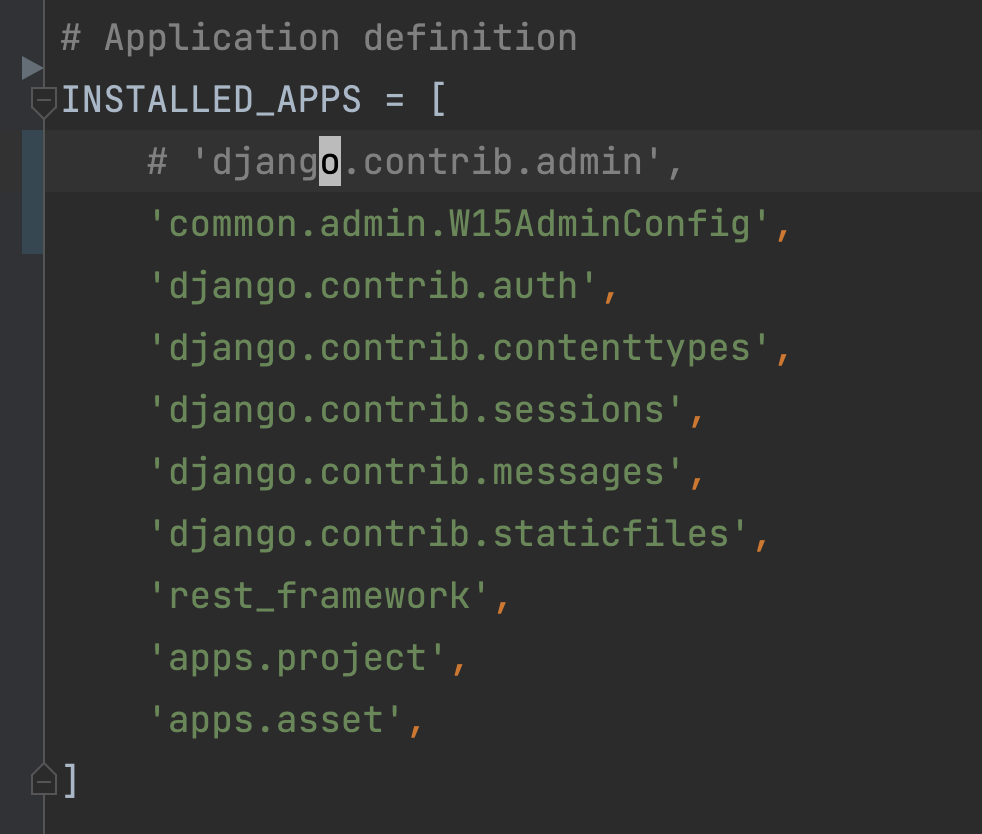
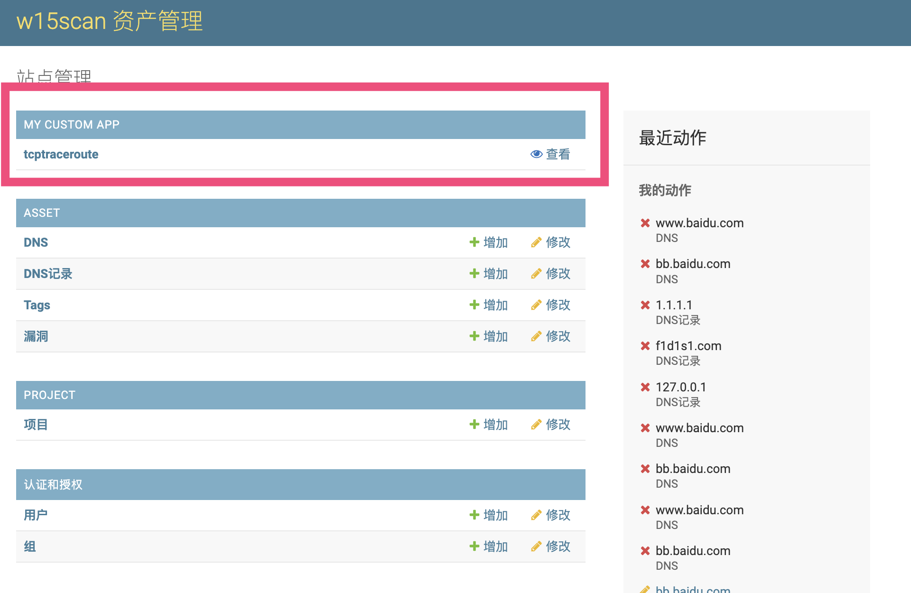
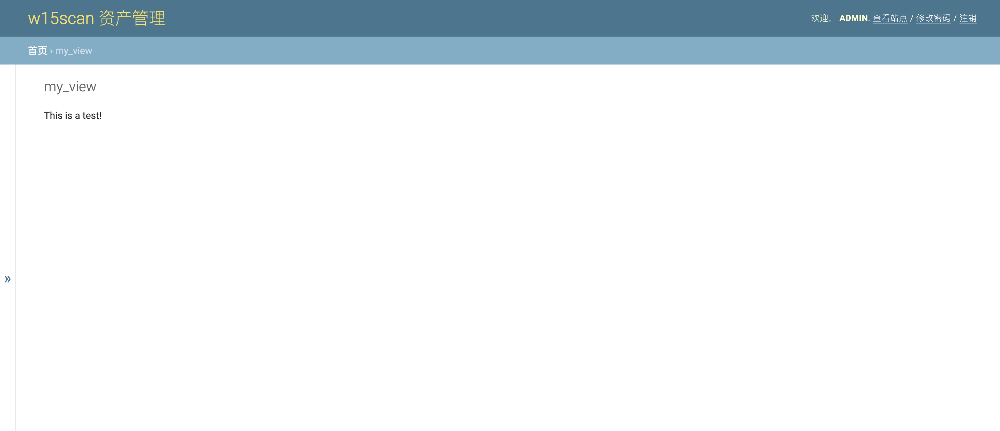

# django 自带admin 添加自定义页面

定义好数据结构，用django自带的admin就能生成一个简单的后台，对于后端来说太好了。但是想在这个后台添加自定义页面会有点麻烦，之前有写过  ，但实在感觉不太优雅，最近工作有用django，翻了翻文档，优雅的实现了一次。

使用的`django==3.2`

**settings.py**
```python 
# 定义模板目录
TEMPLATES = [
    {
        'BACKEND': 'django.template.backends.django.DjangoTemplates',
        'DIRS': [BASE_DIR / "templates"],
        'APP_DIRS': True,
        'OPTIONS': {
            'context_processors': [
                'django.template.context_processors.debug',
                'django.template.context_processors.request',
                'django.contrib.auth.context_processors.auth',
                'django.contrib.messages.context_processors.messages',
            ],
        },
    },
]

# Internationalization
# https://docs.djangoproject.com/en/3.2/topics/i18n/

LANGUAGE_CODE = 'zh-hans'

TIME_ZONE = 'Asia/Shanghai'

USE_I18N = True

USE_L10N = True

USE_TZ = True

```

新建一个`admin.py`,`default_site`路径为`admin.py`的调用路径。

基于AdminSite实现自己的admin site。

重写`get_app_list`，增加自定义的返回数据。

重写`get_urls`，增加自己的路由

增加`my_view`，实现页面逻辑
```python 
from django.contrib.admin import AdminSite
from django.contrib.admin.apps import AdminConfig
from django.template.response import TemplateResponse
from django.urls import path, reverse


class W15AdminConfig(AdminConfig):
    default_site = 'common.admin.W15Admin'


# 对后台的全局修改
class W15Admin(AdminSite):
    site_header = "w15scan 资产管理"

    # 重写首页app list
    def get_app_list(self, request):
        app_list = super().get_app_list(request)
        w15_list = [
            {
                "name": "My Custom App",
                "app_label": "my_test_app",
                # "app_url": "/admin/test_view",
                "models": [
                    {
                        "name": "tcptraceroute",
                        "object_name": "tcptraceroute",
                        "admin_url": reverse("admin:my_view"),
                        "view_only": True,
                    }
                ],
            }
        ]
        return w15_list + app_list

    def get_urls(self):
        urls = [
            path('my_view/', self.admin_view(self.my_view), name='my_view')
        ]
        urls += super().get_urls()
        return urls

    def my_view(self, request):
        context = {
            **self.each_context(request),
            "title": "my_view",
        }
        return TemplateResponse(request, "admin/test.html", context)

```

新增模板，在templates目录中增加自定义页面显示的内容 `admin/test.html`
```python 


<p>This is a test!</p>


```

**settings.py **将`django.contrib.admin`注释，新增`W15AdminConfig`的路径



最后展示界面



点击进去后


