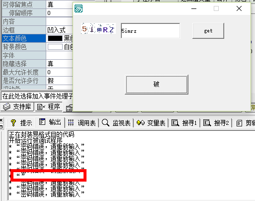
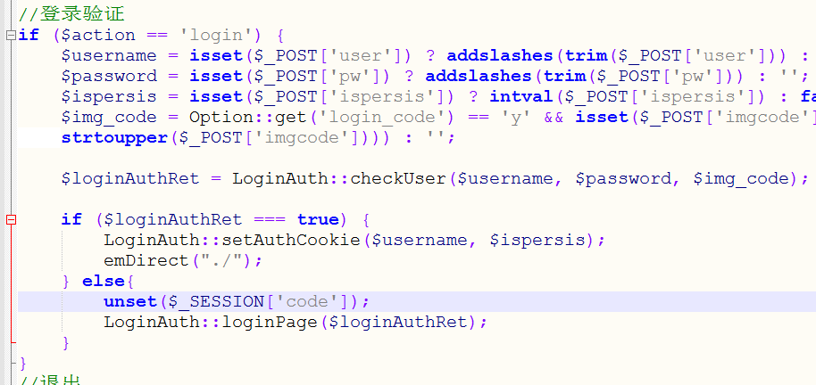
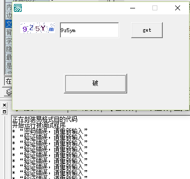

# emlog后台漏洞_可忽视验证码爆破密码

##  描述 

大家可能为了防止黑客对emlog博客后台暴力破解，在后台添加了验证码功能。 

但即使在Emlog后台添加了验证码，也不安全，就跟没添加一样的。攻击者依然可以使用爆破工具批量猜测密码

##  代码分析

登录页面，在admin/globals.php下
```js 
//登录验证
if ($action == 'login') {
	$username = isset($_POST['user']) ? addslashes(trim($_POST['user'])) : '';
	$password = isset($_POST['pw']) ? addslashes(trim($_POST['pw'])) : '';
	$ispersis = isset($_POST['ispersis']) ? intval($_POST['ispersis']) : false;
	$img_code = Option::get('login_code') == 'y' && isset($_POST['imgcode']) ? addslashes(trim(strtoupper($_POST['imgcode']))) : '';

    $loginAuthRet = LoginAuth::checkUser($username, $password, $img_code);
    
	if ($loginAuthRet === true) {
		LoginAuth::setAuthCookie($username, $ispersis);
		emDirect("./");
	} else{
		LoginAuth::loginPage($loginAuthRet);
	}
}
```

  


`LoginAuth::checkUser`是关键函数 我们看他实现的过程

是在`include\lib\loginauth.php`文件
```js 
public static function checkUser($username, $password, $imgcode, $logincode = false) {
        session_start();
        if (trim($username) == '' || trim($password) == '') {
            return false;
        } else {
            $sessionCode = isset($_SESSION['code']) ? $_SESSION['code'] : '';
            $logincode = false === $logincode ? Option::get('login_code') : $logincode;
            if ($logincode == 'y' && (empty($imgcode) || $imgcode != $sessionCode)) {
                return self::LOGIN_ERROR_AUTHCODE;
            }
            $userData = self::getUserDataByLogin($username);
            if (false === $userData) {
                return self::LOGIN_ERROR_USER;
            }
            $hash = $userData['password'];
            if (true === self::checkPassword($password, $hash)){
                return true;
            } else{
                return self::LOGIN_ERROR_PASSWD;
            }
        }
		
}
```

`SESSION`验证方面都不错，当登录失败会调用loginPage方法
```php 
public static function loginPage($errorCode = NULL) {
        Option::get('login_code') == 'y' ?
        $ckcode = "<span>验证码</span>
        <div class=\"val\"><input name=\"imgcode\" id=\"imgcode\" type=\"text\" />
        </div>" :
        $ckcode = '';
        $error_msg = '';
        if ($errorCode) {
			//unset($_SESSION['code']);
            switch ($errorCode) {
                case self::LOGIN_ERROR_AUTHCODE:
                    $error_msg = '验证错误，请重新输入';
                    break;
                case self::LOGIN_ERROR_USER:
                    $error_msg = '用户名错误，请重新输入';
                    break;
                case self::LOGIN_ERROR_PASSWD:
                    $error_msg = '密码错误，请重新输入';
                    break;
            }
        }
        require_once View::getView('login');
        View::output();
    }
```


但是整个登录流程并没有立即对验证码的`SESSION`进行销毁。便导致了漏洞的产生

利用：整个流程中，只需要获取一次验证码，接下来就不用获取便可爆破了。 

为了证实猜想，用易语言写了个简单的工具 



先获取一次验证码 

将密码随机写入脚本，进行登录验证，可以看到，调试出来的就是我们爆破信息，第六个空就是我们正确密码爆破成功的标志 

##  解决办法 

登录验证的代码上销毁验证码的`session`即可 `admin/globals.php`

` unset($_SESSION['code']);`



  


此时我们在用程序爆破测试 

可以看到，除了第一个密码错误以外，其他都需要验证码 


