# furious 网络扫描器 代码学习

## furious 网络扫描器 代码学习

最近在学习go，用go写的代码都会康康

地址:https://github.com/liamg/furious

> Furious is a fast, lightweight, portable network scanner.

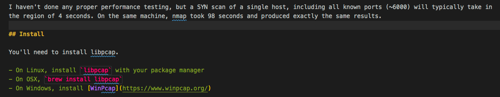

看介绍，扫描6000个端口只发送一个sync包，用时4秒，安装要求上需要`libpcap`,之前ksubdomain也是用的`libpcap`，所以康康它咋写的
```go 
ctx, cancel := context.WithCancel(context.Background())
c := make(chan os.Signal, 1)
signal.Notify(c, os.Interrupt)
go func() {
  <-c
  fmt.Println("Scan cancelled. Requesting stop...")
  cancel()
}()

```

在主线程中定义信号量，方便取消。

扫描的主函数

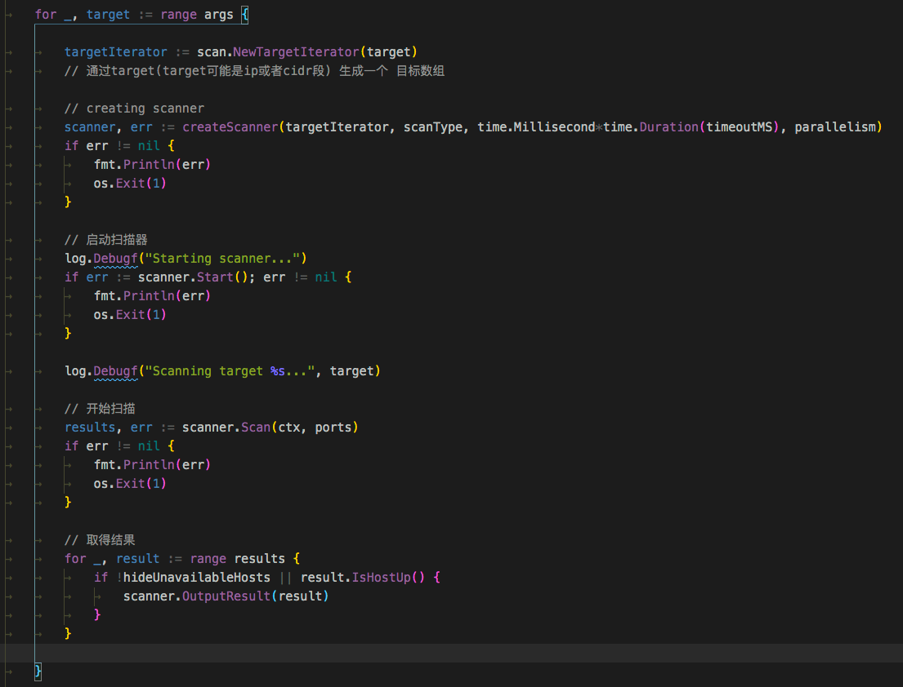

整个扫描流程中会先依次调用`Start()`、`Scan()`、然后使用`range results`取得结果

创建扫描器

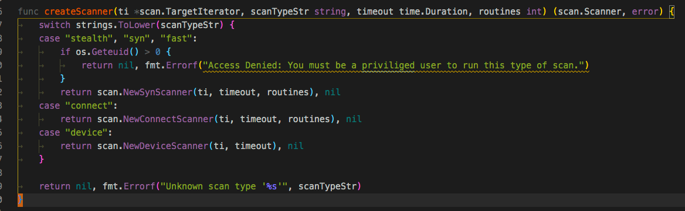

可以看到扫描类型有五种`stealth`、`syn`、`fast`、`connect`、`device`

为扫描器实现了一个接口

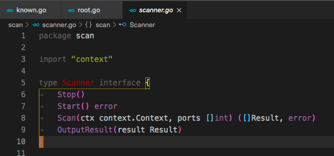

三种扫描类型都实现了这个接口


### scan-connect

先看看`scan-connect.go`

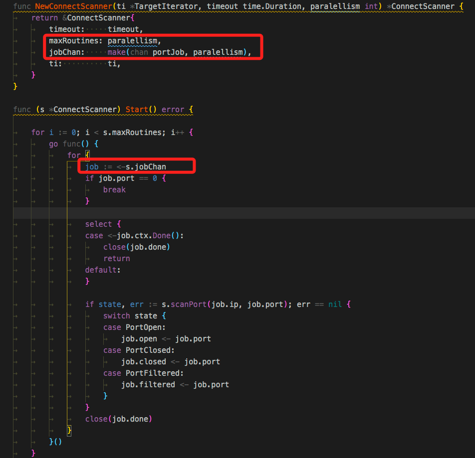

`start`中实现了一个小协程池,并使用tcp连接 扫描端口

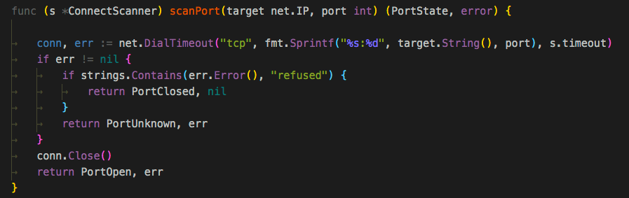

`scan`中先遍历ip再遍历端口组合数据`jobChan`数据

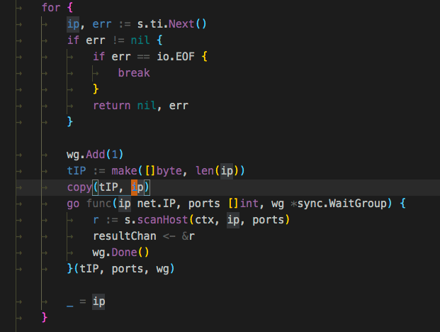

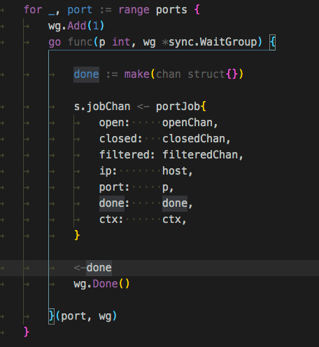

全部扫描结束后才会返回数据。

### scan-device

`start()`为空，主要逻辑在`scan()`函数

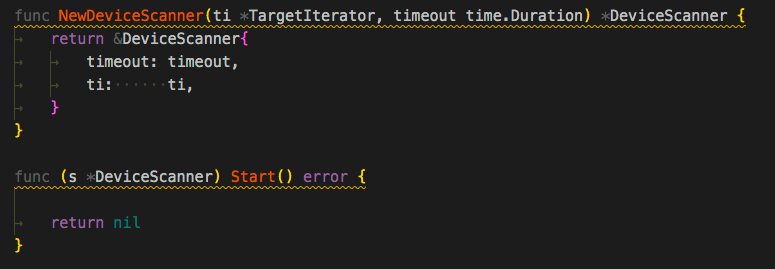

调用第三方arp库`github.com/mostlygeek/arp`扫描

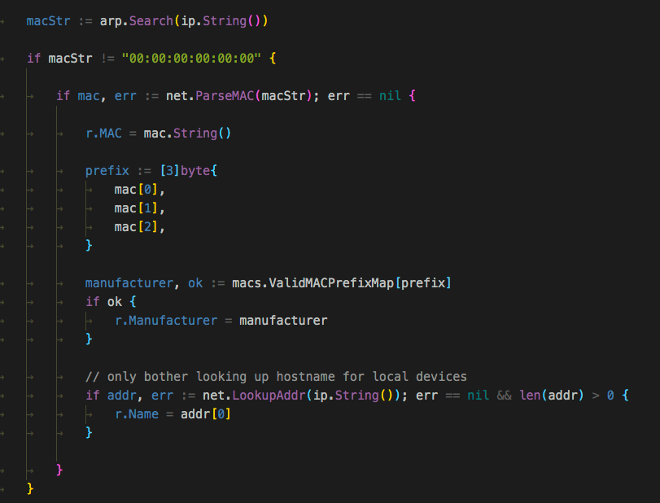

后面也会对每个ip的1端口建立一个连接来确定延迟

### scan-syn

它的扫描逻辑主要调用`pcap`，然后自己组合tcp包发送

贴一下代码叭，一看就能懂大概,源代码在https://github.com/liamg/furious/blob/master/scan/scan-syn.go
```go 
func (s *SynScanner) scanHost(job hostJob) (Result, error) {

    result := NewResult(job.ip)

    select {
    case <-job.ctx.Done():
      return result, nil
    default:
    }

    router, err := routing.New()
    if err != nil {
        return result, err
    }
    networkInterface, gateway, srcIP, err := router.Route(job.ip)
    if err != nil {
        return result, err
    }

    handle, err := pcap.OpenLive(networkInterface.Name, 65535, true, pcap.BlockForever)
    if err != nil {
        return result, err
    }
    defer handle.Close()

    openChan := make(chan int)
    closedChan := make(chan int)
    filteredChan := make(chan int)
    doneChan := make(chan struct{})

    startTime := time.Now()

    go func() {
        for {
            select {
            case open := <-openChan:
                if open == 0 {
                    close(doneChan)
                    return
                }
                if result.Latency < 0 {
                    result.Latency = time.Since(startTime)
                }
                for _, existing := range result.Open {
                    if existing == open {
                        continue
                    }
                }
                result.Open = append(result.Open, open)
            case closed := <-closedChan:
                if result.Latency < 0 {
                    result.Latency = time.Since(startTime)
                }
                for _, existing := range result.Closed {
                    if existing == closed {
                        continue
                    }
                }
                result.Closed = append(result.Closed, closed)
            case filtered := <-filteredChan:
                if result.Latency < 0 {
                    result.Latency = time.Since(startTime)
                }
                for _, existing := range result.Filtered {
                    if existing == filtered {
                        continue
                    }
                }
                result.Filtered = append(result.Filtered, filtered)
            }
        }
    }()

    rawPort, err := freeport.GetFreePort()
    if err != nil {
        return result, err
    }

    // 首先获取网关的mac地址
    hwaddr, err := s.getHwAddr(job.ip, gateway, srcIP, networkInterface)
    if err != nil {
        return result, err
    }

    // 组合网络的各个数据层
    eth := layers.Ethernet{
        SrcMAC:       networkInterface.HardwareAddr,
        DstMAC:       hwaddr,
        EthernetType: layers.EthernetTypeIPv4,
    }
    ip4 := layers.IPv4{
        SrcIP:    srcIP,
        DstIP:    job.ip,
        Version:  4,
        TTL:      255,
        Protocol: layers.IPProtocolTCP,
    }
    tcp := layers.TCP{
        SrcPort: layers.TCPPort(rawPort),
        DstPort: 0,
        SYN:     true,
    }
    tcp.SetNetworkLayerForChecksum(&ip4)

    listenChan := make(chan struct{})

    ipFlow := gopacket.NewFlow(layers.EndpointIPv4, job.ip, srcIP)

  // 接收数据
    go func() {

        eth := &layers.Ethernet{}
        ip4 := &layers.IPv4{}
        tcp := &layers.TCP{}

        parser := gopacket.NewDecodingLayerParser(layers.LayerTypeEthernet, eth, ip4, tcp)

        for {

            select {
            case <-job.ctx.Done():
                break
            default:
            }

            // Read in the next packet.
            data, _, err := handle.ReadPacketData()
            if err == pcap.NextErrorTimeoutExpired {
                break
            } else if err == io.EOF {
                break
            } else if err != nil {
                // connection closed
                fmt.Printf("Packet read error: %s\n", err)
                continue
            }

            decoded := []gopacket.LayerType{}
            if err := parser.DecodeLayers(data, &decoded); err != nil {
                continue
            }
            for _, layerType := range decoded {
                switch layerType {
                case layers.LayerTypeIPv4:
                    if ip4.NetworkFlow() != ipFlow {
                        continue
                    }
                case layers.LayerTypeTCP:
                    if tcp.DstPort != layers.TCPPort(rawPort) {
                        continue
                    } else if tcp.SYN && tcp.ACK {
                        openChan <- int(tcp.SrcPort)
                    } else if tcp.RST {
                        closedChan <- int(tcp.SrcPort)
                    }
                }
            }

        }

        close(listenChan)

    }()

    for _, port := range job.ports {
        tcp.DstPort = layers.TCPPort(port)
        _ = s.send(handle, ð, &ip4, &tcp)
    }

    timer := time.AfterFunc(s.timeout, func() { handle.Close() })
    defer timer.Stop()

    <-listenChan

    close(openChan)
    <-doneChan

    return result, nil
}

```

获取一个本地没使用的端口作为发送端口，截取返回的数据包，如果包含了这个端口说明端口开放。

### 下载公共端口数据

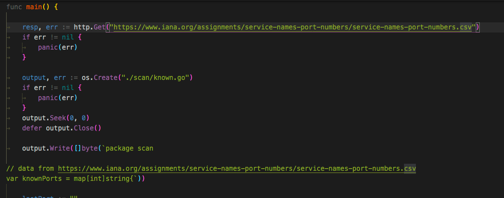

https://www.iana.org/assignments/service-names-port-numbers/service-names-port-numbers.csv

下载文件处理后，会保存为`known.go`

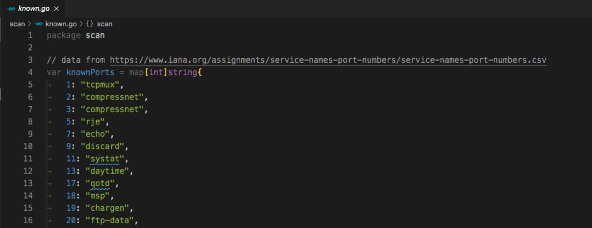

### 其他

并发方面有点混乱，pcap获取网关地址那部分值得学习，其他地方，感觉一般般，用来扫内网还行，扫外网速度也不行。
