# goby指纹提取与yara逆向

goby识别指纹的功能很不错，想试试能不能把goby指纹识别里面的指纹提取出来，移植到自己的扫描器中,结果后面到了逆向虚拟机的程度。。 

## goby的crules

在goby 最初的版本中，翻看了一些感兴趣的资源文件后看到有个`crules`文件。

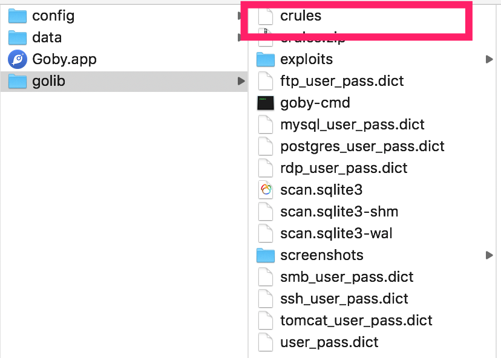

它的文件头是yara文件

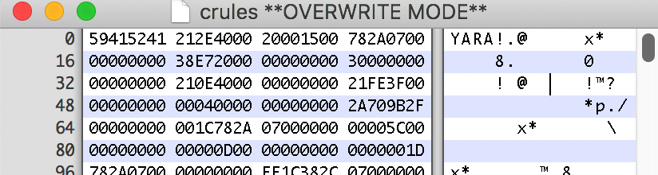

并且里面包含了它的指纹

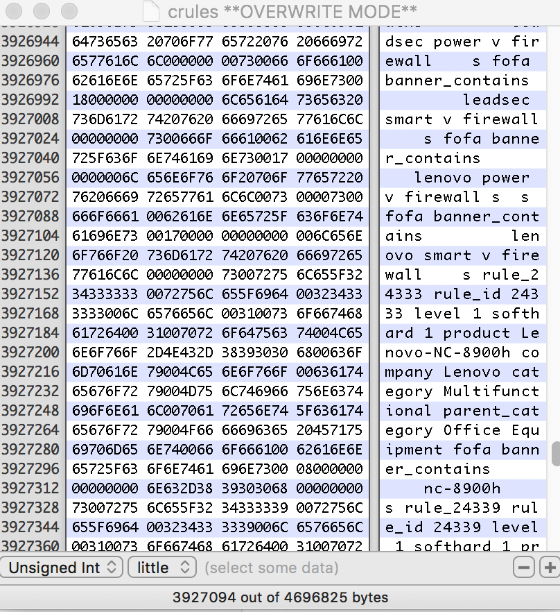

通过文本提取，可以把指纹规则提取出来，但是多个指纹规则之间有`and`、`or`之类的逻辑关系，并不清楚。

### 新版的crules提取

现在goby使用了最新的go版本`1.16`

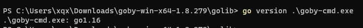

在go1.16，嵌入资源有个官方实现，叫`go embed`，可以根据在二进制中搜索`embed.FS`来确认是否使用了这个特性。

然后我自己测试了一下，看看`go embed`内嵌资源是如何实现的，结果发现资源直接在二进制中明文显示。

于是搜索`YARA`关键字，就能再次定位到goby的指纹规则部分。

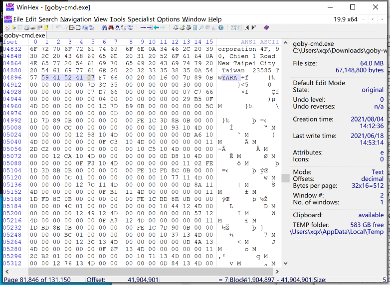

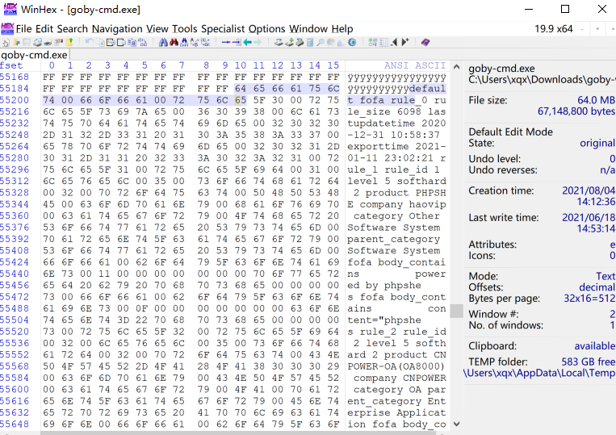

## yara结构分析

因为不知道指纹规则之间的逻辑关系如何提取，所以只能看yara代码是怎么做的。

看到goby使用了这个库`https://github.com/hillu/go-yara`，应该就是用来解析规则的，看这个库的实现，它只是c版本yara源码的封装，所以还是要去看yara的代码。

官方仓库是 https://github.com/VirusTotal/yara

我下载了2.0 3.0 和4.x最新版的源码，发现里面的文件版本和这个都对不上。一度怀疑是魔改的yara？

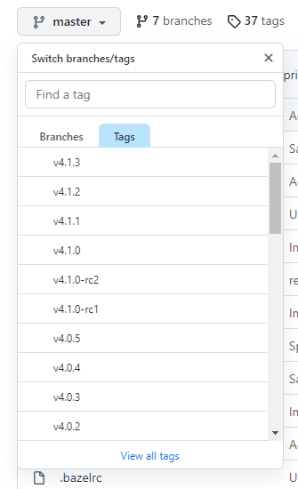

yara编译后文件的规则真是多变,并且每个版本的规则还不兼容。。这上面踩了一下坑。

最后我在`yara-3.10.0`找到了可以符合goby crules文件头的代码

### yara加载编译后的文件

在`yr_arena_load_stream`，可以看到读取magic为yara的标记以及版本判断相关代码。

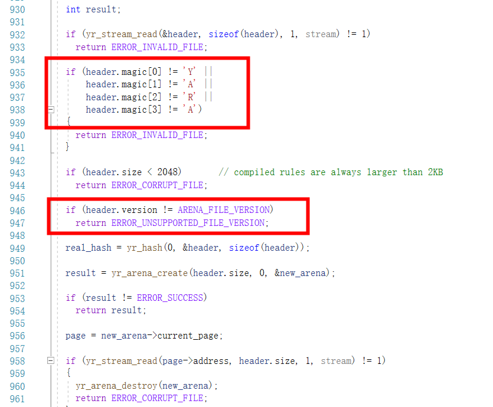

crules文件开头对应的数据结构如下
```C 
typedef struct _ARENA_FILE_HEADER
{
  char      magic[4];
  uint32_t  size;
  uint32_t  version;

} ARENA_FILE_HEADER;

```

之后读取指定长度的字节后，剩余的字节都是用于重定向地址用

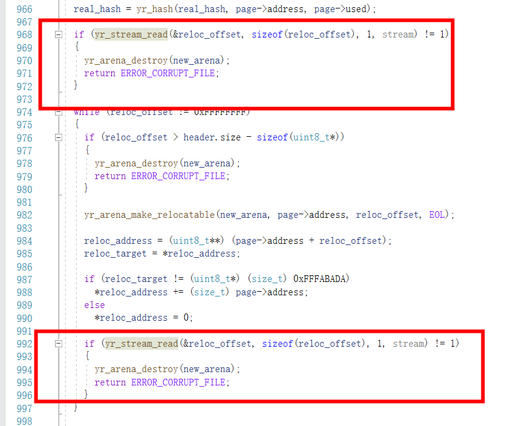

再之后在 `yr_rules_load_stream`，先通过一个结构映射头
```c++ 
typedef struct _YARA_RULES_FILE_HEADER
{
  DECLARE_REFERENCE(YR_RULE*, rules_list_head);
  DECLARE_REFERENCE(YR_EXTERNAL_VARIABLE*, externals_list_head);
  DECLARE_REFERENCE(const uint8_t*, code_start);
  DECLARE_REFERENCE(YR_AC_MATCH_TABLE, match_table);
  DECLARE_REFERENCE(YR_AC_TRANSITION_TABLE, transition_table);

} YARA_RULES_FILE_HEADER;

```

然后再解析出每个节的地址。

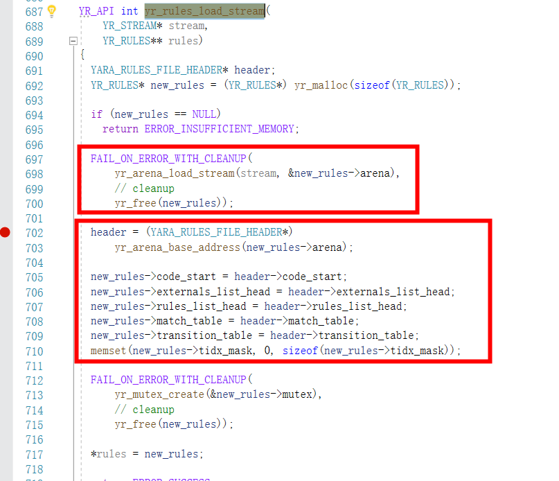
```c++ 
  new_rules->code_start = header->code_start;
  new_rules->externals_list_head = header->externals_list_head;
  new_rules->rules_list_head = header->rules_list_head;
  new_rules->match_table = header->match_table;
  new_rules->transition_table = header->transition_table;

```

得到每个表的位置。yara编译后的文件加载过程到此完成。

简单来说，文件头前面一部分是映射为`_ARENA_FILE_HEADER`的结构，再之后的结构就是一些表的地址。

### yara结构总结

说的可能比较抽象，得自己看yara代码，不断去调试，大概就知道yara是怎么处理和加载编译后的yara文件的了。

yara的编译机制就是把内存中的yara数据结构保存为一个文件，然后对一些重定向内容做一些处理。

加载过程也是同理，之后程序运行位置交到`new_rules->code_start`这个地址上，它将会运行yara的虚拟机程序，虚拟机对所有规则做出判断。

## yara虚拟机

整个虚拟机执行在`exec.c`文件的`yr_execute_code`函数上，在上面打上断点。

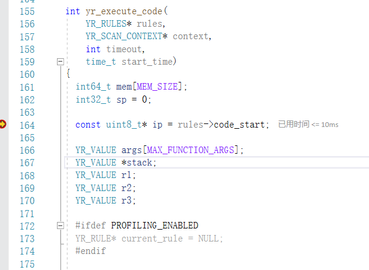

此时的调用堆栈

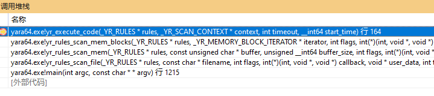

单步运行下来，发现这是一个栈式虚拟机，从地址获取opcode，根据opcode执行。

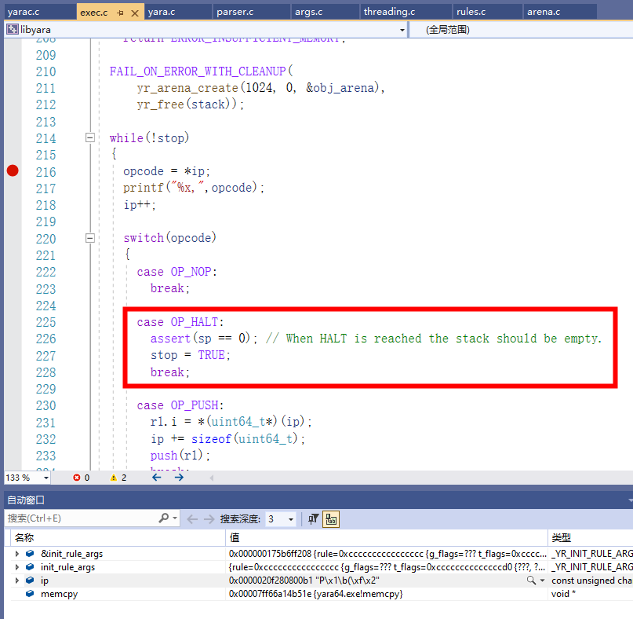

`OP_HALT`是中断标志，这个opcode出现代表执行完毕。

`exec.h`定义了各种opcode和int的关系

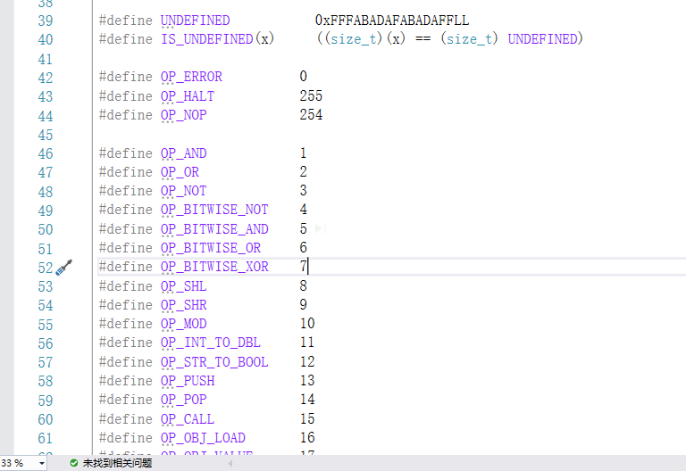

经过调试，发现每次规则开始的时候，都会调用`OP_INIT_RULE`，

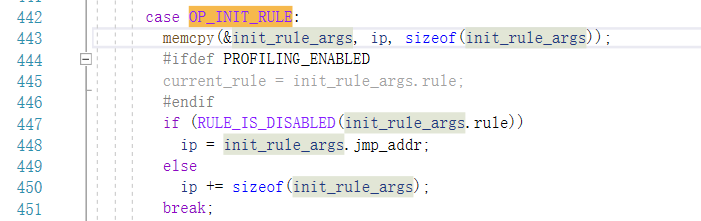

这个执行地址后面的地址就是RULE的数据结构，记录了meta等信息。
```C 
typedef struct _YR_INIT_RULE_ARGS
{
  DECLARE_REFERENCE(YR_RULE*, rule);
  DECLARE_REFERENCE(const uint8_t*, jmp_addr);

} YR_INIT_RULE_ARGS;

```
```C 
typedef struct _YR_RULE
{
  int32_t g_flags;               // Global flags
  int32_t t_flags[MAX_THREADS];  // Thread-specific flags

  DECLARE_REFERENCE(const char*, identifier);
  DECLARE_REFERENCE(const char*, tags);
  DECLARE_REFERENCE(YR_META*, metas);
  DECLARE_REFERENCE(YR_STRING*, strings);
  DECLARE_REFERENCE(YR_NAMESPACE*, ns);

  // Used only when PROFILING_ENABLED is defined
  clock_t clock_ticks;

} YR_RULE;

```
```c 
typedef struct _YR_META
{
  int32_t type;
  YR_ALIGN(8) int64_t integer;

  DECLARE_REFERENCE(const char*, identifier);
  DECLARE_REFERENCE(char*, string);

} YR_META;

```

通过对虚拟机整个执行过程的理解，可以编写一个yara反编译器了。

搜索了下github，有一个开源的 https://github.com/jbgalet/yaradec，但是不支持这个版本，需要自己改改。

所以我根据yara源码和这个开源的反编译器，编写了一个yara反编译器。

### 反编译

运行反编译器，将yara的opcode转换为指令的形式，我的反编译器运行后输出如下

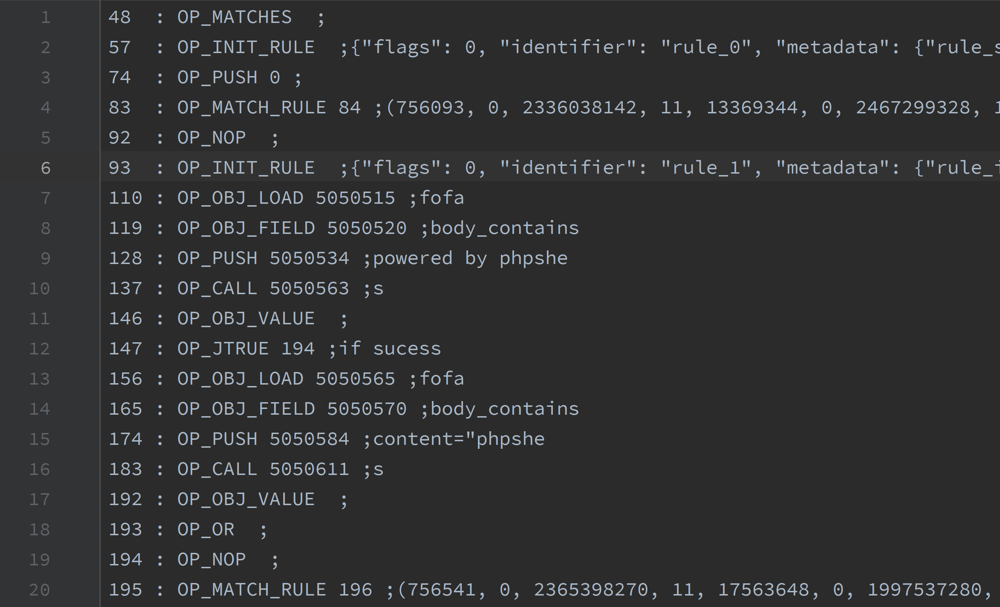

有的opcode会和一些字符串作关联，所以我把它读取出来放到注释部分，opcode就是yara定义的opcode，最前面的数字代表当前执行的位置，因为有的语句会跳转到其他位置，方便看。

接下来就是理解这些yara指令了。

一个简单的例子
``` 
205    : OP_INIT_RULE  ;{"flags": 0, "identifier": "rule_2", "metadata": {"rule_id": "2", "level": "5", "softhard": "2", "product": "CNPOWER-OA(OA8000)", "company": "CNPOWER", "category": "OA", "parent_category": "Enterprise Application"}, "ns": "default:"}
222    : OP_OBJ_LOAD 5050743 ;fofa
231    : OP_OBJ_FIELD 5050748 ;body_contains
240    : OP_PUSH 5050762 ;/oaapp/webobjects/oaapp.woa
249    : OP_CALL 5050801 ;s
258    : OP_OBJ_VALUE  ;
259    : OP_MATCH_RULE 260 ;

```

`OP_INIT_RULE` 是初始化这个规则的meta信息

`OP_OBJ_LOAD` 是载入fofa模块

`OP_OBJ_FIELD`是模块的字段，即 body_contains

`OP_PUSH` 将`/oaapp/webobjects/oaapp.woa`压入堆栈

之后`OP_CALL`调用函数，`OP_OBJ_VALUE` 获取结果，`OP_MATCH_RULE`匹配完成。

所以，可以想象这一段指令对应的原先规则为
``` 
fofa.body_contains("/oaapp/webobjects/oaapp.woa")

```

### 规则逻辑的反编译

上述是一个简单匹配过程，如果一些规则含有逻辑运算，是怎样的呢？

例如下面的例子
``` 
445    : OP_INIT_RULE  ;{"flags": 0, "identifier": "rule_5", "metadata": {"rule_id": "5", "level": "3", "softhard": "2", "product": "MongoDb", "company": "MongoDB, Inc", "category": "Database System", "parent_category": "Software System"}, "ns": "default:"}
462    : OP_OBJ_LOAD 5051424 ;fofa
471    : OP_OBJ_FIELD 5051429 ;body_contains
480    : OP_PUSH 5051443 ;<a href="/_replset">replica set status</a></p>
489    : OP_CALL 5051501 ;s
498    : OP_OBJ_VALUE  ;
499    : OP_JTRUE 642 ;if sucess
508    : OP_OBJ_LOAD 5051503 ;fofa
517    : OP_OBJ_FIELD 5051508 ;protocol_contains
526    : OP_PUSH 5051526 ;mongodb
535    : OP_CALL 5051545 ;s
544    : OP_OBJ_VALUE  ;
545    : OP_JTRUE 640 ;if sucess
554    : OP_OBJ_LOAD 5051547 ;fofa
563    : OP_OBJ_FIELD 5051552 ;body_contains
572    : OP_PUSH 5051566 ;you are trying to access mongodb
581    : OP_CALL 5051610 ;s
590    : OP_OBJ_VALUE  ;
591    : OP_JTRUE 638 ;if sucess
600    : OP_OBJ_LOAD 5051612 ;fofa
609    : OP_OBJ_FIELD 5051617 ;title_contains
618    : OP_PUSH 5051632 ;mongod.exe
627    : OP_CALL 5051654 ;s
636    : OP_OBJ_VALUE  ;
637    : OP_OR  ;
638    : OP_NOP  ;
639    : OP_OR  ;
640    : OP_NOP  ;
641    : OP_OR  ;
642    : OP_NOP  ;
643    : OP_MATCH_RULE 644 ;

```

从这段指令可以精简为
``` 
验证规则1
验证规则2
验证规则3
验证规则4
or
or
or

```

可以看出这是一个后缀表达式(逆波兰表达式)处理的逻辑关系。

要提取逻辑表达式的话，就是把这段后缀表达式转换为可读的中缀表达式。

我写了一个python脚本来完成这个操作
```python 
def zhuanh(l: list):
    l.reverse()
    s = []
    fuhao = ['OP_AND', 'OP_OR', 'OP_NOT']
    while len(l) > 0:
        x = l.pop()
        if x not in fuhao:
            s.append(x)
        else:
            r1 = s.pop()
            if x == 'OP_NOT':
                s.append("!{}".format(r1))
            else:
                r2 = s.pop()
                x = x.replace("OP_AND", "and")
                x = x.replace("OP_OR", "or")
                s.append(f"({r1} {x} {r2})")
    if len(s) != 1:
        raise Exception("错误")
    return s[0]


if __name__ == '__main__':
    a = [1, 2, 3, 4, 'OP_OR', 'OP_OR', 'OP_OR']
    s = zhuanh(a)
    print(s)

```

1,2,3,4代表这四个规则，最后输出结果即

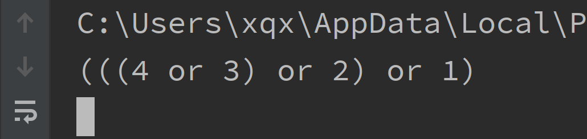

接下来找一个规则复杂一些的尝试一下
``` 
1229    : OP_INIT_RULE  ;{"flags": 0, "identifier": "rule_9", "metadata": {"rule_id": "9", "level": "5", "softhard": "2", "product": "TongDa-OA", "company": "TongTa", "category": "OA", "parent_category": "Enterprise Application"}, "ns": "default:"}
1246    : OP_OBJ_LOAD 5052822 ;fofa
1255    : OP_OBJ_FIELD 5052827 ;body_contains
1264    : OP_PUSH 5052841 ;/static/templates/2013_01/index.css/
1273    : OP_CALL 5052889 ;s
1282    : OP_OBJ_VALUE  ;
1283    : OP_JTRUE 1810 ;if sucess
1292    : OP_OBJ_LOAD 5052891 ;fofa
1301    : OP_OBJ_FIELD 5052896 ;body_contains
1310    : OP_PUSH 5052910 ;javascript:document.form1.uname.focus()
1319    : OP_CALL 5052961 ;s
1328    : OP_OBJ_VALUE  ;
1329    : OP_JTRUE 1808 ;if sucess
1338    : OP_OBJ_LOAD 5052963 ;fofa
1347    : OP_OBJ_FIELD 5052968 ;body_contains
1356    : OP_PUSH 5052982 ;href="/static/images/tongda.ico"
1365    : OP_CALL 5053026 ;s
1374    : OP_OBJ_VALUE  ;
1375    : OP_JTRUE 1806 ;if sucess
1384    : OP_OBJ_LOAD 5053028 ;fofa
1393    : OP_OBJ_FIELD 5053033 ;body_contains
1402    : OP_PUSH 5053047 ;<link rel="shortcut icon" href="/images/tongda.ico" />
1411    : OP_CALL 5053113 ;s
1420    : OP_OBJ_VALUE  ;
1421    : OP_JTRUE 1804 ;if sucess
1430    : OP_OBJ_LOAD 5053115 ;fofa
1439    : OP_OBJ_FIELD 5053120 ;body_contains
1448    : OP_PUSH 5053134 ;oa提示：不能登录oa
1457    : OP_CALL 5053171 ;s
1466    : OP_OBJ_VALUE  ;
1467    : OP_JFALSE 1514 ;if sucess
1476    : OP_OBJ_LOAD 5053173 ;fofa
1485    : OP_OBJ_FIELD 5053178 ;body_contains
1494    : OP_PUSH 5053192 ;紧急通知：今日10点停电
1503    : OP_CALL 5053236 ;s
1512    : OP_OBJ_VALUE  ;
1513    : OP_AND  ;
1514    : OP_NOP  ;
1515    : OP_JTRUE 1802 ;if sucess
1524    : OP_OBJ_LOAD 5053238 ;fofa
1533    : OP_OBJ_FIELD 5053243 ;title_contains
1542    : OP_PUSH 5053258 ;office anywhere 2013
1551    : OP_CALL 5053290 ;s
1560    : OP_OBJ_VALUE  ;
1561    : OP_JTRUE 1800 ;if sucess
1570    : OP_OBJ_LOAD 5053292 ;fofa
1579    : OP_OBJ_FIELD 5053297 ;title_contains
1588    : OP_PUSH 5053312 ;office anywhere 2015
1597    : OP_CALL 5053344 ;s
1606    : OP_OBJ_VALUE  ;
1607    : OP_JTRUE 1798 ;if sucess
1616    : OP_OBJ_LOAD 5053346 ;fofa
1625    : OP_OBJ_FIELD 5053351 ;body_contains
1634    : OP_PUSH 5053365 ;tongda.ico
1643    : OP_CALL 5053387 ;s
1652    : OP_OBJ_VALUE  ;
1653    : OP_JFALSE 1748 ;if sucess
1662    : OP_OBJ_LOAD 5053389 ;fofa
1671    : OP_OBJ_FIELD 5053394 ;title_contains
1680    : OP_PUSH 5053409 ;oa
1689    : OP_CALL 5053423 ;s
1698    : OP_OBJ_VALUE  ;
1699    : OP_JTRUE 1746 ;if sucess
1708    : OP_OBJ_LOAD 5053425 ;fofa
1717    : OP_OBJ_FIELD 5053430 ;title_contains
1726    : OP_PUSH 5053445 ;办公
1735    : OP_CALL 5053463 ;s
1744    : OP_OBJ_VALUE  ;
1745    : OP_OR  ;
1746    : OP_NOP  ;
1747    : OP_AND  ;
1748    : OP_NOP  ;
1749    : OP_JTRUE 1796 ;if sucess
1758    : OP_OBJ_LOAD 5053465 ;fofa
1767    : OP_OBJ_FIELD 5053470 ;body_contains
1776    : OP_PUSH 5053484 ;class="style1">新oa办公系统
1785    : OP_CALL 5053528 ;s
1794    : OP_OBJ_VALUE  ;
1795    : OP_OR  ;
1796    : OP_NOP  ;
1797    : OP_OR  ;
1798    : OP_NOP  ;
1799    : OP_OR  ;
1800    : OP_NOP  ;
1801    : OP_OR  ;
1802    : OP_NOP  ;
1803    : OP_OR  ;
1804    : OP_NOP  ;
1805    : OP_OR  ;
1806    : OP_NOP  ;
1807    : OP_OR  ;
1808    : OP_NOP  ;
1809    : OP_OR  ;
1810    : OP_NOP  ;
1811    : OP_MATCH_RULE 1812 ;

```

优化为的后缀表达式
``` 
1
2
3
4
5
6
and
7
8
9
10
11
or
and
12
or
or
or
or
or
or
or
or

```

后缀表达式转中缀表达式结果
``` 
((((((((12 or ((11 or 10) and 9)) or 8) or 7) or (6 and 5)) or 4) or 3) or 2) or 1)

```

就这样，能将所有规则之间的逻辑关系处理了。

中缀表达式处理程序有一个小问题，就是表达式的括号会很多，这个自行优化下吧 = - 

## 最后

我将规则处理为了json格式，方便阅读和扫描器引用，类似如下

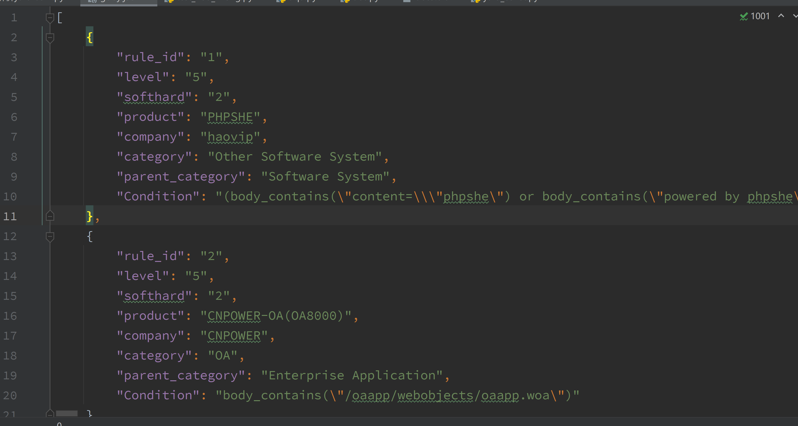

goby因为只需要访问一次首页，剩下的由yara规则进行识别，所以速度会很快。用yara识别web指纹学习到了。

那么能不能直接用yara调用goby的指纹呢？

理论上是可以的，只是需要自己写一个名称为`fofa`的模块，实现所有判断的方法，在编译到yara中。

## 知识星球


