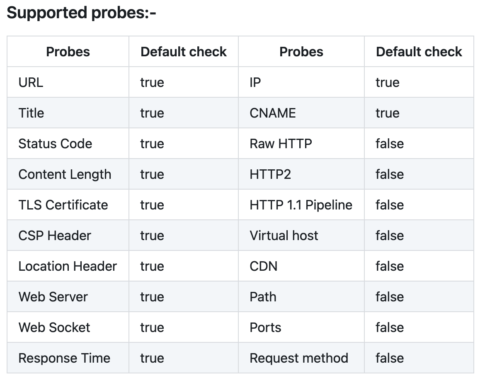
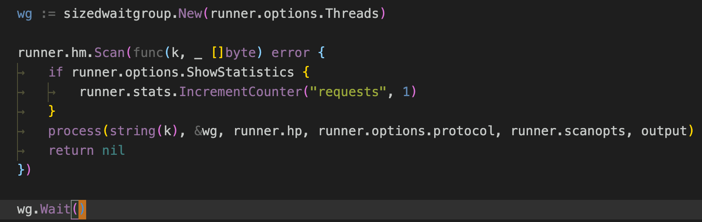
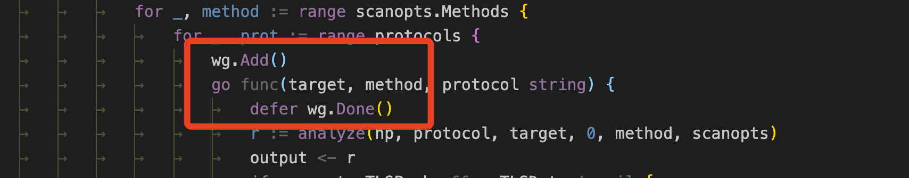
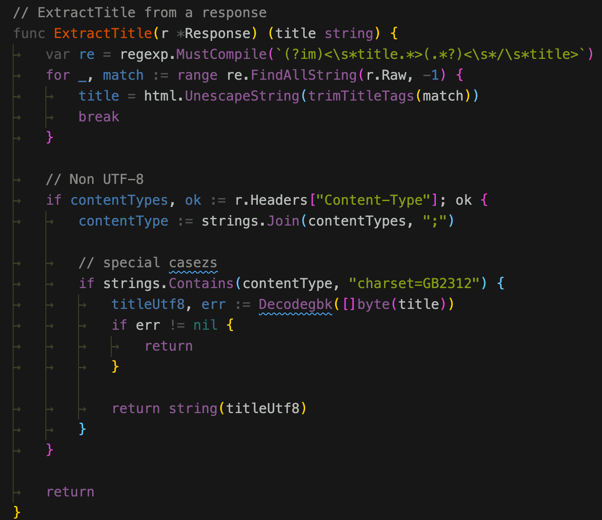
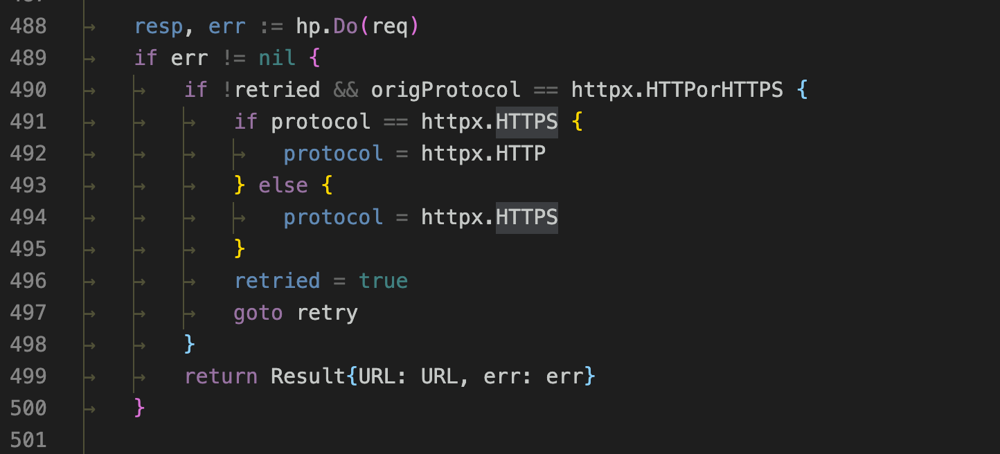

# projectdiscovery之httpx源码学习

> httpx is a fast and multi-purpose HTTP toolkit allows to run multiple probers using retryablehttp library, it is designed to maintain the result reliability with increased threads. 

httpx是一个多功能的http请求工具包，通常可以用它来批量探测资产的一些基本信息。 

源码地址：https://github.com/projectdiscovery/httpx

支持的探针有 



通常情况下，实现一个类似的工具是很容易的，如果用python来写 
```python 
import requests
url = "https://x.hacking8.com"
r = requests.get(url)
resp = r.text
status_code = r.status_code

```

就可以获得大部分探针的信息，但要做成一个工程化的软件，就要考虑更多问题。 

如何处理go的并发，如何加快请求速度，如何进行原生http请求以及如何工程化的组织go的源码框架，看了httpx的源码，这些都挺有收获的，所以写一篇源码记录。 

##  基础结构 

源码目录 
``` 
.
├── cmd
│   └── httpx # 程序编译目录
├── common # 公共函数
│   ├── customheader # 自定义header的一些处理
│   ├── customports # 自定义端口的处理
│   ├── fileutil # 文件处理
│   ├── httputilz # http处理
│   ├── httpx # 一些探针
│   ├── iputil # ip处理
│   ├── slice # go切片处理
│   └── stringz # string函数
├── internal # 运行处理主目录
│   └── runner
├── scripts # 不重要
└── static # 不重要

```

进入到`cmd/httpx/httpx.go`
```go 
package main

import (
    "github.com/projectdiscovery/gologger"
    "github.com/projectdiscovery/httpx/internal/runner"
)

func main() {
    // 解析参数
    options := runner.ParseOptions()

    // 启动，初始化工作
    run, err := runner.New(options)
    if err != nil {
        gologger.Fatalf("Could not create runner: %s\n", err)
    }

    // 运行
    run.RunEnumeration()

    // 关闭
    run.Close()
}

```

就是它编译成命令行的主文件,整个程序的流程一目了然言简意赅。 

##  Go的并发处理 

在http的请求中，最好对go协程的并发做一些限制，类似于`线程池`的概念。 

httpx使用了`https://github.com/remeh/sizedwaitgroup`的库 





使用也很简单，初始化之后，在要使用协程之前`wg.Add()`,使用协程后`wg.Done()`代表结束即可。 

以上只是对协程数做了限制，如果还想对**每秒并行的协程数量** 做限制，可以参考projectdiscover另一个项目`nuclei`，它在使用了`sizedwaitgroup`的基础上，还使用了`go.uber.org/ratelimit`

使用更加简单 
```go 
package main

import (
    "fmt"
    "time"

    "go.uber.org/ratelimit"
)

func main() {
    rl := ratelimit.New(1) // per second

    prev := time.Now()
    for i := 0; i < 10; i++ {
        now := rl.Take() // 重点是它
        if i > 0 {
            fmt.Println(i, now.Sub(prev))
        }
        prev = now
    }

}

```

初始化后在协程中调用`Take()`方法即可。 

##  探针 

httpx支持了很多基于http的基础探针，看几个有意思的。 

探针的实现大部分在`common/httpx`目录。 

###  Cdn check 

`common/httpx/cdn.go`

在以前看`naabu`时也看到过 [projectdiscover之naabu 端口扫描器源码学习](projectdiscover之naabu%20端口扫描器源码学习.md)

> 顾名思义，跟踪一下，发现cdn检查调用的是`github.com/projectdiscovery/cdncheck`中的项目。 
> 
> 通过接口获取一些CDN的ip段，判断ip是否在这些ip段中 

###  CSP 

`common/httpx/csp.go`

主要是获取header中的响应头 
```go 
// CSPHeaders is an incomplete list of most common CSP headers
var CSPHeaders []string = []string{
    "Content-Security-Policy",               // standard
    "Content-Security-Policy-Report-Only",   // standard
    "X-Content-Security-Policy-Report-Only", // non - standard
    "X-Webkit-Csp-Report-Only",              // non - standard
}

```

###  HTTP2.0 

httpx支持`http2.0`的探针，但不太明白实际中这个作用是什么 
```go 
httpx.client2 = &http.Client{
        Transport: &http2.Transport{
            TLSClientConfig: &tls.Config{
                InsecureSkipVerify: true,
            },
            AllowHTTP: true,
        },
        Timeout: httpx.Options.Timeout,
    }

```

###  Pipeline 探针 

http 1.1支持管道传输，例如在一个数据包中发送这样的包 
``` 
GET / HTTP/1.1
HOST: 127.0.0.1

GET / HTTP/1.1
HOST: 127.0.0.1

GET / HTTP/1.1
HOST: 127.0.0.1

```

检测最后的返回是否合法。 
```go 
package httpx

import (
    "crypto/tls"
    "fmt"
    "net"
    "strings"
    "time"
)

// SupportPipeline checks if the target host supports HTTP1.1 pipelining by sending x probes
// and reading back responses expecting at least 2 with HTTP/1.1 or HTTP/1.0
func (h *HTTPX) SupportPipeline(protocol, method, host string, port int) bool {
    addr := host
    if port == 0 {
        port = 80
        if protocol == "https" {
            port = 443
        }
    }
    if port > 0 {
        addr = fmt.Sprintf("%s:%d", host, port)
    }
    // dummy method while awaiting for full rawhttp implementation
    dummyReq := fmt.Sprintf("%s / HTTP/1.1\nHost: %s\n\n", method, addr)
    conn, err := pipelineDial(protocol, addr)
    if err != nil {
        return false
    }
    // send some probes
    nprobes := 10
    for i := 0; i < nprobes; i++ {
        if _, err = conn.Write([]byte(dummyReq)); err != nil {
            return false
        }
    }
    gotReplies := 0
    reply := make([]byte, 1024)
    for i := 0; i < nprobes; i++ {
        err := conn.SetReadDeadline(time.Now().Add(1 * time.Second))
        if err != nil {
            return false
        }

        if _, err := conn.Read(reply); err != nil {
            break
        }

        // The check is very naive, but it works most of the times
        for _, s := range strings.Split(string(reply), "\n\n") {
            if strings.Contains(s, "HTTP/1.1") || strings.Contains(s, "HTTP/1.0") {
                gotReplies++
            }
        }
    }

    // expect at least 2 replies
    return gotReplies >= 2
}

func pipelineDial(protocol, addr string) (net.Conn, error) {
    // http
    if protocol == "http" {
        return net.Dial("tcp", addr)
    }

    // https
    return tls.Dial("tcp", addr, &tls.Config{InsecureSkipVerify: true})
}

```

###  Title 

httpx里面的title单独对中文编码做了优化 



但是不太完美，只对返回头做了判断，也有从内容meta中定义编码的，也有gbk编码的，有兴趣的老哥可以去提哥pr。 

###  HTTP 证书信息 

go内置的网络库已经把tls信息获取并解析了，直接获取即可。 
```go 
package httpx

import (
    "net/http"
)

// TLSData contains the relevant Transport Layer Security information
type TLSData struct {
    DNSNames         []string `json:"dns_names,omitempty"`
    Emails           []string `json:"emails,omitempty"`
    CommonName       []string `json:"common_name,omitempty"`
    Organization     []string `json:"organization,omitempty"`
    IssuerCommonName []string `json:"issuer_common_name,omitempty"`
    IssuerOrg        []string `json:"issuer_organization,omitempty"`
}

// TLSGrab fills the TLSData
func (h *HTTPX) TLSGrab(r *http.Response) *TLSData {
    if r.TLS != nil {
        var tlsdata TLSData
        for _, certificate := range r.TLS.PeerCertificates {
            tlsdata.DNSNames = append(tlsdata.DNSNames, certificate.DNSNames...)
            tlsdata.Emails = append(tlsdata.Emails, certificate.EmailAddresses...)
            tlsdata.CommonName = append(tlsdata.CommonName, certificate.Subject.CommonName)
            tlsdata.Organization = append(tlsdata.Organization, certificate.Subject.Organization...)
            tlsdata.IssuerOrg = append(tlsdata.IssuerOrg, certificate.Issuer.Organization...)
            tlsdata.IssuerCommonName = append(tlsdata.IssuerCommonName, certificate.Issuer.CommonName)
        }
        return &tlsdata
    }
    return nil
}

```

###  检测virtualhost 

检测是否是虚拟主机，方法很简单，将host换成一个随机值，和原来的返回进行比对，不一样则为虚拟主机。 

当然比对的方法有很多，状态码，长度，单词数，行数，相似度等等。 
```go 
package httpx

import (
    "fmt"

    "github.com/hbakhtiyor/strsim"
    retryablehttp "github.com/projectdiscovery/retryablehttp-go"
    "github.com/rs/xid"
)

const simMultiplier = 100

// IsVirtualHost checks if the target endpoint is a virtual host
func (h *HTTPX) IsVirtualHost(req *retryablehttp.Request) (bool, error) {
    httpresp1, err := h.Do(req)
    if err != nil {
        return false, err
    }

    // request a non-existing endpoint
    req.Host = fmt.Sprintf("%s.%s", xid.New().String(), req.Host)

    httpresp2, err := h.Do(req)
    if err != nil {
        return false, err
    }

    // Status Code
    if !h.Options.VHostIgnoreStatusCode && httpresp1.StatusCode != httpresp2.StatusCode {
        return true, nil
    }

    // Content - Bytes Length
    if !h.Options.VHostIgnoreContentLength && httpresp1.ContentLength != httpresp2.ContentLength {
        return true, nil
    }

    // Content - Number of words (space separated)
    if !h.Options.VHostIgnoreNumberOfWords && httpresp1.Words != httpresp2.Words {
        return true, nil
    }

    // Content - Number of lines (newline separated)
    if !h.Options.VHostIgnoreNumberOfLines && httpresp1.Lines != httpresp2.Lines {
        return true, nil
    }

    // Similarity Ratio - if similarity is under threshold we consider it a valid vHost
    if int(strsim.Compare(httpresp1.Raw, httpresp2.Raw)*simMultiplier) <= h.Options.VHostSimilarityRatio {
        return true, nil
    }

    return false, nil
}

```

##  不为人知的优化 

###  autofdmax 
```go 
// automatic fd max increase if running as root
    _ "github.com/projectdiscovery/fdmax/autofdmax

```

之前看`naabu`时也说过哦 

> 大多数类UNIX操作系统（包括Linux和macOS）在每个进程和每个用户的基础上提供了系统资源的限制和控制（如线程，文件和网络连接）的方法。 这些“ulimits”阻止单个用户使用太多系统资源。 

这个库的作用是自动将限制调到最大。 

###  dns缓存 

httpx调用了`github.com/projectdiscovery/fastdialer/fastdialer`

会缓存dns记录(文件式)，加快请求速度 

###  http/https的识别转换 

httpx默认会请求http/https两种协议，默认先请求https，如果失败了会再请求http，这样就能识别出使用了http还是https了。 

在`internal/runner/runner.go`



##  可以学习的 

###  结合GitHub action的自动编译发布 

实现打个tag，github就自动帮你编译发布，在开源软件中还是比较方便的 

新建`.github/workflows`目录，新建`release.yml`
```yaml 
name: Release
on:
  create:
    tags:
      - v*

jobs: 
  release: 
    runs-on: ubuntu-latest
    steps: 
      - 
        name: "Check out code"
        uses: actions/checkout@v2
        with: 
          fetch-depth: 0
      - 
        name: "Set up Go"
        uses: actions/setup-go@v2
        with: 
          go-version: 1.14
      - 
        env: 
          GITHUB_TOKEN: "${{ secrets.GITHUB_TOKEN }}"
        name: "Create release on GitHub"
        uses: goreleaser/goreleaser-action@v2
        with: 
          args: "release --rm-dist"
          version: latest

```

编译分为三步，第一步签出代码，第二部安装go环境，第三部使用`goreleaser/goreleaser-action`编译上传。 

说下第三步，在根目录新建`.goreleaser.yml`文件，文件内容用于配制编译以及上传选项，httpx的配置如下 
```yaml 
builds:
    - binary: httpx
      main: cmd/httpx/httpx.go
      goos:
        - linux
        - windows
        - darwin
      goarch:
        - amd64
        - 386
        - arm
        - arm64

archives:
    - id: tgz
      format: tar.gz
      replacements:
          darwin: macOS
      format_overrides:
          - goos: windows
            format: zip

```

具体字段的介绍可查看：https://goreleaser.com/intro/

##  最后 

projectdiscover为一些项目造了很多go的基础轮子，用起来很方便，这真的是tql。 
